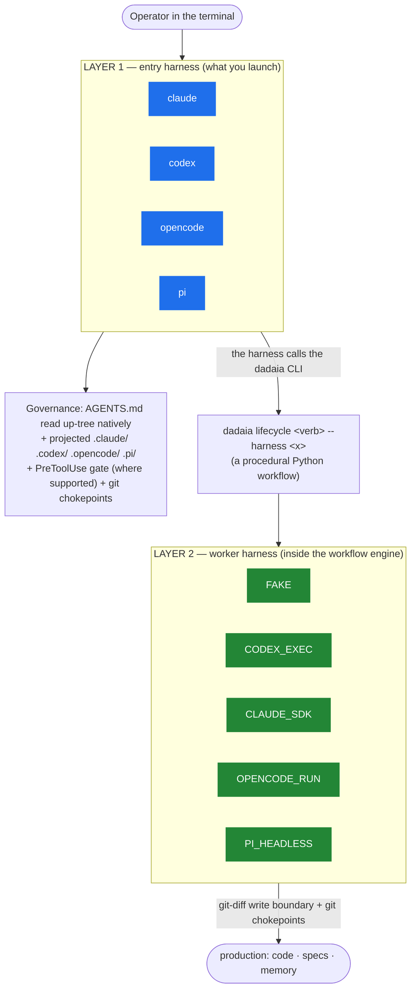
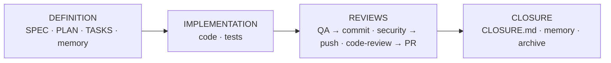

# dadaia-workspace

[](LICENSE)
[](https://pypi.org/project/dadaia-workspace/)

**AI-native workspace management for multi-agent, Spec-Driven Development.**

`dadaia-workspace` gives AI coding agents a structured, governed shared workspace:
scoped project contexts, a Spec-Driven Development (SDD) lifecycle with enforced
gates, canonical agentic-asset projection across **four** AI harnesses, a procedural
multi-harness **workflow engine**, and a real-time monitoring panel.

It runs agents at **two distinct layers** (explained below) and supports
**Claude Code, Codex, OpenCode, and PI** as peers.

Open source under the MIT license. Source, issues, and contributions:
[github.com/marcoaureliomenezes/dadaia-workspace](https://github.com/marcoaureliomenezes/dadaia-workspace).

---

## Install

```bash
pip install dadaia-workspace
```

Requires Python 3.12+.

---

## Quick start

```bash
dadaia init        # bootstrap .dadaia/ and project agentic assets into .claude/, .codex/, .opencode/, .pi/
dadaia doctor      # health check: contexts, assets, panel, SDD gate, leases
dadaia panel       # launch the local dashboard (http://localhost:8080)
```

From there, agents self-discover the rest via `dadaia --help`. Every command group
supports `--help` at every level.

---

## The two agentic layers

The single most important concept in the current architecture. "Harness" means a
different thing at each layer — conflating them causes most confusion.



- **Layer 1 — the entry harness.** The AI coding agent a human launches in the
  terminal: `claude`, `codex`, `opencode`, or `pi`. It is governed by the
  workspace-root `AGENTS.md` (read natively up the directory tree) plus the projected
  per-runtime asset trees (`.claude/`, `.codex/`, `.opencode/`, `.pi/`). This is where
  you sit when you "enter the terminal and type `claude`".
- **Layer 2 — the worker harness.** The bounded agent workers that `dadaia lifecycle`
  drives, one selectable per step, behind a single `AgentRuntimePort`. There are five
  runtime kinds — `FAKE`, `CODEX_EXEC`, `CLAUDE_SDK`, `OPENCODE_RUN`, `PI_HEADLESS` —
  reached over different transports: **SDK** (Claude, in-process), **CLI-headless**
  (`codex exec`, `opencode run`, `pi --mode json`), and **RPC** (designed, not yet
  shipped).

A harness can exist at one layer and not the other (e.g. `FAKE` is Layer-2 only). PI
exists at both: an inert `.pi/` Layer-1 projection and a `PI_HEADLESS` Layer-2 worker.

---

## Supported harnesses

| Harness | Layer 1 (entry) | Layer 2 (worker) | Layer-2 transport |
|---|---|---|---|
| **Claude Code** | ✅ `.claude/` + PreToolUse hook + chokepoints | ✅ `CLAUDE_SDK` (only adapter with a pre-disk Ring-1 boundary) | SDK (in-process) |
| **Codex** | ✅ `.codex/` (hooks fire in the interactive TUI; `codex exec` headless is chokepoints-only) | ✅ `CODEX_EXEC` | CLI-headless (`codex exec`) |
| **OpenCode** | ✅ `.opencode/` (TS plugins call the Python hook) | ◻️ `OPENCODE_RUN` (stub) | CLI-headless (`opencode run`) |
| **PI** (`@earendil-works/pi-coding-agent`) | ✅ inert `.pi/` (no PreToolUse hook → chokepoints-only) | ✅ `PI_HEADLESS` | CLI-headless (`pi --mode json`) |

All projections are generated from one canonical source at `dadaia_workspace/public/`
via `dadaia public stage && dadaia public install`. The Claude SDK and PI runtimes are
**optional, operator-installed** externals (lazy/subprocess-invoked) — the build stays
offline-first without them.

---

## Spec Context Project

A **Spec Context Project** is the keystone unit: *one canonical `specs/` folder bound
to one git repository*, following the SDD lifecycle. Binding a session to a context
triggers a value chain: **bind → inject** (the context's `constitution.md` + memory) **→
enforce** (no production change without an approved release + reserved task) **→
parallel** (each context carries exactly one MUTATING lease, so multiple contexts can be
worked concurrently and safely).

```bash
dadaia context list              # all Spec Context Projects
dadaia context show --json       # active context (machine-readable; agent use)
dadaia context bind <name>       # bind the session (selects injected memory; refreshes incumbent)
```

---

## Workflows — the lifecycle engine

A **workflow** is procedural Python the `dadaia` CLI runs; each step drives a Layer-2
worker harness behind `AgentRuntimePort`. Python owns the state machine, gates, and
hygiene — agents produce evidence, Python decides whether state advances.

```bash
dadaia lifecycle implement   --release-id <id> --harness <x>     # one step
dadaia lifecycle review qa   --release-id <id>                   # a review step
dadaia lifecycle pipeline    --release-id <id> \                 # the full ladder
    --harness claude --step-harness review_security=pi
```

The `pipeline` threads one run through the ladder
**IMPLEMENTATION → QA → SECURITY → CODE → CLOSURE**, with a harness selectable per step
(`--step-harness <phase>=<harness>`), persisting at every step and stopping at the first
blocked gate.

---

## Development lifecycle phases

A release matures through explicit phases; the SDD gate keys off the active phase
(`specs/releases/ACTIVE.md`):



- **DEFINITION** — author SPEC/PLAN/TASKS; memory (`specs/memory/`) is writable here.
- **IMPLEMENTATION** — production code + tests; one MUTATING lease per context.
- **REVIEWS** — `qa-engineer` (commit gate), `security-reviewer` (push gate),
  `code-reviewer` (PR gate). Reviews are ADDITIVE evidence; they mature the release.
- **CLOSURE** — write `CLOSURE.md`, update memory, archive the release.

---

## The SDD gate

Enforcement has two deterministic halves:

1. **PreToolUse hook** — one merged Python entrypoint (`dadaia_workspace.hooks.pre_gate`)
   reads each file-write tool call once and evaluates, first-block-wins:
   **root-whitelist → venv-guard → SDD gate**. The SDD gate decides by
   **path-class × lease × memory-phase × mode** (a single per-context TTL lease with a
   PID veto coordinates MUTATING writes).
2. **Git chokepoints** (run as git hooks, independent of any harness hook): a
   **pre-commit lease gate** and a **pre-push** gate that runs `dadaia ci preflight`
   (ruff format/check + mypy --strict + pytest) *and* requires an APPROVED
   `security-reviewer` verdict for each pushed commit.

The gate reads no SDD artifacts — task markers (`[-]`), `Aprovado` status, and
write-allowlists are agent/coordinator **discipline**, not gate mechanism. Hooks and
chokepoints are installed by `dadaia init` / `dadaia public install` / `dadaia ci
install-hook`.

---

## CLI reference

```
dadaia [COMMAND] --help   # always works at every level
```

| Command group | What it does |
|---|---|
| `dadaia init` | Bootstrap workspace: create `.dadaia/`, project agent assets |
| `dadaia doctor [--fix]` | Diagnose and repair workspace state (contexts, assets, leases) |
| `dadaia context` | Manage Spec Context Projects (list, bind, show, activate, …) |
| `dadaia lifecycle` | The procedural workflow engine (implement, review, pipeline, …) |
| `dadaia ci` | Local CI-equivalent preflight gate + git-hook chokepoints |
| `dadaia lock` | Inspect/manage SDD implementation leases |
| `dadaia public` | Stage and install agentic assets across runtimes |
| `dadaia specs` | SDD release-lifecycle structural checks (`specs doctor`) |
| `dadaia release` / `backlog` / `bug` | Release, backlog, and bug management |
| `dadaia memory` | Memory catalog management |
| `dadaia reports` | Inspect and validate agent handoff reports |
| `dadaia repos` | Query the known repos catalog |
| `dadaia server` | Dev server port registry |
| `dadaia academy` | Manage Academy courses |
| `dadaia migrate` / `clean` / `export` / `import` | Migrations, cleanup, portable archive |
| `dadaia orchestrate` | Read-only workflow reference docs (execution is `dadaia lifecycle`) |
| `dadaia panel` | Start the local monitoring panel |

### Asset projection pipeline

```bash
dadaia public stage                     # stage canonical assets into .dadaia/agentic/
dadaia public install --target all      # project to all runtimes
dadaia public install --target pi       # project to one runtime (claude|codex|opencode|pi|agents)
dadaia public doctor                    # detect drift source → staging → projection
```

---

## Monitoring panel

```bash
dadaia panel                            # http://localhost:8080
```

The panel surfaces contexts, leases/sessions (Kanban), agents, workflows, reports, and
projection health. It exposes a no-auth health probe for automated checks:

```
GET http://localhost:8080/health   →   {"status": "ok", "version": "<running version>"}
```

On loopback bind (`127.0.0.1`) read-only `GET /api/*` endpoints are reachable without a
token; mutations always require one.

---

## Agent self-discovery protocol

Agents can operate the workspace with no prior knowledge:

```
1.  dadaia --help                    → full command tree
2.  dadaia doctor                    → workspace health (what's wrong, what to fix)
3.  dadaia context show --json       → active Spec Context Project (machine-readable)
4.  dadaia public doctor             → agentic asset projection state
5.  GET http://localhost:8080/health → panel health probe
```

If `dadaia doctor` exits non-zero, run `dadaia doctor --fix` first.

---

## Links

- PyPI: https://pypi.org/project/dadaia-workspace/
- GitHub: https://github.com/marcoaureliomenezes/dadaia-workspace
- Issues: https://github.com/marcoaureliomenezes/dadaia-workspace/issues
