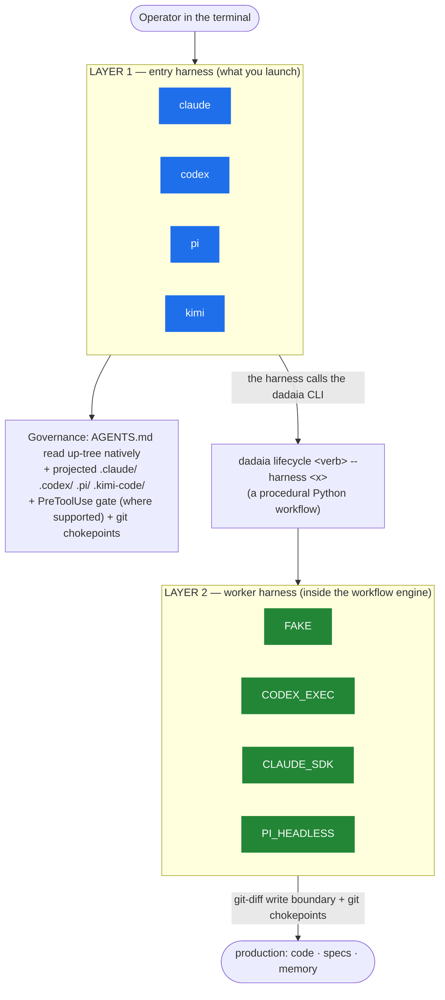
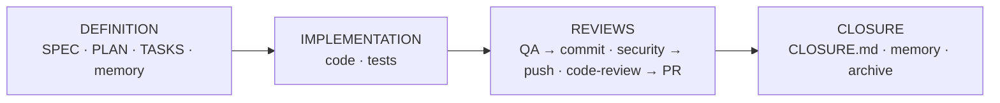

# dadaia-workspace

[](LICENSE)
[](https://pypi.org/project/dadaia-workspace/)

**AI-native workspace management for multi-agent, Spec-Driven Development.**

`dadaia-workspace` gives AI coding agents a structured, governed shared workspace:
scoped project contexts, a Spec-Driven Development (SDD) lifecycle with deterministic
gates, a procedural multi-harness **workflow engine** (the *dadaia-workflows*), a
persona-based agent roster with installable **plugin packs**, canonical agentic-asset
projection across **four** AI harnesses, and a real-time monitoring panel.

It runs agents at **two distinct layers** (explained below) and supports
**Claude Code, Codex, PI, and Kimi Code** as peers. It is designed to be operated by **humans
and by agents**: every capability is reachable through a discoverable CLI, and every
state surface has a machine-readable form.

Open source under the MIT license. Source, issues, and contributions:
[github.com/marcoaureliomenezes/dadaia-workspace](https://github.com/marcoaureliomenezes/dadaia-workspace).

---

## Install

```bash
pip install dadaia-workspace
```

Requires Python 3.12+.

---

## Quick start

```bash
dadaia init                        # bootstrap .dadaia/ + project agent assets (.claude/, .codex/, .pi/, .kimi-code/)
dadaia init --harness claude,pi    # or scaffold only a subset of harnesses (harness profile)
dadaia doctor                      # health check: contexts, assets, gates, presence
dadaia panel                       # local dashboard (http://localhost:4999)
```

From there, agents self-discover the rest via `dadaia --help`. Every command group
supports `--help` at every level.

---

## The two agentic layers

The single most important concept in the architecture. "Harness" means a different
thing at each layer — conflating them causes most confusion.



- **Layer 1 — the entry harness.** The AI coding agent a human launches in the
  terminal: `claude`, `codex`, `pi`, or `kimi`. It is governed by the workspace-root
  `AGENTS.md` (read natively up the directory tree) plus the projected per-runtime
  asset trees (`.claude/`, `.codex/`, `.pi/`, `.kimi-code/`).
- **Layer 2 — the worker harness.** The bounded agent workers that `dadaia lifecycle`
  drives, one selectable per step, behind a single `AgentRuntimePort`. Four runtime
  kinds — `FAKE`, `CODEX_EXEC`, `CLAUDE_SDK`, `PI_HEADLESS` — over two transports:
  **SDK** (Claude, in-process) and **CLI-headless** (`codex exec`, `pi --mode json`).

A harness can exist at one layer and not the other (`FAKE` is Layer-2 only). PI
exists at both: a `.pi/` Layer-1 projection and a `PI_HEADLESS` Layer-2 worker.
Kimi Code is Layer-1 only (`.kimi-code/` projection plus the managed user-level hook
block).

---

## Supported harnesses & harness profiles

| Harness | Layer 1 (entry) | Layer 2 (worker) | Layer-2 transport |
|---|---|---|---|
| **Claude Code** | ✅ `.claude/` + PreToolUse hook + chokepoints | ✅ `CLAUDE_SDK` (only adapter with a pre-disk Ring-1 boundary) | SDK (in-process) |
| **Codex** | ✅ `.codex/` (hooks fire in the interactive TUI; `codex exec` headless is chokepoints-only) | ✅ `CODEX_EXEC` | CLI-headless (`codex exec`) |
| **PI** (`@earendil-works/pi-coding-agent`) | ✅ `.pi/` (no PreToolUse hook → chokepoints-only) | ✅ `PI_HEADLESS` | CLI-headless (`pi --mode json`) |
| **Kimi Code** | ✅ `.kimi-code/` + PreToolUse/PostCompact hooks via a managed block in `~/.kimi-code/config.toml` (Kimi has no project-level config) | — (Layer-1 only) | — |

**Hermes agent (supported consumer).** The hermes agent (dd-chain-capture
hermes-crawler) is the canonical consumer and release gate of dadaia-workspace — and,
since v0.2.9, a declared **supported environment**: the shipped consumer validation
recipe carries a Real-use matrix (R-01…R-08) built from the hermes day-to-day
inventory, and every candidate must pass a full real-use round with zero failures
before deploy.

**Harness profiles.** `dadaia init --harness <set>` scaffolds only the harnesses you
use (persisted in `.dadaia/states/harness_profile.json`). `dadaia public install` and
`dadaia public doctor` are **profile-aware**: a claude-only workspace projects and
doctors only `.claude/`, and out-of-profile assets found on disk are surfaced, never
silently ignored. With no profile, all harnesses are targeted (back-compatible).

All projections are generated from one canonical source at `dadaia_workspace/public/`
via `dadaia public stage && dadaia public install`. The Claude SDK and PI runtimes are
**optional, operator-installed** externals — the build stays offline-first without them.

---

## Spec Context Project

A **Spec Context Project** is the keystone unit: *one canonical `specs/` folder bound
to one git repository*, following the SDD lifecycle. Binding a session to a context
triggers a value chain: **bind → inject** (the context's `constitution.md` + memory) **→
enforce** (no production change without an approved release + reserved task) **→
parallel** (each context carries exactly one MUTATING lease, so multiple contexts can
be worked concurrently and safely).

```bash
dadaia context list              # all Spec Context Projects
dadaia context show --json       # active context (machine-readable; agent use)
dadaia context bind <name>       # bind the session (selects injected memory; refreshes incumbent)
```

---

## Agent roster & personas

The workspace ships a **9-agent core roster** plus **3 plugin agents** (enabled by
installing their pack — see the next section). Each agent is projected into every
harness in the profile; `project-manager` is the Layer-1 coordinator.

| Core agent | Role |
|---|---|
| `project-manager` | Layer-1 coordinator: dispatch, release governance, backlog curation |
| `product-engineer` | Spec author + memory guardian (SPEC/PLAN/TASKS/CLOSURE, `specs/memory/`) |
| `software-engineer` | Generic implementer (TDD-first, conventional commits) |
| `software-architect` | Anti-slop architecture reviews, root-cause gates |
| `qa-engineer` | Test pyramid, E2E ownership, commit-gate reviews |
| `security-reviewer` | Vulnerability audits; the mechanical **push gate** verdict |
| `code-reviewer` | PR/branch six-axis reviews |
| `project-auditor` | Spec/memory-vs-code drift audits, scorecards |
| `ai-engineer` | Exclusive owner of agents/skills/rules/workflows; context engineering |

| Plugin agent | Domain | Pack |
|---|---|---|
| `frontend-engineer` | Browser HTML/CSS/JS/TS/React | `frontend-design` |
| `design-specialist` | UX/UI, design specs, visual review | `frontend-design` |
| `devops-engineer` | CI/CD, GitHub Actions, gitflow, deploy | `devops` |

**Personas** are the Layer-2 equivalent of Claude sub-agents: per-role behavioral
mandates (8 non-PM roles) injected into every workflow step prompt alongside the
step's instruction fragment, on **every** worker harness. The same role identity
governs an agent whether it runs interactively in Layer 1 or headless in Layer 2.

---

## Plugin packs

Plugin agents ship as inert stubs until their pack is installed:

```bash
dadaia plugin list                       # available packs + install state
dadaia plugin install frontend-design    # enable frontend-engineer + design-specialist
dadaia plugin install devops             # enable devops-engineer
dadaia plugin doctor                     # per-projected-file status of installed packs
```

Packs are distributed **inside the package** (no network fetch): real agent bodies
plus curated skills, projected into the harness profile like any canonical asset.
Installs are recorded in `.dadaia/states/installed_plugins.json`; a later core
`dadaia public install` **preserves installed pack bodies** (it never regresses them
to stubs), and `plugin install` is idempotent.

---

## dadaia-workflows — the lifecycle engine

A **workflow** is procedural Python the `dadaia` CLI runs; each step drives a Layer-2
worker behind `AgentRuntimePort`. Python owns the state machine, gates, and hygiene —
agents produce evidence, Python decides whether state advances. Every step prompt is
assembled from its **fragment** (the step-specific instruction: inputs, task, output
schema) plus its **persona** (the role's mandate), with role-scoped memory context
injected from the bound Spec Context.

There are exactly **four** workflows — lean by design, so weaker/cheaper worker
models produce reliable results from scoped, evidence-grounded prompts:

| Workflow | Verb | Shape |
|---|---|---|
| Backlog definition | `dadaia lifecycle backlog-definition` | ONE authoring worker call; a Python review gate validates what actually landed on disk (registry bind + duplicate/conflict classification). `--grill` opts into an evidence-first intake step. |
| Release definition | `dadaia lifecycle release-definition` | SPEC → merged SPEC review (architecture + QA in one call) → PLAN → PLAN review → TASKS → implementability review → commit gate. A consumed backlog pick skips the scope step; rejected reviews and failed lints auto-revise their create step once in-run. |
| Implementation + reviews | `dadaia lifecycle implementation-reviews` | implement → ONE combined tri-angle review (QA + security + code) over injected write-set diff + executed test output → close, with a bounded correction loop. |
| Audit | `dadaia lifecycle audit` | ONE audit_report pass (question, lenses, findings, dispositions); the terminal gate checks referential integrity only. |

Durable step handoffs are **registered in the Spec Context release folder**
(`specs/releases/<id>/handoffs/`, backlog runs in `specs/backlog/handoffs/`) — never
in an opaque runtime path.

```bash
dadaia lifecycle implementation-reviews --release-id <id> \
    --harness codex --step-model review_combined=codex-review-deep
dadaia lifecycle release-definition --release-id <id> --resume-from plan_create
```

**Model & harness governance.** Which model and harness each workflow step uses is
resolver-governed: an operator **profile registry** plus per-context **overlays**
feed a single policy resolver; every run freezes its resolved policy snapshot onto
the run record. Precedence: CLI flag > overlay > catalog default. The panel's
Workflows tab renders each workflow's diagram with inline model pickers.

---

## Development lifecycle phases

A release matures through explicit phases; the SDD gate keys off the active phase
(`specs/releases/ACTIVE.md`):



- **DEFINITION** — author SPEC/PLAN/TASKS; memory (`specs/memory/`) is writable here.
- **IMPLEMENTATION** — production code + tests; concurrent sessions surface through advisory presence (no locks).
- **REVIEWS** — `qa-engineer` (commit gate), `security-reviewer` (push gate),
  `code-reviewer` (PR gate). Reviews are ADDITIVE evidence; they mature the release.
- **CLOSURE** — write `CLOSURE.md`, update memory truth, archive the release.

---

## The SDD gate

Enforcement has two deterministic halves:

1. **PreToolUse hook** — one merged Python entrypoint (`dadaia_workspace.hooks.pre_gate`)
   reads each file-write tool call once and evaluates, first-block-wins:
   **root-whitelist → venv-guard → SDD gate**. The SDD gate decides by
   **path-class × lease × memory-phase × mode** (a single per-context TTL lease with a
   PID veto coordinates MUTATING writes). ADDITIVE paths — bugs, backlog, audits,
   reports, handoffs — always flow, for any agent, with no lease.
2. **Git chokepoints** (run as git hooks, independent of any harness hook): a
   **pre-commit lease gate** and a **pre-push** gate that runs `dadaia ci preflight`
   (ruff format/check + mypy --strict + import-linter + pytest) *and* requires an
   APPROVED `security-reviewer` verdict keyed to each pushed commit sha.

The gate reads no SDD artifacts — task markers (`[-]`), `Aprovado` status, and
write-allowlists are agent/coordinator **discipline**, not gate mechanism. Hooks and
chokepoints are installed by `dadaia init` / `dadaia public install` /
`dadaia ci install-hook`.

---

## Governance data stores

Everything an agent needs to reason about product state is a validated, queryable
store — not prose:

- **Bugs — event-sourced JSONL.** `dadaia bugs append --event reported ...` appends a
  schema-validated event; a bug's stream later carries one terminal event
  (`resolved`/`superseded`/`deferred`/`rejected`). `dadaia bugs status` lists open
  bugs; `dadaia bugs stats` aggregates. Bugs are never silently dropped.
- **Backlog — typed intents.** Every entry declares `(subject{kind,ref} → change)`
  intents bound against an auto-derived anchor registry; `dadaia backlog doctor`
  fail-closed checks (BL-*) run in pre-commit and CI.
- **Memory — current product truth.** Curated Markdown atoms under `specs/memory/`
  with a generated feature catalog (`dadaia memory catalog generate`). Memory is
  injected on context bind; it is writable only in DEFINITION/CLOSURE phases.
- **Reports & handoffs.** Agent output is a machine-readable handoff JSON
  (`dadaia reports validate <file>`); HTML reports are emitted only for humans.

---

## CLI reference

```
dadaia [COMMAND] --help   # always works at every level
```

| Command group | What it does |
|---|---|
| `dadaia init` | Bootstrap workspace; `--harness` selects the harness profile |
| `dadaia doctor [--fix]` | Diagnose and repair workspace state (contexts, assets, presence) |
| `dadaia context` | Manage Spec Context Projects (list, bind, show, …) |
| `dadaia lifecycle` | The dadaia-workflows engine (see the workflow table above) |
| `dadaia plugin` | Install and inspect distributed plugin packs |
| `dadaia ci` | Local CI-equivalent preflight gate + git-hook chokepoints |
| `dadaia public` | Stage, install (profile-aware), and doctor agentic assets |
| `dadaia specs` | SDD release-lifecycle structural checks (`specs doctor`) |
| `dadaia bugs` | Event-sourced JSONL bug telemetry (append/status/stats) |
| `dadaia backlog` | Backlog entries + fail-closed consistency doctor |
| `dadaia release` | Release management commands |
| `dadaia memory` | Memory catalog management |
| `dadaia reports` | Validate handoffs; efficiency-audit marker (`mark-efficiency-audit`) |
| `dadaia repos` | Query the known repos catalog |
| `dadaia server` | Dev server port registry |
| `dadaia academy` | Manage Academy courses |
| `dadaia migrate` / `clean` / `export` / `import` | Migrations, cleanup, portable archive |
| `dadaia orchestrate` | Read-only workflow reference docs (execution is `dadaia lifecycle`) |
| `dadaia panel` | Start the local monitoring panel |

### Asset projection pipeline

```bash
dadaia public stage                     # stage canonical assets into .dadaia/agentic/
dadaia public install --target all      # project to the harness profile (or all)
dadaia public install --target pi       # project to one runtime (claude|codex|pi|agents)
dadaia public doctor                    # drift detection: source → staging → projection
```

`public doctor` exits non-zero on drift and reports per-file `[ok]` / `[drift]` /
`[missing]`. Consumer repos' hand-authored root `AGENTS.md` files are provenance-
protected: only files carrying the generated banner are treated as lib-owned; anything
else is reported `[foreign]` and **never overwritten**.

---

## Monitoring panel

```bash
dadaia panel                            # http://localhost:4999
```

The panel is a local, loopback-bound dashboard (Host-header guarded, no auth on
loopback). Tabs: **Workflows** (per-workflow diagram cards with inline model
pickers), **Projects** (Spec Context Projects with clickable memory chips),
**Sessions cost dashboard**, **Reports**, **Academy**, **Servers** (the dev server
registry), and **Games** — four playable canvas games (Snake, Tetris, Pong, Breakout),
each implemented end-to-end by a Layer-2 worker through the dadaia-workflows. It exposes a no-auth health probe for automated checks:

```
GET http://localhost:4999/health   →   {"status": "ok", "version": "<running version>"}
```

---

## Agent self-discovery protocol

Agents can operate the workspace with no prior knowledge:

```
1.  dadaia --help                    → full command tree
2.  dadaia doctor                    → workspace health (what's wrong, what to fix)
3.  dadaia context show --json       → active Spec Context Project (machine-readable)
4.  dadaia public doctor             → agentic asset projection state
5.  GET http://localhost:4999/health → panel health probe
```

If `dadaia doctor` exits non-zero, run `dadaia doctor --fix` first.

---

## Links

- PyPI: https://pypi.org/project/dadaia-workspace/
- GitHub: https://github.com/marcoaureliomenezes/dadaia-workspace
- Issues: https://github.com/marcoaureliomenezes/dadaia-workspace/issues
