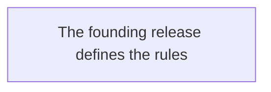

## Overview

**Greenfield context.** This context has no consolidated architecture yet: the architecture
is BORN with the first approved release. While this atom sits in that state, the current
release's SPEC is the founding structural reference — it must propose the initial module
layout, and reviewers judge the SPEC by its internal coherence and the observable criteria
it defines (never reject it for "empty architecture memory": that is the legitimate state
of a new context). At the founding release's CLOSURE, this atom is updated with the
architecture actually implemented.

## Layers

| Layer | Responsibility |
|-------|----------------|
| (to be defined by the founding release) | The current SPEC proposes the initial layout; CLOSURE records it here. |

## Dependency rules

## Contracts between modules

No consolidated contract yet — the founding release's contracts stand as the baseline and
are recorded here at CLOSURE.

## Runtime state

No runtime state registered.

<!-- dadaia:fixed slop-code -->
<!-- /dadaia:fixed slop-code -->
