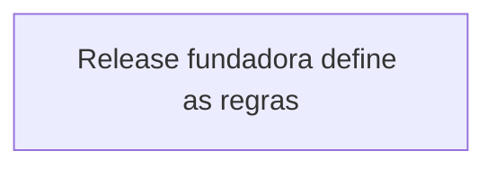

## Visão geral

**Contexto greenfield.** Este contexto ainda não tem arquitetura consolidada: a
arquitetura NASCE com a primeira release aprovada. Enquanto este atom estiver neste
estado, o SPEC da release vigente é a referência estrutural fundadora — ele deve
propor o layout inicial de módulos, e revisores avaliam o SPEC pela coerência interna
e pelos critérios observáveis que ele mesmo define (nunca rejeitar por "memória de
arquitetura vazia": este é o estado legítimo de um contexto novo). No CLOSURE da
release fundadora, este atom é atualizado com a arquitetura realmente implementada.

## Camadas

| Camada | Responsabilidade |
|--------|-----------------|
| (a definir na release fundadora) | O SPEC vigente propõe o layout inicial; o CLOSURE o registra aqui. |

## Regras de dependência

## Contratos entre módulos

Sem contratos consolidados ainda — os contratos da release fundadora valem como base e
são registrados aqui no CLOSURE.

## Estado runtime

Nenhum estado runtime registrado.
