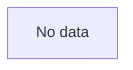

## Atomic view

The product vision is not documented yet. Describe the project's core purpose here.

## Users

| User | Description |
|------|-------------|
| placeholder | Users not documented yet. Describe who uses the product and how. |

## Feature catalog

_No features found._

## Capability map

## Known limits

Limits not documented yet.
