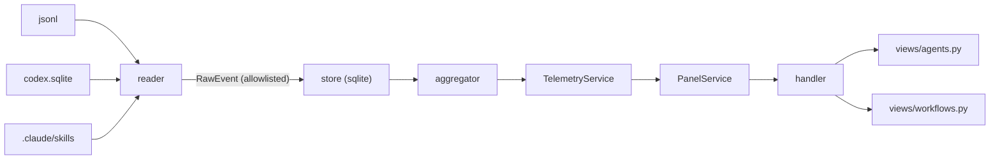

# Plan: Release — agent-monitoring-v1

> **Status:** Aprovado
> **Approved:** 2026-05-17
> **Approved-by:** operator
> **Release ID:** agent-monitoring-v1
> **Phase:** PLAN
> **Owner:** product-engineer
> **Created:** 2026-05-17
> **Plan version:** 1
> **SPEC:** `specs/releases/agent-monitoring-v1/SPEC.md` (Status: Aprovado)

---

## Resumo

- **O que:** novo módulo top-level `dadaia_workspace/features/telemetry/` (4 camadas: reader → store → aggregator → view-adapter) consumido por `features/panel/` via DI. Duas abas novas (Agents, Workflows). Auth Bearer no panel. ~1.500 LoC backend + ~800 LoC frontend (Python strings). Zero deps novas.
- **Ordem:** a11y fix (gating) → schema/migrations → reader (Claude, Codex, skills) → pricing.py → aggregator → endpoints + auth → frontend cards (Agents, Workflows) → hardening.
- **Riscos:** schema corrigido (R1+R2 reconciliation) divergente do que o architect descreveu primeiro; allowlist no reader é o gate de segurança crítico (T1); cold ingest pode levar segundos em workspaces antigos (mitigado por budget + cache).
- **Reuso:** `PanelService` DI pattern; `_respond` em `handler.py`; padrão de view modules em `features/panel/views/`; `SpecContextService.list_all()` para `cwd → context` lookup.
- **Sem overlap** com `multi-platform-parity-v1` (toca `infrastructure/public_assets.py` + `cli/commands/public.py`). Esta release toca `features/panel/handler.py` (rotas), `features/panel/service.py` (DI), `features/panel/views/index.py` (a11y + 2 novas abas) + tudo em `features/telemetry/` (novo).

---

## Camadas (architect D3 + DDD)

```
┌─────────────────────────────────────────────────────────────────────────┐
│  features/panel/    (existing, extended)                                │
│    handler.py        + /api/agents, /api/workflows, /api/sessions       │
│    service.py        PanelService gains telemetry: TelemetryService DI  │
│    views/index.py    nav-tabs split → 4 tabs (a11y fixed)               │
│    views/agents.py   NEW — card grid, breakdown, drill-down (lazy)      │
│    views/workflows.py NEW — card grid, agent chips                      │
│    auth.py           NEW — Bearer token middleware                      │
└────────────────────────────┬────────────────────────────────────────────┘
                             │ depends on
                             ▼
┌─────────────────────────────────────────────────────────────────────────┐
│  features/telemetry/   (NEW, top-level peer of panel)                   │
│    service.py        TelemetryService (DI orchestrator)                 │
│    pricing.py        versioned PRICING_TABLE + compute_cost()           │
│    budget.py         named constants (read budgets, T4 devops)          │
│    reader/                                                              │
│      claude.py       *.jsonl incremental tail + byte-offset checkpoint  │
│      codex.py        sqlite ?mode=ro reader                             │
│      workflows.py    SKILL.md frontmatter parser                        │
│      allowlist.py    field allowlist (T1 critical)                      │
│    store/                                                               │
│      schema.py       DDL + PRAGMA user_version migrations               │
│      dao.py          repository pattern (no sqlite3.Row leaks)          │
│    aggregator/                                                          │
│      queries.py      SQL group-by; cwd→context lookup via SCS           │
└────────────────────────────┬────────────────────────────────────────────┘
                             │ reads from
                             ▼
┌─────────────────────────────────────────────────────────────────────────┐
│  External (read-only):                                                  │
│    ~/.claude/projects/<slug>/*.jsonl                                    │
│    ~/.codex/state_5.sqlite                                              │
│    ~/.codex/history.jsonl                                               │
│    .claude/skills/, .agents/skills/                                     │
│  Persistent:                                                            │
│    ~/.dadaia/state/telemetry/telemetry.sqlite  (chmod 600, WAL)         │
│    ~/.dadaia/state/panel.token                 (chmod 600)              │
└─────────────────────────────────────────────────────────────────────────┘
```

### Mermaid (resumido)



### Regras de import (inviolável)

- `features/telemetry/` importa apenas `core/`, stdlib, e `features/spec_context/` (read-only).
- `features/panel/` importa `features/telemetry/`. Nunca o inverso.
- Nenhum módulo de `features/telemetry/` importa `http.server` ou camada de transporte.
- `pricing.py` é pura: sem SQLite, sem IO.

---

## Reuso de padrões existentes

| Padrão | Onde | Como reusar |
|--------|------|-------------|
| DI explícito | `PanelService.__init__(registry, spec_context, workspace_root)` | Estender com `telemetry: TelemetryService`. Nenhuma instanciação ad-hoc dentro de `PanelService` |
| Regex dispatch | `handler.py _RAW_ROUTES` | Adicionar 3 rotas; **atualizar `_NOT_FOUND_BODY`** no mesmo commit (architect HIGH finding) |
| View module | `features/panel/views/memory.py` | `views/agents.py` e `views/workflows.py` seguem mesmo padrão: pure function que retorna HTML string; escape via `html.escape` |
| Read-only service | `ServerRegistryService` / `SpecContextService` | `TelemetryService` espelha o shape: dataclasses frozen, sem side-effects no construtor |

---

## Ordem de implementação (8 phases)

| Phase | Tema | Bloqueia | Justificativa |
|-------|------|----------|---------------|
| P1 | **A11y fix nas tabs atuais** (T-AM-01) | toda mudança em `views/index.py` | Frontend D-08 + Seção 5.1 — sem `role=tablist`/`tabpanel` no panel atual; adicionar 4ª aba sem isso degrada a11y existente |
| P2 | **Schema + migrations + service.py skeleton** | reader, aggregator | Architect D4/D6 + SE D5 — schema é fundação |
| P3 | **Reader Claude Code** (jsonl, incremental tail, allowlist, budget) | aggregator | Allowlist é o gate de privacidade (T1 CRITICAL) |
| P4 | **Reader Codex** (sqlite ?mode=ro) + reader workflows (SKILL.md frontmatter) | aggregator | Independente do reader Claude — pode rodar em paralelo a P3 se outro agente pegar |
| P5 | **pricing.py + compute_cost + tests** | aggregator | Pure module; pode rodar em paralelo a P3/P4 |
| P6 | **Aggregator + queries (cwd→context lookup)** | endpoints | Depende de P2+P3+P4+P5 |
| P7 | **Endpoints `/api/agents`, `/api/workflows`, `/api/agents/{id}/sessions` + auth Bearer** | frontend | Inclui middleware + CSP/nosniff headers |
| P8 | **Frontend Agents + Workflows + chip-filter via hash** | acceptance | Consome endpoints; testes E2E manuais via panel local |
| P9 | **Hardening + brand integration + retention + acceptance pass** | release ready | chmod, getuid guard, banner pricing (D-AM-21), tokens da brand-identity (com fallback, D-AM-22), retention/compactação 180d raw + agregados perpétuos via `events_daily` (D-AM-18), badge `suspect` em cards (D-AM-19), confirmar ausência de alert hooks (D-AM-20) |

---

## Performance budget (SE Seção 9)

| Métrica | Target |
|---------|--------|
| Cold ingest (49.7 MB, 7.778 eventos, 34 sessões) | < 10s |
| Incremental ingest por ciclo (cache 30s) | < 500ms |
| Query `/api/agents` em 415k eventos (6 meses) | < 50ms (com índices) |
| SQLite size em 6 meses | < 100 MB |
| Memory peak no reader | < 50 MB (buffer máx 10k eventos × ~5KB) |

Constantes nomeadas em `features/telemetry/budget.py`:

```python
MAX_BYTES_PER_FILE_PER_CYCLE = 4 * 1024 * 1024   # 4 MB (T4)
MAX_LINE_LENGTH = 64 * 1024                       # 64 KB (T4)
MAX_EVENTS_PER_CYCLE = 10_000                     # T4
CACHE_TTL_SECONDS = 30                            # architect D5
PRICING_STALENESS_THRESHOLD_DAYS = 90             # devops + frontend D-10
MAX_TOKEN_COUNT_PER_EVENT = 2_000_000             # T7 suspect bound
```

---

## Plano de testes

| Camada | Tipo | Fixtures |
|--------|------|----------|
| `pricing.py` | Unit (pytest parametrize) | Modelo conhecido, modelo conhecido em janela histórica, modelo desconhecido, usage zero, Codex sem split |
| `reader/claude.py` | Unit | jsonl válido, truncado, malformado no meio, vazio, com linhas vazias; idempotência (re-leitura = no-op) |
| `reader/codex.py` | Unit | SQLite in-memory com schema parcial (coluna ausente), DB bloqueada (timeout), DB inexistente |
| `reader/workflows.py` | Unit | SKILL.md com frontmatter válido, frontmatter ausente, applyTo opcional, agentes embutidos no corpo |
| `reader/allowlist.py` | Unit | **Crítico**: dict com `content`/`text`/`messages`/`snapshot`/`thinking`/`prompt`/`response` é stripped; integration test garante NENHUM endpoint vaza esses campos |
| `store/schema.py` | Unit | Migrações aplicadas em sequência; re-aplicar é idempotente (PRAGMA user_version) |
| `aggregator/queries.py` | Unit | Group-by por agente; bucket `unassigned` para cwd órfão; pricing_age_days |
| `auth.py` | Unit | Token gerado e persistido com 0o600; request sem header → 401; request com header errado → 401 |
| `handler.py` | Integration | Subir panel em `127.0.0.1:0` (porta aleatória) num thread; GET endpoints com `Authorization` |
| `views/agents.py` | Smoke | render com lista vazia, lista típica; escape funciona |
| `views/index.py` | Smoke | nav-tabs com `role=tablist`, sections com `role=tabpanel`, `aria-labelledby` presente |

Cobertura mínima alinhada com constitution (≥ 80% em features/infrastructure).

---

## Riscos e mitigações

| # | Risco | Mitigação |
|---|-------|-----------|
| RP1 | Schema do architect ainda referenciava `subagent_type` (R2 reconciliation) | SPEC.md desta release usa schema corrigido pelo SE; review do architect post-approval para migrar `specs/memory/architecture.html` |
| RP2 | Token vazado se logado por engano | Logger nunca formata `Authorization` header; unit test asserta |
| RP3 | jsonl gigante trava o cold ingest | Budget hard-cap (4 MB/ciclo) + retomada incremental |
| RP4 | Pricing.py defasado sem aviso | Banner WCAG-compatível na UI quando `pricing_age_days > 90` |
| RP5 | brand-identity-v1 não pousa antes da implementação | Fallback aos tokens atuais (`--color-accent`, etc.); SPEC define mapeamento ↔ valores atuais |
| RP6 | a11y fix quebra o panel existente | T-AM-01 inclui snapshot tests dos 3 tabs originais antes da mudança |

---

## Rollback

- Cada phase = 1 commit (ou squash de commits relacionados). Reverter um commit é seguro: arquivos de produção em `features/telemetry/` são novos; `features/panel/` mudanças são aditivas (nova DI arg, novas rotas, novas views).
- Reverter P8 sem reverter P7 deixa endpoints servindo dados sem UI consumindo — aceitável (zero impacto operacional, panel volta a mostrar placeholder).
- Reverter P2 deixa SQLite órfão em `~/.dadaia/state/telemetry/` — operador remove manualmente.

---

## Resolução de open questions

- **Q-AM-1 — Allowlist é no reader ou no view?** Em **ambos**, mas a fonte de verdade é no reader (`reader/allowlist.py`). Views são defesa em profundidade.
- **Q-AM-2 — Workflows: extrair `agent_ids` como?** v1: substring match no body de SKILL.md contra `agents.name` conhecidos (best-effort). v1.1 pode adotar frontmatter explícito se proliferar.
- **Q-AM-3 — Codex thread_id vira sessão Claude?** Não. Tabela `sessions` aceita ambos (`provider='claude'` vs `'codex'`); UI mostra duas dimensões separadas (R4 do Phase 1).
- **Q-AM-4 — Cwd resolvido onde?** Em **query time** no aggregator, não na ingestão (architect D9). Renomear/desativar context reclassifica histórico sem reingest.
