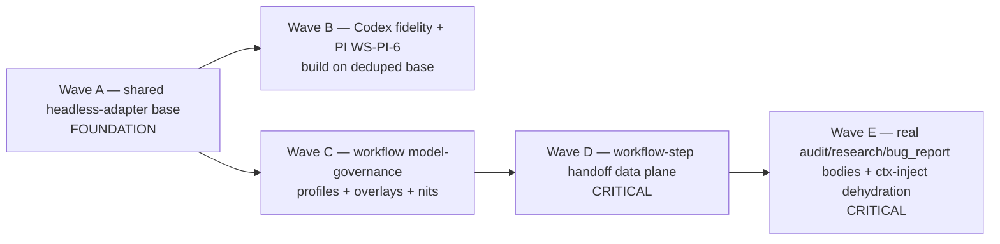

# PLAN — Release: v0.1.30 — super release: PI/Codex Layer-2 + workflow system maturation

**Status:** Aprovado
**Release ID:** v0.1.30
**Owner:** product-engineer

> DEFINE-ONLY (GRILL D-4). This plan is approved as the implementation strategy; **no wave
> runs until the operator approves at the DEFINITION checkpoint.**

---

## 1. Strategy — foundation-first wave spine (D-3)

The six picked items execute as **five waves, A→E**, ordered by dependency. Each later wave
builds on a seam an earlier wave authored; reordering would force a wave to build on a soon-
to-change surface (the exact two-non-converged-systems defect the architecture exists to
kill).

**Ordering justification:**
- **A first (foundation, D-3).** Items 2 and 3 modify `codex_runtime`/`pi_runtime` and the
  telemetry surface; if A landed after them, B would re-touch adapter internals A then
  rewrites. A authors the single base; B builds on the deduped, single-authored surface.
- **B after A.** Codex-fidelity (Item 2) and PI WS-PI-6 (Item 3) are per-harness work that
  sits cleanly on the shared base (B does not touch the base's invariants).
- **C after A, before D.** Governance (Item 4) is independent of A/B internals but its
  resolver/overlay surface is consumed by the handoff ledger's policy-snapshot recording
  and is reviewed before the larger D/E waves (review cadence).
- **D before E (CRITICAL chain).** The new workflow bodies in E (Item 6 WS-A) **consume** the
  run-scoped handoff ledger D authors; E cannot land first without re-implementing D's
  resolver inline. D is therefore the keystone of the workflow half.
- **E last.** WS-A bodies + ctx-inject dehydration are the final completion, depending on
  both the fragment engine (shipped v0.1.24) and D's ledger.

---

## 2. Layers affected

| Layer | Waves touching it |
|-------|-------------------|
| `core/` (models, ports, protocols) | A (Runner/git Protocol home is `infrastructure`, not core), D (workflow_handoff models + LifecycleRun field), C (local-profile port) |
| `infrastructure/` | A (headless_adapter_base), B (codex transform/projection), C (overlay store + local-profile store), D (runtime_files step payloads, run-store extension) |
| `features/lifecycle/` | C (model_profiles, policy_resolver), D (workflow_handoffs, context_selector, release_definition, retention, hygiene), E (workflows/audit·research·bug_report) |
| `features/telemetry/` | B (reader/pi.py, aggregator/runtimes.py) |
| `features/panel/` | C (workflow_policy `_semantic_check`), D (minimal run-ledger API exposure) |
| `features/academy/` | B (PI fourth-harness module) |
| `hooks/` | E (ctx_inject dehydration — bind/session safety preserved) |
| `public/` | B (AGENTS.md / codex projection), C (schema additive for extends), D (workflow-step-payload schemas, output-handoff.md fix), E (fragment bodies + doctor) |

---

## 3. Module list — NEW vs MODIFIED, per wave

### Wave A — shared-headless-adapter-base (FOUNDATION)
- **NEW** `infrastructure/headless_adapter_base.py` — the shared home: `_redact` +
  `_SECRET_NAME_PARTS`; `_GitDiffPort` Protocol + `_with_changed_paths`; `_env`/allowlist;
  the `Runner` subprocess-seam type; the shared `_prompt` JSON-envelope builder. Factored so
  the subprocess parts are separable from redaction + git seam (SDK reuses the latter only).
- **MODIFIED** `infrastructure/pi_runtime.py` — import the base; keep only `_command`,
  `_result_from_output`, `_last_message_end`, `_extract_text`, `_verdict_payload`,
  `_structured_from_verdict`, the JSONL parse, `PiHeadlessConfig`, `_resolve_model`.
- **MODIFIED** `infrastructure/codex_runtime.py` — import the base; keep only `_command`,
  `_model_and_effort`, `_result_from_output`, the `--output-last-message` read,
  `CodexExecConfig`, the effort narrowing.
- **MODIFIED** `infrastructure/claude_sdk_runtime.py` — import `_redact`/`_SECRET_NAME_PARTS`
  (and git seam for `changed_paths` parity) from the base; do NOT inherit subprocess bits.
- **NEW (test)** `tests/unit/infrastructure/test_headless_adapter_base.py` — the divergence
  test (A3) + base unit coverage.
- **Back-compat:** behavior byte-preserved; `infrastructure/fake_runtime.py` untouched
  (it carries no secret-scrub/git-diff to dedup).

### Wave B — codex-runtime-fidelity (Item 2) + PI WS-PI-6 (Item 3)
- **MODIFIED** `infrastructure/runtime_transforms/codex.py` — WS-CDX-PROTOCOL: on-disk
  rule-law path transform + read instruction (or rewrite by-name citations to a reachable
  surface).
- **MODIFIED** `public/data/AGENTS.md` — WS-CDX-PROTOCOL: fold load-bearing law into a
  Codex-reachable surface if path-transform alone is insufficient.
- **MODIFIED** `infrastructure/codex_doctor.py` (+ `public_assets.py`) — WS-CDX-HYGIENE:
  doctor INFO trust-boundary line; resolve `.codex/workflows/` keep-or-drop (remove inert
  reference); drop inert config keys.
- **MODIFIED** onboarding surface (`public/skills/ai-harness-codex/SKILL.md` /
  onboarding doc) — WS-CDX-HYGIENE trust-boundary note.
- **NEW** `features/telemetry/reader/pi.py` — incremental PI session-metadata reader
  (mirror `reader/codex.py`; reads `~/.pi/agent/sessions/`; metadata-only, T1).
- **MODIFIED** `features/telemetry/aggregator/runtimes.py` — `PiRuntimeAdapter`
  (enrichment + liveness) + `"pi"` in `ADAPTER_REGISTRY`.
- **NEW** `features/academy/knowledge_basis/08_pi_agent/<module>.md` — PI fourth-harness doc.

### Wave C — workflow-model-governance (Item 4)
- **MODIFIED** `features/lifecycle/model_profiles.py` — `list_profiles`/`profiles_for` merge
  built-in + operator-loaded profiles (WS-PROFILES).
- **NEW** `infrastructure/json_local_model_profile_store.py` — the
  `.dadaia/states/workflow_model_profiles.local.json` adapter (atomic write; validate
  `harness=pi`; reject API keys; never projected).
- **NEW** `core/protocols/local_model_profile_store.py` — the port; wired via `container.py`.
- **MODIFIED** `infrastructure/json_workflow_model_policy_store.py` — `extends` field in
  `_ALLOWED_TOP_LEVEL`/schema + walk `context → extends… → default` in `overlay_for` /
  `workflow_default_harness` / `step_harness`; cycle detection; hard error on missing parent
  (WS-OVERLAYS).
- **MODIFIED** `features/lifecycle/policy_resolver.py` — resolve through the per-context
  overlay chain (WS-OVERLAYS); de-dup `_DEFAULT_PROFILE_BY_HARNESS_PURPOSE` (WS-NITS i);
  docstring correction naming `governed_workflow_catalog()` (WS-NITS ii).
- **NEW/MODIFIED** one shared home for `_DEFAULT_PROFILE_BY_HARNESS_PURPOSE` (imported by
  both `policy_resolver.py` and `features/workflows/dadaia_catalog.py`).
- **MODIFIED** `features/panel/views/workflow_policy.py` — `_semantic_check` 3-map union
  (WS-NITS iii).
- **MODIFIED** `public/schemas/workflow-model-policy-v1.schema.json` — additive `extends`.
- **MODIFIED** `container.py` — wire the local-profile store/port.

### Wave D — workflow-step-handoff-data-plane (Item 5, CRITICAL)
- **NEW** `core/models/workflow_handoff.py` — `WorkflowStepRecord`,
  `WorkflowStepConsumerRecord`, attempt ledger, retention-mode enum.
- **MODIFIED** `core/models/lifecycle.py` — additive `workflow_steps` field on `LifecycleRun`
  (+ `to_dict`/`from_dict` round-trip; old records load — A27).
- **NEW** `public/schemas/workflow-step-payload-v1.schema.json`,
  `public/schemas/lifecycle-run-workflow-steps-v1.schema.json`.
- **NEW** `features/lifecycle/workflow_handoffs.py` — the resolver/service (enqueue / resolve
  / ack / reclaim; compact digest rendering; envelope + named-payload validation).
- **MODIFIED** `infrastructure/runtime_files.py` — `write_run_artifact` step-payload path
  under `.dadaia/runs/lifecycle/<run_id>/steps/`.
- **MODIFIED** `infrastructure/json_lifecycle_run_store.py` — persist `workflow_steps`
  atomically (existing temp+rename).
- **MODIFIED** `features/lifecycle/workflows/release_definition.py` — per-`ReleaseStep`
  `produces`/`consumes`; write+validate payloads; resolver-injected digests; terminal gate
  graph-completeness check.
- **MODIFIED** `features/lifecycle/context_selector.py` — route required handoff selection
  through the resolver; `previous-handoff-only` legacy-only; digest rendering.
- **MODIFIED** `features/lifecycle/pipeline.py` — attempt tracking for implement/review loops
  (bounded retry default 2 → BLOCK).
- **MODIFIED** `features/lifecycle/antislop/retention.py` — protect step artifacts via
  extended `live_claims`; reclaim `consumed_all` past consumed TTL.
- **MODIFIED** `features/lifecycle/hygiene.py` — workflow-step payload state counters.
- **NEW/MODIFIED** `dadaia lifecycle handoffs doctor` check (or fold into `hygiene status`).
- **MODIFIED** `public/lifecycle_fragments/shared/output-handoff.md` — `detail` → `detail_md`
  field fix.
- **MODIFIED** `container.py` — wire the workflow-handoff resolver/service.

### Wave E — real workflow bodies + ctx-inject dehydration (Item 6, CRITICAL)
- **NEW** `features/lifecycle/workflows/audit.py`, `research.py`, `bug_report.py` — real
  fragment+gate bodies (mirror `release_definition.py`; consume the Wave-D ledger).
- **MODIFIED** `features/lifecycle/workflows/_deferred.py` — remove `audit`/`research`/
  `bug_report` from `DEFERRED_WORKFLOWS` (and the stub entry points).
- **NEW** fragment bodies under `public/lifecycle_fragments/` for the three workflows.
- **MODIFIED** `hooks/ctx_inject.py` — WS-C: reduce broad session-memory injection; keep
  bind/session safety + lean generic preflight; `pre_gate`/chokepoints unchanged.
- **MODIFIED** affected docs/fragments — reflect OQ-3/OQ-4/OQ-7 decisions; OQ-6 deferral
  rationale recorded (CLOSURE).

---

## 4. Storage / path constants (resolved at GRILL)

- Workflow-step payload data plane: `.dadaia/runs/lifecycle/<run_id>/steps/<NNN>-<step>-attempt-<n>.step-payload.json`
  (immutable; the `runs/lifecycle` canonical-zone confinement in `runtime_files` already exists).
- Control plane: `LifecycleRun.workflow_steps` persisted in `.dadaia/states/lifecycle/<run_id>.json`.
- Local PI-profile store: `.dadaia/states/workflow_model_profiles.local.json` (operator-local,
  NEVER projected).
- Overlay store (existing): `.dadaia/states/workflow_model_policy.json` (+ `extends`).
- Durable external evidence (unchanged): `.dadaia/handoff/<context>/*.handoff.json`.

---

## 5. Back-compat constraints (binding)

- `LifecycleRun.workflow_steps` is **additive-optional**; the run-store schema literal is NOT
  bumped (mirrors how `workflow_policy` was added). Old records load with `workflow_steps=()`.
- Overlay `extends` is **additive**; a v0.1.28/v0.1.29 overlay with no `extends` parses and
  resolves byte-identically (A16).
- The shared adapter base is a **pure refactor**: existing per-adapter unit suites pass
  unchanged (A4).
- The generic `handoff-v1.1` schema is **never mutated**; the workflow-step schema is separate.
- Local-profile store **missing** → library defaults (L3); **present-but-invalid** → fail
  closed.

---

## 6. Execution order with per-wave green checkpoints

1. **Wave A** → checkpoint: divergence test green; all three adapter suites green; mypy/lint
   green. (Foundation locked before any per-harness change.)
2. **Wave B** → checkpoint: PI telemetry adapter+reader green with faked fixture; Codex
   reachability test + doctor INFO green; `public doctor` `[ok]`.
3. **Wave C** → checkpoint: operator-profile load test; `extends` chain + cycle/missing-parent
   tests; WMP doctor ↔ panel `_semantic_check` agree; nits resolved; suite green.
4. **Wave D** → checkpoint: release-definition fake-run ledger test (A18–A22); retention
   live/promoted/eligible tests (A23); attempt-loop test (A24); handoffs doctor (A26); old
   run record loads (A27). **CRITICAL gate.**
5. **Wave E** → checkpoint: audit/research/bug_report bodies run (A28–A29); ctx-inject
   dehydration test (A30); OQ decisions recorded (A31); specs+public doctor green (A32).
   **CRITICAL gate.**

---

## 7. Validation plan

- Per-wave: `poetry run pytest` (scoped then full), `ruff format --check`, `ruff check`,
  `mypy --strict`, import-linter.
- Projection waves (B, C, D, E touch `public/`): `dadaia public stage` →
  `dadaia public install --target all` → `dadaia public doctor` (`[ok]` incl. public-privacy).
- SDD: `dadaia specs doctor --specs-dir specs` green (this DEFINITION authorship + at CLOSURE).
- Cross-wave integration: the release-definition fake run (D) feeding a real workflow body
  (E) is the end-to-end proof the two CRITICAL items converge on one ledger.

---

## 8. Risks (full table in SPEC §7) — plan-level mitigations

- **R1 (security dedup)** — Wave A is gated by the divergence test + unchanged suites + a
  security-reviewer pass before any per-harness wave consumes the base.
- **R2 (cross-wave coupling)** — the A→E spine + per-wave green checkpoints make each
  dependency explicit; no wave starts until its predecessor's checkpoint is green.
- **R3 (retention data-loss)** — reuse the existing guarded ladder; extend `live_claims`
  with step refs; promote verdict + consumed_backlog payloads; dry-run default.
- **R7 (super-release size)** — D-4 DEFINE-ONLY checkpoint: the operator may prune waves
  before any code runs.
