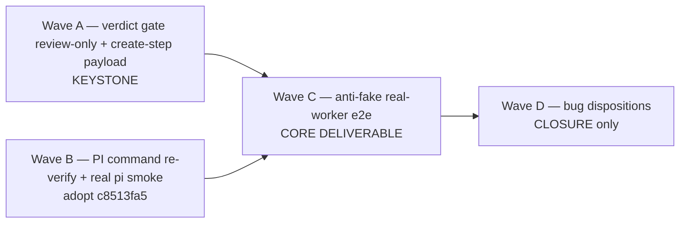

# PLAN — Release: v0.1.31 — make the dadaia-workflows actually run on a real Layer-2 worker

**Status:** Aprovado
**Release ID:** v0.1.31
**Owner:** product-engineer

> DEFINE-ONLY (GRILL D-6). This plan is approved as the implementation strategy; **no wave
> runs until the operator approves at the DEFINITION checkpoint** and `ACTIVE.md` advances to
> IMPLEMENTATION. **No push** (standing operator constraint).

---

## 1. Strategy — four waves, gate-first (D-5)

The two HIGH bugs + the anti-fake e2e map to **four waves, A→D**, ordered by dependency. The
gate fix (Wave A) is the keystone: it is the single change that lets a real create step pass.
The PI command (Wave B) is independent of the gate but must be working before the e2e can prove
"advances past step 1." The e2e (Wave C) depends on **both** A and B. Dispositions (Wave D) are
CLOSURE-only.

**Ordering justification:**
- **A is the keystone.** Until the verdict gate is scoped to review steps and create steps have a
  payload contract, a real create step BLOCKs at step 1 — no real chain can advance. A lands the
  root-cause fix (D-1/D-2), restoring the workflow's own documented design.
- **B is independent of A** (it touches `pi_runtime`, not the gate) but is a prerequisite of C:
  the e2e cannot prove the real command executes without the landed `c8513fa5` and the smoke.
- **C depends on A and B.** The anti-fake e2e is the convergence proof — it only passes once the
  gate accepts a real create-step payload (A) **and** the real PI command runs (B). C is the core
  deliverable (D-4).
- **D is CLOSURE-only.** Both bugs flip to `Closed` with the Wave-B/C evidence during the
  disposition sweep — not in this DEFINITION cycle.

---

## 2. Layers affected

| Layer | Waves touching it |
|-------|-------------------|
| `features/lifecycle/` (`agent_runner`, the SEVEN runner callers, `PipelineStep`) | A (runner gate + all seven call sites + `PipelineStep.is_review` field + comments) |
| `public/lifecycle_fragments/` | A (bundle `shared.output_handoff` into EVERY producing create step) |
| `infrastructure/` (`pi_runtime`) | B (re-verify only — fix already landed; no source change expected beyond confirmation) |
| `tests/` | A (gate unit/regression tests incl. pipeline review path, fragment-bundle test), B (real `pi` smoke), C (real-worker e2e) |
| `specs/` (bugs, memory, ACTIVE, CLOSURE) | D (CLOSURE-only disposition sweep + memory atoms) |

No `core/` model change. No `public/` schema change (`handoff-v1.1` reused unchanged — D-2). No
new harness, no new fragment family (D-5). Adding `is_review` to `PipelineStep` is an additive
field on an existing dataclass, not a new step model (C1).

---

## 3. Module list — NEW vs MODIFIED, per wave

### Wave A — verdict gate review-only + create-step payload (KEYSTONE; D-1/D-2)

- **MODIFIED** `dadaia_workspace/features/lifecycle/agent_runner.py`
  - Add `is_review: bool = False` to `AgentRunnerInput` (~line 98).
  - Branch `_blocked_result` (~line 174) on `data.is_review`: the `verdict == "APPROVED"` check
    (~line 182) applies **only** when `is_review` is true; create steps require
    `succeeded` + a schema-valid fenced payload (the extractor's `schema`-field equality →
    `artifact_refs` populated, line ~184) + in-scope paths (the existing `artifact_refs` +
    out-of-scope checks already enforce the create-step contract — no field-level schema
    validation added, D-5).
  - Correct the `evaluate_gate` docstring (~line 128) so the pass condition is no longer stated as
    "an APPROVED verdict" for all steps.

- **The SEVEN runner call sites — each annotated with the runner METHOD it uses (C2):**
  - **MODIFIED** `release_definition.py` (~339, `evaluate_gate_with_result`) — thread
    `is_review=step.is_review`; correct the misleading inline comment (~329) to the review-only gate.
  - **MODIFIED** `audit.py` (~281, `evaluate_gate_with_result`) — `is_review=step.is_review`.
  - **MODIFIED** `bug_report.py` (~276, `evaluate_gate_with_result`) — `is_review=step.is_review`.
  - **MODIFIED** `research.py` (~265, `evaluate_gate_with_result`) — `is_review=step.is_review`.
  - **MODIFIED** `backlog_definition.py` (~444, `evaluate_gate`) — `is_review=False` for its single
    model create step `backlog_author` (`BacklogStep` is kind-based, no `is_review` boolean — pass
    the literal `False`).
  - **MODIFIED** `pipeline.py` (~205, `run`) — thread `is_review=step.is_review`, **after** adding
    an `is_review` field to `PipelineStep` (dataclass ~lines 79–91, no such field today). Set
    `is_review=True` on the `review_qa`/`review_security`/`review_code` steps (~495–519);
    `implement` (a create step, already bundles `shared.output_handoff`) keeps `is_review=False`.
    **This is the C1 fix** — without it those review gates silently drop `verdict == APPROVED`.
  - **MODIFIED** `phase_workflow.py` (~102, `run`) — thread `is_review` so a step targeting a
    **review phase** (`QA_REVIEW`/`SECURITY_REVIEW`/`CODE_REVIEW`) runs as `is_review=True`.
    `phase_workflow.run()` is generic, parameterized by `target_phase`; derive `is_review` from
    whether `target_phase`/`from_phase` is a review phase (or accept it as a `run()` argument).

- **MODIFIED** `dadaia_workspace/public/lifecycle_fragments/release_definition/release-scope.md`
  — and the create-step `shared_fragment_ids` in `release_definition.py` — bundle
  `shared.output_handoff` into **every** producing create step (C3 / R-B): `release_scope` (~139,
  alongside `shared.grill_questionnaire`), `plan_create` (~167), `tasks_create` (~182) — all three
  bundle no output contract today — plus `backlog_author` in `backlog_definition.py`. `spec_create`
  already has it.
- **NEW (test)** `tests/unit/features/lifecycle/test_agent_runner_review_only_gate.py` — the
  gate-distinction tests (A2–A5/A8): review step blocks on missing/REJECTED verdict (release-def
  AND pipeline review step); create step PASSES on schema-valid payload **with `verdict=REJECTED`
  or absent** (R-A adversarial case); no-op create-step worker (empty `artifact_refs`) still
  BLOCKs (OQ-1); each pipeline review step (`review_qa`/`review_security`/`review_code`) still
  BLOCKs on missing/REJECTED verdict (A8 / C1 regression guard).
- **NEW/MODIFIED (test)** a fragment-bundle test that **derives the producing-step set
  programmatically from each `_SEQUENCE`** (not a hard-coded list) and asserts `release_scope`,
  `spec_create`, `plan_create`, `tasks_create`, and `backlog_author` each carry a handoff-emission
  instruction (A11), and that no parallel `create_handoff` fragment exists (A10).

> Note: `release_definition._payload_from_result` (~line 470) already stores `verdict` only for
> review steps — the data plane is already review-only; this wave aligns the **gate** with that
> existing precedent (root-cause alignment, not a new pattern).

### Wave B — PI command re-verify + real `pi` smoke (adopt `c8513fa5`; D-3)

- **VERIFY (no source change expected)** `dadaia_workspace/infrastructure/pi_runtime.py` —
  `_command` (~line 164) already appends `["-p"]` with no trailing `-` (the `c8513fa5` fix).
  Confirm; do not re-fix.
- **VERIFY** `tests/unit/infrastructure/test_pi_runtime.py` —
  `test_pi_adapter_builds_controlled_command_and_env` already asserts `argv[-1] == "-p"` and
  `"-" not in argv` (lines ~105–106). Re-verify the assertion is present and not weakened (A12).
- **NEW (test)** a real `pi` smoke that runs the real `pi` binary through `PiHeadlessAdapter` and
  proves the command executes without "Unknown option: -" (A13). Folded into / shares the env
  gate of the Wave-C e2e (D-4) — same opt-in preconditions as `tests/integration/pi_live/`.

### Wave C — anti-fake real-worker e2e (CORE DELIVERABLE; D-4)

- **NEW (test)** `tests/integration/<real_worker>/test_real_layer2_worker_workflow_e2e.py` —
  mirrors the existing opt-in pattern (`tests/integration/pi_live/test_pi_live_contract.py`):
  - Env gate: `DADAIA_E2E_REAL_WORKER=1` plus the live preconditions (`pi` binary present /
    `PI_BIN`, `ANTHROPIC_API_KEY`); auto-SKIP otherwise (A14/A17).
  - Drives the **fixed minimal chain `release_scope` → `spec_create`** — the exact shipped-failure
    path (OQ-3, fixed by QA review). No alternative chain.
  - **Asserts CONCRETE post-step-1 state, NOT "no exception" (R-C / A15):** (a) the real command
    executed (catches the D-3 class); (b) the `release_scope` step is **not blocked** and yields a
    parsed `SUCCEEDED` `AgentRunResult`; (c) the run carries **no** `"agent result missing APPROVED
    verdict"` `BlockedState`; (d) the run **advanced beyond `release_scope`** (reached/ran
    `spec_create`).
  - Documents the run command in the module docstring (A17).
- **Worker-compliance handling (A16 / R4):** the e2e PROVES the chosen step(s) emit a parseable
  payload for the real worker. If a real `pi`/`codex` does not reliably emit the fenced payload,
  harden `pi_runtime._verdict_payload` / the structured-output read to degrade safely and record
  the residual for CLOSURE. The decision (proven vs hardened) is captured as a CLOSURE drift.
- **codex (optional second case — OQ-2):** add a codex variant only if cheap and creds are
  available; `pi` first is the required case.

### Wave D — bug dispositions (CLOSURE only)

- **MODIFIED (CLOSURE)** `specs/bugs/pi-headless-command-trailing-dash-breaks-layer2.md` →
  `status: Closed` with the real-`pi`-smoke evidence (A13/A18).
- **MODIFIED (CLOSURE)** `specs/bugs/lifecycle-workflows-never-pass-real-layer2-worker-verdict-gate.md`
  → `status: Closed` with the real-worker e2e evidence (A15/A18).
- **MODIFIED (CLOSURE)** `specs/memory/**`, `specs/releases/v0.1.31/CLOSURE.md`,
  `specs/releases/ACTIVE.md` — the disposition sweep + memory atoms per §6 of the SPEC.

---

## 4. Test strategy — default CI stays green; real worker is opt-in

- **Default `pytest` / CI (fully faked, always green):** the Wave-A gate tests, the fragment-bundle
  test, and the existing `test_pi_runtime.py` all run against the **fake** runtime. The Wave-A
  tests are the unit proof that the gate distinction (review vs create) is correct **without** a
  real worker — they are the everyday regression net. The Wave-C e2e and Wave-B smoke are
  **collected and SKIPPED** by default (env flag unset), so a default run is fully faked + green
  (A14/A17). The Wave-A unit tests also pin the **pipeline review path** (C1): each of
  `review_qa`/`review_security`/`review_code` still BLOCKs on a missing/REJECTED verdict (A8).
- **Opt-in real-worker run (operator, on demand):** with `DADAIA_E2E_REAL_WORKER=1` and live
  preconditions set, the Wave-C e2e (+ Wave-B smoke) execute the real `pi` worker and prove the
  end-to-end chain. This is the **anti-fake law** (L6/D-4): the fake can no longer mask a
  worker-contract gap, because a real run exists and is documented.
- **Why both layers are needed:** the fake unit tests prove the *logic* of the gate; the real e2e
  proves the *worker contract* (the exact gap that shipped because only fakes ran). Removing either
  re-opens the class of bug this release closes.
- **Per-wave gates:** `ruff format --check`, `ruff check`, `mypy --strict`, import-linter, and the
  scoped then full `poetry run pytest` (faked) on every wave. Wave A touches `public/` fragments →
  `dadaia public stage` → `dadaia public install --target all` → `dadaia public doctor` (`[ok]`
  incl. public-privacy). `dadaia specs doctor --specs-dir specs` green at DEFINITION and CLOSURE.

---

## 5. Back-compat constraints (binding)

- `AgentRunnerInput.is_review` is **additive-optional** (`= False`): existing constructions that
  omit it keep the create-step default; no caller breaks.
- The **review-step contract is unchanged** — review steps still require `verdict == APPROVED` +
  evidence + in-scope paths (A5). This release only *narrows* the verdict requirement off create
  steps; it never loosens review steps.
- `shared.output_handoff` / `handoff-v1.1` is **reused unchanged** — no schema mutation (D-2).
- No `core/` model change, no new harness, no new fragment family (D-5).
- The `c8513fa5` PI command fix is **kept verbatim**; this release does not alter the argv.

---

## 6. Execution order with per-wave green checkpoints

1. **Wave A (KEYSTONE)** → checkpoint: review step blocks on missing/REJECTED verdict, for a
   release-def review AND a pipeline review step (A5/A8); create step passes on schema-valid payload
   regardless of `verdict` incl. `verdict=REJECTED`/absent (A3, R-A); no-op create-step worker
   still BLOCKs (A4); **all seven** call sites thread the flag + `PipelineStep` gains `is_review`
   (A1/A6); every producing create step bundles `shared.output_handoff` (A9/A11); no
   `create_handoff` fragment (A10); comments/docstring corrected (A7); faked suite + mypy/lint +
   `public doctor` green.
2. **Wave B** → checkpoint: PI argv assertion re-verified `argv[-1] == "-p"` / `"-" not in argv`
   (A12); real `pi` smoke present + env-gated + SKIPPED by default (A13).
3. **Wave C (CORE)** → checkpoint: real-worker e2e present, env-gated, SKIPPED by default in a
   normal run (A14/A17); with the env flag set on the operator's machine it asserts concrete
   post-step-1 state — not blocked, no missing-verdict BlockedState, advanced beyond `release_scope`,
   parsed SUCCEEDED result (A15, R-C); worker-compliance proven or extraction hardened with residual
   recorded (A16).
4. **Wave D (CLOSURE only — NOT this cycle)** → both bugs `Closed` with evidence; memory atoms;
   disposition sweep; `git mv` to `_archive/`; `ACTIVE.md` repointed (A18).

---

## 7. Risks — plan-level mitigations (full table in SPEC §7)

- **R1 (create steps gate-free)** — Wave A's no-op-worker-still-BLOCKs test (OQ-1) + the retained
  `artifact_refs` / out-of-scope checks pin the create-step contract.
- **R2 (review regression)** — a review-path regression test runs before/after the threading
  change, for a release-def review step; review contract is unchanged.
- **R3 (C1 — pipeline review gate silently lost)** — add `is_review` to `PipelineStep`; thread it
  at `pipeline.py`/`phase_workflow.py`; A8 drives each pipeline review step with a missing/REJECTED
  verdict and asserts it STILL BLOCKs. This is the must-fix DEFINITION-review condition.
- **R4 (worker non-compliance)** — Wave C must PROVE payload emission or harden extraction; the
  decision is a recorded CLOSURE drift.
- **R5 (e2e leaks into CI)** — env gate + auto-SKIP mirrors the proven `pi_live`/`codex_live`
  opt-in pattern; default CI is fully faked.
- **R7 (a runner caller missed)** — all seven call sites threaded; `backlog_definition` threads
  `is_review=False` explicitly; the runner-level fix covers all callers.
