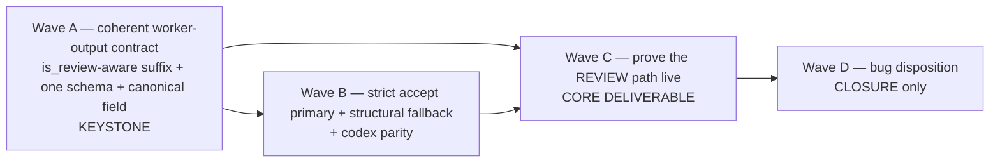

# PLAN — Release: v0.1.32 — harden real-worker workflows (coherent worker-output contract + live review path)

**Status:** Aprovado
**Release ID:** v0.1.32
**Owner:** product-engineer

> DEFINE-ONLY (GRILL D-7). This plan is approved as the implementation strategy; **no wave
> runs until the operator approves at the DEFINITION checkpoint** and `ACTIVE.md` advances to
> IMPLEMENTATION. **No push** (standing operator constraint).

---

## 1. Strategy — four waves, contract-first (D-7)

The bug + the live-review deliverable map to **four waves, A→D**, ordered by dependency. The
coherent-contract fix (Wave A) is the keystone: it is the single change that makes strict
acceptance correct, so it must land before strict accept is restored (Wave B). The live
review-path proof (Wave C) depends on both A and B. Disposition (Wave D) is CLOSURE-only.

**Ordering justification:**
- **A is the keystone.** Until the prompt names one field (`schema`) with one value
  (`agent-run-result-v1`) and is step-kind-aware, a real worker can't reliably emit a
  strict-matching payload — so restoring strict accept (B) would re-introduce the dropped-result
  failure. A lands the root-cause fix (D-1/D-2/D-3), aligning the prompt with the v0.1.31
  review-only gate.
- **B depends on A.** Restoring `schema == expected_schema` as primary is only safe once the
  prompt is coherent; B also brings codex to pi parity so both workers behave identically.
- **C depends on A and B.** The live review-path proof can only assert the verdict gate fires
  strictly on real output once the contract is coherent (A) and strict accept is primary (B).
  C is the core deliverable (D-6).
- **D is CLOSURE-only.** The bug flips to `Closed` with the Wave-A/C evidence during the
  disposition sweep — not in this DEFINITION cycle.

---

## 2. Layers affected

| Layer | Waves touching it |
|-------|-------------------|
| `features/lifecycle/prompt_builder.py` (`build_fragment_suffix` + `LifecyclePromptBuilder`) | A (is_review param + one-schema/canonical-field text + threading) |
| `features/lifecycle/` workflow call sites (the SIX `build_fragment_suffix` callers) | A (thread `is_review` into the suffix call) |
| `public/lifecycle_fragments/shared/output-handoff.md` | A (canonical field `schema` text) |
| `infrastructure/pi_runtime.py` + `infrastructure/headless_adapter_base.py` | B (strict-primary reorder + docstrings; factor shared extraction helper) |
| `infrastructure/codex_runtime.py` | B (rewire `_result_from_output` to the shared candidate/acceptance path — codex parity) |
| `tests/` | A (suffix-text + threading tests), B (extractor strict/structural + codex parity tests), C (live review-path e2e + REJECTED-blocks) |
| `specs/` (bug, memory, ACTIVE, CLOSURE) | D (CLOSURE-only disposition sweep + memory atoms) |

No `core/` model change (the `expected_schema` default on `PromptScope`/`AgentRunRequest`
already exists — D-1 wires nothing new). No new `public/` fragment family; no schema mutation
(`handoff-v1.1` frontmatter id unchanged). No new harness (D-7).

---

## 3. Module list — NEW vs MODIFIED, per wave

### Wave A — coherent worker-output contract (KEYSTONE; D-1/D-2/D-3)

- **MODIFIED** `dadaia_workspace/features/lifecycle/prompt_builder.py`
  - `build_fragment_suffix(...)` gains a **keyword-only, NO-default** `is_review: bool` parameter
    (~line 40) — signature `build_fragment_suffix(bundle, *, selected_context, is_review)`
    (DEFINITION-review C2; no default chosen so a forgotten flag is a call/type error, never a
    review step silently fed create-step text). The "## Required output" section (~lines 69-74)
    branches on `is_review`:
    - **review** → instruct emit of `structured_output.verdict` = APPROVED/REJECTED + evidence
      (`verdict_reason`/`findings`) in a result whose `schema` field is `agent-run-result-v1`,
      with `artifact_refs`.
    - **create** → instruct emit of the produced artifact + `artifact_refs` in a result whose
      `schema` field is `agent-run-result-v1`; **do NOT** instruct a verdict.
  - **D-1:** the text names exactly ONE schema target — the literal field `schema` =
    `agent-run-result-v1` (the transport id). It stops surfacing `{bundle.output_schema}` as a
    competing "output schema to conform to". The fragment `output_schema` stays in the
    `FragmentBundle` (Python tags the produced payload with it from the run ledger) but is no
    longer named as a second schema-to-emit. **No per-step `expected_schema` wiring is added**;
    `PromptScope.expected_schema` keeps its `agent-run-result-v1` default (~line 111, unchanged).
  - Decide threading shape: either (a) `build_fragment_suffix(..., is_review=...)` is called
    directly by each caller with the step's flag, or (b) thread `is_review` through
    `LifecyclePromptBuilder.build(...)` if a caller assembles the suffix inside `build`.
    Reading the callers (below) shows every caller invokes `build_fragment_suffix` directly and
    then `prompt_builder.build(scope, ...)` with the suffix as `scope.prompt` — so **option (a)
    is the minimal seam**: add `is_review` to `build_fragment_suffix` only; `LifecyclePromptBuilder.build`
    needs no change.

- **The SIX `build_fragment_suffix` call sites — each threads the step's review signal:**
  - **MODIFIED** `workflows/release_definition.py` (~line 320) — `is_review=step.is_review`. Also
    correct any remaining stale "self-verdict for every step" prose if present (the gate-side
    comment ~331 is already review-only from v0.1.31 — verify, do not duplicate).
  - **MODIFIED** `workflows/audit.py` (~line 267) — `is_review=step.is_review`.
  - **MODIFIED** `workflows/bug_report.py` (~line 262) — `is_review=step.is_review`.
  - **MODIFIED** `workflows/research.py` (~line 251) — `is_review=step.is_review`.
  - **MODIFIED** `pipeline.py` `_fragment_prompt` (~line 415) — `is_review=step.is_review`
    (`PipelineStep` gained `is_review` in v0.1.31). **Second stale surface (DEFINITION-review
    C6):** `_generic_prompt` (~lines 395-400) is NOT a `build_fragment_suffix` caller — it
    hard-codes the universal self-verdict text for every generic (no-fragment) step. Make it
    step-kind-aware too (review → verdict instruction; create → emit artifact + refs, no
    self-verdict), keyed on `step.is_review`. Left untouched it re-introduces Drift 1 on the
    pipeline's generic steps.
  - **MODIFIED** `workflows/backlog_definition.py` (~line 432) — `is_review=False` (its single
    model step `backlog_author` is a *create* step; `BacklogStep` is kind-based, no `is_review`
    boolean — pass the literal `False`).
  - **NOTE — `phase_workflow.py` is NOT a `build_fragment_suffix` caller.** It builds its prompt
    from `scope.prompt` (caller-supplied) and already threads `is_review` into `AgentRunnerInput`
    (v0.1.31, ~line 123). No suffix-builder change needed there.

- **MODIFIED** `dadaia_workspace/public/lifecycle_fragments/shared/output-handoff.md`
  - D-3: change the documented result field from `schema_version` to **`schema`** (the literal
    transport id `agent-run-result-v1`). Keep the review-only `verdict`/`verdict_reason`/
    `findings` rows. Keep the `output_schema: handoff-v1.1` frontmatter id (not the `schema`
    field value — distinct concepts). After editing this `public/` fragment: `dadaia public
    stage` → `dadaia public install --target all` → `dadaia public doctor` (`[ok]` incl.
    public-privacy).

- **NEW (test)** `tests/unit/features/lifecycle/test_fragment_suffix_is_review.py` —
  - A review-step suffix instructs `structured_output.verdict` = APPROVED/REJECTED; a create-step
    suffix does NOT (A1).
  - The suffix names exactly ONE schema target (`schema` = `agent-run-result-v1`) and does not
    surface the fragment domain schema as a second emit instruction (A2).
  - `pipeline._generic_prompt` is step-kind-aware: review → verdict instruction, create → no
    self-verdict (A4b, C6).
- **NEW/MODIFIED (test)** a threading test that **ENUMERATES the `build_fragment_suffix` callers**
  (C2) and asserts each passes the correct `is_review` (review-style workflows + pipeline →
  `step.is_review`; `backlog_definition` → `False`); it FAILS when a new caller omits the flag,
  and asserts no new `expected_schema=` at the call sites (A4). Prefer asserting via the assembled
  prompt text per workflow over mocking.
- **NEW/MODIFIED (test)** the fragment-guard test (C1) — asserts in the `shared/output-handoff.md`
  **body**: (a) NO `schema_version` field + instructs exactly `schema` = `agent-run-result-v1`
  (Drift 3); AND (b) NO residual "conform to the `output_schema`" emit-framing (Drift 2);
  frontmatter `output_schema: handoff-v1.1` UNCHANGED; no fragment under
  `public/lifecycle_fragments/` instructs `schema_version` (A3); no `create_handoff` fragment;
  `shared.output_handoff` is the single contract (A5).

### Wave B — strict accept primary + structural fallback + codex parity (D-4/D-5)

- **MODIFIED** `dadaia_workspace/infrastructure/pi_runtime.py`
  - `_is_result_payload` (~lines 297-321): make strict `payload.get("schema") == expected_schema`
    the **explicitly primary** accept; the structural path (non-empty `artifact_refs` +
    `status`/`summary`/`structured_output`) is the **documented fallback**. (The current order is
    already strict-then-structural — this wave makes the intent explicit in the docstring and
    pins it with tests so it cannot silently regress to structural-load-bearing.)
  - Update `_verdict_payload` / `_is_result_payload` docstrings (~lines 265-321): strict is the
    contract (the prompt is now coherent), structural is defence-in-depth, no-op → `None` →
    empty `artifact_refs` → BLOCK (A9).
  - `_json_candidates` (fenced/bare/sliced) unchanged.
- **MODIFIED** `dadaia_workspace/infrastructure/headless_adapter_base.py`
  - **Factor the shared extraction/acceptance helper once (A12):** lift the
    `_json_candidates` + `_verdict_payload` + `_is_result_payload` logic (or the minimal core of
    it) into a shared function/mixin method on `SubprocessAdapterMixin` so both `pi_runtime` and
    `codex_runtime` call ONE implementation. `pi_runtime` is rewired to call the shared helper
    (behaviour identical — pinned by existing pi extractor tests).
- **MODIFIED** `dadaia_workspace/infrastructure/codex_runtime.py`
  - `_result_from_output` (~lines 201-236): instead of a single `json.loads(raw)`, run the
    last-message text through the **shared candidate scan** (fenced/bare/sliced) and the
    **shared strict-primary + structural-fallback acceptance** against `request.expected_schema`.
    Thread `request` into `_result_from_output` so it has `expected_schema` (today it only
    receives `output_path` + `proc`). Preserve the existing degraded fallbacks (unparseable →
    prose-summary `SUCCEEDED`; non-dict → `structured_output` value).
- **NEW (test)** `tests/unit/infrastructure/test_pi_runtime.py` additions: strict-primary accept
  for fenced AND bare correctly-labelled payload (A6); structural fallback for mis-labelled/
  unlabelled payload (A7); no-op → empty `artifact_refs` (A8); **strict-primacy BEHAVIOUR test
  (C5/A9)** — a payload that is BOTH structurally-valid AND `schema`-matched takes the strict
  path, and a structurally-valid but `schema`-mismatched payload is accepted ONLY via the
  fallback; a future reorder that lets structural shadow strict FAILS this test (not asserted via
  docstring).
- **NEW (test)** `tests/unit/infrastructure/test_codex_runtime.py` additions: fenced AND bare
  codex payload parse (A10); strict-primary + structural-fallback parity (A11); no-op codex worker
  → empty `artifact_refs` (A11); **codex reject-guard (C4/A11)** — arbitrary JSON lacking the
  result shape (a dict with no `schema` match and no non-empty `artifact_refs`) yields empty
  `artifact_refs`, proving codex no longer maps ANY dict to a result; **single-helper proof
  (C3/A12)** — patch the shared extraction helper in `headless_adapter_base` and assert BOTH
  `pi_runtime` AND `codex_runtime` call it (positive proof of one implementation, not a grep).

### Wave C — prove the REVIEW path live (CORE DELIVERABLE; D-6)

**OQ-2 selection (RESOLVED at DEFINITION review — architect/qa APPROVE-WITH-CONDITIONS):**
- **Chain = `release_scope` → `spec_create` → `spec_arch_review`** (the minimal create→review
  pair built on the v0.1.31 truncated sequence). `spec_arch_review` is the **first** real review
  step in `_SEQUENCE` (`is_review=True`, `release_definition.py:150-154`), so extending the
  existing truncated chain by exactly one step yields a real review/gate step whose verdict the
  Python gate reads. This is **cheaper than the full 9-step `release_definition` run** (the SPEC
  permits either; the minimal create→review pair is chosen for credit economy and faster
  iteration — the full sequence adds no proof the single review step does not already give).
- **REJECTED-blocks negative = faked gate path** (not a second live run). The existing
  faked-runtime unit/integration gate tests already exercise a review step BLOCKing on a
  REJECTED/missing verdict (v0.1.31 A5/A8); Wave C adds/points an explicit assertion there so
  the negative is proven without burning a second live credit. The **live** half proves only the
  positive (APPROVED passes on real output).
- **Codex live variant = OMITTED** (OQ-2 optional): `pi` is the required worker; a codex live
  run adds cost without new proof (codex parity is unit-proven in Wave B). Confirm at review.

- **MODIFIED (test)** `tests/integration/pi_live/test_real_layer2_worker_workflow_e2e.py`
  - Extend `_truncated_sequence()` to `release_scope` → `spec_create` → `spec_arch_review`
    (+ the terminal `definition_commit_gate` if needed for a clean completion). Slice
    `spec_arch_review` verbatim from `_SEQUENCE` (no fabricated step).
  - **NEW live test** `test_real_pi_worker_review_step_emits_approved_and_gate_passes`:
    env-gated (reuse `_real_worker_skip_reason()` / `requires_real_worker`), with the flag set it
    asserts CONCRETE state (A14): (a) `spec_arch_review` ran; (b) it yielded a parsed
    `SUCCEEDED` result carrying `verdict == APPROVED` from the real worker; (c) the run is **not
    blocked** at `spec_arch_review` (the verdict gate fired on real output and PASSED);
    (d) optionally that strict acceptance (not the structural fallback) carried it — if only the
    fallback carried it, record the residual for CLOSURE (R5).
  - Document the run command in the module docstring (A16) and update the v0.1.31 docstring's
    "advances past step 1" framing to "advances through a real review/gate step".
- **NEW/MODIFIED (test)** REJECTED-blocks negative (faked gate path): an explicit assertion
  (extend the Wave-B or existing review-gate test) that a review step with `verdict == REJECTED`
  (and a missing-verdict variant) BLOCKs the run — proving the gate is honest on real-worker-shaped
  output without a second live run (A15).

### Wave D — bug disposition (CLOSURE only)

- **MODIFIED (CLOSURE)** `specs/bugs/lifecycle-prompt-names-two-schemas-confusing-real-workers.md`
  → `status: Closed` with the coherent-contract test evidence (A1-A3) + the live review-path e2e
  evidence (A14) (never deleted — L7).
- **MODIFIED (CLOSURE)** `specs/memory/**`, `specs/releases/v0.1.32/CLOSURE.md`,
  `specs/releases/ACTIVE.md` — the disposition sweep + memory atoms per §6 of the SPEC.

---

## 4. Test strategy — default CI stays green; live review path is opt-in

- **Default `pytest` / CI (fully faked, always green):** the Wave-A suffix/threading/fragment
  tests, the Wave-B pi+codex extractor tests, and the REJECTED-blocks faked-gate negative all run
  against the **fake** runtime or pure-function asserts — they are the everyday regression net
  and prove the *logic* of the coherent contract and the strict/structural extraction without a
  real worker. The Wave-C **live** review-path test is **collected and SKIPPED** by default
  (env flag unset), so a default run is fully faked + green (A13/A16).
- **Opt-in live review-path run (operator, on demand):** with `DADAIA_E2E_REAL_WORKER=1` and the
  `pi` live preconditions, the Wave-C live test executes the real `pi` worker through
  `release_scope → spec_create → spec_arch_review` and proves the review gate fires strictly on
  real APPROVED output (L6/D-6). This is the v0.1.32 escalation of the v0.1.31 anti-fake law: the
  *review* path — not just the *create* path — is now proven live.
- **Why both layers are needed:** the faked tests prove the gate *logic* (review-vs-create,
  strict-vs-structural, REJECTED-blocks); the live test proves the real *worker contract* on the
  review path (the exact gap v0.1.31 left open). Removing either re-opens the class of failure
  this release closes.
- **Per-wave gates:** `ruff format --check`, `ruff check --no-cache`, `mypy --strict`,
  import-linter, and the scoped then full `poetry run pytest -p no:cacheprovider` (faked) on
  every wave. Wave A touches a `public/` fragment → `dadaia public stage` → `dadaia public
  install --target all` → `dadaia public doctor` (`[ok]` incl. public-privacy). `dadaia specs
  doctor --specs-dir specs` green at DEFINITION and CLOSURE.

---

## 5. Back-compat constraints (binding)

- `build_fragment_suffix`'s new `is_review` is **keyword-only with NO default** (DEFINITION-review
  C2) — every caller MUST choose; a forgotten flag is a call/type error, never a silent
  miss-as-create-step. All six callers are updated in Wave A. (The enumerating threading test is
  the defence-in-depth: it FAILS when a new caller omits the flag.)
- The **review-step contract is unchanged** — review steps still gate on `verdict == APPROVED` +
  evidence + in-scope paths (v0.1.31). This release only aligns the *prompt* with that gate and
  the *extractor* primacy; it never loosens the gate.
- `PromptScope.expected_schema` / `AgentRunRequest.expected_schema` keep their
  `agent-run-result-v1` default — **no per-step schema wiring** (D-1/D-7).
- The **structural-acceptance fallback is retained** — only demoted from primary (D-4); a real
  mis-labelling worker still parses.
- `shared.output_handoff` frontmatter `output_schema: handoff-v1.1` is **unchanged** — only the
  documented result *field name* moves `schema_version` → `schema` (D-3).
- No `core/` model change, no new harness, no new fragment family (D-7).

---

## 6. Execution order with per-wave green checkpoints

1. **Wave A (KEYSTONE)** → checkpoint: `build_fragment_suffix` is `is_review`-aware (review vs
   create text — A1); names one schema target `schema=agent-run-result-v1`, no competing domain
   schema (A2); `shared/output-handoff.md` says `schema` not `schema_version`, no fragment
   instructs `schema_version`, no `create_handoff` fragment (A3/A5); all SIX call sites thread the
   correct `is_review`, no new `expected_schema=` (A4); faked suite + mypy/lint + `public doctor`
   green.
2. **Wave B** → checkpoint: pi strict-primary accept for fenced+bare labelled payload (A6),
   structural fallback for mis-labelled (A7), no-op → empty refs (A8), docstrings explicit (A9);
   codex parity — fenced+bare parse (A10), strict-primary+structural-fallback (A11), shared helper
   factored once (A12); faked suite + mypy/lint green.
3. **Wave C (CORE)** → checkpoint: live review-path test present, env-gated, SKIPPED in a default
   run (A13/A16); with the flag set it asserts `spec_arch_review` ran, yielded a real
   `verdict == APPROVED` SUCCEEDED result, and the gate PASSED on real output (A14, concrete
   state); REJECTED-blocks negative proven via the faked gate path (A15); strict-vs-fallback
   outcome recorded if relevant (R5).
4. **Wave D (CLOSURE only — NOT this cycle)** → bug `Closed` with evidence; memory atoms;
   disposition sweep; `git mv` to `_archive/`; `ACTIVE.md` repointed (A17).

---

## 7. Risks — plan-level mitigations (full table in SPEC §7)

The full risk table (R1-R8 incl. the DEFINITION-review conditions C2/C5→R2/R2b/R3/R3b) lives in
SPEC §7. Plan-level keystones: strict-primary keeps the structural fallback (R1/R5); all six
suffix callers + the `_generic_prompt` second surface are threaded and test-pinned (R2/R2b/C2/C6);
codex is rewired to the single shared helper, proven by the patch-the-helper test (R3/C3/C4); the
live test is env-gated/skip-by-default with the REJECTED negative on the faked path (R4); a fragment
edit re-stages + installs + `public doctor` `[ok]` (R7).
