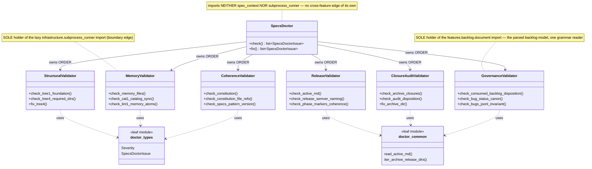

# `features/specs/doctor` — SpecsDoctor coordinator + validator siblings

This class diagram is the canonical picture of the `features/specs/doctor` subsystem: a thin
`SpecsDoctor` **coordinator** that owns `check()`/`fix()` ORDER and delegates all LOGIC to six
single-responsibility validator siblings, plus two shared leaf modules (`doctor_types`,
`doctor_common`). Each validator is independently testable; the coordinator holds no family
logic of its own.

Boundary imports are **confined** to exactly one validator each: `doctor_memory` is the sole
holder of the lazy `infrastructure.subprocess_runner` edge (the LINT-1 shell-out), and
`doctor_governance` is the sole holder of the `features.backlog.document` edge (the parsed
ACTIVE/LEDGER model it validates against, never a second grammar reader). The coordinator
holds neither, and the doctor package carries no `spec_context` edge at all.

**Regeneration law.** Regenerate at the closure of every structural release (any rename,
split, or merge of the `SpecsDoctor` coordinator or its validator siblings). The class names
above are pinned by the introspection drift-guard
`tests/contract/test_architecture_diagrams_current.py`, which imports the live `doctor_*`
modules and fails if a diagrammed class name goes stale or a live validator is missing. The
same guard requires this file to carry exactly one fenced Mermaid block.
