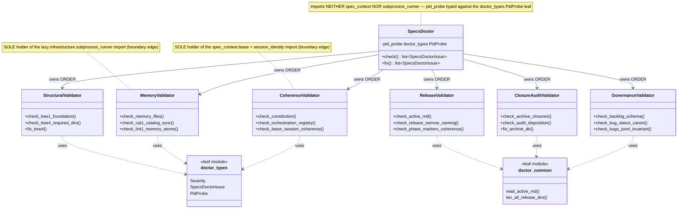

# `features/specs/doctor` — SpecsDoctor coordinator + validator siblings

**Release origin:** v0.1.55 (Architecture Decomposition, FR1). This class diagram is the
canonical picture of the decomposed `features/specs/doctor` subsystem: a thin `SpecsDoctor`
**coordinator** that owns `check()`/`fix()` ORDER and delegates all LOGIC to six
single-responsibility validator siblings, plus two shared leaf modules
(`doctor_types`, `doctor_common`). It replaces the former 2,830-line god module.

The two feature-boundary imports are **confined** to exactly one validator each:
`doctor_coherence` is the sole holder of the `spec_context.{lease, session_identity}` edge, and
`doctor_memory` is the sole holder of the lazy `infrastructure.subprocess_runner` edge. The
coordinator holds neither — its `pid_probe` seam is typed against the `doctor_types.PidProbe`
leaf alias, so it carries no `spec_context` cross-feature edge (R-1 cap invariant, cross-feature
stays 13).

**Regeneration law.** Regenerate at the closure of every structural release (any rename,
split, or merge of the `SpecsDoctor` coordinator or its validator siblings). The class names
above are pinned by the introspection drift-guard
`tests/contract/test_architecture_diagrams_current.py`, which imports the live `doctor_*`
modules and fails if a diagrammed class name goes stale or a live validator is missing.
