# `dadaia_workspace/features` — package map (26 packages)

**Release origin:** v0.1.55 (Architecture Decomposition, FR3). This package graph is the
canonical picture of the feature layer after the `reports_next` / `reports_retention` /
`reports_validation` triplet merged into one `features/reports/` package (flat `next` /
`retention` / `validation` submodules), plus the v0.2.5 capability, certification, and
transactional reconciliation boundaries. The current feature count is **26**.

Each feature is isolated (no feature imports another feature — composition happens in
`container.py`); the surviving cross-feature edges are frozen by the import-linter
`features-no-cross-feature` contract (ignore-cap **26 = 9/4/13**, unchanged this release —
the doctor + reports moves repoint existing edges 1:1). The `workflows ↔ lifecycle` cycle is
broken by hosting the governed catalog seam in `features/lifecycle/governed_catalog.py`,
pinned by the `lifecycle-no-workflows` contract.

```mermaid
flowchart TB
    subgraph features["dadaia_workspace/features — 26 packages"]
        academy["academy"]
        agents["agents"]
        ai_surface["ai_surface"]
        backlog["backlog"]
        bugs["bugs"]
        capabilities["capabilities"]
        certification["certification"]
        chokepoints["chokepoints"]
        ci_preflight["ci_preflight"]
        export["export"]
        import_["import_"]
        lifecycle["lifecycle"]
        migrate["migrate"]
        panel["panel"]
        public["public"]
        reconcile["reconcile"]
        reports["reports"]
        repos["repos"]
        server_registry["server_registry"]
        spec_artifacts["spec_artifacts"]
        spec_context["spec_context"]
        specs["specs"]
        telemetry["telemetry"]
        workflows["workflows"]
        workspace["workspace"]
        workspace_clean["workspace_clean"]
    end

    subgraph reports_pkg["features/reports — merged v0.1.55 FR3 (was 3 top-level packages)"]
        next["next"]
        retention["retention"]
        validation["validation"]
    end

    reports --> reports_pkg
    lifecycle -. governed_catalog seam .-> workflows
    container["container.py (composition root)"] --> features
    core["core/ (models · protocols · exceptions)"]
    features --> core

    note1["edge #7: lifecycle.report_workflow -> reports.validation (FR3 target repoint)"]
    reports_pkg -.- note1
```

**Regeneration law.** Regenerate at the closure of every structural release (any feature
package added, removed, renamed, split, or merged). The 26 package names and the three
`features/reports` submodule names above are pinned by the introspection drift-guard
`tests/contract/test_architecture_diagrams_current.py`, which discovers the live packages via
`pkgutil` and fails if a diagrammed package name goes stale or a live package is missing.
