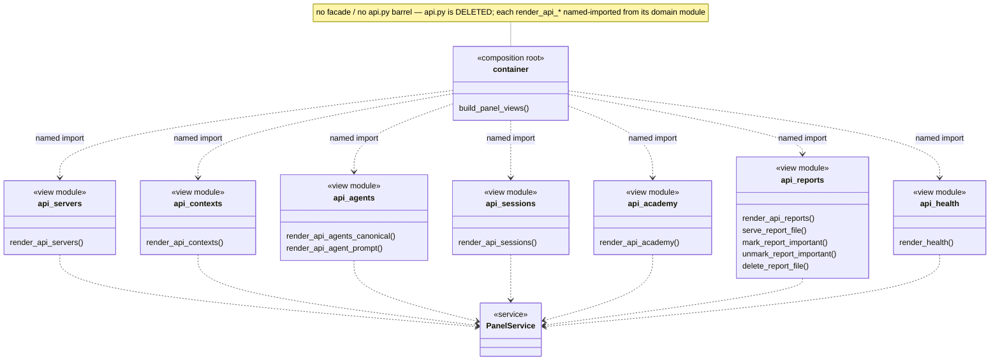

# `features/panel/views` — per-domain API view modules

**Release origin:** v0.1.55 (Architecture Decomposition, FR2). This module graph is the
canonical picture of the decomposed panel API surface: the former 1,279-line
`features/panel/views/api.py` god module split into **seven per-domain view modules**, one
responsibility each. `api.py` is **deleted** — there is no facade, barrel, or re-export shim.
`container.py` imports each `render_api_*` function from its per-domain module via explicit
named imports (extending the incumbent named-import pattern shared with
`panel.views.workflow_policy`).

Every module imports **only** `features.panel.service` (`PanelService`) plus `core.models` —
zero cross-feature / infrastructure edges — so FR2 changed no `setup.cfg` ignore edge.

**Regeneration law.** Regenerate at the closure of every structural release (any rename,
split, or merge of a panel `api_*` view module or its public render functions). The module
and function names above are pinned by the introspection drift-guard
`tests/contract/test_architecture_diagrams_current.py`, which imports the live
`features.panel.views.api_*` modules and fails if a diagrammed name goes stale or a live
render function is missing.
