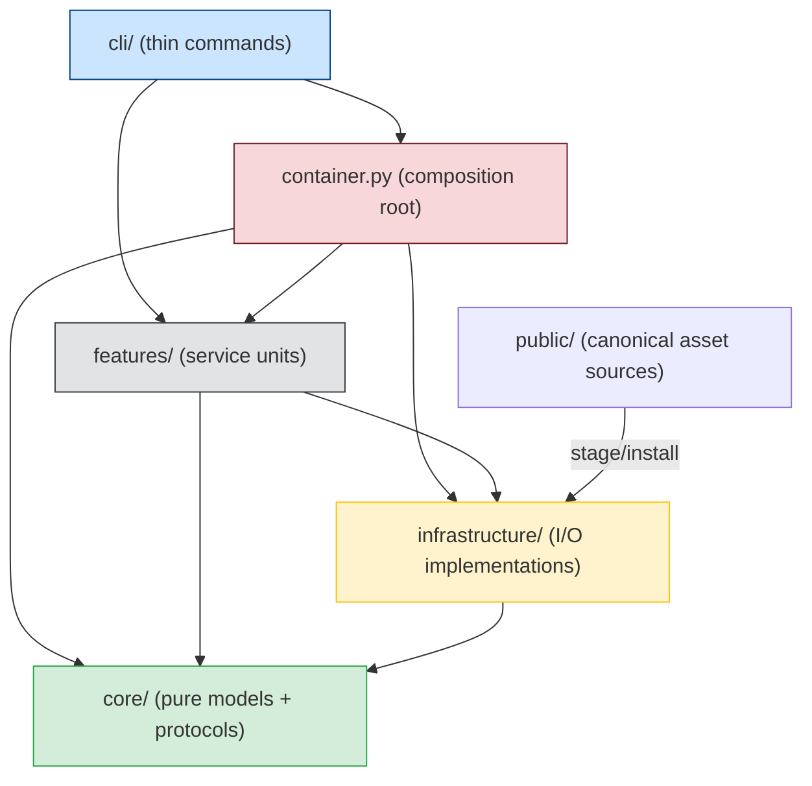

# dadaia-workspace — Deep Architecture Review

**Produced:** 2026-06-08T12:00:00Z
**Agent:** software-architect (dispatched at top level)
**Scope:** Full implementation review of `dadaia_workspace/` against memory-declared architecture
**Prior art:** Validates, deepens, and refutes findings from project-auditor audit `20260608T035551Z-da1a1b2c/architecture.md`

---

## architect-core-workflow — Step 1: Understand the Problem

**Core problem:** dadaia-workspace was built incrementally, AI-assisted, over many releases. The operator trusts the foundational pillars (lease model, SDD gate, asset chain) but suspects implementation-level rot has accumulated. The system must survive an external audit: no spaghetti, no stale layers, no unjustified side-effects, and it must remain human-workable without AI.

**Constraints:**
- Existing production system with 2358 tests — behavior-preserving refactors only
- Self-hosting: the library is developed inside one of its own instances (source-vs-instance duality)
- Multi-harness: Claude Code + Codex + OpenCode runtimes must stay in parity
- AI-assisted build history means any module could harbor implicit assumptions no human verified

**Success criteria:**
- Layer boundaries hold in every import graph
- Every module has a single, derivable responsibility
- A UML diagram can be drawn directly from class/module relationships
- A human with no AI can extend any feature without unintended side-effects

**Assumptions made explicit:**
- The three-ring architecture (cli → features → core/infrastructure) is correct and non-negotiable
- `container.py` is the sole composition root — no service is created outside it
- All infrastructure I/O is in `infrastructure/`; all business logic is in `features/` and `core/`

---

## architect-core-workflow — Step 2: Research Existing Solutions

The patterns used here (DI container, protocol-based interfaces, hexagonal architecture) are well-established. The implementation correctly targets the hexagonal / ports-and-adapters style. The panel's violation of that style is therefore not a novel discovery — it is a known failure mode when a composite feature grows without governance. The established solution (protocol interfaces in `core/protocols/`, wired in `container.py`) already exists in the codebase for other features. The gap is not a missing pattern: it is the incomplete application of an existing one.

---

## Layer and Boundary Map

**What the code actually does vs. the declared rule:**

| Rule | Status | Evidence |
|------|--------|----------|
| `core/` has zero I/O, stdlib-only imports | HOLDS | Verified across all `core/**/*.py` |
| `features/` → `core/` only (not infra directly) | MOSTLY HOLDS — exceptions below | `panel/service.py:157` instantiates `WorkflowsService` directly |
| `features/` do not import other `features/` | VIOLATED by `panel/` systematically | See AR-01, AR-02, AR-03 |
| `cli/` commands are thin (no business logic) | HOLDS | Commands call container factories; no algorithmic code |
| Single composition root at `container.py` | MOSTLY HOLDS — bypassed in one critical spot | `panel/service.py:157` constructs `WorkflowsService` directly |

---

## Gate Results

### Root-Cause Gate: PASS

All findings from the auditor and this review identify actual root causes, not symptoms. The CANONICAL_AGENTS staleness (D-01) has a clear root cause: a frozen constant not updated during agent consolidation. The `_WORKSPACE_ROOT` bug (D-02) has a clear root cause: a static path walk that only works in the wheel install, not editable. No finding in this review is a workaround masking a deeper cause.

### Architecture-Fidelity Gate: PARTIAL_FAIL

The SPEC (`architecture.md`) declares "features are isolated service units; they communicate via interfaces/protocols, never by importing each other's concrete classes." The implementation of `panel/service.py` violates this contract in two non-trivial ways:

1. **Import-time coupling** (auditor confirmed, architect deepens): `panel/service.py:45-48` imports concrete types from three sibling features. This is the correct finding.

2. **Constructor-time bypass** (auditor missed, architect adds): `panel/service.py:157` — `self._workflows_service = WorkflowsService(workspace_root)` — constructs a concrete feature service *inside the constructor of another feature service*, bypassing the DI container entirely. This is a harder violation than the import coupling because:
   - It makes `PanelService` untestable without `WorkflowsService` being importable
   - It makes `WorkflowsService` irremovable without editing `PanelService`
   - The container (`container.py:289`) then reaches into `service._workflows_service` directly for the workflow detail endpoint, which means the internal state of `PanelService` is accessed as public API by the container

The SPEC is correct; the implementation does not match it. Gate: PARTIAL_FAIL for the panel feature only. Every other feature passes.

---

## Findings

### [HIGH] AR-01 — Panel service holds three concrete sibling-feature types at import level

**Location:** `dadaia_workspace/features/panel/service.py:45-48`

**Issue:** `panel/service.py` imports `ServerRegistryService`, `SpecContextService`, and `WorkflowsService` with their concrete class names from sibling feature packages. The auditor correctly identified this. The constructor does use DI (receives them as parameters), which limits the blast radius — but the compile-time import dependency means:
- If any of those three modules is renamed or refactored, `panel/service.py` fails at import time before any test runs
- mypy type-checks against the concrete types, not the protocols, so future protocol refactors silently break type safety

**Why it matters:** Every feature boundary violation here is a future incident waiting to happen. When `SpecContextService` adds a required dependency, it must change its `__init__`, and `panel/service.py` type annotation breaks silently if checked only at runtime. This is the primary mechanism by which "code on code" rot breeds.

**Trade-off if fixed:** ~4 hours of mechanical protocol work. Three `core/protocols/` files, three container wire-ups. Eliminates the compile-time dependency. The fix is in the auditor's W-7 workstream — this review confirms and endorses it.

**Recommendation:** Define `IServerRegistryProvider`, `ISpecContextProvider`, `IWorkflowSummaryProvider` in `core/protocols/`. Wire `panel/service.py` against those. The container already does this for every other feature.

---

### [HIGH] AR-02 — PanelService bypasses the DI container for WorkflowsService (auditor missed this)

**Location:** `dadaia_workspace/features/panel/service.py:157`

**Issue:** `self._workflows_service = WorkflowsService(workspace_root)` — a concrete feature-layer service is instantiated *inside the constructor of a sibling feature service*. This is architecturally distinct from and worse than the import coupling in AR-01:

1. `WorkflowsService` is constructed outside the composition root (`container.py`), meaning its lifecycle and dependencies are invisible to the DI container.
2. `container.py:289` then reaches into `service._workflows_service` as `service._workflows_service` — a private attribute — to get the workflows service for the detail endpoint: `"api_workflow_detail": render_api_workflow_detail(service._workflows_service)`. This means the container has a coupling to the *internal state* of `PanelService`, not to its public API.
3. Because `WorkflowsService` takes `workspace_root` as its sole constructor argument and is created unconditionally on `PanelService.__init__`, it is always instantiated even when the workflows feature is not used (e.g. in tests that only check server listing).

**Why it matters:** The composition root contract says that all wiring happens in `container.py`. When a feature constructs another feature internally, two separate wiring graphs exist simultaneously. Changes to `WorkflowsService.__init__` must be made in both the container and inside `PanelService`. This is the exact "build on stale layers" pattern that produces hard-to-diagnose incidents.

**Trade-off if fixed:** `WorkflowsService` must be injected into `PanelService` through the constructor (already partially prepared — the constructor signature accepts it as an optional). The container wires it. The `service._workflows_service` access in `container.py:289` becomes a first-class constructor parameter. Approximately 30 minutes of mechanical work with zero test failures expected.

**Recommendation:** Add `workflows_service: WorkflowsService` (or better: `IWorkflowSummaryProvider`) as a constructor parameter to `PanelService`. Remove the `WorkflowsService(workspace_root)` instantiation from the constructor. Wire in `build_panel_service()`. Update `build_panel_views()` to inject directly rather than accessing `service._workflows_service`.

---

### [HIGH] AR-03 — `panel/views/api.py` imports concrete types from three feature packages

**Location:** `dadaia_workspace/features/panel/views/api.py:93-101`

**Issue:** The views layer directly imports:
- `dadaia_workspace.features.agents.reader` — concrete reader functions
- `dadaia_workspace.features.reports_retention.ReportRetentionService` — concrete service class
- `dadaia_workspace.features.telemetry.aggregator.models.AgentSummary` — concrete model
- `dadaia_workspace.features.telemetry.aggregator.runtimes.ADAPTER_REGISTRY` — a global registry singleton

The auditor's assessment was correct but understated. The most concerning item is `ADAPTER_REGISTRY` — a module-level mutable dictionary (`dict[str, RuntimeAdapter]`) imported directly by a view function. This is implicit global state in the view layer. If any test or runtime code modifies `ADAPTER_REGISTRY` during a request, the view's behavior changes unpredictably without any signal to the caller. This is precisely the pattern that produces hard-to-trace bugs under concurrent development.

The `ReportRetentionService` is instantiated *inside `render_api_reports`'s closure*: `retention = ReportRetentionService(service._workspace_root)` is called on every request. This means a new service instance — and potentially a new state store read — occurs on every `GET /api/reports`. It bypasses the DI container entirely: no injection, no lifecycle management, no test substitution without monkeypatching.

**Why it matters:** Three separate antipatterns in one file:
1. Cross-feature concrete imports (same as AR-01)
2. Module-level global mutable state accessed directly (`ADAPTER_REGISTRY`)
3. Service instantiation inside view closures (bypasses DI, creates a new store handle per request)

**Trade-off if fixed:** View functions should receive only what `PanelService` exposes through its public API. The `ReportRetentionService` concern belongs in `PanelService` or a dedicated `PanelCompositeService`. `ADAPTER_REGISTRY` should be injected or accessed through a protocol, not grabbed from the module namespace. Approximately 3-6 hours to fully clean this up.

**Recommendation:** Move `ReportRetentionService` logic into `PanelService` (it already has `workspace_root`). Pass the adapter registry as an injected mapping rather than a global. View functions should receive only `PanelService` and DTOs.

---

### [MEDIUM] AR-04 — `public_assets.py` is a 2446-line god module with two duplicate consumer-repo discovery functions (auditor confirmed, architect deepens)

**Location:** `dadaia_workspace/infrastructure/public_assets.py` (entire file)

**Issue:** The auditor correctly flagged this as MEDIUM. This review adds two deepened findings:

**Finding AR-04a — Duplicate consumer-repo discovery logic:**
The module contains two versions of the same consumer-repo enumeration logic:
- Free function `_consumer_repos_for_root(workspace_root)` at approximately line 620
- Instance method `FileSystemPublicAssetManager._consumer_repos(workspace_root)` at approximately line 2087-2107

Both functions have identical logic (walk `repos/`, check for `.dadaia/` and `.dadaia/agentic/` markers, emit `[skip]` on stderr for non-qualifying dirs). This is silent duplication. If the qualification logic ever changes (e.g. a new marker file is required), it must be updated in two places. The free function is used by `_install_workspace_guardrail_pair` and its variants; the instance method is used by `_runtime_expectations`. They are the same operation expressed twice.

**Finding AR-04b — The guardrail-pair install logic is itself triplicated:**
There are three functions that write the same `AGENTS.md + CLAUDE.md` pair:
- `_install_workspace_guardrail_pair` (lines 718-793) — workspace-root + consumer repos
- `_install_workspace_root_guardrail_pair` (lines 795-843) — workspace-root only
- `_install_consumer_repos_guardrail_pair` (lines 846-904) — consumer repos only

All three contain identical hash-compare logic: read source, compute SHA-256, compare with destination, overwrite if different. The only variation is which targets are written. This is 270 lines of triplicated code that should be approximately 60 lines with a `targets` parameter.

**Why it matters:** The duplication means that fixing a bug in the hash-compare logic (e.g. the hash comparison currently misses the case where the destination exists but has wrong permissions) requires three separate fixes. In practice, during the `_install_workspace_root_guardrail_pair` path (lines 816-843), the code recomputes `src_sha` and `stub_sha` inline rather than calling the shared `_sha256` helper — this is a third divergence path.

**Trade-off if fixed:** The decomposition proposed in W-8 (extract Codex rendering, extract guardrail logic, extract privacy check) is correct. The triplicated guardrail-pair write is the highest-priority internal simplification within that workstream.

**Recommendation:** Adopt W-8's decomposition plan. Immediately within the guardrail-pair section: collapse `_install_workspace_guardrail_pair`, `_install_workspace_root_guardrail_pair`, and `_install_consumer_repos_guardrail_pair` into a single function with a `targets: set[Literal["workspace", "repos"]]` parameter. Collapse `_consumer_repos_for_root` and `FileSystemPublicAssetManager._consumer_repos` into a single module-level function.

---

### [MEDIUM] AR-05 — Stale `CANONICAL_AGENTS` in `reports_next/service.py` (auditor confirmed, architect deepens root cause)

**Location:** `dadaia_workspace/features/reports_next/service.py:23-41`

**Issue:** The auditor correctly identified this as HIGH (D-01). This review reclassifies the architectural dimension as MEDIUM but confirms the functional bug is HIGH.

The root cause is not just "the list was not updated." The root cause is a design decision: `CANONICAL_AGENTS` is a frozen constant in a feature module rather than being derived from the agent registry at runtime. The agent registry already exists (`MarkdownAgentStore`, read by `read_canonical_agents()`), and `PanelService` already calls `read_canonical_agents(workspace_root)` for the agents tab. The `ReportsNextService` duplicates this concern by hardcoding a list that the registry already authoritative tracks.

The architecture allows three resolution strategies:
1. Derive the canonical set at service construction time from `read_canonical_agents(workspace_root)` (requires passing `workspace_root`)
2. Keep a hardcoded set but update it to the current 12-name set (9 core + 3 plugins)
3. Remove the filter entirely and accept any well-formed agent name from PLAN.md

Strategy 1 is architecturally correct (single source of truth). Strategy 2 is the immediate fix. Strategy 3 introduces false positives from typos in PLAN.md.

**Why it matters:** With the current stale list, any PLAN.md that uses the correct 9-core agent names (`software-engineer`, not `software-engineer-python`) will produce a `NoAgentSequenceError` or silently return an empty sequence. The `dadaia reports next` command is broken for any release authored after the 15→9 consolidation.

**Recommendation:** Immediate fix (strategy 2): replace the `CANONICAL_AGENTS` frozenset with the 12 current names. Medium-term (strategy 1): inject the agent registry path into `ReportsNextService` and derive the set at construction time.

---

### [MEDIUM] AR-06 — `_WORKSPACE_ROOT` static path derivation in `cli/main.py` routes bugs to wrong directory (auditor confirmed)

**Location:** `dadaia_workspace/cli/main.py:68`

**Issue:** `_WORKSPACE_ROOT = Path(__file__).resolve().parent.parent.parent.parent` — four levels up from `cli/main.py` yields `dadaia_workspace/ → dadaia-workspace/ → repos/ → workspace-root/`. This works for the wheel install case. For an editable install (`pip install -e .`), `__file__` resolves to the source tree path, and four levels up yields `repos/` — not the workspace root.

The auditor confirmed three actual entries in `repos/.dadaia/bugs/reported.json` proving this path is in production use.

**Additional observation from this review:** `resolve_workspace_root()` already exists at `dadaia_workspace/core/workspace_resolver.py` and correctly walks up from `cwd` looking for `.dadaia/states/spec_contexts.json`. It is imported and used by `public_assets.py`. The `_safe_app()` function in `cli/main.py` should call it instead of using the static `_WORKSPACE_ROOT`. The `WorkspaceNotInitializedError` it raises on no-workspace scenarios should be caught and handled gracefully in the exception reporter.

**Why it matters:** The `bug_reporter` accumulates all unhandled exceptions into `reported.json`. Routing those reports to `repos/.dadaia/bugs/` instead of the workspace's `.dadaia/bugs/` means:
1. The operator cannot find them via `dadaia doctor`
2. The `repos/.dadaia/` directory is a boundary violation (see the workspace root law: `.dadaia/` is workspace-level only, never inside a repo)

**Recommendation:** Replace `_WORKSPACE_ROOT = ...` with a function call inside `_safe_app()`: wrap `resolve_workspace_root()` in a try/except, fall back to a temp path on `WorkspaceNotInitializedError`. This is the W-2 fix and it is correct.

---

### [LOW] AR-07 — Dead HTML-era classes in `specs/doctor.py` (auditor confirmed)

**Location:** `dadaia_workspace/features/specs/doctor.py:263-354`

**Issue:** `_MemoryHtmlSummary`, `_MemoryParser`, `_parse_memory_html` are HTML-era remnants. The retaining comment ("retained for any callers that still parse HTML assets") is inaccurate — grep confirms zero callers in the entire codebase. Dead code is not harmless: it signals to every developer that HTML parsing is still a concern in this subsystem, misleads future readers, and creates confusion during refactors.

**Recommendation:** Delete all three constructs. Update the comment to read "HTML-era parser removed in post-memory-markdown-source-v1 cleanup." Run tests (expect zero failures).

---

### [LOW] AR-08 — `kanban.py` staleness check duplicates `locking._session_is_stale` (auditor missed)

**Location:** `dadaia_workspace/features/panel/views/kanban.py:69-81`

**Issue:** The kanban view defines its own `_is_stale(last_seen_at, ttl_seconds)` function. The docstring explicitly says "mirrors `locking._session_is_stale`." This is a documented copy. Any change to the staleness definition in the locking module (e.g. changing the TTL semantics) will silently not propagate to the kanban view because the function is copied, not imported.

The `_session_is_stale` function in `locking.py` is in the features layer (`spec_context/locking.py`). The kanban view imports from `panel/views/` — also the features layer. There is no layer violation in importing it, only the existing cross-feature coupling concern. The correct solution is to move a `is_stale_session(last_seen_at, ttl_seconds)` function to `core/` (it requires no I/O) and import it from there.

**Why it matters:** This is the "build on stale layers" pattern in miniature. When the locking module's TTL semantics change, the kanban board shows stale data for sessions that should be marked stale (or vice versa). It is the kind of bug that surfaces as a visual inconsistency with no obvious code path to follow.

**Recommendation:** Extract the shared staleness predicate to `core/lock_liveness.py` (which already has `is_stale` for lease records). Add a session-specific variant `is_stale_session(last_seen_at: str, ttl_seconds: int) -> bool`. Import it in both `kanban.py` and `locking.py`. Remove the inline duplicate.

---

## Pillar Scorecard

| Pillar | Score | Rationale |
|--------|-------|-----------|
| Strong layers / boundary enforcement | 5/10 | Panel systematically violates the boundary in three ways (AR-01, AR-02, AR-03). 13 of 15 feature packages are clean. |
| Single source of truth / no duplication | 5/10 | Consumer-repo discovery logic duplicated (AR-04a), guardrail-pair install triplicated (AR-04b), staleness check duplicated (AR-08), canonical agents list duplicated (AR-05). |
| Block-by-block encapsulation | 6/10 | `WorkflowsService` constructed inside `PanelService` constructor (AR-02) leaks through `container.py` accessing private state. `ReportRetentionService` instantiated per-request inside a view closure (AR-03). |
| Testability / replaceability | 6/10 | `WorkflowsService` bypass (AR-02) makes PanelService partially untestable without live filesystem. ADAPTER_REGISTRY global state (AR-03) requires monkeypatching to test in isolation. |
| Human-workable without AI | 7/10 | The three-ring architecture is clearly expressed. `container.py` is the correct composition root. The violations are localized to `panel/`. A competent human engineer could navigate the codebase. The god module in `infrastructure/` makes the asset pipeline hard to follow. |
| UML derivability | 6/10 | `core/` is clean enough for direct UML. `features/` (except `panel/`) maps cleanly to independent service objects. `panel/` violates encapsulation enough that its UML would show incorrect boundaries. `public_assets.py` has no class-level structure beyond `FileSystemPublicAssetManager` — the 27 top-level functions would appear as a flat function bag in any UML tool. |
| Simplicity first | 6/10 | The lease model is appropriately simple. The SDD gate is appropriately simple. The panel feature grew complex without extraction — the opposite of simplicity. The triplicated guardrail-pair logic is complexity without benefit. |

**Overall architecture score: 6.5 / 10**

This is slightly lower than the auditor's 7.0 for the architecture dimension because this review found the `WorkflowsService` constructor bypass (AR-02) and the guard-pair triplication (AR-04b), both of which the auditor missed.

---

## Auditor Finding Comparison

| Auditor ID | This Review | Disposition | Notes |
|------------|-------------|-------------|-------|
| D-01 (CANONICAL_AGENTS HIGH) | AR-05 (MEDIUM arch, HIGH functional) | CONFIRM + DEEPEN | Root cause is design: frozen constant instead of registry-derived set. Functional bug severity confirmed HIGH. |
| D-02 (_WORKSPACE_ROOT HIGH) | AR-06 (MEDIUM-HIGH) | CONFIRM | `resolve_workspace_root()` already exists; fix is mechanical. |
| D-03 (panel cross-feature imports MEDIUM) | AR-01 (HIGH) | CONFIRM + ELEVATE | Import coupling is HIGH because it breaks at import time and defeats protocol-based type safety. |
| A-01 (panel service concrete imports) | AR-01 | CONFIRM | Identical finding, elevated severity. |
| A-02 (panel/views/api.py concrete imports) | AR-03 (MEDIUM) | CONFIRM + DEEPEN | Adds ADAPTER_REGISTRY global state concern and per-request service instantiation. These are two additional antipatterns beyond what the auditor found. |
| A-03 (public_assets.py god module MEDIUM) | AR-04 (MEDIUM) | CONFIRM + DEEPEN | Adds the duplicate consumer-repo discovery logic and the triplicated guardrail-pair install logic as specific, actionable sub-findings. |
| D-04 (dead HTML classes MEDIUM) | AR-07 (LOW) | CONFIRM + DOWNGRADE | Functional impact is LOW (zero callers, no behavior change). Architectural impact is LOW (dead code, misleading comment). |
| D-05 (session files memory claim MEDIUM) | Not in scope | N/A | Memory atom accuracy is not an architecture finding. The code behavior is correct; the memory atom is wrong. |
| D-06 (god module MEDIUM) | AR-04 (MEDIUM) | CONFIRM | Identical finding, deepened with specific duplication evidence. |

**Most important finding the auditor missed:** AR-02 — `WorkflowsService` constructed inside `PanelService.__init__`, bypassing the composition root, with the container then accessing the private `service._workflows_service` attribute as a first-class dependency. This is a harder violation than the import coupling and actively undermines the DI architecture.

**Secondary finding the auditor missed:** AR-08 — staleness check duplicated verbatim from `locking.py` into `kanban.py`, documented as a mirror copy, creating a silent divergence risk.

---

## Root-Cause-Ordered Remediation Direction

Ordered by architectural root cause, not by priority:

### Root Cause RC-1: Panel feature violates isolation contract (AR-01, AR-02, AR-03)

All three panel violations share one root cause: the panel was evolved as a composite UI feature without being governed by the same isolation rules as other features. Each violation added one more concrete dependency rather than abstracting through the container.

**Direction:**
1. (AR-02 — 30 min) Remove `WorkflowsService(workspace_root)` from `PanelService.__init__`. Inject it through the constructor. Fix `container.py:289` to inject directly, not access `service._workflows_service`.
2. (AR-01 — 4 hours) Define `IServerRegistryProvider`, `ISpecContextProvider`, `IWorkflowSummaryProvider` in `core/protocols/`. Update `panel/service.py` imports and type annotations to use them.
3. (AR-03 — 3-6 hours) Move `ReportRetentionService` calls into `PanelService`. Pass adapter registry as injected mapping. View functions receive only `PanelService` and DTOs.

### Root Cause RC-2: Single-responsibility violations in `infrastructure/` (AR-04)

The god module grew organically. The root cause is the absence of an extraction discipline: each new behavior was appended to the same file rather than placed in its own module.

**Direction:** Execute W-8 (multi-release decomposition). Within the current release: collapse the three triplicated guardrail-pair install functions and the two consumer-repo discovery functions as an immediate, safe simplification (~60 lines instead of ~330 lines).

### Root Cause RC-3: Stale constants not derived from single sources of truth (AR-05, AR-08)

Two cases where a value that should be derived from an authoritative source is instead hardcoded or copied. The root cause is the absence of a "no hardcoded registry values" discipline.

**Direction:**
- AR-05: derive `CANONICAL_AGENTS` from the agent registry at construction time, or update the constant as an immediate fix.
- AR-08: move the staleness predicate to `core/lock_liveness.py`.

### Root Cause RC-4: Stale path assumption in CLI entry point (AR-06)

Root cause is the `_WORKSPACE_ROOT` static path derivation. The fix is a single mechanical substitution of `resolve_workspace_root()`.

**Direction:** W-2 as described by the auditor. No architecture design needed — it is a one-line fix with a `WorkspaceNotInitializedError` catch.

### Root Cause RC-5: Dead code left without removal discipline (AR-07)

Root cause is the absence of a "delete it; don't comment it" convention. The "retained for callers" comment is an anti-pattern: it defers the deletion decision to future readers who have no context.

**Direction:** Delete `_MemoryHtmlSummary`, `_MemoryParser`, `_parse_memory_html`. Run tests. Zero failures expected.

---

## Positive Architecture Findings (what the foundations get right)

These are not merely diplomatic observations — they are the reason the overall score is 6.5 and not lower:

1. **`core/` is genuinely pure.** Zero I/O, zero feature imports, zero infrastructure imports. Only models, protocols, exceptions, and two utility modules (`workspace_resolver`, `lock_liveness`, `specs_version`, `specs_resolver`). This foundation is solid.

2. **The lease model is architecturally correct.** `features/spec_context/lease.py` is clean, single-purpose, well-documented. The O_EXCL CAS sentinel pattern closes the TOCTOU gap correctly. The `_before_write` test seam is correctly guarded with an import-time assertion. This is a well-engineered critical section.

3. **`container.py` functions as a composition root.** Every factory function follows the same `build_<feature>_service(workspace_root)` pattern. The wiring is explicit and readable. The panel violations are exceptions, not the rule.

4. **`cli/` commands are genuinely thin.** Verified: no business logic in any command file. All commands validate inputs, call container factories, format outputs.

5. **13 of 15 feature packages respect isolation.** Only `panel/` systematically violates the boundary. All other features (`spec_context`, `telemetry`, `workflows`, `orchestration`, `academy`, `repos`, `server_registry`, `specs`, `agents`, `workspace`, `export`, `import_`, `public`) hold their boundaries.

6. **The `infrastructure/` sub-package structure is correct** for every module except `public_assets.py`. `git_subprocess.py`, `markdown_agent_store.py`, `markdown_workflow_store.py`, `json_*_store.py` are appropriately scoped single-responsibility modules.

---

## Open Questions

These questions cannot be answered by code inspection alone and are not resolved in this review:

1. **Is the `panel/views/api.py:ADAPTER_REGISTRY` global intentional?** The registry is module-level mutable state. If it is intended to be runtime-extensible, that design decision should be documented. If it is fixed at startup, it should be a frozen dict or a constant.

2. **Is `WorkflowsService(workspace_root)` inside `PanelService.__init__` a known trade-off?** The docstring does not explain why it was not injected. If there was an intentional reason (e.g. avoiding a circular dependency), it should be documented.

3. **Is the self-hosting development loop (`dadaia-workspace` in `repos/dadaia-workspace/`) tested end-to-end after every library change?** The `_is_self_repo` / `_is_source_repo_root` distinction suggests this was a pain point. Understanding whether the self-hosting test loop is automated would inform the priority of the `_WORKSPACE_ROOT` fix.
