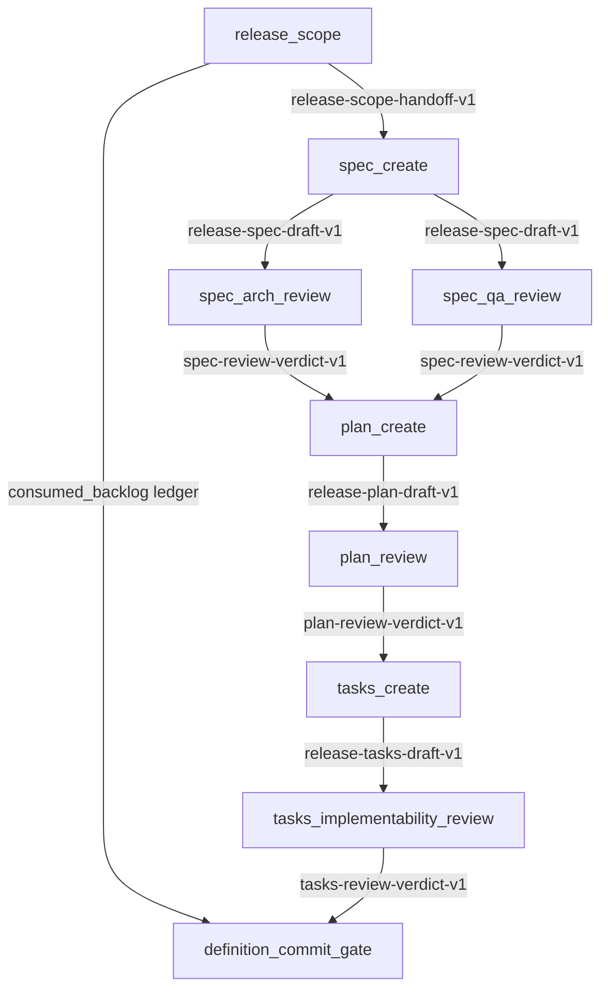

# EPIC - Workflow Step Handoffs + Consumption-Aware Cleanup

## 0. One-line law

Inside a dadaia-workflow, prompts do not communicate by stale prose, broad context scans, or
"latest file by agent" guesses. They communicate through a **run-scoped workflow handoff
ledger**: `LifecycleRun` is the control plane, immutable step payload artifacts are the
data plane, and Python owns the producer -> consumer graph. Python validates every payload
before injecting a compact digest into the next prompt, records consumption, and reclaims
consumed transient artifacts when they are no longer needed.

## 1. Why this matters

The new architecture makes dadaia-workflows the procedural brain of the development
lifecycle. A workflow is no longer one model call; it is a Python routine with many prompt
steps:

- sequence;
- conditional branches;
- loops;
- gates;
- future parallel batches.

Static prompt fragments solve only half the problem. They tell each prompt **how to do its
step**. They do not carry **what the previous prompt discovered or decided**. That second
half is the workflow handoff data plane.

Example: in release definition, `release_scope` decides which backlog/bugs/audit findings
are in scope, which backlog entries are consumed, and which open questions were resolved.
`spec_create` must consume exactly that scope. Later, cleanup/backlog disposition must know
which backlog files were consumed and whether they should be rewritten to residual or
removed from the live set. If this state is passed as loose prose or by scanning all old
handoffs, the workflow will drift and accumulate slop.

## 2. Current state, evidenced

The repo already has useful foundations:

- `dadaia_workspace/public/schemas/handoff-v1.schema.json` defines generic
  `handoff-v1.1` for agent/report/review communication.
- `.dadaia/handoff/<context>/` is the canonical machine-readable handoff zone.
- `features/lifecycle/gates.py` validates generic handoff evidence semantically:
  agent, context, release, verdict, commit SHA, task group, age, severity.
- `features/lifecycle/context_selector.py` supports `previous-handoff-only`, but it
  selects handoffs by directory scan and optional agent-name substring.
- `features/lifecycle/workflows/release_definition.py` is the first real fragment-driven
  workflow. It has 8 model steps plus a terminal Python gate:
  `release_scope -> spec_create -> spec_arch_review -> spec_qa_review -> plan_create ->
  plan_review -> tasks_create -> tasks_implementability_review -> definition_commit_gate`.
- `LifecycleRun.injected_context` records prompt composition: fragment ids, dynamic refs,
  prefix hash, model, runtime kind, output schema, and gate result.
- `infrastructure/json_lifecycle_run_store.py` already persists lifecycle runs atomically
  under `.dadaia/states/lifecycle/`.
- `infrastructure/runtime_files.py` already writes run artifacts under
  `.dadaia/runs/lifecycle/<run_id>/`.
- `features/lifecycle/hygiene.py` and `features/lifecycle/antislop/retention.py` already
  know `.dadaia/handoff` as a swept zone with TTL and protections.

But these foundations are not yet a workflow-step handoff system:

- `handoff-v1.1` is generic; it has no workflow id, run id, producer step, consumer steps,
  payload schema, consumed state, or cleanup policy. It also has
  `additionalProperties: false`, so workflow fields cannot be safely bolted on.
- `ContextSelector._handoffs()` reads all `.handoff.json` files and can filter only by
  filename containing an agent string. It does not know producer/consumer edges.
- `previous-handoff-only` means "latest matching file", not "the handoff produced by the
  exact upstream step this prompt depends on".
- `LifecycleAgentRunner` gates on `artifact_refs`, but does not parse, persist, or mark
  consumed workflow-step payloads.
- Hygiene cleanup is TTL/protection based. It can count malformed/orphan handoffs, but it
  does not know when a handoff has been consumed by all downstream prompts.
- Retention protects live run `expected_artifacts`, but lifecycle runs do not yet claim
  run-scoped step payload artifacts as live workflow data-plane state.

## 3. Candidate architecture decision

### 3.1 Options reviewed

| Option | Verdict | Why |
|---|---|---|
| Per-step JSON files only | Rejected as incomplete | The files are inspectable, but discovery becomes a filename convention. That repeats today's `latest matching handoff` bug in another directory. |
| One aggregate JSON only | Rejected as too bulky | Simple read path, but payloads bloat lifecycle state and cleanup cannot reclaim individual consumed step outputs safely. |
| Append-only JSONL/event log only | Rejected as authority | Excellent audit/replay format, but Python would have to rebuild current state before every prompt; this is unnecessary for a single coordinator workflow. |
| SQLite/local queue | Rejected for now | SQLite WAL is mature and Python ships `sqlite3`, but it introduces database locks, backup/checkpoint concerns, and a new operational surface. Current scale is one Python workflow coordinator. |
| Hybrid run ledger + immutable artifacts | Chosen | `LifecycleRun` decides what each prompt consumes; immutable run artifacts carry payloads; optional event log can observe; retention can reclaim consumed transient payloads. |

External prior art supports the decision boundary: Python's `queue` module is primarily an
in-process/thread communication primitive, not a durable workflow state store; SQLite WAL
supports concurrent readers with a single writer, but it is a database subsystem with its
own lock/checkpoint behavior. The current repo already has an atomic JSON run store and
canonical `.dadaia/runs/lifecycle` artifact zone, so adding SQLite now is extra machinery.

### 3.2 Target thesis

Add a workflow-specific handoff layer beside the existing agent/report handoff contract.

Keep:

- generic `handoff-v1.1` for human/report sidecars, review/security approvals, and
  inter-agent evidence outside workflow internals;
- `.dadaia/handoff/<context>/*.handoff.json` as the durable external evidence channel
  consumed by reports, panel, review gates, and pre-push security gates.

Add:

- `WorkflowStepRecord` entries inside `LifecycleRun` as the **control plane**;
- immutable `workflow-step-payload-v1` artifacts under `.dadaia/runs/lifecycle/<run_id>/`
  as the **data plane**;
- optional `events.jsonl` later as an observability log, never as the source of truth;
- a queue-like resolver API that gives the next step exactly its declared upstream
  payloads and marks them consumed when prompt assembly succeeds.

The worker should emit schema-specific structured output. Python validates it, persists it
as a workflow-step payload artifact, then records the artifact ref in `LifecycleRun`.

The workflow-step payload is a typed envelope:

```json
{
  "schema_version": "workflow-step-payload-v1",
  "context": "dadaia-workspace",
  "release_id": "v0.1.25",
  "workflow_id": "release_definition",
  "run_id": "release-define-20260626",
  "producer_step": "release_scope",
  "producer_role": "project-manager",
  "attempt": 1,
  "sequence": 1,
  "produced_at": "2026-06-26T00:00:00Z",
  "payload_schema": "release-scope-handoff-v1",
  "verdict": "APPROVED",
  "verdict_reason": "Scope is complete and conflict-free.",
  "summary": "Release scope selected one backlog item and no bugs/audits.",
  "payload": {
    "selected_backlog": ["workflow-model-governance-panel-control-plane"],
    "selected_bugs": [],
    "selected_audits": [],
    "consumed_backlog": [
      {
        "slug": "workflow-model-governance-panel-control-plane",
        "disposition": "consume-after-release-definition",
        "residual_required": false
      }
    ],
    "open_questions": [],
    "scope_summary": "..."
  },
  "next_consumers": ["spec_create", "definition_commit_gate"]
}
```

The envelope is generic; the `payload` is schema-specific. Python validates both:

1. envelope schema;
2. payload schema named by `payload_schema`.

## 4. File layout and state model

Use the existing lifecycle state and run-artifact zones so cleanup and selection are
deterministic:

```text
.dadaia/states/lifecycle/<run_id>.json
.dadaia/runs/lifecycle/<run_id>/
  steps/
    001-release_scope-attempt-1.step-payload.json
    002-spec_create-attempt-1.step-payload.json
    003-spec_arch_review-attempt-1.step-payload.json
    004-spec_create-attempt-2.step-payload.json
  events.jsonl                 # optional observability slice, not authority
```

`LifecycleRun` becomes the Python-owned manifest/control plane. Add a backward-compatible
field such as `workflow_steps`:

```json
{
  "schema_version": "lifecycle-run-v2",
  "context": "dadaia-workspace",
  "release_id": "v0.1.25",
  "run_id": "release-define-20260626",
  "command": "release_definition",
  "status": "running",
  "workflow_steps": [
    {
      "step_id": "release_scope",
      "attempt": 1,
      "producer_role": "project-manager",
      "produced_ref": ".dadaia/runs/lifecycle/release-define-20260626/steps/001-release_scope-attempt-1.step-payload.json",
      "produced_at": "2026-06-26T00:00:00Z",
      "payload_schema": "release-scope-handoff-v1",
      "verdict": "APPROVED",
      "consumers": {
        "spec_create": {"status": "consumed", "attempt": 1, "consumed_at": "2026-06-26T00:01:00Z"},
        "definition_commit_gate": {"status": "pending", "attempt": null, "consumed_at": null}
      },
      "retention": {
        "mode": "delete-after-consumed",
        "eligible_at": null
      },
      "promoted_handoff_ref": null
    }
  ]
}
```

Why run-scoped:

- no "latest by agent" ambiguity;
- parallel workflow runs do not collide;
- implementation/review loops can identify attempts (`implement#1 -> qa#1 rejected ->
  implement#2`) without deadlock or stale input;
- cleanup can reclaim consumed step artifacts without touching external review evidence;
- the panel can show a run's data plane from one run record without scanning unrelated
  handoffs.

`.dadaia/handoff/<context>/*.handoff.json` remains valid, but only for outputs that must
survive beyond the internal workflow exchange: human-facing report handoffs,
security-reviewer approvals, code-review verdicts, closure evidence, and other durable
cross-agent evidence.

## 5. Producer / consumer contract

Each workflow step definition declares:

```yaml
produces:
  - id: release_scope
    payload_schema: release-scope-handoff-v1
    required: true
consumes:
  - from_step: release_scope
    as: release_scope_handoff
    payload_schema: release-scope-handoff-v1
    required: true
    consume_mode: read-once
```

Python enforces:

- a step cannot start until all required upstream handoffs exist and validate;
- a step receives only the upstream payloads declared in `consumes`;
- a produced payload's `payload_schema` must match the step definition;
- a consumer marks consumption in `LifecycleRun.workflow_steps` only after its prompt is built
  successfully with that payload digest injected;
- a payload is cleanup-eligible only after every declared consumer reaches
  `status: consumed`, unless its retention mode promotes it to durable evidence.

This gives queue semantics without adopting a queue server:

- **enqueue:** Python persists an immutable step payload artifact and records `produced_ref`;
- **dequeue/read:** Python resolves declared upstream refs from `LifecycleRun`, validates them,
  and renders compact digests into the next prompt;
- **ack:** after prompt assembly succeeds, Python records the consumer's `consumed_at`;
- **reclaim:** retention deletes transient artifacts only after every declared consumer acked
  and the run is not live.

No prompt should scan a directory to discover "the latest" handoff. The resolver is the only
authority.

## 6. Release-definition example

Current sequence:

```text
release_scope
spec_create
spec_arch_review
spec_qa_review
plan_create
plan_review
tasks_create
tasks_implementability_review
definition_commit_gate
```

Target handoff graph:



Important behavior:

- `spec_create` consumes only the `release_scope` payload, not every old
  project-manager handoff.
- `plan_create` consumes both SPEC review verdict payloads.
- `definition_commit_gate` consumes the whole run ledger and validates all required
  producer/consumer edges before advancing.
- `consumed_backlog` from `release_scope` is carried as structured data to the commit gate
  and later to closure/backlog disposition logic.

## 7. Cleanup semantics

Workflow step payloads have lifecycle states:

| state | meaning | cleanup posture |
|---|---|---|
| `produced` | payload artifact exists and validates | protected while run is live |
| `consumed_partial` | at least one downstream consumer consumed it | protected until all required consumers consume |
| `consumed_all` | every declared consumer consumed it | eligible after `ttl_after_consumed_seconds` unless promoted |
| `promoted` | durable evidence needed by report/panel/release closure | mirrored or referenced by `.dadaia/handoff` / report evidence protection |
| `orphan` | producer not in `LifecycleRun.workflow_steps` or no matching run | hygiene candidate |
| `malformed` | invalid envelope/payload | blocks workflow if active; hygiene candidate if stale/inactive |

Retention modes:

- `delete-after-consumed`: default for internal prompt-to-prompt data.
- `keep-until-run-complete`: useful for debugging failed runs.
- `promote-to-evidence`: durable handoff referenced by CLOSURE/report/panel.
- `keep-until-release-closure`: retained through closure, then eligible.

Cleanup must be two-stage:

1. **Workflow finalization:** when a run completes/fails/blocks terminally, Python marks
   step payload artifacts with computed `eligible_at` based on consumption and retention
   mode.
2. **Retention sweep:** `RetentionSweep` reclaims eligible, non-live, non-important
   `.dadaia/runs/lifecycle/<run_id>/steps/*` artifacts/directories. Dry-run by default;
   apply only via explicit cleanup.

Never delete:

- step payload artifacts in a live run's claimed run directory;
- promoted/current-release evidence;
- generic handoffs referenced by a valid report artifact;
- paths marked important by the operator;
- payload artifacts whose resolved path escapes `.dadaia/runs/lifecycle`.

## 8. Runtime integration

Add services:

```text
dadaia_workspace/core/models/workflow_handoff.py
dadaia_workspace/features/lifecycle/workflow_handoffs.py
dadaia_workspace/infrastructure/json_lifecycle_run_store.py        # extend existing store
dadaia_workspace/infrastructure/runtime_files.py                   # extend run-artifact writes
```

Responsibilities:

- allocate run-scoped step-artifact directory under `.dadaia/runs/lifecycle/<run_id>/`;
- write immutable step payload artifacts atomically;
- validate envelope + payload schema;
- resolve declared upstream payload refs for a step from `LifecycleRun.workflow_steps`;
- render selected payloads into compact prompt digests, not raw JSON dumps;
- update `LifecycleRun.workflow_steps` consumption state atomically through the existing run
  store;
- expose run handoff graph for panel/reporting from the run record;
- compute cleanup eligibility.

Extend:

- `features/lifecycle/workflows/release_definition.py`:
  - declare `produces` / `consumes` per `ReleaseStep`;
  - write/validate step payload artifacts after each model result;
  - inject upstream payload digests through the workflow resolver, not
    `ContextSelector._handoffs()`;
  - terminal gate validates graph completeness before phase transition.
- `features/lifecycle/pipeline.py`:
  - apply the same ledger to implementation/review loops;
  - track attempts so `implement#2` consumes the rejection from `qa#1`, never stale
    output from `qa#0` or an unrelated run.
- `features/lifecycle/context_selector.py`:
  - keep `previous-handoff-only` only for legacy/manual contexts;
  - add workflow-aware selectors such as `workflow_handoff:<step>` or remove handoff
    selection from generic context selector and route it through the workflow resolver;
  - render handoff digests (`verdict`, `summary`, blocking findings, artifact refs,
    decisions) instead of raw JSON.
- `core/models/lifecycle.py`:
  - add `WorkflowStepRecord` / `WorkflowStepConsumerRecord` / attempt ledger to
    `LifecycleRun`;
  - keep `InjectedContext.refs` as the prompt-composition audit, now including typed refs
    like `workflow-payload:<run_id>:<step>:<attempt>`.
- `features/lifecycle/hygiene.py`:
  - count workflow-step payload artifacts separately from generic handoffs;
  - identify produced/consumed/orphan/malformed states.
- `features/lifecycle/antislop/retention.py`:
  - protect live run directories using `LifecycleRun.expected_artifacts` plus step payload
    refs;
  - reclaim `consumed_all` eligible payload artifacts;
  - prune empty run directories after eligible cleanup.
- `container.py`:
  - wire the workflow handoff resolver/service through the composition root.

## 9. Schema strategy

Do not force this into `handoff-v1.1`. That schema is generic, stable, and
`additionalProperties: false`.

Add:

```text
dadaia_workspace/public/schemas/workflow-step-payload-v1.schema.json
dadaia_workspace/public/schemas/lifecycle-run-workflow-steps-v1.schema.json
```

Payload schemas can initially be Python dictionaries/tests, but the better long-term path
is one schema per `output_schema`:

```text
dadaia_workspace/public/schemas/lifecycle/release-scope-handoff-v1.schema.json
dadaia_workspace/public/schemas/lifecycle/release-spec-draft-v1.schema.json
dadaia_workspace/public/schemas/lifecycle/spec-review-verdict-v1.schema.json
...
```

The existing output-schema parity tests prove PI/Codex can extract the same structured
payload. This release should extend that proof so the extracted payload also validates
against the workflow-step payload schema.

Also fix the prompt/schema mismatch in `public/lifecycle_fragments/shared/output-handoff.md`:
the current handoff schema requires `findings[].detail_md`, but the fragment describes
`detail`. That mismatch must not be copied into the workflow-step schema.

## 10. Panel visibility

The Workflows tab should show the run ledger as the workflow data plane:

- per-run producer/consumer graph;
- each step's produced payload artifact;
- each consumer and consumption state;
- payload schema;
- payload summary;
- cleanup state: live, consumed, promoted, eligible, deleted;
- errors: missing upstream payload, malformed payload, stale unresolved payload.

This should integrate with the future Workflows tab from
`workflow-model-governance-panel-control-plane`: the same step matrix that shows model and
fragments should also show "inputs consumed" and "payloads produced".

## 11. Doctor / validation checks

Add:

```text
dadaia lifecycle handoffs doctor
```

or fold into `dadaia lifecycle hygiene status`.

Checks:

- every non-terminal run with workflow-step payloads has `LifecycleRun.workflow_steps`;
- every `produced_ref` path exists and validates;
- every step payload references the same context/release/workflow/run as the `LifecycleRun`;
- every required consumer is declared and eventually marked consumed;
- no step consumes a payload not declared in workflow definition;
- no active run has a malformed required payload;
- no stale `consumed_all` payload remains past TTL unless promoted/protected;
- no orphan workflow payload exists outside a run directory.

## 12. Tests

Required tests:

- unit: workflow-step payload schema validates and rejects missing workflow/run/producer fields;
- unit: payload schema validation rejects a malformed `release-scope-handoff-v1` payload;
- unit: store atomic write leaves no temp files;
- unit: consumer cannot read undeclared upstream payload;
- unit: consumption state transitions `produced -> consumed_partial -> consumed_all`;
- unit: cleanup eligibility only after all required consumers consumed;
- unit: promoted payload is never reclaimed while its mirrored external evidence remains;
- integration: release-definition fake run produces run-scoped payload artifacts in
  sequence and records them in `LifecycleRun.workflow_steps`;
- integration: `spec_create` receives the exact `release_scope` payload by run/step/attempt,
  not latest by agent;
- integration: implementation retry loop proves `implement#2` consumes `qa#1` rejection and
  not `qa#0` / unrelated run state;
- integration: terminal commit gate blocks if a required payload is missing/malformed;
- integration: retention dry-run reports eligible consumed payloads; apply deletes only
  eligible ones and prunes empty run dirs;
- panel/API: run detail exposes payload graph and consumption states.

## 13. Risks and mitigations

| Risk | Mitigation |
|---|---|
| Handoffs become new slop source | Run-scoped payload artifacts + consumed state + eligibility + retention sweep |
| Wrong handoff injected into a prompt | Workflow definitions declare exact producer/consumer edges; no latest-by-agent scan |
| Panel/debug needs history but cleanup deletes it | Retention mode can promote evidence; default deletes internal transient handoffs |
| Schema sprawl | Envelope schema stable; payload schemas generated/owned by workflow definitions |
| Parallel future steps race on run ledger | Atomic `LifecycleRun` updates with CAS/sentinel; optional append-only event log for audit |
| A failed run needs investigation | Failed/blocked runs keep payload artifacts until run terminal TTL or operator cleanup |
| Consumed backlog cleanup loses evidence | Promote consumed-backlog ledger to release evidence or archive copy before deletion |
| Generic handoff v1.1 breaks | Do not mutate it for workflow internals; add separate workflow-step schema |
| SQLite/local queue overcomplicates runtime | Keep queue semantics in the Python resolver; defer SQLite until proven multi-process contention exists |

## 14. Release slicing

### Slice A - workflow handoff core

- add `WorkflowStepRecord` models/schemas in `LifecycleRun`;
- add producer/consumer declarations to release-definition workflow;
- validate and inject run-scoped payload digests;
- persist payload refs in `LifecycleRun`;
- tests for release-definition handoff graph.

### Slice B - cleanup semantics

- add consumption-state tracking;
- add cleanup eligibility;
- extend hygiene/retention to reclaim consumed workflow payload artifacts;
- tests for live/protected/eligible behavior.

### Slice C - panel visibility

- expose run payload graph through panel API;
- render producer/consumer graph and consumption states in Workflows tab;
- show cleanup/protection status.

### Slice D - broader workflow adoption

- apply same handoff protocol to backlog-definition, implementation, closure, audit,
  research, and bug-report workflows as their bodies become real.

## 15. Acceptance criteria

1. Release-definition fake run records `LifecycleRun.workflow_steps` and writes one
   immutable step payload artifact per producing model step under
   `.dadaia/runs/lifecycle/<run_id>/steps/`.
2. `spec_create` consumes the exact `release_scope` payload by run id, producer step, and
   attempt.
3. A missing or malformed required upstream payload blocks the workflow before the next
   prompt runs.
4. Every step payload validates envelope + payload schema.
5. Consumption is recorded per downstream step.
6. A payload artifact is not cleanup-eligible until all declared consumers consumed it.
7. Consumed transient payload artifacts are reclaimed by retention after their consumed TTL,
   while promoted/current-release evidence survives.
8. No workflow code uses "latest handoff by agent filename" for required prompt-to-prompt
   communication.
9. Panel/API can show the per-run payload graph, produced/consumed states, payload schemas,
   and cleanup eligibility.
10. `dadaia lifecycle handoffs doctor` or equivalent fails on orphan, malformed, stale,
    undeclared, and unconsumed required payloads.

## 16. Mandatory grill questions before SPEC

1. Confirm the chosen storage boundary: `LifecycleRun` control plane plus immutable
   `.dadaia/runs/lifecycle/<run_id>/steps/` payload artifacts, with `.dadaia/handoff`
   reserved for durable external evidence. Is there any operator requirement that
   contradicts this?
2. Should payload schemas be real JSON Schema files in the first release, or Python
   validators with schema files added in the second slice?
3. What default retention should internal consumed payload artifacts use: 1 hour, 24 hours, or
   delete immediately at successful workflow finalization?
4. Which payloads must be promoted/mirrored to durable release evidence by default:
   release-scope, review verdicts, consumed-backlog ledger, or all terminal gates?
5. Should failed/blocked workflow runs keep all step payload artifacts until manual cleanup, or
   expire them after a longer failure TTL?
6. For implementation/review loops, what is the maximum automatic retry count before the
   workflow blocks for operator intervention?
