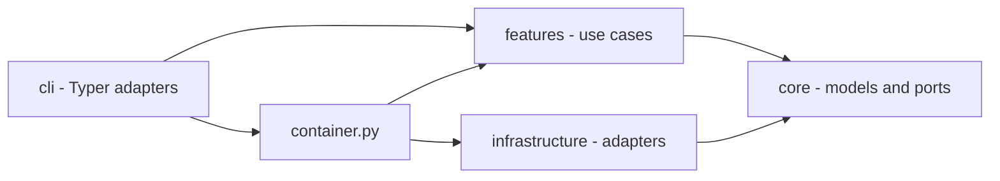
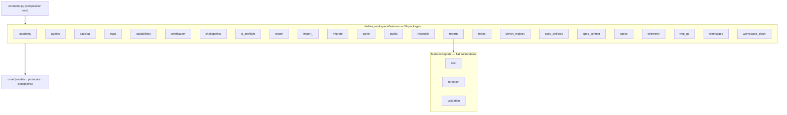

## Part 1 — Principles

A principle is admitted only with an **existing mechanical check** that fails when it is
violated; its `Measured by:` line names that check verbatim. A rule nobody can measure is
Part-2 description. Its `ADR:` line is `none` for a pre-canon principle (predates the ADR
mechanism) or `NNNN (proposed|accepted)` once a real decision record exists — a FUTURE
change to any of these principles requires a new ADR; an agent proposes, only the operator
accepts.

### P-01 · We keep features on ports: a feature never imports `infrastructure` directly; the container injects the adapter.
Measured by: `lint-imports --config setup.cfg --no-cache` — contract `features-no-infrastructure`.
ADR: none
Rationale: an adapter reached directly cannot be substituted or faked.

### P-02 · We never spawn a subprocess from a feature; process execution goes through `ProcessRunner`.
Measured by: `lint-imports --config setup.cfg --no-cache` — contract `features-no-subprocess`.
ADR: none
Rationale: one process seam keeps execution observable, fakeable and bounded.

### P-03 · We keep `core` free of OS primitives (`fcntl`, `signal`, `subprocess`, `msvcrt`); `core/platform.py` is the sole platform seam.
Measured by: `lint-imports --config setup.cfg --no-cache` — contract `core-no-os-primitives`.
ADR: none
Rationale: a POSIX-only primitive in the bottom ring breaks every importer on Windows.

### P-04 · We make `core` the bottom ring: it imports no `features`, `infrastructure`, `cli` or `hooks`.
Measured by: `lint-imports --config setup.cfg --no-cache` — contract `core-no-upper-layers` (zero ignored imports).
ADR: none
Rationale: the ring everything imports must import nothing, or the graph has a cycle.

### P-05 · We let `infrastructure` depend on `core` only — never on `features`, `cli` or `hooks`.
Measured by: `lint-imports --config setup.cfg --no-cache` — contract `infrastructure-no-upper-layers` (zero ignored imports).
ADR: none
Rationale: an adapter that knows a use case is no longer an adapter.

### P-06 · We keep `core.kernel_tunables` a pure-constant leaf that imports no upper layer.
Measured by: `lint-imports --config setup.cfg --no-cache` — contract `kernel-tunables-is-a-leaf`.
ADR: none
Rationale: hooks import it on the write hot path; one upper edge drags in the composition graph.

### P-07 · We keep features mutually independent: they compose through the container, never through sibling imports; a helper two features need lives in each.
Measured by: `lint-imports --config setup.cfg --no-cache` — contract `features-no-cross-feature`, whose `modules =` list is asserted equal to the on-disk `dadaia_workspace/features/*/__init__.py` package set by `pytest -p no:cacheprovider tests/contract/test_import_linter_ignore_cap.py`.
ADR: none
Rationale: a hand-kept `modules =` list hid three real sibling edges from the only check that measures independence.

### P-08 · We compose the CLI through the container: a verb never imports an infrastructure adapter directly.
Measured by: `lint-imports --config setup.cfg --no-cache` — contract `cli-no-infrastructure`.
ADR: none
Rationale: a verb that builds its own adapter is a second composition root.

### P-09 · We resolve a Spec Context in exactly one place, `core.specs_resolver.resolve_context`, imported directly only by `cli._specs_resolution`, `container` and `hooks`.
Measured by: `lint-imports --config setup.cfg --no-cache` — contract `bind-resolution-seam-is-a-single-home` (zero ignored imports, none ever accepted).
ADR: none
Rationale: every context bug came from a second resolution path answering differently.

### P-10 · We cap every suppressed layering edge and ratchet the cap only downward; an edge is added with its reason and the cap moved in the same commit.
Measured by: `pytest -p no:cacheprovider tests/contract/test_import_linter_ignore_cap.py` — the test module is the cap's one numeric home.
ADR: none
Rationale: a pinned exception list turns every new suppression into a reviewable diff.

### P-11 · We keep `core` file-I/O pure outside an authorized set of six modules; new file I/O enters `core` only by joining that set on purpose.
Measured by: `pytest -p no:cacheprovider tests/contract/test_core_file_io_purity.py` (AST walk; every authorized stem must exist).
ADR: none
Rationale: joining the set is legal; arriving there unnoticed is not.

### P-12 · We never import the composition root from a hook; hooks reach the resolution authority directly because they are one-shot processes on the write hot path.
Measured by: `pytest -p no:cacheprovider tests/contract/test_hook_import_surface.py` (six hook modules plus the executed gate path, with `container` absent from `sys.modules`).
ADR: none
Rationale: the composition graph costs seconds of import time per gated tool call.

### P-13 · We keep the architecture diagrams derived from live code: every diagrammed class, view module and feature package is introspected against the live tree.
Measured by: `pytest -p no:cacheprovider tests/contract/test_architecture_diagrams_current.py`.
ADR: none
Rationale: a diagram nobody checks is the first artifact to lie.

### P-14 · We keep the release-event fold read-only: `core/release_events.py` contains no write call and no file I/O at all.
Measured by: `pytest -p no:cacheprovider tests/contract/test_release_events_read_only.py`.
ADR: none
Rationale: a reader that can write is a reader that can rewrite history.

### P-15 · We close the release-record envelope: exactly seven event kinds, `additionalProperties: false`, and no harness `session_id` in a governance record.
Measured by: `pytest -p no:cacheprovider tests/contract/test_release_event_schema.py`.
ADR: none
Rationale: an open envelope accumulates fields until no consumer can fold it.

### P-16 · We store no provenance a resolver cannot re-derive: a stored `resolved_commit` equals the value derived from git history.
Measured by: `pytest -p no:cacheprovider tests/contract/test_resolved_commit_stored_equals_derived.py` (marked `slow`; runs in the `contract-coverage` job and the local preflight).
ADR: none
Rationale: git is the authority for git facts; this test keeps the cache a cache.

### P-17 · We map every core skill and every scoped `AGENTS.md` source to exactly one `DADAIA.md` section, every section to at least one owner, with content hashes re-recorded only by review.
Measured by: `pytest -p no:cacheprovider tests/contract/test_behavior_map.py` (bijection, hash tuples, citation check, invocation grants).
ADR: none
Rationale: law that no asset owns is law nobody applies.

## Part 2 — Implementation

### Overview

dadaia-workspace is a Python package and local workspace runtime organized around Spec
Context Projects, in three rings plus a composition root:

- `cli/` parses operator input, renders output and delegates.
- `features/` owns product behavior by domain.
- `core/` owns pure models, protocols, constants and classifiers.
- `infrastructure/` owns filesystem, git, subprocess, JSON and platform adapters.
- `container.py` is the composition root the CLI and the panel build through.

Where an edge is unavoidable, a **function-scoped lazy import** keeps the module's
load-time posture intact — the idiom the two capped `chokepoints` and `doctor_memory`
edges use. **The workspace ships no agent-execution runtime**: it provides context, law,
deterministic boundaries, evidence validation and diagnostics.

### Context and SDD

`features/spec_context/` owns ALIVE/DEAD lifecycle, binding, caller-owned session identity,
advisory presence, path classification and workspace doctor checks; there is no lease or
locking module. `hooks/pre_gate.py` composes root whitelist, venv guard and the SDD
path/phase/mode gate; `hooks/sdd_post_gate.py` refreshes presence and runs the nonblocking
reconciler; `hooks/ctx_inject.py` emits the once-per-session bootstrap, re-armed when this
session's own bind record is newer than its injection sentinel. Its tech-stack digest reads
only the leading lines of [[tech-stack]], which is why that atom's `Snapshot` bullets sit at
the top of its Part 2.

`core/specs_resolver.resolve_context()` is the single authority resolving a Spec Context
NAME (P-09), and the rung law is its docstring ([[context-management]]). The CLI seam,
`container`, the SDD gate and ctx-inject all consume it, each supplying its own caller
input. Session-record reading inside `core` is a documented duplicate of
`features/spec_context/session_identity`, because `core` may not import `features` (P-04).

Exit codes tell the truth: `dadaia doctor` and `reports validate` exit non-zero whenever
issues remain. Tool-initiated commits (`alive` scaffold, `dead` sync) fall back to an
injected `dadaia-workspace <dadaia@workspace.local>` git identity when the environment has
none (`infrastructure/git_subprocess.py`).

### Git chokepoints

Installed from `public/scripts/pre-commit-presence-gate.sh` (concurrency warning only) and
`public/scripts/pre-push-ci-gate.sh` (branch policy plus the range-scoped denylist scan;
the security verdict lives at the PR boundary — [[sdd-gate-v3]]).

`features/chokepoints/` is decision logic: it spawns no subprocess (P-02) and carries no
module-load-time edge into `infrastructure` — its one infrastructure edge
(`jsonl_log_rotation`) is function-scoped and capped under P-10. The I/O its gates need
arrives as core ports the CLI injects: `ProcessAncestry` for the pre-commit ancestry probe,
and `GitObjectReader` (adapter `infrastructure/git_objects.GitSubprocessObjectReader`) for
listing the new objects of a pushed range. That object source is a required parameter of
the push decision function, so an unwired call site is a type error, not a skipped gate.

`GitObjectReader`'s contract covers both sides of a scanned path: each object carries its
own new content **and** the prior published text of the same path at the range's base, or
an explicit absence — a distinct value, never an empty string. The protocol module stays
data-only and zero-I/O; the adapter owns every subprocess, chunks its batched conversation
to a constant resident bound, and converts every parse failure into its own typed read
error.

`core/redaction.py` is the stdlib-pure masking primitive — word-boundary alternation,
longest-first ordering, stable first-appearance placeholder ordinals — behind the operator
`--redact` surface in `cli/redact.py`. It sits in `core` because it performs no I/O and is
outside the file-I/O authorized set (P-11). The push gate does **not** consume it: its
render boundary masks path segments with the detector's own compiled matchers, so what the
scan detects and what the refusal masks cannot diverge.

### Handoffs, panel and public assets

`features/reports/` validates, discovers and retains handoff-first communication:
cross-agent handoffs under `.dadaia/handoff/<context>/`, optional HTML reports under
`.dadaia/reports/<context>/<agent>/`, validation stdlib-only behind `ValidatorPort`.
`features/panel/` serves a loopback-only stdlib HTTP UI with route/view modules split by
domain ([[panel]]).

Canonical harness assets live in `dadaia_workspace/public/`. `public stage` copies
versioned source into `.dadaia/agentic/`; `public install` resolves its arguments once into
an immutable install plan and runs an ordered list of flag-free steps projecting to
`.claude/`, `.codex/`, `.kimi-code/` and the shared `.agents/`; `public doctor` compares
source, staging, projection, privacy and policy-aware rendering. Projection files are never
edited in place, projected law files are PROTECTED, and the source repository carries no
generated projection roots.

The projection chain is a derivation, not an origin: every core sub-agent, hook and rule
file implements an abstract entity declared in `public/entities/registry.json`, while
skills and `AGENTS.md` are universal. Underived core surface is forbidden
([[agentic-entities]]), measured by `tests/contract/test_agentic_entities_derivation.py`
and the `entities-derivation` doctor check. A projected script is a thin entry-point
wrapper over a package module, measured by
`tests/contract/test_public_scripts_thin_wrapper.py`.

### Specs, memory and other feature domains

`features/specs/` owns structural validators, the memory-atom lint (one canonical package
module, imported directly by the doctor) and memory catalog generation. Markdown atoms are
the memory source; `catalog.json` and `product/index.md` are generated from frontmatter,
and a catalog value derivable from an atom's body is computed at generation time rather
than stored, measured by `tests/contract/test_memory_catalog_render_contract.py`.
`SpecsDoctor` is a thin coordinator delegating each family's logic to six validator
siblings. `features/spec_artifacts/new_artifacts.py` creates a release SPEC and nothing
else — the workspace scaffolds no hotfix release ([[sdd-bug-backlog-governance]]).

The backlog grammar has one owner: `features/backlog/` both parses and writes it, so
`backlog new` finds its insertion point through the parsed fence-aware structure, checks
slug membership through the parsed document, and re-parses its own output before reporting
success. Certification runs the deterministic checks behind `dadaia certify`; capabilities
publishes the `dadaia-capabilities-v2` payload; telemetry owns allowlisted local metadata
and its refresh serialization primitive; server registry owns collision-free dev-port
allocation. Bugs, repos, academy, import/export, migration, workspace initialization and
cleanup remain bounded feature packages.

### Concurrency

Workspace concurrency never blocks on another session. Mutating file-tool calls record
best-effort presence and a peer record produces an advisory warning; the caller's own READ
mode is self-protection; ordinary filesystem and git conflicts surface races. Narrow
adapter primitives that serialize a single telemetry refresh or database write must have
bounded failure behavior and cannot freeze Spec Context work.

### Runtime state

Canonical workspace state is rooted at `.dadaia/`. The binding whitelist is
`_DADAIA_ALLOWED_SUBDIRS` in `features/spec_context/doctor.py` (ROOT-4 flags anything
else); this table mirrors it:

| Path | Owner |
|---|---|
| `states/spec_contexts.json` | context registry |
| `sessions/` | caller-owned bind records (protected) |
| `states/presence/` | advisory live-session records |
| `states/server_registry.json` | development server registry |
| `states/agent_model_policy.json` | Layer-1 agent model governance overlay |
| `states/root_exceptions.txt` | operator-approved root-whitelist exceptions |
| `states/import-manifest.json` | provenance of the last `dadaia import` |
| `handoff/` | machine-readable agent handoffs |
| `reports/` | optional human-readable reports |
| `tmp/` | bounded ephemeral files (incl. `tmp/legacy-quarantine/`) |
| `agentic/` | staged public assets and manifest |
| `hooks/` | projected harness hook wrappers |
| `scripts/` | projected governance/gate scripts |
| `mcps/` | MCP server working dirs |
| `runtime/` | projected runtime assets |
| `academy/` | academy working data |
| `logs/` | hook/reconciler diagnostics |
| `dev-report/`, `dist/` | dev artifacts and built wheels |
| `.venv/`, `.cache/` | workspace Python runtime and tool caches |

Legacy `states/ctx_locks/` and `sessions/runtime/` are invalid retired state, removed by
`doctor --fix`; `states/bind_epoch/` is swept by the named `remove_legacy_bind_epoch_state`
install migration. Known-legacy `.dadaia/` subdirs (`bugs`, `src`, `locks`,
`figma-bridge`, `imgs`, `references`) are quarantined — never deleted — by the reconcile
`legacy-dir-quarantine` step (`features/migrate/legacy_dadaia_dirs.py`) into
`tmp/legacy-quarantine/run-<id>/` with a manifest. `dadaia import` relocates the archive's
`export-manifest.json` to `states/import-manifest.json`.

No repo may contain `.dadaia/`, a virtualenv, cache directories, test-results, Playwright
reports or coverage artifacts — measured by `dadaia doctor`'s ROOT-4 and
`tests/contract/test_source_repo_hygiene.py`.

### Core file-I/O authorized set

`core/` is stdlib-pure; file I/O is allowed only in the ratchet-authorized set (P-11):
`specs_backup`, `specs_version`, `specs_resolver`, `workspace_resolver`, `specs_repair`
and `atomic_write`.

`core/atomic_write.py` is **the** atomic-write primitive: a uuid-suffixed temp sibling plus
`os.replace`, parameterized by preserve-mode, text-or-bytes content and newline policy,
with temp cleanup on every failure path for every parameter combination. It is stateless
and imports nothing from `dadaia_workspace`, which lets `hooks/` consume it without
touching the composition root (P-12). `tests/unit/core/test_atomic_write_census.py`
enumerates every atomic write in the package and asserts each routes through the primitive
— zero named per-module writers, zero inline `.tmp` writers, no surviving shim.

**Compare-then-swap lives inside the primitive**, because a caller's own re-read
necessarily precedes the serialization a concurrent writer can land inside. The optional
`expected_previous` parameter makes the comparison the last read the primitive performs,
immediately before `os.replace`; a mismatch raises `ConcurrentModificationError`, a pure
`core` exception type, and the temp sibling is cleaned on that path. Semantics are
refuse-stale, then retry — never last-write-wins. `expected_previous` is opt-in and its
kind (`str`/`bytes`) must match the content's.

### Agent surface

Nine core agent roles with two dispatchers run inside the entry harness
([[agent-orchestration]]). Their bodies are canonical Markdown under `public/agents/`,
rendered at install with the resolved model/effort policy and projected per harness. The
ordered release ritual is owned by the SDD documents and by the agents that write them;
hooks enforce mechanical file/git boundaries only.

**A persona carries only what the law does not.** Its body targets 120-220 lines, states
its rules as positive targets rather than a prohibition list, and drops anything the law
already says. The target is measured, not met: the overflow in each exceeding persona is
content whose only home is that role, justified inline. A block leaves a persona only when
a named surviving home — a disclosed skill sibling that already exists — receives it, and
a persona never loses a write-allowlist row, a scope boundary or a hard-stop block.

Which skill and which scoped `AGENTS.md` operates which `DADAIA.md` section is declared in
exactly one machine-readable place, `public/entities/behavior-map.json` (P-17); its
contract test is also the citation check, so every path and CLI verb a public asset cites
must exist. **The law reaches each harness exactly once**: the projection seam decides, per
harness, which surface carries it, and no harness ends with zero copies
([[public-asset-distribution]]).

### Architecture diagrams

The three class/package diagrams live here as their own subsections, parsed in place by
P-13's drift-guard, and each is regenerated at the closure of any structural release that
renames, splits, adds, removes or merges what it depicts.

### `features/specs/doctor` — SpecsDoctor coordinator + validator siblings

A thin `SpecsDoctor` coordinator owns `check()`/`fix()` ORDER and delegates all logic to
six single-responsibility validator siblings, plus two shared leaf modules
(`doctor_types`, `doctor_common`). Boundary imports are confined to exactly one validator
each: `doctor_memory` is the sole holder of the lazy `infrastructure.subprocess_runner`
edge, and `doctor_governance` is the sole holder of the `features.backlog.document` edge.
The coordinator holds neither, and the package carries no `spec_context` edge at all.

### `dadaia_workspace/features` — package map (24 packages)

Each feature is isolated (P-07); composition happens in `container.py`, and the surviving
cross-feature edges are declared, reasoned and capped under P-10. The parenthetical count
above is the drift-guard's pinned lookup key and moves only with the live package set.

The guard is forward-only for packages: a retired package left in the diagram passes,
which is why regeneration is a stated closure step rather than a check.

### `features/panel/views` — per-domain API view modules

The panel API surface is seven per-domain view modules, one responsibility each. There is
no facade, barrel or re-export shim: `container.py` imports each `render_api_*` function
from its own module via explicit named imports. Every module imports only
`features.panel.service` (`PanelService`) plus `core.models` — zero cross-feature or
infrastructure edges.

### Dependencies

[[spec-context-project]], [[context-management]], [[sdd-gate-v3]], [[agent-orchestration]],
[[panel]], [[public-asset-distribution]], [[tech-stack]].
