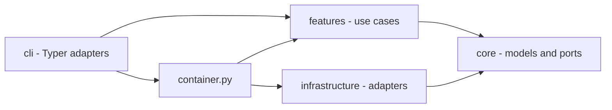

## Overview

dadaia-workspace is a Python package and local workspace runtime organized around Spec
Context Projects. The code uses three rings plus a composition root:

- `cli/` parses operator input, renders output, and delegates.
- `features/` owns product behavior by domain.
- `core/` owns pure models, protocols, constants, and classifiers.
- `infrastructure/` owns filesystem, Git, subprocess, JSON, and platform adapters.
- `container.py` is the only general composition root.

Import-linter and AST contract tests enforce the intended direction and cap deliberate
legacy exceptions. New feature code depends on ports, not concrete adapters. The
accepted-ignore-edge **cap ratchets only downward**: an edge is added only with a rationale
recorded on the edge itself and the cap adjusted in the same commit, and the net direction
across a release is a reviewable number in that release's CLOSURE — the same
measure-then-pin-then-ratchet-down law that governs the complexity ceilings and the LARGE
census ([[quality-assurance]]). Where an edge is unavoidable, a **function-scoped lazy
import** keeps the module's load-time posture intact, so the ring's static shape stays
what it claims to be.

**The workspace ships no agent-execution runtime.** It provides context, law,
deterministic boundaries, evidence validation, and diagnostics; the agents themselves
are driven by their harnesses against the SDD documents. A mechanism exists here only
while a demand requires it.

## Primary Subsystems

### Context and SDD

`features/spec_context/` owns ALIVE/DEAD lifecycle, binding, caller-owned session
identity, advisory presence, path classification, and workspace doctor checks. There is
no lease or locking module. `hooks/pre_gate.py` composes root whitelist, venv guard, and
the SDD path/phase/mode gate. `hooks/sdd_post_gate.py` refreshes advisory presence and
runs the nonblocking reconciler. `hooks/ctx_inject.py` emits the once-per-session
context bootstrap, re-armed when this session's own bind record is newer than its
injection sentinel.

#### The resolution seam

`core/specs_resolver.resolve_context()` is the single authority that resolves a Spec
Context NAME, and the `DADAIA.md` §3 rung law is its docstring ([[context-management]]).
There is one such function in the package: the CLI seam, `container`, the SDD gate and
ctx-inject all consume it, each supplying its own caller input — the gate passes the
write target so attribution stays path-first. Session-record reading inside `core` is a
documented §6 duplicate of `features/spec_context/session_identity`, because `core` may
not import `features`.

The import-linter contract `bind-resolution-seam-is-a-single-home` names exactly three
sanctioned direct importers — `cli._specs_resolution`, `container`, and `hooks` — and
takes zero ignored imports; a verb reaching the authority directly is a contract break.
Hooks are direct importers by law rather than by exception: they are one-shot processes
on the write hot path, and routing them through the composition root costs seconds of
import graph per gated tool call, so **no hook imports `container`**. An attesting
import-surface test pins that fact.

Exit codes tell the truth: `dadaia doctor` (and `reports validate`) exit non-zero
whenever issues remain — a green exit is proof, never a formality. Tool-initiated
commits (`alive` scaffold, `dead` sync) fall back to an injected
`dadaia-workspace <dadaia@workspace.local>` git identity when the environment has
none (`infrastructure/git_subprocess.py`), so containers and CI never die on it.

Git chokepoints are installed from:

- `public/scripts/pre-commit-presence-gate.sh` - concurrency warning only;
- `public/scripts/pre-push-ci-gate.sh` - CI preflight, branch policy, range-scoped
  denylist scan; the security verdict lives at the PR boundary, not here
  ([[sdd-gate-v3]]).

`features/chokepoints/` is pure decision logic: it imports no `infrastructure` module and
spawns no subprocess. The I/O its gates need arrives as core ports the CLI injects at the
call site — `ProcessAncestry` for the pre-commit ancestry probe, and `GitObjectReader`
(adapter `infrastructure/git_objects.GitSubprocessObjectReader`, built at the composition
root) for listing the new objects of a pushed range ([[sdd-gate-v3]]). The object source
is a required parameter of the push decision function, so an unwired production call site
is a type error rather than a silently skipped gate; import-linter contracts pin the ring
purity.

`GitObjectReader`'s contract covers both sides of a scanned path: each object carries its
own new content **and** the prior published text of the same path at the range's base, or
an explicit absence when there is no resolvable base, no such path, or the prior blob is
over the cap or undecodable. Absence is a distinct value, never an empty string, so the
decision layer cannot mistake "nothing was published" for "nothing matched". Widening the
port rather than giving the matcher a second input source is what keeps the decision
function pure: it still takes only objects and term sources. The protocol module itself
stays data-only and zero-I/O; the adapter owns every subprocess, chunks its batched
conversation to a constant resident bound, and converts every parse failure into its own
typed read error so nothing raw escapes the ring.

`core/redaction.py` is the stdlib-pure masking primitive — word-boundary alternation,
longest-first ordering, stable first-appearance placeholder ordinals — behind the operator
`--redact` surface in `cli/redact.py`. It lives in `core` because `core` is importable from
every ring and imports none, it performs no I/O, and it is outside the file-I/O authorized
set below. The push gate does **not** consume it: its render boundary masks path segments
with the **detector's own compiled matchers**, so what the scan detects and what the refusal
masks cannot diverge ([[sdd-gate-v3]]). Two render boundaries, each with the predicate its
own channel is judged by, is the deliberate shape — a shared predicate here would be a
second, weaker copy of one of them.

### Handoffs and reports

`features/reports/` validates, discovers, and retains handoff-first communication.
Cross-agent handoffs live under `.dadaia/handoff/<context>/`; HTML reports are optional
and live under `.dadaia/reports/<context>/<agent>/`. Handoff validation is stdlib-only
behind `ValidatorPort`.

### Panel

`features/panel/` serves a loopback-only stdlib HTTP UI. Route/view modules are split by
domain. The panel has six governance tabs — Projects, Agents, Agentic Entities,
Reports, Academy, Servers. Layer-1 model policy is the panel's only governance
editor; the Agentic Entities tab and the Agents tab's Persona cards are
server-rendered from the abstract-entity registry.

### Public assets

Canonical harness assets live in `dadaia_workspace/public/`. `public stage` copies
versioned source into `.dadaia/agentic/`; `public install` resolves its arguments once
into an immutable install plan and runs an ordered list of flag-free steps that project
runtime-specific assets to `.claude/`, `.codex/`, `.kimi-code/`, and shared
`.agents/`; `public doctor` compares source, staging, projection, privacy, and
policy-aware rendering.

Generated projection files are never edited in place. The projected law files
(`DADAIA.md` and library-originated `AGENTS.md`) are PROTECTED and human-only in an
instantiated workspace. The source repository itself must not contain generated
workspace projection roots.

The projection chain is a derivation, not an origin: every core sub-agent, hook, and
rule file the installer projects implements an abstract, harness-agnostic entity —
Persona, Deterministic Behavior, or Abstract Rule — declared in
`public/entities/registry.json`; skills and `AGENTS.md` are universal, read natively
by every entry harness. Underived core surface is forbidden (constitution §12.5,
[[agentic-entities]]), enforced by the derivation contract test and the
`entities-derivation` doctor check.

### Specs and memory

`features/specs/` owns structural validators, the memory-atom lint, and memory catalog
generation. **The lint's one canonical implementation is a package module**, imported
directly by the doctor — no feature module shells out to a projected script for logic it
owns, and the projected copy under `public/scripts/` is a thin entry-point wrapper over it
([[public-asset-distribution]]). Markdown atoms are the memory source; `catalog.json` and
`product/index.md` are generated from frontmatter, and a catalog value that can be derived from an atom's body is **computed at
generation time, never stored** in that atom. Memory is current truth and is writable only
by product-engineer during DEFINITION or CLOSURE. Every field the frontmatter schema
declares is required, and an undeclared field is invalid — the schema rejects the retired
`agent_tier` and the dropped per-atom size field alike.

`SpecsDoctor` is a thin coordinator that owns `check()`/`fix()` ORDER and delegates every
family's logic to six single-responsibility validator siblings over two shared leaf
modules; the class-level picture and its regeneration law are
the `SpecsDoctor` diagram in this atom's **Architecture Diagrams** section below,
kept honest by an introspection drift-guard that imports the live modules. Release
scaffolding is `features/spec_artifacts/new_artifacts.py`, which creates a release SPEC and
nothing else — the workspace scaffolds no hotfix release, because a bug fix carries no
release ceremony ([[sdd-bug-backlog-governance]]).

### Other feature domains

Backlog and bugs own intake consistency and event-sourced bug state. The ACTIVE/LEDGER
grammar has exactly one owner: `features/backlog/` both parses and writes it, so
`backlog new` lives beside the parser it shares a grammar with, finds its insertion point
through the parsed fence-aware structure rather than a private heading regex, checks slug
membership through the parsed document, and re-parses its own output before reporting
success. No module outside that package compiles the grammar, and inside it a sibling is
imported only through a public name — the YAML-error formatter `preview.py` supplies to
`document.py` is exported API, not a reached-into private symbol. Certification runs
the deterministic capability checks behind `dadaia certify`. Capabilities publishes the
`dadaia-capabilities-v2` payload. Telemetry owns allowlisted local metadata and its
separate refresh serialization primitive. Server registry owns collision-free dev-port
allocation. Repos, academy, import/export, migration, workspace initialization,
and cleanup remain bounded feature packages.

## Concurrency

Workspace concurrency never blocks on another session. Mutating file-tool calls record
best-effort presence; a peer record produces an advisory warning. The caller's own READ
mode is self-protection. Ordinary filesystem and Git conflicts surface races.

This no-lock rule concerns agent/workspace coordination. Narrow implementation details
that serialize a single telemetry refresh or database write are internal adapter
primitives; they must have bounded failure behavior and cannot freeze Spec Context work.

## Runtime State

Canonical workspace state is rooted at `.dadaia/`. The binding whitelist is
`_DADAIA_ALLOWED_SUBDIRS` in `features/spec_context/doctor.py` (ROOT-4 flags anything
else); this table mirrors it:

| Path | Owner |
|---|---|
| `states/spec_contexts.json` | context registry |
| `sessions/` | caller-owned bind records (protected) |
| `states/presence/` | advisory live-session records |
| `states/server_registry.json` | development server registry |
| `states/agent_model_policy.json` | Layer-1 agent model governance overlay |
| `states/root_exceptions.txt` | operator-approved root-whitelist exceptions |
| `states/import-manifest.json` | provenance of the last `dadaia import` |
| `handoff/` | machine-readable agent handoffs |
| `reports/` | optional human-readable reports |
| `tmp/` | bounded ephemeral files (incl. `tmp/legacy-quarantine/`) |
| `agentic/` | staged public assets and manifest |
| `hooks/` | projected harness hook wrappers |
| `scripts/` | projected governance/gate scripts |
| `mcps/` | MCP server working dirs |
| `runtime/` | projected runtime assets |
| `academy/` | academy working data |
| `logs/` | hook/reconciler diagnostics |
| `dev-report/`, `dist/` | dev artifacts and built wheels |
| `.venv/`, `.cache/` | workspace Python runtime and tool caches |

Legacy `states/ctx_locks/` and `sessions/runtime/` are invalid retired state. Doctor
removes them with `--fix`. `states/bind_epoch/` is orphan state in a workspace upgraded
from an older release; the named `remove_legacy_bind_epoch_state` install migration
sweeps it and is retained for one release. Known-legacy `.dadaia/` subdirs (`bugs`, `src`, `locks`,
`figma-bridge`, `imgs`, `references`) are quarantined — never deleted — by the
reconcile `legacy-dir-quarantine` step (`features/migrate/legacy_dadaia_dirs.py`) into
`tmp/legacy-quarantine/run-<id>/` with a manifest. `dadaia import` relocates the
archive's `export-manifest.json` to `states/import-manifest.json` so an imported
workspace passes its own doctor.

No repo may contain `.dadaia/`, a virtualenv, cache directories, test-results,
Playwright reports, or coverage artifacts.

## Core file-I/O authorized set

`core/` is stdlib-pure; file I/O is allowed only in the ratchet-authorized set:
`specs_backup` (consumer-tree migration), `specs_version` (pattern-version stamp),
`specs_resolver` and `workspace_resolver` (tree walks), `specs_repair` (removal of
unfilled placeholder atoms from old-scaffold trees; the single home both repair
surfaces, `features.specs` and `features.migrate`, may import without a forbidden
sibling edge), and `atomic_write`.

`core/atomic_write.py` is **the** atomic-write primitive of the package: a uuid-suffixed
temp sibling plus `os.replace`, parameterized by preserve-mode, text-or-bytes content and
newline policy, with **temp cleanup on every failure path, for every parameter
combination**. It is stateless and imports nothing from `dadaia_workspace` — not even a
`core` sibling — which is what lets `hooks/` consume it without touching the composition
root, so the hooks-never-import-`container` latency law holds by construction and no
sanctioned duplicate is owed anywhere. Its consumers span `features/`, `infrastructure/`
and `hooks/`, and `core` is the only ring all three may import downward; a feature- or
infrastructure-hosted home would have created the forbidden sibling or upward edge instead.
The rationale rides the ratchet entry itself, on the `specs_repair` precedent — the ratchet
is a guard against file I/O drifting into `core` by accident, and its own failure message
prescribes this deliberate path.

**One writer, proven by scan.** A census test enumerates every atomic write in the package
and asserts each routes through the primitive: zero named per-module writers, zero inline
`.tmp` writers, no call-through shim surviving under an old name. Hand-kept copies of one
correctness contract are what diverged before — some cleaning their temp file on a failed
replace and some leaking it — and a derived census is what keeps them from regrowing.

## Agent Surface

Nine core agent roles with two dispatchers run inside the entry harness. Their bodies are
canonical Markdown under `public/agents/`, rendered at install with the resolved
model/effort policy and projected per harness. The ordered release ritual is owned by the
SDD documents — `ACTIVE.md`, SPEC, PLAN, TASKS, CLOSURE — and by the agents that write
them. Hooks enforce mechanical file/Git boundaries only. Branch placement, pushability and
merge milestones are stated once in the law's gitflow section and operated by
`dd-gitflow-default`; a persona carries a pointer to those two homes and restates neither.

**A persona carries only what the law does not.** Its body targets 120–220 lines, states
its rules as positive targets rather than a prohibition list, and drops anything the law
already says — the memory-bootstrap ritual, handoff-first, the concurrency posture, the
scope-error inventory. Where a fact genuinely has no other home it stays, and the persona
says why. Relocation targets are the **disclosed skill siblings that already exist**: a
block leaves a persona only when a named surviving home receives it, recorded row by row in
the relocating release's coverage table, and a persona never loses a write-allowlist row, a
scope boundary or a hard-stop block to a trim. Relocated content moves from the always-on
budget into on-demand skill files, which is the point of the move.

Four of the nine personas sit inside the ceiling (`code-reviewer`, `security-reviewer`,
`project-manager`, `project-auditor`); five sit above it — `product-engineer` 279,
`qa-engineer` 269, `ai-engineer` 252, `software-architect` 250, `software-engineer` 245
projected lines, 2,095 across the fleet. Each overflow is content whose only home is that
role — the SDD authorship phases, the E2E toolchain and pyramid tables, the
harness-authoring identity, the architecture-review charter, the implementer stack and TDD
sequence — and each carries its justification inline. The ceiling is a target the fleet is
measured against every release, never a number a persona is silently declared to meet. Which skill operates which law topic is declared in exactly one machine-readable
place, `public/entities/rules-skills-map.json`, enforced by one contract test that is also
the citation check: every path and every CLI verb a public asset cites must exist
([[agentic-entities]]).

**The law reaches each harness exactly once.** The projection seam decides, per harness,
which surface carries it — a harness that resolves an import chain from its own
constitution needs no rules-directory mirror, and one that reads `AGENTS.md` natively
keeps its own path. The decision lives at the seam, never as a per-file exclusion, and no
harness ends with zero copies ([[public-asset-distribution]]).

## Architecture Diagrams

Retired from `specs/assets/architecture/` (FR1, T-050-06): the v6 canon root has no `assets/` member, so the three class/package diagrams that lived there fold in here, verbatim, as their own subsections. `tests/contract/test_architecture_diagrams_current.py` parses these in-doc Mermaid blocks the same way it parsed the retired files.

### `features/specs/doctor` — SpecsDoctor coordinator + validator siblings

This class diagram is the canonical picture of the `features/specs/doctor` subsystem: a thin
`SpecsDoctor` **coordinator** that owns `check()`/`fix()` ORDER and delegates all LOGIC to six
single-responsibility validator siblings, plus two shared leaf modules (`doctor_types`,
`doctor_common`). Each validator is independently testable; the coordinator holds no family
logic of its own.

Boundary imports are **confined** to exactly one validator each: `doctor_memory` is the sole
holder of the lazy `infrastructure.subprocess_runner` edge (the LINT-1 shell-out), and
`doctor_governance` is the sole holder of the `features.backlog.document` edge (the parsed
ACTIVE/LEDGER model it validates against, never a second grammar reader). The coordinator
holds neither, and the doctor package carries no `spec_context` edge at all.

**Regeneration law.** Regenerate at the closure of every structural release (any rename,
split, or merge of the `SpecsDoctor` coordinator or its validator siblings). The class names
above are pinned by the introspection drift-guard
`tests/contract/test_architecture_diagrams_current.py`, which imports the live `doctor_*`
modules and fails if a diagrammed class name goes stale or a live validator is missing. The
same guard requires this file to carry exactly one fenced Mermaid block.

### `dadaia_workspace/features` — package map (26 packages)

**Release origin:** v0.1.55 (Architecture Decomposition, FR3). This package graph is the
canonical picture of the feature layer after the `reports_next` / `reports_retention` /
`reports_validation` triplet merged into one `features/reports/` package (flat `next` /
`retention` / `validation` submodules), plus the v0.2.5 capability, certification, and
transactional reconciliation boundaries. The current feature count is **26**.

Each feature is isolated (no feature imports another feature — composition happens in
`container.py`); the surviving cross-feature edges are frozen by the import-linter
`features-no-cross-feature` contract (ignore-cap **26 = 9/4/13**, unchanged this release —
the doctor + reports moves repoint existing edges 1:1). The `workflows ↔ lifecycle` cycle is
broken by hosting the governed catalog seam in `features/lifecycle/governed_catalog.py`,
pinned by the `lifecycle-no-workflows` contract.

```mermaid
flowchart TB
    subgraph features["dadaia_workspace/features — 26 packages"]
        academy["academy"]
        agents["agents"]
        ai_surface["ai_surface"]
        backlog["backlog"]
        bugs["bugs"]
        capabilities["capabilities"]
        certification["certification"]
        chokepoints["chokepoints"]
        ci_preflight["ci_preflight"]
        export["export"]
        import_["import_"]
        lifecycle["lifecycle"]
        migrate["migrate"]
        panel["panel"]
        public["public"]
        reconcile["reconcile"]
        reports["reports"]
        repos["repos"]
        server_registry["server_registry"]
        spec_artifacts["spec_artifacts"]
        spec_context["spec_context"]
        specs["specs"]
        telemetry["telemetry"]
        tmp_gc["tmp_gc"]
        workflows["workflows"]
        workspace["workspace"]
        workspace_clean["workspace_clean"]
    end

    subgraph reports_pkg["features/reports — merged v0.1.55 FR3 (was 3 top-level packages)"]
        next["next"]
        retention["retention"]
        validation["validation"]
    end

    reports --> reports_pkg
    lifecycle -. governed_catalog seam .-> workflows
    container["container.py (composition root)"] --> features
    core["core/ (models · protocols · exceptions)"]
    features --> core

    note1["edge #7: lifecycle.report_workflow -> reports.validation (FR3 target repoint)"]
    reports_pkg -.- note1
```

**Regeneration law.** Regenerate at the closure of every structural release (any feature
package added, removed, renamed, split, or merged). The 26 package names and the three
`features/reports` submodule names above are pinned by the introspection drift-guard
`tests/contract/test_architecture_diagrams_current.py`, which discovers the live packages via
`pkgutil` and fails if a diagrammed package name goes stale or a live package is missing.

### `features/panel/views` — per-domain API view modules

**Release origin:** v0.1.55 (Architecture Decomposition, FR2). This module graph is the
canonical picture of the decomposed panel API surface: the former 1,279-line
`features/panel/views/api.py` god module split into **seven per-domain view modules**, one
responsibility each. `api.py` is **deleted** — there is no facade, barrel, or re-export shim.
`container.py` imports each `render_api_*` function from its per-domain module via explicit
named imports (extending the incumbent named-import pattern shared with
`panel.views.workflow_policy`).

Every module imports **only** `features.panel.service` (`PanelService`) plus `core.models` —
zero cross-feature / infrastructure edges — so FR2 changed no `setup.cfg` ignore edge.

**Regeneration law.** Regenerate at the closure of every structural release (any rename,
split, or merge of a panel `api_*` view module or its public render functions). The module
and function names above are pinned by the introspection drift-guard
`tests/contract/test_architecture_diagrams_current.py`, which imports the live
`features.panel.views.api_*` modules and fails if a diagrammed name goes stale or a live
render function is missing.

## Dependencies

[[spec-context-project]], [[context-management]], [[sdd-gate-v3]],
[[agent-orchestration]], [[panel]], [[public-asset-distribution]], [[tech-stack]].
