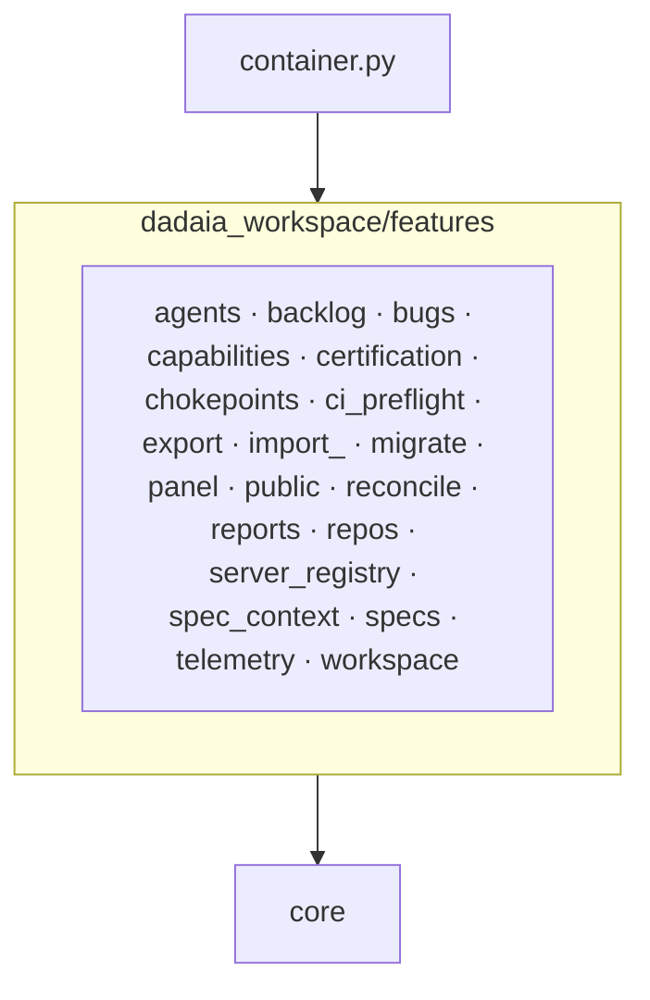

## Part 1 — Principles

### P-01 · We keep the dependency ring: core imports nothing internal, infrastructure imports only core, no layer imports upward; a feature imports the concrete infrastructure class it alone consumes.
Measured by: `lint-imports --config setup.cfg --no-cache` — contracts `core-no-upper-layers` and `infrastructure-no-upper-layers` (zero ignored imports).
ADR: 0001 (accepted)
Rationale: the ledger shows zero adapter substitutions ever fixed a bug; the port requirement only grew the container funnel.

### P-02 · We never spawn a subprocess from a feature; process execution goes through the one infrastructure adapter, `infrastructure/subprocess_runner.py`.
Measured by: `lint-imports --config setup.cfg --no-cache` — contract `features-no-subprocess` (direct imports only, zero ignored edges).
ADR: 0001 (accepted)
Rationale: one process seam keeps execution observable, fakeable and bounded.

### P-03 · We keep `core` free of OS primitives (`fcntl`, `signal`, `subprocess`, `msvcrt`); `core/platform.py` is the sole platform seam.
Measured by: `lint-imports --config setup.cfg --no-cache` — contract `core-no-os-primitives`.
ADR: none
Rationale: a POSIX-only primitive in the bottom ring breaks every importer on Windows.

### P-04 · We make `core` the bottom ring: it imports no `features`, `infrastructure`, `cli` or `hooks`.
Measured by: `lint-imports --config setup.cfg --no-cache` — contract `core-no-upper-layers` (zero ignored imports).
ADR: none
Rationale: the ring everything imports must import nothing, or the graph has a cycle.

### P-05 · We let `infrastructure` depend on `core` only — never on `features`, `cli` or `hooks`.
Measured by: `lint-imports --config setup.cfg --no-cache` — contract `infrastructure-no-upper-layers` (zero ignored imports).
ADR: none
Rationale: an adapter that knows a use case is no longer an adapter.

### P-06 · We keep `core.kernel_tunables` a pure-constant leaf that imports no upper layer.
Measured by: `lint-imports --config setup.cfg --no-cache` — contract `kernel-tunables-is-a-leaf`.
ADR: none
Rationale: hooks import it on the write hot path; one upper edge drags in the composition graph.

### P-07 · We keep features mutually independent: they compose through the container, never through sibling imports; a helper two features need lives in each.
Measured by: `lint-imports --config setup.cfg --no-cache` — contract `features-no-cross-feature`, whose `modules =` list is asserted equal to the on-disk `features/*/__init__.py` package set by `pytest tests/contract/test_import_linter_ignore_cap.py`.
ADR: none
Rationale: a hand-kept `modules =` list hid three real sibling edges from the check.

### P-08 · We keep a Protocol in `core/protocols` only where two production adapters exist; `container.py` composes platform seams and shared collaborators, nothing single-consumer.
Measured by: `pytest tests/contract/test_protocols_have_two_adapters.py`.
ADR: 0001 (accepted)
Rationale: a Protocol with one implementer is interface text that hides a direct dependency.

### P-09 · We resolve the whole Invocation — workspace root, session, context, specs dir, mode, release, phase — once per process in `core.invocation.resolve`, imported directly only by `cli._specs_resolution`, `container` and `hooks`.
Measured by: `lint-imports --config setup.cfg --no-cache` — contract `bind-resolution-seam-is-a-single-home` (zero ignored imports, none ever accepted); `pytest tests/unit/core/test_invocation.py`.
ADR: 0003 (accepted)
Rationale: every context bug came from a second resolution path answering differently.

### P-10 · We cap every suppressed layering edge and ratchet the cap only downward; an edge is added with its reason and the cap moved in the same commit.
Measured by: `pytest tests/contract/test_import_linter_ignore_cap.py` — the test module is the cap's one numeric home.
ADR: none
Rationale: a pinned exception list turns every new suppression into a reviewable diff.

### P-11 · We keep `core` file-I/O pure outside an authorized set of eight modules; new file I/O enters `core` only by joining that set on purpose.
Measured by: `pytest tests/contract/test_core_file_io_purity.py` (AST walk; every authorized stem must exist).
ADR: none
Rationale: joining the set is legal; arriving there unnoticed is not.

### P-12 · We never import the composition root from a hook; hooks reach the resolution authority directly because they are one-shot processes on the write hot path.
Measured by: `pytest tests/contract/test_hook_import_surface.py` (six hook modules plus the executed gate path, with `container` absent from `sys.modules`).
ADR: none
Rationale: the composition graph costs seconds of import time per gated tool call.

### P-13 · We keep the architecture diagrams derived from live code: every diagrammed class, view module and feature package is introspected against the live tree.
Measured by: `dadaia specs doctor` — rule `MEM-DRIFT-1` (`features/specs/doctor_memory.py`), one WARNING per package the map and the live tree disagree on.
ADR: none
Rationale: a diagram nobody checks is the first artifact to lie.

### P-14 · We keep the release-state reader pure: `core/release_state.py` parses and serializes already-read text and performs no file I/O.
Measured by: `pytest tests/contract/test_release_state_read_only.py`.
ADR: 0004 (proposed)
Rationale: a reader that can write is a reader that can rewrite history.

### P-15 · We close the release-state envelope: `release-state-v1` carries `additionalProperties: false` at every level, a closed log-entry shape, and no harness `session_id`.
Measured by: `pytest tests/contract/test_release_state_schema.py`.
ADR: 0004 (proposed)
Rationale: an open envelope accumulates fields until no consumer can fold it.

### P-16 · We store no provenance a resolver cannot re-derive: a stored `resolved_commit` equals the value derived from git history.
Measured by: `pytest tests/contract/test_resolved_commit_stored_equals_derived.py` (marked `slow`; runs in the `contract-coverage` job and the local preflight).
ADR: none
Rationale: git is the authority for git facts; this test keeps the cache a cache.

### P-17 · We map every core skill and every scoped `AGENTS.md` source to exactly one `DADAIA.md` section, every section to at least one owner, with content hashes re-recorded only by review.
Measured by: `pytest tests/contract/test_behavior_map.py` (bijection, hash tuples, citation check, invocation grants).
ADR: none
Rationale: law that no asset owns is law nobody applies.

## Part 2 — Implementation

### One decider per fact

| Fact | The module that decides it |
|---|---|
| workspace root, session, context, mode, release, phase | `core/invocation.py` — `resolve() -> Invocation`, over rungs 0 (explicit/`target_path`) … 3 (repo of the cwd) |
| session record schema, read, liveness and reaping | `core/session_store.py` — `new_binding_record`/`is_live`/`live_session`/`reap_stale`; `core/record_liveness.py` holds the raw TTL predicate |
| presence liveness and reaping | `features/spec_context/presence.py` — `gc()` is the only reaper of records, markers, sentinels and emptied directories |
| what `.dadaia/` may contain — zones with class, creator, TTL and canon, the `states/` canon, the root law sets, the exceptions file | `core/workspace_layout.py` — `DADAIA_ZONES`, `STATES_CANON`, `ROOT_ALLOWED_DIRS`/`ROOT_ALLOWED_FILES`, `INSTANCE_EXCEPTIONS`; init, `dadaia doctor`, the gate's ADDITIVE prefixes, the root-whitelist hook, the stage renderer and export are derived views, pinned by `tests/contract/test_zone_registry.py` |
| what a `specs/` tree may contain | `features/specs/canon.py`'s `CANON` table — scaffold renders it, doctor checks it |
| whether a projection is current | `infrastructure/projection.py`'s `ProjectionRule` plus `projection_rules()`; install writes and doctor compares the same table |
| which harness a projection targets | `HarnessProjection` in `infrastructure/projection_rules.py`, with three production adapters — Claude Code, Codex, Kimi Code |
| a bug record's status | `core/models/bugs.py` transition methods; `infrastructure/jsonl_record_store.py::JsonlRecordStore.scan()` is the one ledger parser, yielding `MalformedLine` for a bad row |
| a handoff's version, artifact and validity | `core/handoff_index.py` — `HandoffIndex`/`Handoff`, the stdlib schema walker internal to it |
| the git publication boundary | `features/chokepoints/{branch_policy,pre_commit,push_gate,verdict}.py`; `covering_verdict()` is the single verdict reader |
| the telemetry database connection | `features/telemetry/store.py`'s `TelemetryStore`, owning open/migrate/`integrity_check`/`quarantine` |
| a YAML frontmatter block | `core/frontmatter.py` |
| the release phase vocabulary | `core/release_state.py` — `PHASES` + `MEMORY_WRITE_PHASES`; doctor and gate import, never re-type |
| the release-id shape | `core/specs_version.py` — `RELEASE_SEMVER_RE` with `RELEASE_ID_FRAGMENT` derived for path regexes; `is_release_semver` is the mint predicate |
| memory-canon shape facts | `features/specs/memory_canon.py` — slug→file table, forbidden-heading matcher, wikilink grammar |
| fail-soft registry reads | `core/invocation.py` — `alive_context_slugs` + the name↔slug maps; `JsonContextStore` stays the schema-gated CRUD |
| first parent of a sha | `infrastructure/git_objects.py::GitSubprocessObjectReader.first_parent` |
| the ctx-inject decision | `features/spec_context/injection_policy.py::decide_injection` — pure over plain values; the hook is transport |
| doctor order, fix dispatch, --fix help | `features/specs/rules.py::RULES` — one ordered registry, three derived projections |
| shared specs facts per doctor run | `features/specs/specs_tree.py::SpecsTree` — fresh per check(), active release parsed once |

- `container.py` is composition wiring only, contract-tested so every definition keeps a production consumer (no orphaned factories); the panel's 15-route composition lives with its single consumer in `cli/commands/panel_composition.py`; a single-consumer adapter is imported directly by its feature and never passes through the container (ADR 0001).
- `core/protocols/` holds six Protocols: three two-adapter OS seams (`FilePermissionSetter`, `ShutdownHandler`, `TelemetryRefreshLock`) and three panel cross-feature seams whose implementer lives under `features/` (`AgentsProvider`, `ContextProjectProvider`, `ServerRegistryProvider`); every other adapter is imported by its one consumer (the consumer-less `ProcessAncestry` chain was deleted at 0.5.3).
- `setup.cfg` carries seven import-linter contracts; `features-no-infrastructure` and `cli-no-infrastructure` were deleted by ADR 0001, `features-no-subprocess` is direct-imports-only with no suppressed edge, and the three surviving suppressed edges all sit under `features-no-cross-feature`.
- `features/migrate` stamps `specs_pattern_version: 6` or refuses, instructing a tree below v6 to upgrade to 0.4.x first — no in-wheel pre-v6 lineage.
- Hooks import `core.invocation` directly and build the `Invocation` once per process; they never import `container` (P-12); the PostToolUse hook `sdd_post_gate` renews presence, touches `last_seen_at` and runs `presence.gc` on one throttle — it writes nothing else.

### `features/specs/doctor` — SpecsDoctor coordinator + validator siblings

### `dadaia_workspace/features` — package map (20 packages)

### `features/panel/views` — per-domain API view modules

<!-- dadaia:fixed slop-code -->
### Slop — code (fixed)
- A comment explains a non-obvious why; the what, the history and any spec, task, ADR or version id live in git and the ledgers.
- A docstring states the contract in at most 3 lines; bug history lives in `BUGS.jsonl`.
- Code is born with a real caller in the same change; without a caller it does not exist.
- A fix replaces the old path; it never wraps it and never opens a second path.
- A `core/protocols` port exists only with two production adapters; a parameter exists only when it is read.
- Detection: `dd-code-review` SLOP.md S1, S2, S4, S5; measured by ratchet V32 and `test_protocols_have_two_adapters`.
<!-- /dadaia:fixed slop-code -->
