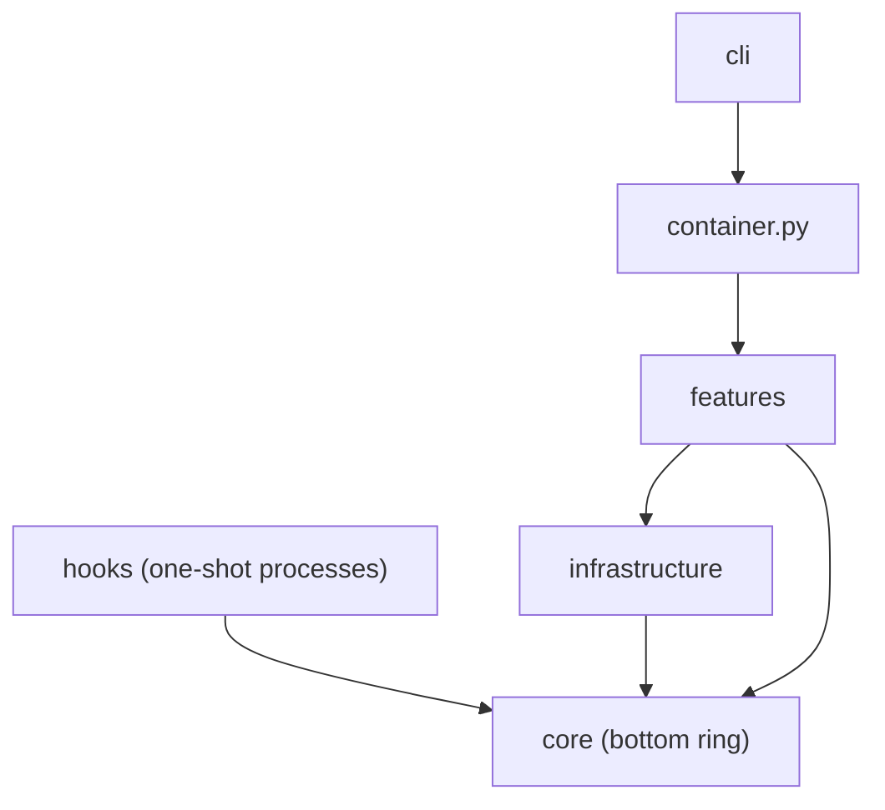
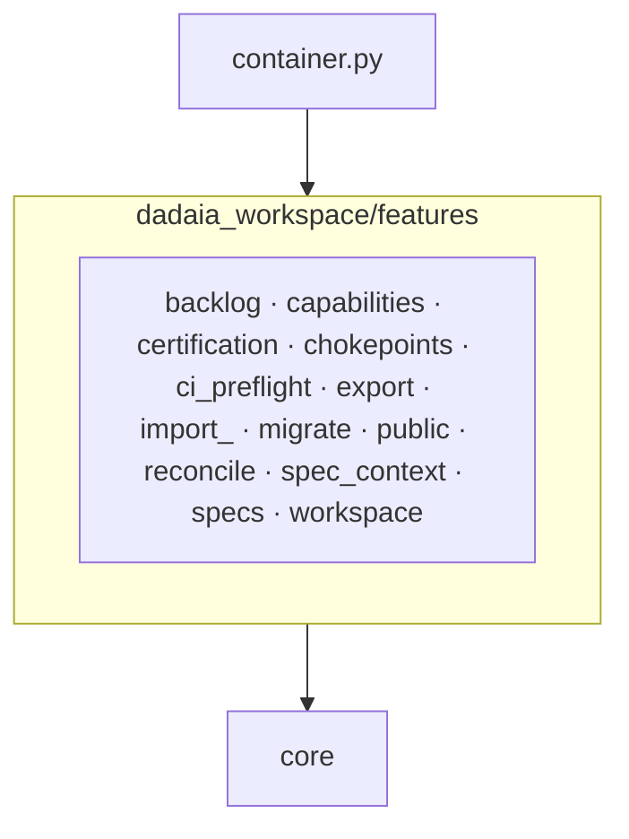

## Principles

### P-01 · We keep the dependency ring: core imports nothing internal, infrastructure imports only core, no layer imports upward; a feature imports the concrete infrastructure class it alone consumes.
Measured by: `lint-imports --config setup.cfg --no-cache` — contracts `core-no-upper-layers` and `infrastructure-no-upper-layers` (zero ignored imports).
ADR: 0001 (accepted)
Rationale: the ledger shows zero adapter substitutions ever fixed a bug; the port requirement only grew the container funnel.

### P-02 · We never spawn a subprocess from a feature; process execution goes through the one infrastructure adapter, `infrastructure/subprocess_runner.py`.
Measured by: `lint-imports --config setup.cfg --no-cache` — contract `features-no-subprocess` (direct imports only, zero ignored edges).
ADR: none
Rationale: one process seam keeps execution observable, fakeable and bounded.

### P-03 · We keep `core` free of OS primitives (`fcntl`, `signal`, `subprocess`, `msvcrt`); `core/platform.py` is the sole platform seam.
Measured by: `lint-imports --config setup.cfg --no-cache` — contract `core-no-os-primitives`.
ADR: none
Rationale: a POSIX-only primitive in the bottom ring breaks every importer on Windows.

### P-04 · We make `core` the bottom ring: it imports no `features`, `infrastructure`, `cli` or `hooks`.
Measured by: `lint-imports --config setup.cfg --no-cache` — contract `core-no-upper-layers` (zero ignored imports).
ADR: none
Rationale: the ring everything imports must import nothing, or the graph has a cycle.

### P-05 · We let `infrastructure` depend on `core` only — never on `features`, `cli` or `hooks`.
Measured by: `lint-imports --config setup.cfg --no-cache` — contract `infrastructure-no-upper-layers` (zero ignored imports).
ADR: none
Rationale: an adapter that knows a use case is no longer an adapter.

### P-06 · We keep `core.kernel_tunables` a pure-constant leaf that imports no upper layer.
Measured by: `lint-imports --config setup.cfg --no-cache` — contract `kernel-tunables-is-a-leaf`.
ADR: none
Rationale: hooks import it on the write hot path; one upper edge drags in the composition graph.

### P-07 · We keep features mutually independent: they compose through the container, never through sibling imports; a helper two features need lives in each.
Measured by: `lint-imports --config setup.cfg --no-cache` — contract `features-no-cross-feature`, whose `modules =` list is asserted equal to the on-disk `features/*/__init__.py` package set by `pytest tests/contract/test_import_linter_ignore_cap.py`.
ADR: none
Rationale: a hand-kept `modules =` list hid three real sibling edges from the check.

### P-08 · We keep a Protocol in `core/protocols` only where two production adapters exist; `container.py` composes platform seams and shared collaborators, nothing single-consumer.
Measured by: `pytest tests/contract/test_protocols_have_two_adapters.py`.
ADR: 0001 (accepted)
Rationale: a Protocol with one implementer is interface text that hides a direct dependency.

### P-09 · We resolve the whole Invocation — workspace root, session, context, specs dir, the session's Bind — once per process in `core.invocation.resolve`, imported directly only by `cli._specs_resolution`, `container` and `hooks`.
Measured by: `lint-imports --config setup.cfg --no-cache` — contract `bind-resolution-seam-is-a-single-home` (zero ignored imports, none ever accepted); `pytest tests/unit/core/test_invocation.py`.
ADR: 0003 (accepted)
Rationale: every context bug came from a second resolution path answering differently.

### P-10 · We cap every suppressed layering edge and ratchet the cap only downward; an edge is added with its reason and the cap moved in the same commit.
Measured by: `pytest tests/contract/test_import_linter_ignore_cap.py` — the test module is the cap's one numeric home.
ADR: none
Rationale: a pinned exception list turns every new suppression into a reviewable diff.

### P-11 · We keep `core` file-I/O pure outside an authorized set of eight modules; new file I/O enters `core` only by joining that set on purpose.
Measured by: `pytest tests/contract/test_core_file_io_purity.py` (AST walk; every authorized stem must exist).
ADR: none
Rationale: joining the set is legal; arriving there unnoticed is not.

### P-12 · We never import the composition root from a hook; hooks reach the resolution authority directly because they are one-shot processes on the write hot path.
Measured by: `pytest tests/contract/test_hook_import_surface.py` (six hook modules plus the executed gate path, with `container` absent from `sys.modules`).
ADR: none
Rationale: the composition graph costs seconds of import time per gated tool call.

### P-13 · We keep the architecture diagrams derived from live code: every diagrammed class, view module and feature package is introspected against the live tree.
Measured by: `dadaia doctor` — `specs`-section rule `MEM-DRIFT-1` (`features/specs/doctor_memory.py`), one WARNING per package the map and the live tree disagree on.
ADR: none
Rationale: a diagram nobody checks is the first artifact to lie.

### P-14 · We keep the release-state reader pure: `core/release_state.py` parses and serializes already-read text and performs no file I/O.
Measured by: `pytest tests/contract/test_release_state_read_only.py`.
ADR: 0004 (accepted)
Rationale: a reader that can write is a reader that can rewrite history.

### P-15 · We close the release-state envelope: `release-state-v1` carries `additionalProperties: false` at every level, a closed log-entry shape, and no harness `session_id`.
Measured by: `pytest tests/contract/test_release_state_schema.py`.
ADR: 0004 (accepted)
Rationale: an open envelope accumulates fields until no consumer can fold it.

### P-17 · We map every core skill and every scoped `AGENTS.md` source to exactly one `DADAIA.md` section, every section to at least one owner, with content hashes re-recorded only by review.
Measured by: `pytest tests/contract/test_behavior_map.py` (bijection, hash tuples, citation check, invocation grants).
ADR: none
Rationale: law that no asset owns is law nobody applies.

### P-30 · The version, the CHANGELOG section and the tag of a release come from release-please over Conventional Commits, and promote is merging its release PR; a candidate's closed trio lives in git at its CLOSURE commit, never in a copied candidate or archive directory.
Measured by: `pytest tests/contract/test_release_semver_canon.py tests/contract/test_ci_workflow_hygiene.py`.
ADR: 0021 (accepted)
Rationale: a hand-minted version and a hand-copied archive are two more writers of one fact each; the commit history already holds both.

### P-31 · We hold every repo INSIDE the workspace under `repos/<slug>/`, each its own git repository with its own `specs/`; the workspace is never a monorepo, one repo is the degenerate case of many, and bootstrap is one command (`init <dir> --harness <name> [--repo <url>]`).
Measured by: `pytest tests/e2e/test_one_line_bootstrap.py tests/unit/core/test_workspace_resolver.py`.
ADR: 0015 (accepted)
Rationale: the law, the harness projections, the zones and the venv live outside every repo; a per-repo or monorepo tool cannot govern ten projects with one law.

### P-32 · We change canonical memory (`ARCHITECTURE.md`, `QUALITY.md`) only in the commit that carries its accepted ADR, and we reconcile product memory from the window's code diff at every closure — delete, update, then add — recorded as one `kind: memory` entry naming every drifted atom.
Measured by: `pytest tests/contract/test_memory_canonical_shape.py`; `dadaia doctor` — `specs`-section rules `RELEASE-TREE-MEMORY` and `LINT-1` (history lines).
ADR: 0023 (accepted)
Rationale: three closures touched every product atom and left fifteen contradicted by the code; an append protocol stacks, a diff-driven one deletes first.

## Tech Stack

- Python `^3.12`, built by Poetry Core; console entrypoints `dadaia` and `dadaia-workspace` are one callable, and the version lives in `pyproject.toml` alone.
- Runtime dependencies: Typer, Rich, PyYAML, Jinja2, jsonschema; `claude-sdk` is an optional extra.
- Everything else is the standard library; there is no database — every state is a JSON or JSONL file.
- Claude Code, Codex, Kimi Code, Cursor, Devin CLI and GitHub Copilot are operator-installed external CLIs, never Python dependencies; the workspace runs no agent-execution runtime.
- Quality toolchain: pytest (`pytest-cov`, `pytest-xdist`, `pytest-randomly`, `pytest-timeout`, Hypothesis, Playwright), Ruff, mypy `--strict`, import-linter, gitleaks; `mutmut` sits in an optional group ([[QUALITY]]).
- Packaging: wheel and sdist ship the `dadaia_workspace` package with `public/` inside it and no bytecode.
- Canonical commands, from the workspace root:

```bash
.dadaia/.venv/bin/dadaia --version
.dadaia/.venv/bin/python -m pytest
.dadaia/.venv/bin/dadaia ci preflight
.dadaia/.venv/bin/dadaia doctor
.dadaia/.venv/bin/dadaia public doctor
.dadaia/.venv/bin/dadaia certify --json
```

## Structure



- `container.py` is composition wiring only: every definition keeps a production consumer, and a single-consumer adapter is imported directly by its feature (P-08).
- `core/protocols/` holds the two-adapter OS seams (`FilePermissionSetter`, `ShutdownHandler`) and the spec-context provider; every other adapter is imported by its one consumer.
- `setup.cfg` carries seven import-linter contracts; `features-no-subprocess` has no suppressed edge, and the two suppressed edges (`reconcile.service` -> `capabilities`, `reconcile.service` -> `migrate.state_v2`) sit under `features-no-cross-feature` (P-10).
- Hooks import `core.invocation` directly and build the `Invocation` once per process (P-12); `sdd_post_gate` touches `last_seen_at` and runs the reaper on one throttle and writes nothing else.
- `features/migrate` stamps `specs_pattern_version: 7` or refuses; a tree below v6 upgrades to 0.4.x first.

### `dadaia_workspace/features` — package map (13 packages)



<!-- dadaia:fixed slop-code -->
### Slop — code (fixed)
- A comment explains a non-obvious why; the what, the history and any spec, task, ADR or version id live in git and the ledgers.
- A docstring states the contract in at most 3 lines; bug history lives in `BUGS.jsonl`.
- Code is born with a real caller in the same change; without a caller it does not exist.
- A fix replaces the old path; it never wraps it and never opens a second path.
- A `core/protocols` port exists only with two production adapters; a parameter exists only when it is read.
- Detection: `dd-code-review` SLOP.md S1, S2, S4, S5; measured by ratchet V32 and `test_protocols_have_two_adapters`.
<!-- /dadaia:fixed slop-code -->
