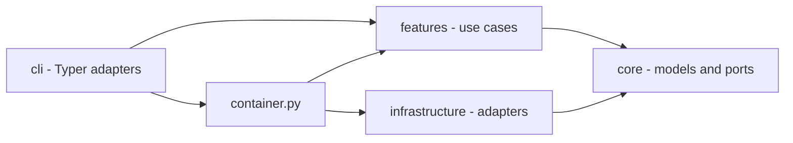
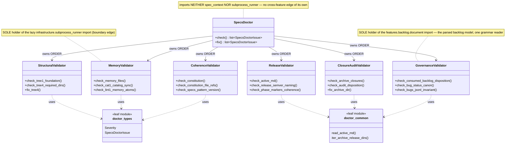
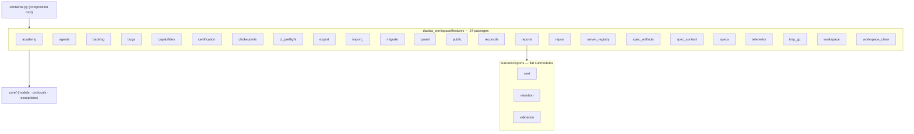

## Part 1 — Principles

A principle is admitted only with an **existing mechanical check** that fails when it is
violated; its `Measured by:` line names that check verbatim, and its ADR carries the
context, the decision and its consequences. A rule nobody can measure is Part-2
description, never a principle. Every `ADR:` below is `proposed` until the operator
accepts it — an agent never writes `accepted`.

### P-01 · We keep features on ports: a feature never imports `infrastructure` directly; the container injects the adapter.
Measured by: `lint-imports --config setup.cfg --no-cache` — contract `features-no-infrastructure`.
ADR: 0001 (proposed)
Rationale: an adapter reached directly is an adapter that cannot be substituted, faked in a
unit test, or replaced without editing the feature that named it.

### P-02 · We never spawn a subprocess from a feature; process execution goes through `ProcessRunner`.
Measured by: `lint-imports --config setup.cfg --no-cache` — contract `features-no-subprocess`.
ADR: 0002 (proposed)
Rationale: one process seam is what makes execution observable, fakeable and bounded; a
second one reintroduces the untestable branch every time.

### P-03 · We keep `core` free of OS primitives (`fcntl`, `signal`, `subprocess`, `msvcrt`); `core/platform.py` is the sole platform seam.
Measured by: `lint-imports --config setup.cfg --no-cache` — contract `core-no-os-primitives`.
ADR: 0003 (proposed)
Rationale: a POSIX-only primitive imported at module level in the bottom ring breaks every
importer on Windows, and the seam is the only place a portability decision is reviewable.

### P-04 · We make `core` the bottom ring: it imports no `features`, `infrastructure`, `cli` or `hooks`.
Measured by: `lint-imports --config setup.cfg --no-cache` — contract `core-no-upper-layers` (zero ignored imports).
ADR: 0004 (proposed)
Rationale: the ring everything imports must import nothing, or the dependency graph has a
cycle and "pure model" becomes a claim rather than a fact.

### P-05 · We let `infrastructure` depend on `core` only — never on `features`, `cli` or `hooks`.
Measured by: `lint-imports --config setup.cfg --no-cache` — contract `infrastructure-no-upper-layers` (zero ignored imports).
ADR: 0005 (proposed)
Rationale: an adapter that knows a use case is no longer an adapter; the direction of that
edge is the whole value of the ring.

### P-06 · We keep `core.kernel_tunables` a pure-constant leaf that imports no upper layer.
Measured by: `lint-imports --config setup.cfg --no-cache` — contract `kernel-tunables-is-a-leaf`.
ADR: 0006 (proposed)
Rationale: the tunables module is imported on the write hot path by hooks; a single upper
edge there would drag the composition graph into every gated tool call.

### P-07 · We keep features mutually independent: they compose through the container, never through sibling imports; a helper two features need lives in each (duplication over coupling).
Measured by: `lint-imports --config setup.cfg --no-cache` — contract `features-no-cross-feature`, whose `modules =` list is asserted equal to the on-disk `dadaia_workspace/features/*/__init__.py` package set by `pytest -p no:cacheprovider tests/contract/test_import_linter_ignore_cap.py`.
ADR: 0007 (proposed)
Rationale: cross-feature erosion is the mechanism behind this workspace's bug loop, and a
hand-kept `modules =` list is how three real sibling edges stayed invisible to the only
check that measures independence.

### P-08 · We compose the CLI through the container: a verb never imports an infrastructure adapter directly.
Measured by: `lint-imports --config setup.cfg --no-cache` — contract `cli-no-infrastructure`.
ADR: 0008 (proposed)
Rationale: a verb that builds its own adapter is a second composition root, and two roots
drift by construction.

### P-09 · We resolve a Spec Context in exactly one place, `core.specs_resolver.resolve_context`, imported directly only by `cli._specs_resolution`, `container` and `hooks`.
Measured by: `lint-imports --config setup.cfg --no-cache` — contract `bind-resolution-seam-is-a-single-home` (zero ignored imports, none ever accepted).
ADR: 0009 (proposed)
Rationale: every context bug this product has had came from a second resolution path
answering differently from the first.

### P-10 · We cap every suppressed layering edge and ratchet the cap only downward; an edge is added with its reason on the edge and the cap moved in the same commit.
Measured by: `pytest -p no:cacheprovider tests/contract/test_import_linter_ignore_cap.py` — the test module is the cap's one numeric home (exact equality, per-family pin, sanctioned-source check).
ADR: 0010 (proposed)
Rationale: an uncapped exception list grows silently; a pinned one turns every new
suppression into a reviewable diff with a stated reason.

### P-11 · We keep `core` file-I/O pure outside an authorized set of six modules; new file I/O enters `core` only by joining that set on purpose.
Measured by: `pytest -p no:cacheprovider tests/contract/test_core_file_io_purity.py` (AST walk; every authorized stem must exist).
ADR: 0011 (proposed)
Rationale: I/O drifting into the bottom ring by accident is what makes a "pure" ring
untestable; joining the set is legal, arriving there unnoticed is not.

### P-12 · We never import the composition root from a hook; hooks reach the resolution authority directly because they are one-shot processes on the write hot path.
Measured by: `pytest -p no:cacheprovider tests/contract/test_hook_import_surface.py` (six hook modules plus the executed gate path, with `container` absent from `sys.modules`).
ADR: 0012 (proposed)
Rationale: the composition graph costs seconds of import time per gated tool call; the
latency law only holds if something asserts the absence.

### P-13 · We keep the architecture diagrams derived from live code: every diagrammed class, view module and feature package is introspected against the live tree.
Measured by: `pytest -p no:cacheprovider tests/contract/test_architecture_diagrams_current.py`.
ADR: 0013 (proposed)
Rationale: a diagram nobody checks is the first artifact to lie; the guard's honest scope
is forward-only for feature packages and both directions for doctor classes and panel
view modules.

### P-14 · We keep the release-event fold read-only: `core/release_events.py` contains no write call and no file I/O at all.
Measured by: `pytest -p no:cacheprovider tests/contract/test_release_events_read_only.py`.
ADR: 0014 (proposed)
Rationale: the fold is what every reader trusts to answer "what phase is this release in";
a reader that can write is a reader that can rewrite history.

### P-15 · We close the release-record envelope: exactly seven event kinds, `additionalProperties: false`, and no harness `session_id` ever enters a governance record.
Measured by: `pytest -p no:cacheprovider tests/contract/test_release_event_schema.py`.
ADR: 0015 (proposed)
Rationale: an open envelope accumulates undocumented fields until no consumer can fold it,
and a harness session id in a committed record is a privacy leak with no owner.

### P-16 · We store no provenance a resolver cannot re-derive: a stored `resolved_commit` equals the value derived from git history.
Measured by: `pytest -p no:cacheprovider tests/contract/test_resolved_commit_stored_equals_derived.py` (marked `slow`; runs in the `contract-coverage` job and the local preflight — only `unit-fast` excludes `slow`).
ADR: 0016 (proposed)
Rationale: git is the authority for git facts; a cache that can disagree with its source is
a second truth, and this test is what keeps it a cache.

### P-17 · We map every core skill and every scoped `AGENTS.md` source to exactly one `DADAIA.md` section, every section to at least one owner, with content hashes re-recorded only by review.
Measured by: `pytest -p no:cacheprovider tests/contract/test_behavior_map.py` (bijection, hash tuples, citation check, invocation grants).
ADR: 0017 (proposed)
Rationale: law that no asset owns is law nobody applies, and an asset citing a path or verb
that does not exist is instruction the harness cannot follow.

## Part 2 — Implementation

### Overview

dadaia-workspace is a Python package and local workspace runtime organized around Spec
Context Projects. The code uses three rings plus a composition root:

- `cli/` parses operator input, renders output, and delegates.
- `features/` owns product behavior by domain.
- `core/` owns pure models, protocols, constants, and classifiers.
- `infrastructure/` owns filesystem, Git, subprocess, JSON, and platform adapters.
- `container.py` is the general composition root the CLI and the panel build through.

Import-linter and AST contract tests enforce the intended direction (P-01 – P-09) and cap
deliberate legacy exceptions (P-10). Where an edge is unavoidable, a **function-scoped lazy
import** keeps the module's load-time posture intact, so the ring's static shape stays what
it claims to be — the idiom the two capped `chokepoints` and `doctor_memory` edges use.

**The workspace ships no agent-execution runtime.** It provides context, law,
deterministic boundaries, evidence validation, and diagnostics; the agents themselves are
driven by their harnesses against the SDD documents. A mechanism exists here only while a
demand requires it.

### Context and SDD

`features/spec_context/` owns ALIVE/DEAD lifecycle, binding, caller-owned session identity,
advisory presence, path classification, and workspace doctor checks. There is no lease or
locking module (the no-lock law itself is `DADAIA.md` §3). `hooks/pre_gate.py` composes root
whitelist, venv guard, and the SDD path/phase/mode gate. `hooks/sdd_post_gate.py` refreshes
advisory presence and runs the nonblocking reconciler. `hooks/ctx_inject.py` emits the
once-per-session context bootstrap, re-armed when this session's own bind record is newer
than its injection sentinel — its tech-stack digest reads only the leading lines of
[[tech-stack]], which is why that atom's `Snapshot` bullets sit at the top of its Part 2.

#### The resolution seam

`core/specs_resolver.resolve_context()` is the single authority that resolves a Spec Context
NAME (P-09), and the `DADAIA.md` §3 rung law is its docstring ([[context-management]]). The
CLI seam, `container`, the SDD gate and ctx-inject all consume it, each supplying its own
caller input — the gate passes the write target so attribution stays path-first.
Session-record reading inside `core` is a documented duplicate of
`features/spec_context/session_identity`, because `core` may not import `features` (P-04).

Hooks are direct importers by law rather than by exception (P-12): routing them through the
composition root costs seconds of import graph per gated tool call.

Exit codes tell the truth: `dadaia doctor` (and `reports validate`) exit non-zero whenever
issues remain — a green exit is proof, never a formality. Tool-initiated commits (`alive`
scaffold, `dead` sync) fall back to an injected
`dadaia-workspace <dadaia@workspace.local>` git identity when the environment has none
(`infrastructure/git_subprocess.py`), so containers and CI never die on it.

#### Git chokepoints

Installed from:

- `public/scripts/pre-commit-presence-gate.sh` — concurrency warning only;
- `public/scripts/pre-push-ci-gate.sh` — CI preflight, branch policy, range-scoped denylist
  scan; the security verdict lives at the PR boundary, not here ([[sdd-gate-v3]]).

`features/chokepoints/` is decision logic: it spawns no subprocess (P-02) and carries **no
module-load-time edge into `infrastructure`** — its one infrastructure edge
(`jsonl_log_rotation`) is function-scoped and declared as a capped ignore under P-10. The
I/O its gates need arrives as core ports the CLI injects at the call site — `ProcessAncestry`
for the pre-commit ancestry probe, and `GitObjectReader` (adapter
`infrastructure/git_objects.GitSubprocessObjectReader`, built at the composition root) for
listing the new objects of a pushed range ([[sdd-gate-v3]]). The object source is a required
parameter of the push decision function, so an unwired production call site is a type error
rather than a silently skipped gate.

`GitObjectReader`'s contract covers both sides of a scanned path: each object carries its own
new content **and** the prior published text of the same path at the range's base, or an
explicit absence when there is no resolvable base, no such path, or the prior blob is over
the cap or undecodable. Absence is a distinct value, never an empty string, so the decision
layer cannot mistake "nothing was published" for "nothing matched". Widening the port rather
than giving the matcher a second input source is what keeps the decision function pure: it
still takes only objects and term sources. The protocol module itself stays data-only and
zero-I/O; the adapter owns every subprocess, chunks its batched conversation to a constant
resident bound, and converts every parse failure into its own typed read error so nothing
raw escapes the ring.

`core/redaction.py` is the stdlib-pure masking primitive — word-boundary alternation,
longest-first ordering, stable first-appearance placeholder ordinals — behind the operator
`--redact` surface in `cli/redact.py`. It lives in `core` because `core` is importable from
every ring and imports none, it performs no I/O, and it is outside the file-I/O authorized
set (P-11). The push gate does **not** consume it: its render boundary masks path segments
with the **detector's own compiled matchers**, so what the scan detects and what the refusal
masks cannot diverge ([[sdd-gate-v3]]). Two render boundaries, each with the predicate its
own channel is judged by, is the deliberate shape — a shared predicate here would be a
second, weaker copy of one of them.

### Handoffs and reports

`features/reports/` validates, discovers, and retains handoff-first communication.
Cross-agent handoffs live under `.dadaia/handoff/<context>/`; HTML reports are optional and
live under `.dadaia/reports/<context>/<agent>/`. Handoff validation is stdlib-only behind
`ValidatorPort`.

### Panel

`features/panel/` serves a loopback-only stdlib HTTP UI. Route/view modules are split by
domain. The panel has six governance tabs — Projects, Agents, Agentic Entities, Reports,
Academy, Servers. Layer-1 model policy is the panel's only governance editor; the Agentic
Entities tab and the Agents tab's Persona cards are server-rendered from the
abstract-entity registry.

### Public assets

Canonical harness assets live in `dadaia_workspace/public/`. `public stage` copies versioned
source into `.dadaia/agentic/`; `public install` resolves its arguments once into an
immutable install plan and runs an ordered list of flag-free steps that project
runtime-specific assets to `.claude/`, `.codex/`, `.kimi-code/`, and shared `.agents/`;
`public doctor` compares source, staging, projection, privacy, and policy-aware rendering.

Generated projection files are never edited in place. The projected law files (`DADAIA.md`
and library-originated `AGENTS.md`) are PROTECTED and human-only in an instantiated
workspace. The source repository itself must not contain generated workspace projection
roots.

The projection chain is a derivation, not an origin: every core sub-agent, hook, and rule
file the installer projects implements an abstract, harness-agnostic entity — Persona,
Deterministic Behavior, or Abstract Rule — declared in `public/entities/registry.json`;
skills and `AGENTS.md` are universal, read natively by every entry harness. Underived core
surface is forbidden (constitution §12.5, [[agentic-entities]]), measured by
`tests/contract/test_agentic_entities_derivation.py` and the `entities-derivation` doctor
check. A projected script is a thin entry-point wrapper over a package module, never a second
implementation, measured by `tests/contract/test_public_scripts_thin_wrapper.py`.

### Specs and memory

`features/specs/` owns structural validators, the memory-atom lint, and memory catalog
generation. **The lint's one canonical implementation is a package module**, imported
directly by the doctor — no feature module shells out to a projected script for logic it
owns ([[public-asset-distribution]]). Markdown atoms are the memory source; `catalog.json`
and `product/index.md` are generated from frontmatter, and a catalog value derivable from an
atom's body is **computed at generation time, never stored** in that atom, measured by
`tests/contract/test_memory_catalog_render_contract.py`. Memory is current truth and is
writable only by product-engineer during DEFINITION or CLOSURE. Every field the frontmatter
schema declares is required and an undeclared field is invalid — the schema **rejects** the
retired `agent_tier` and the dropped per-atom size field alike.

`SpecsDoctor` is a thin coordinator that owns `check()`/`fix()` ORDER and delegates every
family's logic to six single-responsibility validator siblings over two shared leaf modules;
the class-level picture and its regeneration law are the `SpecsDoctor` diagram below, kept
honest by P-13's drift-guard. Release scaffolding is
`features/spec_artifacts/new_artifacts.py`, which creates a release SPEC and nothing else —
the workspace scaffolds no hotfix release, because a bug fix carries no release ceremony
([[sdd-bug-backlog-governance]]).

### Other feature domains

Backlog and bugs own intake consistency and bug state: **one record per bug**, appended once,
with an enumerated set of mutable governance fields — not an event stream. The ACTIVE/LEDGER
grammar has one owner: `features/backlog/` both parses and writes it, so `backlog new` lives
beside the parser it shares a grammar with, finds its insertion point through the parsed
fence-aware structure rather than a private heading regex, checks slug membership through the
parsed document, and re-parses its own output before reporting success. No module outside that
package compiles the grammar, and inside it a sibling is imported only through a public name —
the YAML-error formatter `preview.py` supplies to `document.py` is exported API, not a
reached-into private symbol. Certification runs the deterministic capability checks behind
`dadaia certify`. Capabilities publishes the `dadaia-capabilities-v2` payload. Telemetry owns
allowlisted local metadata and its separate refresh serialization primitive. Server registry
owns collision-free dev-port allocation. Repos, academy, import/export, migration, workspace
initialization, and cleanup remain bounded feature packages.

### Concurrency

Workspace concurrency never blocks on another session (`DADAIA.md` §3 states the law; this
atom records only how the code embodies it). Mutating file-tool calls record best-effort
presence; a peer record produces an advisory warning. The caller's own READ mode is
self-protection. Ordinary filesystem and Git conflicts surface races.

Narrow implementation details that serialize a single telemetry refresh or database write are
internal adapter primitives; they must have bounded failure behavior and cannot freeze Spec
Context work.

### Runtime state

Canonical workspace state is rooted at `.dadaia/`. The binding whitelist is
`_DADAIA_ALLOWED_SUBDIRS` in `features/spec_context/doctor.py` (ROOT-4 flags anything else);
this table mirrors it:

| Path | Owner |
|---|---|
| `states/spec_contexts.json` | context registry |
| `sessions/` | caller-owned bind records (protected) |
| `states/presence/` | advisory live-session records |
| `states/server_registry.json` | development server registry |
| `states/agent_model_policy.json` | Layer-1 agent model governance overlay |
| `states/root_exceptions.txt` | operator-approved root-whitelist exceptions |
| `states/import-manifest.json` | provenance of the last `dadaia import` |
| `handoff/` | machine-readable agent handoffs |
| `reports/` | optional human-readable reports |
| `tmp/` | bounded ephemeral files (incl. `tmp/legacy-quarantine/`) |
| `agentic/` | staged public assets and manifest |
| `hooks/` | projected harness hook wrappers |
| `scripts/` | projected governance/gate scripts |
| `mcps/` | MCP server working dirs |
| `runtime/` | projected runtime assets |
| `academy/` | academy working data |
| `logs/` | hook/reconciler diagnostics |
| `dev-report/`, `dist/` | dev artifacts and built wheels |
| `.venv/`, `.cache/` | workspace Python runtime and tool caches |

Legacy `states/ctx_locks/` and `sessions/runtime/` are invalid retired state. Doctor removes
them with `--fix`. `states/bind_epoch/` is orphan state in a workspace upgraded from an older
release; the named `remove_legacy_bind_epoch_state` install migration sweeps it. Known-legacy
`.dadaia/` subdirs (`bugs`, `src`, `locks`, `figma-bridge`, `imgs`, `references`) are
quarantined — never deleted — by the reconcile `legacy-dir-quarantine` step
(`features/migrate/legacy_dadaia_dirs.py`) into `tmp/legacy-quarantine/run-<id>/` with a
manifest. `dadaia import` relocates the archive's `export-manifest.json` to
`states/import-manifest.json` so an imported workspace passes its own doctor.

No repo may contain `.dadaia/`, a virtualenv, cache directories, test-results, Playwright
reports, or coverage artifacts — measured by `dadaia doctor`'s ROOT-4 check and
`tests/contract/test_source_repo_hygiene.py`.

### Core file-I/O authorized set

`core/` is stdlib-pure; file I/O is allowed only in the ratchet-authorized set (P-11):
`specs_backup` (consumer-tree migration), `specs_version` (pattern-version stamp),
`specs_resolver` and `workspace_resolver` (tree walks), `specs_repair` (removal of unfilled
placeholder atoms from old-scaffold trees; the single home both repair surfaces,
`features.specs` and `features.migrate`, may import without a forbidden sibling edge), and
`atomic_write`.

`core/atomic_write.py` is **the** atomic-write primitive of the package: a uuid-suffixed temp
sibling plus `os.replace`, parameterized by preserve-mode, text-or-bytes content and newline
policy, with **temp cleanup on every failure path, for every parameter combination**. It is
stateless and imports nothing from `dadaia_workspace` — not even a `core` sibling — which is
what lets `hooks/` consume it without touching the composition root, so P-12 holds by
construction and no sanctioned duplicate is owed anywhere. Its consumers span `features/`,
`infrastructure/` and `hooks/`, and `core` is the only ring all three may import downward; a
feature- or infrastructure-hosted home would have created the forbidden sibling or upward edge
instead.

**One writer, proven by scan.** `tests/unit/core/test_atomic_write_census.py` enumerates every
atomic write in the package and asserts each routes through the primitive: zero named
per-module writers, zero inline `.tmp` writers, no call-through shim surviving under an old
name. Hand-kept copies of one correctness contract are what diverged before — some cleaning
their temp file on a failed replace and some leaking it — and a derived census is what keeps
them from regrowing.

**Compare-then-swap lives inside the primitive, because it cannot live outside it.** A
read-modify-write caller — the JSONL record store rewriting one governance line — needs to
refuse a swap when the file moved under it. Doing that check in the caller is structurally
unsound: the caller's re-read necessarily happens *before* it hands content to `atomic_write`,
so a concurrent writer landing during the serialization of the temp sibling is invisible to
the check and is silently discarded by the replace that follows. The optional
`expected_previous` parameter closes that window by moving the comparison to be the **last**
read the primitive performs, immediately before `os.replace` and after the temp sibling is
already fully written; the gap then holds nothing but the comparison itself. A mismatch raises
`ConcurrentModificationError` — a pure `core` exception type carrying no `dadaia_workspace`
import, so a caller with its own domain error catches it and re-raises that instead — and the
temp sibling is cleaned on that path like every other. The semantics are **refuse-stale, then
the caller retries**, never last-write-wins: nothing blocks, and a rewrite is never applied to
a tree the writer did not see. `expected_previous` is opt-in and its kind (`str`/`bytes`) must
match the content's, so every existing append-only or whole-file writer is unaffected.

### Agent surface

Nine core agent roles with two dispatchers run inside the entry harness. Their bodies are
canonical Markdown under `public/agents/`, rendered at install with the resolved model/effort
policy and projected per harness. The ordered release ritual is owned by the SDD documents —
SPEC, PLAN, TASKS and the release's own `RELEASE.jsonl` fold — and by the agents that write
them. Hooks enforce mechanical file/Git boundaries only. Branch placement, pushability and
merge milestones are stated once in the law's gitflow section and operated by
`dd-gitflow-default`; a persona carries a pointer to those two homes and restates neither.

**A persona carries only what the law does not.** Its body targets 120–220 lines, states its
rules as positive targets rather than a prohibition list, and drops anything the law already
says — the memory-bootstrap ritual, handoff-first, the concurrency posture, the scope-error
inventory. That line target is a **measured target, not a met ceiling**: four of the nine
personas sit inside it and five sit above it, each overflow being content whose only home is
that role — the SDD authorship phases, the E2E toolchain and pyramid tables, the
harness-authoring identity, the architecture-review charter, the implementer stack and TDD
sequence — with its justification inline. Relocation targets are the **disclosed skill
siblings that already exist**: a block leaves a persona only when a named surviving home
receives it, recorded row by row in the relocating release's coverage table, and a persona
never loses a write-allowlist row, a scope boundary or a hard-stop block to a trim.

Which skill and which scoped `AGENTS.md` operates which `DADAIA.md` section is declared in
exactly one machine-readable place, `public/entities/behavior-map.json` (P-17) — the map that
retired `rules-skills-map.json`. Its contract test is also the citation check: every path and
every CLI verb a public asset cites must exist ([[agentic-entities]]).

**The law reaches each harness exactly once.** The projection seam decides, per harness,
which surface carries it — a harness that resolves an import chain from its own constitution
needs no rules-directory mirror, and one that reads `AGENTS.md` natively keeps its own path.
The decision lives at the seam, never as a per-file exclusion, and no harness ends with zero
copies ([[public-asset-distribution]]).

### Architecture diagrams

The v6 canon root has no `assets/` member: the three class/package diagrams live here as
their own subsections, parsed in place by P-13's drift-guard.

### `features/specs/doctor` — SpecsDoctor coordinator + validator siblings

This class diagram is the canonical picture of the `features/specs/doctor` subsystem: a thin
`SpecsDoctor` **coordinator** that owns `check()`/`fix()` ORDER and delegates all LOGIC to six
single-responsibility validator siblings, plus two shared leaf modules (`doctor_types`,
`doctor_common`). Each validator is independently testable; the coordinator holds no family
logic of its own.

Boundary imports are **confined** to exactly one validator each: `doctor_memory` is the sole
holder of the lazy `infrastructure.subprocess_runner` edge (the LINT-1 shell-out), and
`doctor_governance` is the sole holder of the `features.backlog.document` edge (the parsed
ACTIVE/LEDGER model it validates against, never a second grammar reader). The coordinator
holds neither, and the doctor package carries no `spec_context` edge at all.

**Regeneration law.** Regenerate at the closure of every structural release (any rename,
split, or merge of the `SpecsDoctor` coordinator or its validator siblings). The class names
above are pinned by P-13's drift-guard, which imports the live `doctor_*` modules and fails if
a diagrammed class name goes stale or a live validator is missing.

### `dadaia_workspace/features` — package map (24 packages)

This package graph is the canonical picture of the feature layer. **The live package count is
24**; the parenthetical in the heading above is the drift-guard's pinned lookup key
(`_FEATURES_HEADING`), which moves only together with that constant.

Each feature is isolated (P-07) — composition happens in `container.py`, and the surviving
cross-feature edges are declared, reasoned and capped under P-10.

**Regeneration law.** Regenerate at the closure of every structural release (any feature
package added, removed, renamed, split, or merged). The package names and the three
`features/reports` submodule names above are pinned by P-13's drift-guard, which discovers the
live packages via `pkgutil` and fails if a live package is missing from the diagram. The guard
is **forward-only** for packages: a retired package left in the diagram passes, which is why
regeneration is a stated closure step rather than a check.

### `features/panel/views` — per-domain API view modules

This module graph is the canonical picture of the decomposed panel API surface: the former
1,279-line `features/panel/views/api.py` god module split into **seven per-domain view
modules**, one responsibility each. `api.py` is **deleted** — there is no facade, barrel, or
re-export shim. `container.py` imports each `render_api_*` function from its per-domain module
via explicit named imports (extending the incumbent named-import pattern shared with
`panel.views.workflow_policy`).

Every module imports **only** `features.panel.service` (`PanelService`) plus `core.models` —
zero cross-feature / infrastructure edges.

**Regeneration law.** Regenerate at the closure of every structural release (any rename,
split, or merge of a panel `api_*` view module or its public render functions). The module and
function names above are pinned by P-13's drift-guard, in both directions.

### Dependencies

[[spec-context-project]], [[context-management]], [[sdd-gate-v3]], [[agent-orchestration]],
[[panel]], [[public-asset-distribution]], [[tech-stack]].
