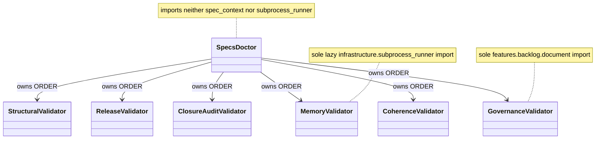
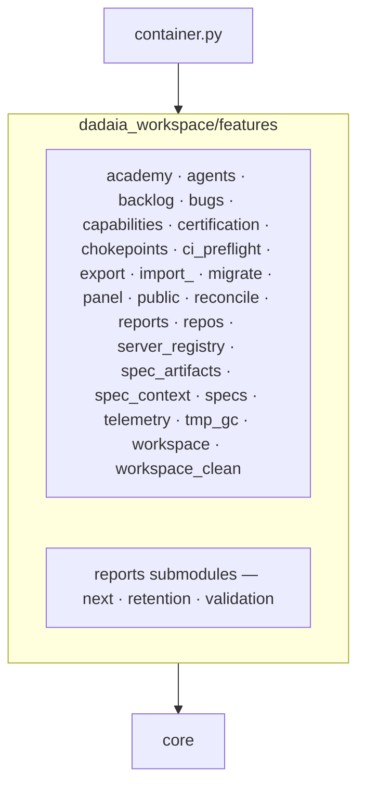
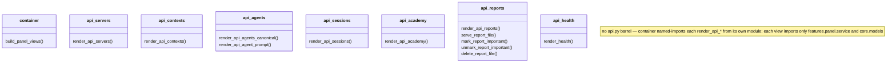

## Part 1 — Principles

### P-01 · We keep features on ports: a feature never imports `infrastructure` directly; the container injects the adapter.
Measured by: `lint-imports --config setup.cfg --no-cache` — contract `features-no-infrastructure`.
ADR: none
Rationale: an adapter reached directly cannot be substituted or faked.

### P-02 · We never spawn a subprocess from a feature; process execution goes through `ProcessRunner`.
Measured by: `lint-imports --config setup.cfg --no-cache` — contract `features-no-subprocess`.
ADR: none
Rationale: one process seam keeps execution observable, fakeable and bounded.

### P-03 · We keep `core` free of OS primitives (`fcntl`, `signal`, `subprocess`, `msvcrt`); `core/platform.py` is the sole platform seam.
Measured by: `lint-imports --config setup.cfg --no-cache` — contract `core-no-os-primitives`.
ADR: none
Rationale: a POSIX-only primitive in the bottom ring breaks every importer on Windows.

### P-04 · We make `core` the bottom ring: it imports no `features`, `infrastructure`, `cli` or `hooks`.
Measured by: `lint-imports --config setup.cfg --no-cache` — contract `core-no-upper-layers` (zero ignored imports).
ADR: none
Rationale: the ring everything imports must import nothing, or the graph has a cycle.

### P-05 · We let `infrastructure` depend on `core` only — never on `features`, `cli` or `hooks`.
Measured by: `lint-imports --config setup.cfg --no-cache` — contract `infrastructure-no-upper-layers` (zero ignored imports).
ADR: none
Rationale: an adapter that knows a use case is no longer an adapter.

### P-06 · We keep `core.kernel_tunables` a pure-constant leaf that imports no upper layer.
Measured by: `lint-imports --config setup.cfg --no-cache` — contract `kernel-tunables-is-a-leaf`.
ADR: none
Rationale: hooks import it on the write hot path; one upper edge drags in the composition graph.

### P-07 · We keep features mutually independent: they compose through the container, never through sibling imports; a helper two features need lives in each.
Measured by: `lint-imports --config setup.cfg --no-cache` — contract `features-no-cross-feature`, whose `modules =` list is asserted equal to the on-disk `features/*/__init__.py` package set by `pytest tests/contract/test_import_linter_ignore_cap.py`.
ADR: none
Rationale: a hand-kept `modules =` list hid three real sibling edges from the check.

### P-08 · We compose the CLI through the container: a verb never imports an infrastructure adapter directly.
Measured by: `lint-imports --config setup.cfg --no-cache` — contract `cli-no-infrastructure`.
ADR: none
Rationale: a verb that builds its own adapter is a second composition root.

### P-09 · We resolve a Spec Context in exactly one place, `core.specs_resolver.resolve_context`, imported directly only by `cli._specs_resolution`, `container` and `hooks`.
Measured by: `lint-imports --config setup.cfg --no-cache` — contract `bind-resolution-seam-is-a-single-home` (zero ignored imports, none ever accepted).
ADR: none
Rationale: every context bug came from a second resolution path answering differently.

### P-10 · We cap every suppressed layering edge and ratchet the cap only downward; an edge is added with its reason and the cap moved in the same commit.
Measured by: `pytest tests/contract/test_import_linter_ignore_cap.py` — the test module is the cap's one numeric home.
ADR: none
Rationale: a pinned exception list turns every new suppression into a reviewable diff.

### P-11 · We keep `core` file-I/O pure outside an authorized set of six modules; new file I/O enters `core` only by joining that set on purpose.
Measured by: `pytest tests/contract/test_core_file_io_purity.py` (AST walk; every authorized stem must exist).
ADR: none
Rationale: joining the set is legal; arriving there unnoticed is not.

### P-12 · We never import the composition root from a hook; hooks reach the resolution authority directly because they are one-shot processes on the write hot path.
Measured by: `pytest tests/contract/test_hook_import_surface.py` (six hook modules plus the executed gate path, with `container` absent from `sys.modules`).
ADR: none
Rationale: the composition graph costs seconds of import time per gated tool call.

### P-13 · We keep the architecture diagrams derived from live code: every diagrammed class, view module and feature package is introspected against the live tree.
Measured by: `pytest tests/contract/test_architecture_diagrams_current.py`.
ADR: none
Rationale: a diagram nobody checks is the first artifact to lie.

### P-14 · We keep the release-event fold read-only: `core/release_events.py` contains no write call and no file I/O at all.
Measured by: `pytest tests/contract/test_release_events_read_only.py`.
ADR: none
Rationale: a reader that can write is a reader that can rewrite history.

### P-15 · We close the release-record envelope: exactly seven event kinds, `additionalProperties: false`, and no harness `session_id` in a governance record.
Measured by: `pytest tests/contract/test_release_event_schema.py`.
ADR: none
Rationale: an open envelope accumulates fields until no consumer can fold it.

### P-16 · We store no provenance a resolver cannot re-derive: a stored `resolved_commit` equals the value derived from git history.
Measured by: `pytest tests/contract/test_resolved_commit_stored_equals_derived.py` (marked `slow`; runs in the `contract-coverage` job and the local preflight).
ADR: none
Rationale: git is the authority for git facts; this test keeps the cache a cache.

### P-17 · We map every core skill and every scoped `AGENTS.md` source to exactly one `DADAIA.md` section, every section to at least one owner, with content hashes re-recorded only by review.
Measured by: `pytest tests/contract/test_behavior_map.py` (bijection, hash tuples, citation check, invocation grants).
ADR: none
Rationale: law that no asset owns is law nobody applies.

## Part 2 — Implementation

### `features/specs/doctor` — SpecsDoctor coordinator + validator siblings

### `dadaia_workspace/features` — package map (24 packages)

### `features/panel/views` — per-domain API view modules

