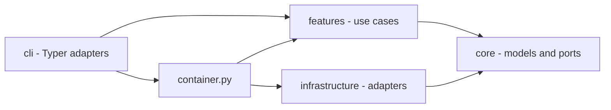
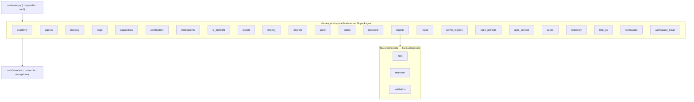
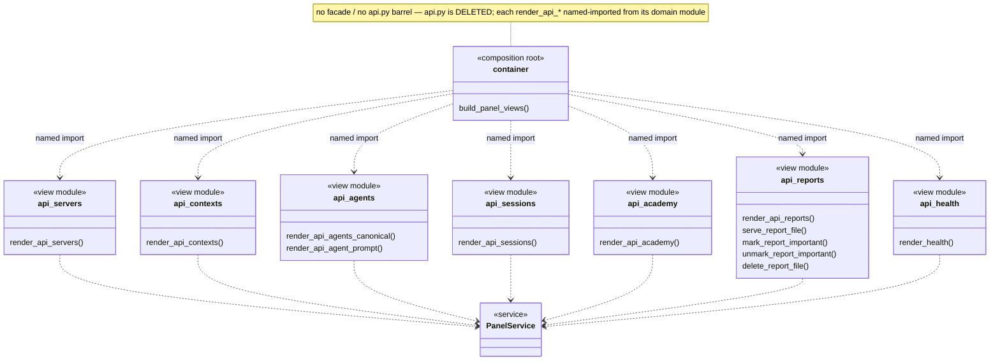

## Part 1 — Principles

### P-01 · We keep features on ports: a feature never imports `infrastructure` directly; the container injects the adapter.
Measured by: `lint-imports --config setup.cfg --no-cache` — contract `features-no-infrastructure`.
ADR: none
Rationale: an adapter reached directly cannot be substituted or faked.

### P-02 · We never spawn a subprocess from a feature; process execution goes through `ProcessRunner`.
Measured by: `lint-imports --config setup.cfg --no-cache` — contract `features-no-subprocess`.
ADR: none
Rationale: one process seam keeps execution observable, fakeable and bounded.

### P-03 · We keep `core` free of OS primitives (`fcntl`, `signal`, `subprocess`, `msvcrt`); `core/platform.py` is the sole platform seam.
Measured by: `lint-imports --config setup.cfg --no-cache` — contract `core-no-os-primitives`.
ADR: none
Rationale: a POSIX-only primitive in the bottom ring breaks every importer on Windows.

### P-04 · We make `core` the bottom ring: it imports no `features`, `infrastructure`, `cli` or `hooks`.
Measured by: `lint-imports --config setup.cfg --no-cache` — contract `core-no-upper-layers` (zero ignored imports).
ADR: none
Rationale: the ring everything imports must import nothing, or the graph has a cycle.

### P-05 · We let `infrastructure` depend on `core` only — never on `features`, `cli` or `hooks`.
Measured by: `lint-imports --config setup.cfg --no-cache` — contract `infrastructure-no-upper-layers` (zero ignored imports).
ADR: none
Rationale: an adapter that knows a use case is no longer an adapter.

### P-06 · We keep `core.kernel_tunables` a pure-constant leaf that imports no upper layer.
Measured by: `lint-imports --config setup.cfg --no-cache` — contract `kernel-tunables-is-a-leaf`.
ADR: none
Rationale: hooks import it on the write hot path; one upper edge drags in the composition graph.

### P-07 · We keep features mutually independent: they compose through the container, never through sibling imports; a helper two features need lives in each.
Measured by: `lint-imports --config setup.cfg --no-cache` — contract `features-no-cross-feature`, whose `modules =` list is asserted equal to the on-disk `dadaia_workspace/features/*/__init__.py` package set by `pytest -p no:cacheprovider tests/contract/test_import_linter_ignore_cap.py`.
ADR: none
Rationale: a hand-kept `modules =` list hid three real sibling edges from the check that measures independence.

### P-08 · We compose the CLI through the container: a verb never imports an infrastructure adapter directly.
Measured by: `lint-imports --config setup.cfg --no-cache` — contract `cli-no-infrastructure`.
ADR: none
Rationale: a verb that builds its own adapter is a second composition root.

### P-09 · We resolve a Spec Context in exactly one place, `core.specs_resolver.resolve_context`, imported directly only by `cli._specs_resolution`, `container` and `hooks`.
Measured by: `lint-imports --config setup.cfg --no-cache` — contract `bind-resolution-seam-is-a-single-home` (zero ignored imports, none ever accepted).
ADR: none
Rationale: every context bug came from a second resolution path answering differently.

### P-10 · We cap every suppressed layering edge and ratchet the cap only downward; an edge is added with its reason and the cap moved in the same commit.
Measured by: `pytest -p no:cacheprovider tests/contract/test_import_linter_ignore_cap.py` — the test module is the cap's one numeric home.
ADR: none
Rationale: a pinned exception list turns every new suppression into a reviewable diff.

### P-11 · We keep `core` file-I/O pure outside an authorized set of six modules; new file I/O enters `core` only by joining that set on purpose.
Measured by: `pytest -p no:cacheprovider tests/contract/test_core_file_io_purity.py` (AST walk; every authorized stem must exist).
ADR: none
Rationale: joining the set is legal; arriving there unnoticed is not.

### P-12 · We never import the composition root from a hook; hooks reach the resolution authority directly because they are one-shot processes on the write hot path.
Measured by: `pytest -p no:cacheprovider tests/contract/test_hook_import_surface.py` (six hook modules plus the executed gate path, with `container` absent from `sys.modules`).
ADR: none
Rationale: the composition graph costs seconds of import time per gated tool call.

### P-13 · We keep the architecture diagrams derived from live code: every diagrammed class, view module and feature package is introspected against the live tree.
Measured by: `pytest -p no:cacheprovider tests/contract/test_architecture_diagrams_current.py`.
ADR: none
Rationale: a diagram nobody checks is the first artifact to lie.

### P-14 · We keep the release-event fold read-only: `core/release_events.py` contains no write call and no file I/O at all.
Measured by: `pytest -p no:cacheprovider tests/contract/test_release_events_read_only.py`.
ADR: none
Rationale: a reader that can write is a reader that can rewrite history.

### P-15 · We close the release-record envelope: exactly seven event kinds, `additionalProperties: false`, and no harness `session_id` in a governance record.
Measured by: `pytest -p no:cacheprovider tests/contract/test_release_event_schema.py`.
ADR: none
Rationale: an open envelope accumulates fields until no consumer can fold it.

### P-16 · We store no provenance a resolver cannot re-derive: a stored `resolved_commit` equals the value derived from git history.
Measured by: `pytest -p no:cacheprovider tests/contract/test_resolved_commit_stored_equals_derived.py` (marked `slow`; runs in the `contract-coverage` job and the local preflight).
ADR: none
Rationale: git is the authority for git facts; this test keeps the cache a cache.

### P-17 · We map every core skill and every scoped `AGENTS.md` source to exactly one `DADAIA.md` section, every section to at least one owner, with content hashes re-recorded only by review.
Measured by: `pytest -p no:cacheprovider tests/contract/test_behavior_map.py` (bijection, hash tuples, citation check, invocation grants).
ADR: none
Rationale: law that no asset owns is law nobody applies.

## Part 2 — Implementation

### Overview

`container.py` is the composition root the CLI and the panel build through. An unavoidable
edge uses a function-scoped lazy import — the two capped `chokepoints` and `doctor_memory`
edges. The workspace ships no agent-execution runtime.

### Seams

- `core/specs_resolver.resolve_context()` — single context-NAME authority (P-09); its
  docstring holds the rung law ([[context-management]]). Consumers: the CLI seam,
  `container`, the SDD gate, ctx-inject. `core` duplicates
  `features/spec_context/session_identity`'s record read, since P-04 forbids the import.
- `core/atomic_write.py` — the one atomic-write primitive: uuid-suffixed temp sibling plus
  `os.replace`, parameterized by preserve-mode, text-or-bytes content and newline policy,
  temp cleanup on every failure path, importing nothing from `dadaia_workspace` so `hooks/`
  consume it without the composition root (P-12). Compare-then-swap is inside it: optional
  `expected_previous` is the last read before `os.replace`, a mismatch raises the pure-`core`
  `ConcurrentModificationError` and cleans the temp sibling, and its kind (`str`/`bytes`)
  must match the content's. Semantics are refuse-stale then retry.
  `tests/unit/core/test_atomic_write_census.py` asserts every atomic write routes through it.
- `core/redaction.py` — stdlib-pure masking behind `cli/redact.py`'s `--redact`:
  word-boundary alternation, longest-first ordering, first-appearance placeholder ordinals.
  The push gate does not consume it; its render boundary masks with the detector's own
  matchers.
- The P-11 file-I/O authorized stems are `specs_backup`, `specs_version`, `specs_resolver`,
  `workspace_resolver`, `specs_repair`, `atomic_write`.

### Feature packages

- `features/spec_context/` — ALIVE/DEAD lifecycle, binding, session identity, advisory
  presence, path classification, workspace doctor checks. No lease or locking module.
- `features/chokepoints/` — pre-commit/pre-push decision logic, no subprocess (P-02); its
  one `infrastructure` edge (`jsonl_log_rotation`) is function-scoped and capped under P-10.
  I/O arrives as injected core ports: `ProcessAncestry` and `GitObjectReader` (adapter
  `infrastructure/git_objects.GitSubprocessObjectReader`), the latter a required parameter of
  the push decision function. `GitObjectReader` yields each object's new content plus the
  prior published text of the same path at the range base, or an explicit absence value
  (never an empty string); the protocol module is data-only, the adapter owns every
  subprocess, chunks to a constant resident bound and raises its own typed read error.
- `features/specs/` — structural validators, the memory-atom lint (one package module the
  doctor imports directly), catalog generation. Markdown atoms are the source; `catalog.json`
  and `product/index.md` are generated from frontmatter, and a catalog value derivable from
  an atom body is computed at generation time
  (`tests/contract/test_memory_catalog_render_contract.py`). `SpecsDoctor` is a thin
  coordinator over six validator siblings ([[specs-doctor]]).
- `features/backlog/` — the sole owner of the backlog grammar, parsing and writing: `backlog
  new` finds its insertion point through the parsed fence-aware structure, checks slug
  membership through the parsed document, and re-parses its own output.
- `features/spec_artifacts/new_artifacts.py` — creates a release SPEC and nothing else; the
  workspace scaffolds no hotfix release ([[sdd-bug-backlog-governance]]).
- `features/reports/` — handoff validation, discovery and retention, stdlib-only behind
  `ValidatorPort`. `features/panel/` — loopback-only stdlib HTTP UI ([[panel]]).
  `features/public/` — the projection chain ([[public-asset-distribution]]).
- Other bounded packages: certification, capabilities, telemetry, server registry, bugs,
  repos, academy, import/export, migration, workspace initialization and cleanup.

### Hooks and chokepoints

`hooks/pre_gate.py` composes root whitelist, venv guard and the path/phase/mode gate;
`hooks/sdd_post_gate.py` refreshes presence and runs the nonblocking reconciler;
`hooks/ctx_inject.py` emits the once-per-session bootstrap and reads only the leading lines
of [[tech-stack]] for its digest. The git chokepoints are installed from
`public/scripts/pre-commit-presence-gate.sh` and `public/scripts/pre-push-ci-gate.sh`
([[sdd-gate-v3]]).

### Concurrency

No workspace operation blocks on another session. A mutating file-tool call records
best-effort presence; a peer record produces an advisory warning; the caller's own READ mode
is self-protection; filesystem and git conflicts surface races. Adapter primitives that
serialize a single telemetry refresh or database write have bounded failure behavior.

### Runtime state

Workspace state is rooted at `.dadaia/` and nowhere else; the allowed subdirectory set is
`_DADAIA_ALLOWED_SUBDIRS` in `features/spec_context/doctor.py`, enforced by ROOT-4. Legacy
`states/ctx_locks/` and `sessions/runtime/` are retired state removed by `doctor --fix`;
`states/bind_epoch/` is swept by the `remove_legacy_bind_epoch_state` install migration;
known-legacy subdirs (`bugs`, `src`, `locks`, `figma-bridge`, `imgs`, `references`) are
quarantined — never deleted — into `tmp/legacy-quarantine/run-<id>/` with a manifest by the
reconcile `legacy-dir-quarantine` step (`features/migrate/legacy_dadaia_dirs.py`).

No repo may contain `.dadaia/`, a virtualenv, cache directories, test-results, Playwright
reports or coverage artifacts — measured by ROOT-4 and
`tests/contract/test_source_repo_hygiene.py`. `dadaia doctor` and `reports validate` exit
non-zero while issues remain. Tool-initiated commits (`alive` scaffold, `dead` sync) fall
back to an injected `dadaia-workspace <dadaia@workspace.local>` git identity
(`infrastructure/git_subprocess.py`).

### Agent surface

Nine core agent roles with two dispatchers run inside the entry harness
([[agent-orchestration]]). Their bodies are canonical Markdown under `public/agents/`,
rendered at install with the resolved model/effort policy and projected per harness. A
persona body targets 120-220 lines; each exceeding persona justifies its overflow inline, and
no persona loses a write-allowlist row, a scope boundary or a hard-stop block. Every core
sub-agent, hook and rule file derives from an abstract entity in
`public/entities/registry.json`, and `public/entities/behavior-map.json` binds each skill and
scoped `AGENTS.md` to one `DADAIA.md` section (P-17) ([[agentic-entities]]).

### Architecture diagrams

The three diagrams below are parsed in place by P-13's drift-guard and regenerated at the
closure of any structural release that renames, splits, adds, removes or merges what they
depict.

### `features/specs/doctor` — SpecsDoctor coordinator + validator siblings

The coordinator owns `check()`/`fix()` ORDER only; six validator siblings hold the logic,
over two shared leaf modules. Each boundary import sits in exactly one validator:
`doctor_memory` holds the lazy `infrastructure.subprocess_runner` edge, `doctor_governance`
the `features.backlog.document` edge. The package carries no `spec_context` edge.

### `dadaia_workspace/features` — package map (24 packages)

The parenthetical count is the drift-guard's pinned lookup key and moves only with the live
package set. The guard is forward-only for packages — a retired package left in the diagram
passes — which is why regeneration is a stated closure step.

### `features/panel/views` — per-domain API view modules

No facade, barrel or re-export shim: `container.py` named-imports each `render_api_*` from
its own module. Every view module imports only `features.panel.service` and `core.models`.

### Dependencies

[[spec-context-project]], [[context-management]], [[sdd-gate-v3]], [[agent-orchestration]],
[[panel]], [[public-asset-distribution]], [[tech-stack]].
