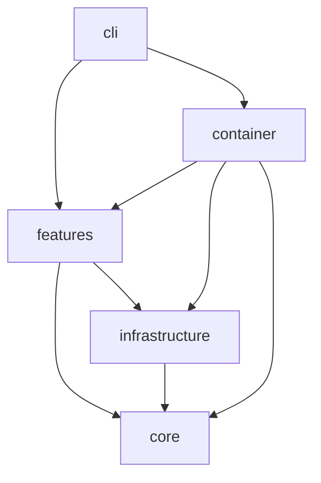
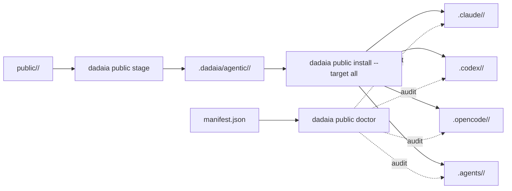
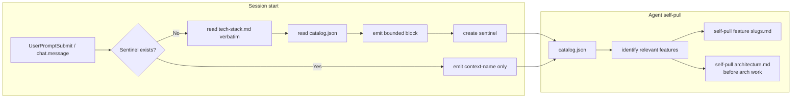
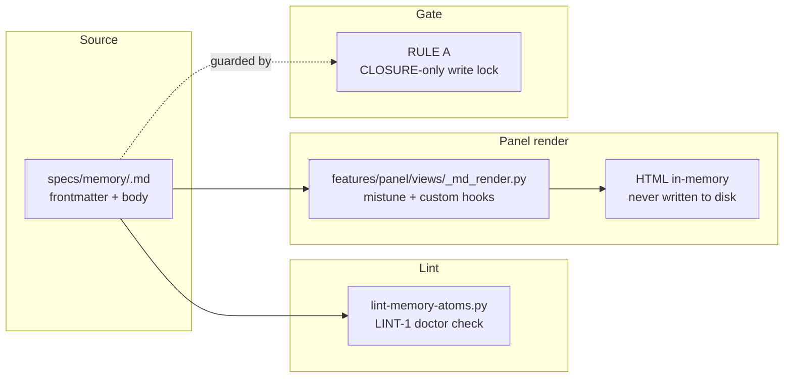

## Visão geral

Arquitetura em três anéis: (1) CLI thin em `dadaia_workspace/cli/`; (2) features isoladas em `dadaia_workspace/features/<name>/` cada uma com seu service/doctor/etc; (3) infrastructure em `dadaia_workspace/infrastructure/` (Git, JSON stores, public asset projection). Núcleo em `dadaia_workspace/core/` mantém models, protocols e exceptions — sem I/O. Dependency injection via `dadaia_workspace/container.py`.

Asset chain canonical → projeções: a fonte de cada agente, skill, rule, command, script, template, workflow vive em `dadaia_workspace/public/<type>/`; staging em `.dadaia/agentic/<type>/` (snapshots imutáveis com manifest.json); instalação espalha por `.claude/`, `.codex/`, `.opencode/`, `.agents/` seguindo regras por tool.

## Camadas

**cli/** — typer app + commands (`academy`, `context`, `doctor`, `export`, `import`, `init`, `orchestrate`, `public`, `repos`, `specs`). Thin wrapper sobre features; sem business logic.

**features/** — cada feature é uma pasta com `service.py` + opcionalmente `doctor.py`, `resolver.py`, `runner.py`. Features atuais: `academy`, `agents` (canonical agent reader sobre `MarkdownAgentStore`), `export`, `import_`, `orchestration`, `panel` (descrito em detalhe abaixo), `public`, `repos`, `server_registry`, `spec_context`, `specs`, `telemetry` (com `aggregator/queries.py` expondo `list_sessions(runtime, project=None, limit=None) -> SessionListResult` + `get_session(runtime, session_id) -> SessionDetail | None`; `aggregator/runtimes.py` declara o protocolo `RuntimeAdapter` com métodos `enrich_row`, `enrich_detail`, `liveness(session_id, cwd)` e implementações `ClaudeRuntimeAdapter` (cost via `pricing.compute_cost`, liveness via `~/.claude/sessions/*.json`) e `CodexRuntimeAdapter` (cost `None` + `cost_known=False`, liveness via `~/.codex/state_5.sqlite::threads` + tail de `~/.codex/history.jsonl` com try/except fallback para `idle`); `TelemetryAggregator` mantém registry `{runtime: adapter}` e delega enrichment per row), `workflows` (`WorkflowsService` wrapping `MarkdownWorkflowStore` com mtime cache + `dag.py` SVG renderer server-side via longest-path layout), `workspace`.

**panel — arquitetura HTTP interna (pós R5):**

  * **Route categories (3 tipos declarados em`handler.py`)**:
    * _Public_ : rotas em `_COMPILED_ROUTES`, sem autenticação — `GET /`, `GET /static/<name>`, `GET /memory/<slug>/<path>`, `GET /memory-view/<slug>/<file>`, `GET /reports/<path>` (path-traversal guard via `Path.resolve()` + `relative_to(workspace_root/.dadaia/reports/)`; 403 se fora do boundary).
    * _Bearer-only_ : `_BEARER_ONLY_ROUTES` — normalmente exigem header `Authorization: Bearer <token>`; incluem todos os `/api/*` endpoints: `/api/servers`, `/api/contexts`, `/api/agents`, `/api/agents/<id>/prompt`, `/api/workflows`, `/api/workflows/<name>`, `/api/sessions`, `/api/sessions/<runtime>/<id>`, `/api/academy`, `/api/reports`, `DELETE /api/reports/<path>`, `/api/kanban` (panel-kanban-v1). **Loopback bypass (panel-ux-fix-v1):** quando o panel inicia com `bind == "127.0.0.1"`, `loopback_bypass=True` é passado para `make_handler_class()`; o branch 401 em `handler.py` é guardado por `if not _loopback_bypass and (…)` — `GET /api/*` retorna 200 sem token em bind loopback. Detecção é no boot address (avaliado uma vez), não no peer TCP address de cada request. Mutações (`POST`, `DELETE`) não são afetadas — padrão de autenticação permanece inalterado para elas.
    * _Telemetry_ : `_tel_patterns` + telemetry required — subconjunto das bearer-only rotas de sessions que delegam para `TelemetryAggregator`.
  * **`do_DELETE` handler**: `PanelHandler.do_DELETE` adicionado ao lado de `do_GET`; espelha o padrão de auth (Bearer validation constant-time); despacha `api_report_delete` via regex dispatch; mesmo traversal guard que `GET /reports/<path>`. Em v0.1.4.3, `api_report_delete` remove o HTML report + canonical handoff em `.dadaia/handoff/` + legacy sidecar adjacent em `.dadaia/reports/` em um único passo atômico.
  * **Report retention (v0.1.4.3)**: `GET /api/reports` descobre reports por artifact HTML (HTML-first, não sidecar-driven); enriquece cada row com sidecars canônicos de `.dadaia/handoff/` e legacy sidecars adjacentes de `.dadaia/reports/**`; deduplica para uma row por HTML report; adiciona campos `important: boolean`, `expires_at: string | null`, `is_expired: boolean`, `retention_reason: string | null`. Startup/listing path executa cleanup de reports expirados não-importantes (não-bloqueante; falhas são warning no metadata). `POST /api/reports/<path>/important` e `DELETE /api/reports/<path>/important` são as novas mutações de retention. CLI: `dadaia reports cleanup [--older-than 48h] [--dry-run] [--json]`, `mark-important`, `unmark-important`, `important`. Estado persiste em `.dadaia/states/report_retention.json`. Root-whitelist hook `root-whitelist-gate.sh` (PreToolUse) bloqueia writes não-whitelisted ao workspace root; instalado via `dadaia public install --target all`.
  * **Static asset registry** : `static.py _ASSETS` dict é o registry central de todos os assets servidos por `/static/<name>`. CSS servido como Python string constants (Python-string modules em `views/assets/css/`). JS e SVGs lidos do filesystem em import-time em `static.py` (não em request-time — sem traversal possível). `logo-rhino-36.svg` e `logo-rhino-24.svg` registrados em `_ASSETS`. `_assets.py` não contém mais `PANEL_CSS`, `PANEL_JS`, nem `PALETTE` (removidos).
  * **View composition** : `container.py build_panel_views()` instancia e retorna o dict de 15+ view callables, incluindo `api_reports` (`GET /api/reports`), `reports_serve` (`GET /reports/<path>`), `api_report_delete` (`DELETE /api/reports/<path>`), `api_kanban` (`GET /api/kanban` — servido por `views/kanban.py`). Todos os view callables são passados para `PanelHandler` via DI.
  * **`views/kanban.py` (panel-kanban-v1)**: view read-only que lê `.dadaia/sessions/*.json` (session files de R2 — _não_ o `TelemetryDao`), agrupa cards por context e modo, mapeia modo para coluna Kanban (READ → research, SPEC → spec, BOUND_IMPLEMENTATION → implementation, BOUND_REVIEW → review, desconhecido → research), computa `is_stale` em read-time (`(now - last_seen_at) > ttl_seconds`), retorna JSON com `generated_at` + `swimlanes`. Ausência ou vazio do diretório `.dadaia/sessions/` → 200 com swimlanes vazias (nunca 500). Arquivos malformados ignorados silenciosamente. Servido em `GET /api/kanban`; endpoint bearer-only (loopback bypass de panel-ux-fix-v1 se aplica).
  * **`window.Panel` registry pattern** em `core.js`: objeto `{ register(name, mod), activate(name, opts) }` definido antes do tab loading logic. Lazy tab module loading: `register(name, mod)` registra o módulo; `activate(name, opts)` chama `mod.load(opts)` ou equivalente. Módulos registrados: `agents` (`window.Agents`), `workflows` (`window.Workflows`), `sessions`, `academy`, `reports`. `window.escHtml` promovido a global em `core.js`; todos os novos módulos JS usam `window.escHtml`. `DOMContentLoaded` em `core.js` registra Sessions, Academy e Reports via `window.Panel.register` e ativa o tab correto via hash routing (`#reports`, `#academy` são novos).
  * **`AcademyService` DI**: injetado como parâmetro opcional `academy=None` em `PanelService.__init__()`; instanciado no composition root de `panel.py`; `GET /api/academy` chama `service.academy.list_all()` quando não-None, retorna `[]` caso contrário.
  * **Workspace resolver** : `_resolve_workspace()` em `panel.py` caminha de baixo para cima do cwd até encontrar o diretório contendo `.dadaia/` — `dadaia panel` funciona de qualquer subdiretório do workspace.
  * **Telemetry hardening** : `_try_build_telemetry()` em `panel.py` usa handlers per-exception-type (`PermissionError`, `OSError`, `sqlite3.OperationalError`, `ImportError`), cada um emitindo `logging.warning` com a causa raiz antes de retornar `None` — nenhuma exception produz HTTP 503 silencioso nas rotas de sessions.


**core/** — `models/` (dataclasses puras), `protocols/` (ABCs / Protocols para DI), `exceptions.py`. Zero I/O. Pode importar stdlib apenas.

**infrastructure/** — implementações concretas dos protocols: `git_subprocess`, `json_*_store`, `public_assets`, `markdown_workflow_store`, `markdown_agent_store`, `claude_agent_dispatcher`, `cli_agent_dispatcher`, `excel_reader`, `python_env`. Toda I/O fica aqui. **Não-features-fed** : as tabelas SQLite `workflows` e `workflow_agents` permanecem em `schema.py` com marker `# DEAD:` aguardando cleanup release (migration 6); zero código de produção lê delas após R3.

**container.py** — wires features ↔ infrastructure via `build_*_service(workspace_root)` factories. CLI commands chamam o container para obter serviços.

**public/** — assets canônicos versionados: `agents/`, `skills/`, `rules/`, `commands/`, `scripts/`, `templates/`, `workflows/`, `plugins/`, `data/`, `scaffold/`. `public_assets.py` stage/install/doctor. A função `_install_workspace_guardrail_pair` faz fan-out byte-identical de uma única fonte `data/AGENTS.md` para o par `AGENTS.md` + `CLAUDE.md` no workspace-root e em cada consumer-repo carregando marker `.dadaia/agentic/` (Option C); o lib repo auto-skipa via `package_version`.

**agent topology (public default: 3 tiers, 15 agentes)** — Tier 1 _orchestrators_ (2): `project-manager` (intake + routing) e `project-auditor` (drift/dead-code audit). Tier 2 _curator_ (1): `product-engineer`, autor de SPEC/PLAN/TASKS/CLOSURE e guardião de `specs/memory/**/*.md` apenas em CLOSURE. Tier 3 _leaf specialists_ (12): `ai-engineer`, `backend-engineer`, `code-reviewer`, `design-specialist`, `devops-engineer`, `frontend-engineer`, `qa-engineer`, `researcher`, `security-reviewer`, `software-architect`, `software-engineer-node`, `software-engineer-python`. Agentes de jogo, data/BI vendor-specific e qualquer agente preso a projetos pessoais não fazem parte do default público; pertencem a optional packs ou overlays privados. Workflows públicos default: `spec-refinement`, `cross-cutting-feature`, `onboarding-new-repo`, `hotfix-release`, `audit-cycle`, `code-review-fan-out`, `design-first-implementation`. Rules públicos default: `workspace-protocol`, `tmp-file-guardrail`, `plugin-scope`, `dadaia-workspace-dev-guardrail`.

**Renderer split e runtime parity** — personas canônicas em `public/agents/` são projetadas para cada runtime via adapters. Claude recebe frontmatter/body no formato Claude Code. Codex recebe blocos nativos em `.codex/config.toml`, `paths = [".agents/skills", ".codex/skills"]`, hooks `PreToolUse`/`PostToolUse`/`UserPromptSubmit`, workflows como reference-only, e linguagem de dispatch baseada em `tool_search`/deferred multi-agent tools quando disponíveis. OpenCode recebe permissões mapeadas para seu runtime e plugins de gate/context. Doctor deve reportar essas diferenças como estado verdadeiro do runtime, não como paridade falsa.

**Implementation review/QA gate** — SPEC/PLAN/TASKS approval requires pre-implementation agreement from the owning implementer, `qa-engineer`, `code-reviewer`, and `security-reviewer` (plus `design-specialist` for visible UI). Implementers own code plus unit/integration tests and emit implementation-complete handoffs only. `project-manager` coordinates QA, code review, security review, and rework. Task `[x]`, push, PR, merge, deploy, release closure, and memory updates are blocked until every required reviewer approves the same commit or artifact.

**path-scope enforcement** — O gate PreToolUse `sdd-spec-gate.sh` valida o
`file_path` de Write/Edit/MultiEdit e headers de Codex `apply_patch` contra
`paths.write_allowlist` do frontmatter do agente ativo. Tools de write sem
target path parseável falham fechadas. Todos os 20 agentes declaram bloco
`paths:`. Mismatch → JSON `{"decision":"block","reason":"[PATH SCOPE ERROR] …"}`;
agent-persona não detectada → fail-open com warning em `/tmp/sdd-gate.log`
(NFR3). `ai-engineer` tem write authority exclusiva sobre
`dadaia_workspace/public/{skills,rules,workflows,commands,agents,hooks}/**`;
`software-engineer-python`/`-node` são banidos dessa superfície AI-entity (e
vice-versa: `ai-engineer` não escreve código Python/Node nem specs).

**rules folder** — 5 arquivos canônicos públicos: `workspace-protocol.md` (SDD gate + context discovery + task lifecycle), `tmp-file-guardrail.md` (artefatos temporários e outputs), `plugin-scope.md` (escopo de plugins/skills especializados), `dadaia-workspace-dev-guardrail.md` (regras de evolução da própria lib) e `harness-skill-scope.md` (always_on; restringe as skills ai-harness-claude-code, ai-harness-codex e ai-context-engineering ao ai-engineer; harness-primitives é explicitamente não-restrita). Rules de domínio, jogos, vendors ou projetos privados não pertencem ao default público.

## Regras de dependência

Setas indicam dependência permitida; ausência de seta significa proibição.



**Proibido:** core nunca importa de features/infrastructure/cli; features não importam de cli; features não importam outras features (passar pelo container).

## Fluxo de dados — pipeline asset chain



## Fluxo de dados — gate v3 SDD (com RULE E e PostToolUse)

```mermaid
sequenceDiagram
    participant Tool as Agent Tool
    participant PreHook as PreToolUse Hook
    participant Gate as sdd-spec-gate.sh
    participant Active as releases/ACTIVE.md
    participant Session as .dadaia/sessions/sess_*.json
    participant Lock as .dadaia/locks/implementation/
    participant TASKS as releases/<id>/TASKS.md
    participant PostHook as PostToolUse Hook
    participant PostGate as sdd-post-gate.sh
    Tool->>PreHook: Write/Edit (file_path)
    PreHook->>Gate: stdin JSON
    Gate->>Active: read phase
    Gate->>Gate: RULE A: memory/* + phase≠CLOSURE → block
    Gate->>Gate: RULE B: _archive/* → block
    Gate->>Gate: RULE D: path-scope allowlist check
    Gate->>Session: read DADAIA_SESSION_ID session file
    alt DADAIA_SESSION_ID absent
        Gate-->>PreHook: block production write; tmp paths already fast-allowed
    else session present
        Gate->>Lock: read impl lock (IMPLEMENTATION mode)
        Gate->>Gate: RULE E: path-policy matrix (mode + staleness + ownership)
        Gate->>TASKS: grep [-] marker (RULE C; release from lock file if IMPL mode)
        alt allowed + task [-]
            Gate-->>PreHook: exit 0 (allow)
        else
            Gate-->>PreHook: {"decision":"block", owner session_id}
        end
    end
    PreHook-->>Tool: allow/block
    Tool->>PostHook: tool completed
    PostHook->>PostGate: DADAIA_SESSION_ID
    PostGate->>Session: renew last_seen_at (atomic)
    PostGate->>Lock: append HEARTBEAT to lock-events.jsonl
```

## Contratos entre módulos

De| Para| Tipo de contrato| Notas
---|---|---|---
cli/commands/*| container.build_*_service| Factory call| Cada command resolve workspace_root e chama factory
features/*| core/protocols/*| Protocol / ABC| Injetado via constructor — features não conhecem implementação
features/specs/doctor| specs/ filesystem| Path-based, read-only| Recebe specs_dir absoluto; nunca escreve. Inclui invariante **D-OC-1** (bidirectional): forward — cada nome Tier-1 do router PM mapeia para `public/workflows/<name>.workflow.md` existente; cada nome Tier-2 mapeia para heading `### Playbook — <name>` em SKILL.md; reverse — cada heading `### Playbook — <name>` em SKILL.md aparece como Tier-2 no router PM ou carrega anotação `[deprecated]`. Referência dangling em qualquer direção → hard error.
infrastructure/public_assets| public/ ↔ .dadaia/agentic/ ↔ projeções| Manifest + file copy| Manifest.json é o cache do que foi propagado
PreToolUse hook| sdd-spec-gate.sh| JSON stdin / stdout| Fail-open: erros internos → allow
features/telemetry/reader/claude.py| features/telemetry/store DAO| Event stream → SQLite UPDATE| Extrai `agent_name` de `tool_use.input.subagent_type` em Task tool invocations de subagents despachados; propaga a persona via mapa `session_id → agent_name` a todos eventos subsequentes da mesma session; persiste via `UPDATE sessions WHERE session_id = ?` (idempotente). Backfill histórico via `scripts/backfill_telemetry_agent_name.py [--db PATH] [--dry-run]` — UPDATE em rows existentes, nunca INSERT, rodar duas vezes é no-op.
features/telemetry/aggregator/queries.py| features/telemetry/aggregator/runtimes.py| RuntimeAdapter protocol + registry| `TelemetryAggregator` mantém registry `{runtime: RuntimeAdapter}` e delega `enrich_row(row, raw) -> SessionRow` + `enrich_detail(detail, raw) -> SessionDetail` + `liveness(session_id, cwd) -> "active"|"idle"|"ended"` per runtime. `ClaudeRuntimeAdapter` wires `pricing.compute_cost` para `cumulative_cost_usd` e seta `cost_known=True`; `CodexRuntimeAdapter` seta `cumulative_cost_usd=None` + `cost_known=False` (defensive guard impede chamada a `pricing.compute_cost` para Codex rows). Liveness classifica `active ≤ 5min`, `idle ≤ 60min`, `ended` caso contrário ou `threads.archived = 1`. Try/except wraps reads com fallback graceful para `idle`.

## Estado runtime

Locais canônicos de estado em disco e seu propósito:

  * `.dadaia/states/spec_contexts.json` — todos os Spec Context Projects (`schema_version: "2"`; state ALIVE/DEAD; sem flag global de contexto; campos `alive_since` e `dead_since`).
  * `.dadaia/states/.ws_lock` — fcntl workspace-wide lock (gitignored; criado em runtime; Lock 1).
  * `.dadaia/states/ctx_locks/<slug>.lock` — fcntl per-context lock (gitignored; Lock 2).
  * `.dadaia/sessions/<sess_*>.json` — session files criados por `context bind`; registram mode, release, runtime, pid, last_seen_at, ttl_seconds.
  * `.dadaia/locks/implementation/<ctx>__<release>.json` — Lock 3 per-release implementation lock (state: FREE/HELD/STALE/RECLAIMED).
  * `.dadaia/logs/lock-events.jsonl` — audit log append-only (O_APPEND; registros <1 KB; eventos: ACQUIRED, RELEASED, STALE_DETECTED, RECLAIMED, HEARTBEAT, BLOCKED_ATTEMPT).
  * `.dadaia/agentic/<type>/` — staging de assets (snapshot imutável).
  * `.dadaia/agentic/manifest.json` — registro do que foi propagado para cada tool.
  * `.dadaia/scripts/sdd-spec-gate.sh` — projeção do gate PreToolUse (instalada por `dadaia public install`).
  * `.dadaia/scripts/sdd-post-gate.sh` — projeção do gate PostToolUse / heartbeat renewal (instalada por `dadaia public install`).
  * `.dadaia/reports/<context>/<agent>/*.html` — reports HTML produzidos por especialistas (20 diretórios possíveis correspondentes aos 20 agentes), consumidos por `project-manager` no Discovery e por `project-auditor` nas auditorias.
  * `.dadaia/states/report_retention.json` — important-mark set para report retention (v0.1.4.3); keys são caminhos workspace-relativos; nunca cresce com arquivos marcados por regra automática — somente por ação explícita do operador via panel ou CLI.
  * `.dadaia/states/root_exceptions.txt` — lista de entradas de root permitidas além do whitelist canônico (e.g. `CLAUDE.md`, `.mcp.json`, `opencode.json`); lida pelo hook `root-whitelist-gate.sh` antes de bloquear uma escrita.
  * `.dadaia/scripts/` — scripts utilitários do workspace (e.g. `install-ccusage-alias.sh` movido de `scripts/` root em v0.1.4.4).
  * `.dadaia/cache/ruff/` — cache do ruff (redirected de root em v0.1.4.4; `pyproject.toml [tool.ruff] cache-dir`).
  * `.dadaia/cache/coverage/` — arquivo `.coverage` de cobertura (redirected de root em v0.1.4.4; `pyproject.toml [tool.coverage.run] data_file`).
  * `specs/releases/ACTIVE.md` — release ativa + phase.
  * `specs/memory/*.md` — memory atômica (Markdown + frontmatter YAML; rendered in-memory pelo panel via mistune).
  * `specs/memory/product/catalog.json` — gerado por `generate-memory-catalog.py` a partir do frontmatter dos `.md`; committed; índice machine-readable.
  * `specs/_archive/releases/<id>/` — releases concluídas com CLOSURE.
  * `specs/_archive/legacy-features/<name>/` — features SDD pre-release-lifecycle não implementadas.
  * `specs/_archive/legacy-memory/<ts>/` — memory markdown migrado para HTML.
  * `specs/_archive/legacy-root/` — SPEC/PLAN/TASKS top-level pre-release-lifecycle.


**Removido em v2:** o antigo marcador global de contexto é deletado por `dadaia migrate` e não é recriado em nenhum code path v2. O conceito de "global primary" foi substituído por session binding via `eval $(dadaia context bind ...)`.

## Memory injection subsystem

Implemented in release `memory-context-enforcement-v1`. Ensures agents never start work without product context ("agents never work blind"). The subsystem operates across three runtimes (Claude Code, OpenCode, Codex).

### Lean payload (operator decision D-5)

The injected bootstrap is **tech-stack + catalog only** (~2,400 tokens). `architecture.md` is intentionally _not_ injected — it is large and is self-pulled by agents before any architectural or cross-layer work, exactly as feature atoms are self-pulled on-demand. Since `memory-markdown-source-v1`, tech-stack is injected verbatim as `.md` (no strip pass needed); the former `strip-memory-html.py` helper was deleted.

Layer| What is injected| Tokens (est)
---|---|---
Catalog index| `specs/memory/product/catalog.json` — all features with slug, title, summary, path, tags, rank| ~1,200
Tech stack| `memory/tech-stack.md` verbatim (no strip pass)| ~1,200
**Total injected**|  —| **~2,400 (~3K target)**

### ctx-inject.sh (Claude Code + OpenCode)

`dadaia_workspace/public/scripts/ctx-inject.sh` — lib-originated, projected to `.dadaia/scripts/ctx-inject.sh` by `dadaia public install`. Fires on every `UserPromptSubmit` event in Claude Code and on every `chat.message` in OpenCode. The script:

  1. Resolves `$SPECS_DIR` from `$DADAIA_CONTEXT`, the bound session file, or explicit command flags.
  2. Checks a **first-message sentinel** at `.dadaia/tmp/ctx-inject-fired-<SESSION_ID>`. If the sentinel exists, emits only the context-name line and exits — no re-injection on subsequent turns of the same session.
  3. Creates the sentinel and emits the full payload inside bounded markers:


    === workspace memory (tech + catalog) ===
    ...tech-stack.md content verbatim...
    ...catalog.json content...
    === end memory bootstrap ===

Fallback: when `catalog.json` is absent (consumer repos not yet generated), injects `product/index.md` verbatim instead of the catalog block (no error, no empty block). The former `.html` fallback was removed together with `strip-memory-html.py`.

### ctx-inject.ts (OpenCode first-message guard)

`dadaia_workspace/public/plugins/ctx-inject.ts` — extended with a first-message-only guard. The OpenCode `chat.message` hook fires on every user message; without the guard, the ~5K payload would be paid on every turn. The guard uses the same session sentinel pattern as `ctx-inject.sh`. If no session env var is available, falls back to a PID-based sentinel. Any error skips injection and never breaks the chat (fail-open).

### catalog.json generation pipeline

`dadaia_workspace/features/specs/catalog.py` — reads frontmatter YAML blocks from `specs/memory/product/*.md` files (not HTML scraping). Public function `generate_catalog(specs_dir: Path) -> dict` returns a dict matching the catalog JSON schema. CLI entry: `dadaia memory catalog generate [--specs-dir PATH]`. The generated file is committed as `specs/memory/product/catalog.json` (18 product feature entries). The script `dadaia_workspace/public/scripts/generate-memory-catalog.py` is the standalone equivalent for use outside the CLI.

### CAT-1 doctor check

In `dadaia_workspace/features/specs/doctor.py`. Verifies that the set of slugs in `catalog.json` matches the set of `*.md` files (excluding `index.md`) in `specs/memory/product/`. Severity: WARNING (not ERROR — catalog may simply be stale). The check message names the specific out-of-sync slugs/files.

### Codex memory-ctx adapter (ADR-CX-001)

`dadaia_workspace/public/runtime/codex/memory-ctx/SKILL.md` — NEW universal Codex bootstrap adapter. Auto-discovered and installed to `.codex/skills/memory-ctx/SKILL.md` by `_install_codex_runtime_adapters` in `infrastructure/public_assets.py` via directory iteration (`sorted(src_root.iterdir())`). No `config.toml` entry is created or needed — registration is purely by directory presence (ADR-CX-001). Covered by `dadaia public doctor` check D-CX-6 (leak/missing/drift). The adapter fires before role-specific adapters (`design-ctx`, `frontend-ctx`).

### Step 0 block in all 21 agent personas

A mandatory "Step 0 — Memory bootstrap (mandatory, before any implementation)" block was extracted to a shared skill `dadaia_workspace/public/skills/dadaia-step0-memory-bootstrap.md` (memory-markdown-source-v1). All 21 agent persona files in `dadaia_workspace/public/agents/` reference this skill instead of inlining ~400 tokens. The block instructs agents to: (1) read the catalog, (2) self-pull `architecture.md` before architectural/cross-layer work, (3) self-pull the 1-3 relevant feature atoms. 5 previously fully-blind P0 agents (code-reviewer, design-specialist, project-auditor, researcher, security-reviewer) also gained `dadaia-workspace-spec-navigator` in their frontmatter `skills:` list.



## Structured-memory-source subsystem

Implemented in release `memory-markdown-source-v1`. Memory atoms are `.md` files with YAML frontmatter + Markdown body. This supersedes the YAML/HTML dual-file model from `memory-structured-source-v1`. HTML is ephemeral (rendered in-memory by the panel via `mistune`; never written to disk). This supersedes the YAML/HTML dual-file model shipped by `memory-structured-source-v1`.

### Source format

Each atom is a `.md` file with a strict YAML frontmatter block (`---` delimiters). Frontmatter schema: `memory-frontmatter-v1` (file: `dadaia_workspace/public/schemas/memory/memory-frontmatter-v1.schema.json`; `additionalProperties: false`). Required fields: `slug`, `title`, `category`, `tldr`, `summary`, `tags`, `agent_tier`, `token_estimate`, `last_updated`, `release_origin`. Body: Markdown validated by a `##` heading allowlist (curated set of canonical PT section names + documented per-atom headings). `## Changelog`, `## Histórico`, `## History`, `## Versions` are hard errors. Cross-atom links use `slug` wikilinks resolved by `lint-memory-atoms.py`.

### Panel render path (`features/panel/views/_md_render.py`)

The panel reads `.md` source at serve time, converts it to HTML using `mistune~=3.0` with custom hooks (~100 LOC in `features/panel/views/_md_render.py`):
- Mermaid fenced code block → `<pre class="mermaid">…</pre>`
- `wikilink` → `<a href="…">` anchor
- Sanitiser: strips inline `<script>` and `<style>` from rendered output (XSS guard, OWASP A03)

Output is cached by mtime. No `.html` files are written to disk. Path traversal guard in `views/memory.py` covers `.md` source files. The SPEC-DOC-008 byte-identity invariant was retired — it applied to committed HTML only and is no longer meaningful.

### Lint tooling (`lint-memory-atoms.py`)

`dadaia_workspace/public/scripts/lint-memory-atoms.py` validates every atom:
- Frontmatter present, parseable, required fields, no extra fields (`additionalProperties`)
- `##` headings are a subset of the allowlist; no duplicates
- `slug` wikilinks resolve to real `.md` files in `specs/memory/`
- `token_estimate` drift warning (> 20% from `words × 1.35`; WARN only — never ERROR)
- Forbidden headings (`## Changelog` / `## Histórico` / `## History` / `## Versions`) — hard ERROR

Invoked by doctor check `LINT-1`. Exit 0 = all valid; exit 1 = at least one ERROR; exit 2 = warnings only.

### Doctor LINT-1 check

`LINT-1` in `features/specs/doctor.py` calls `lint-memory-atoms.py` on all `.md` files under `specs/memory/`. ERROR on frontmatter violations or forbidden headings; WARNING on token drift. Replaces the removed STRUCT-1..4 / SYNC-1 / YAML-absent checks. Check #2 (memory files exist) now looks for `.md` files. Check #8 (forbidden heading grep) now operates on `.md` body directly — no escape hatch.

### Gate RULE A (`.md` atoms)

RULE A in `sdd-spec-gate.sh` locks `specs/memory/**/*.md` with CLOSURE-only enforcement (same as the former `.yaml` and `.html` locks). A Write attempt on a `.md` memory atom outside the CLOSURE phase is blocked.

### Scaffold (born-markdown)

New consumer repos initialized via `dadaia init` or `dadaia context create` receive `.md` stubs in `specs/memory/` (frontmatter scaffold + section placeholders). The old `.yaml` scaffold files were deleted. `dadaia memory product add <slug>` generates a `.md` file validated by `lint-memory-atoms.py`.



## Evidências visuais

Diagramas de classe e screenshots da CLI vão sob `specs/assets/architecture/`. Atualmente sem assets — primeira batch virá em release subsequente.
