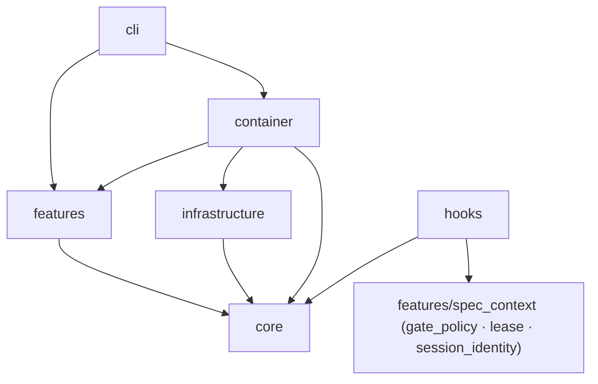
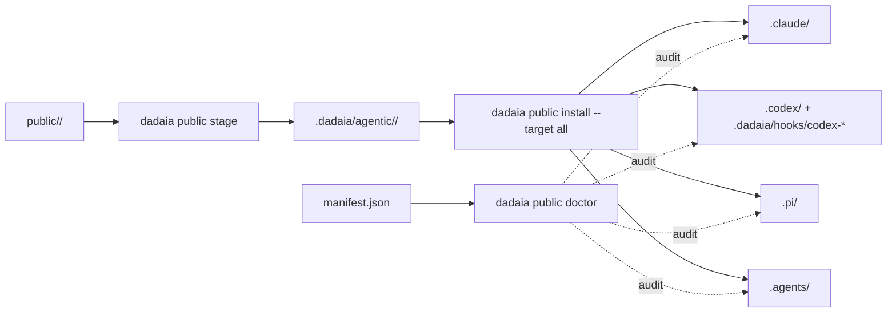

## Overview

Three-ring architecture: (1) thin CLI in `dadaia_workspace/cli/`; (2) isolated features in `dadaia_workspace/features/<name>/`, each with its service/doctor/etc; (3) infrastructure in `dadaia_workspace/infrastructure/` (Git, JSON stores, public asset projection). The core in `dadaia_workspace/core/` holds models, protocols, and exceptions. Dependency injection via `dadaia_workspace/container.py`.

Canonical asset chain → projections: the source of every public asset lives in `dadaia_workspace/public/<type>/`; staging in `.dadaia/agentic/<type>/` (immutable snapshots with manifest.json); installation fans out to `.claude/`, `.codex/`, `.pi/`, `.agents/` following per-tool rules (`_VALID_TARGETS` = `{agents, claude, codex, pi}` + `all`). The harness/runtime roster is single-sourced in [[tech-stack]] §Agent runtimes. The lifecycle prompt-fragment source lives in `dadaia_workspace/public/lifecycle_fragments/`; personas in `public/personas/`.

## The Spec Context Project (central concept)

A **Spec Context Project** is a canonical specs folder bound to one repository — session-bindable; the binding triggers the **bind → inject → enforce → parallel-multi-project** chain that lets a generic agent fleet build real projects safely. Constitution §0 and [[spec-context-project]] are the sources; this atom does not duplicate the definition.

## Layers

**cli/** — typer app + 22 subcommands: `init`, `export`, `import`, `clean`, `context`, `lock`, `lifecycle`, `ci`, `repos`, `public`, `doctor`, `academy`, `orchestrate`, `reports`, `specs`, `server`, `migrate`, `panel`, `memory`, `release`, `backlog`, `bugs` (`bugs append|status|stats` is the JSONL event store and the sole bug-intake surface — there is no `bug` command group — [[sdd-bug-backlog-governance]]). Thin wrapper over features; no business logic.

**features/** — each feature is a folder with `service.py` + optionally `doctor.py`, `resolver.py`, `runner.py`. Current features (23):

- `academy` — navigable knowledge basis (panel tab + CLI).
- `agents` — canonical agent reader over `MarkdownAgentStore`.
- `ai_surface` — doctor of the dehydrated AI surface (guards against lifecycle-ritual creep).
- `backlog` — backlog-consistency engine: auto-derived subject registry, fail-closed classifier, `backlog doctor` BL-*, `consumed_backlog` ledger + removal-on-release. Detail in [[sdd-bug-backlog-governance]].
- `bugs` — event-sourced bug telemetry: `BugService` folds append-only JSONL streams into per-`bug_id` state + stats. Detail in [[sdd-bug-backlog-governance]].
- `chokepoints` — backends of the harness-independent git-hook gates (pre-commit lease gate; consumed via `dadaia ci`). Detail in [[sdd-gate-v3]].
- `ci_preflight` — the pre-push hook's local CI preflight (ruff/mypy/pytest).
- `export` / `import_` — workspace portability ([[workspace-portability]]).
- `lifecycle` — the multi-harness procedural lifecycle engine: state machine, semantic gates, hygiene/anti-slop, prompt builder + fragments + personas, workflow bodies (a shared `workflows/_fragment_gate.py` `FragmentGateWorkflow` base + `_FragmentAssemblyMixin` behind the 4 handoff-ledger bodies, v0.1.57), the declarative `role_atoms.py` role→memory-atom map, the `fragment_coherence_doctor.py` (FRAG-COH-1..4), run store, policy resolver, workflow-step handoff data plane. Detail in [[lifecycle-foundation]] and [[dadaia-workflows]].
- `migrate` — v1→v2 and tree-v2 migrations.
- `panel` — local HTTP control surface ([[panel]]).
- `public` — model resolution and asset-chain services ([[public-asset-distribution]]).
- `reports` — the single agent-comms reports package with flat submodules `next` / `retention` / `validation`: discovery of the next expected handoff, reports retention, and stdlib-only handoff JSON validation. Merged from the former `reports_next` / `reports_retention` / `reports_validation` top-level triplet (v0.1.55; behavior-preserving relocation) ([[agent-comms]]).
- `repos` — catalog of known repos.
- `server_registry` — dev-server port registry ([[server-registry]]).
- `spec_artifacts` — SDD artifact scaffolders (`release|backlog new`, `memory product add`).
- `spec_context` — ALIVE/DEAD contexts, `lease.py` (the central locking contract), `gate_policy.py` (the gate's classifier), `session_identity.py` (single owner of pointers/session records), workspace doctor ([[context-management]], [[workspace-doctor]]).
- `specs` — specs doctor + catalog generation. `features/specs/doctor.py` is a **224-line `SpecsDoctor` coordinator** that owns `check()`/`fix()` ORDER and delegates validation LOGIC to six single-responsibility sibling validator classes — `doctor_structural`, `doctor_memory`, `doctor_release`, `doctor_closure_audit`, `doctor_governance`, `doctor_coherence` — over two shared leaf modules: `doctor_types.py` (`Severity`/`SpecsDoctorIssue`/`_MemoryMdSummary` + the leaf alias `PidProbe = Callable[[int], bool]`) and `doctor_common.py` (the five cross-validator pure release-dir/active-md helpers). Each suppressed boundary import lives in exactly one validator — `spec_context.{lease,session_identity}` only in `doctor_coherence`, the lazy `infrastructure.subprocess_runner` only in `doctor_memory`; the coordinator imports neither (its `pid_probe` is typed against the `doctor_types.PidProbe` leaf, keeping the coordinator off any `spec_context` edge). Decomposed in v0.1.55, behavior byte-identical (golden-pinned) ([[specs-doctor]]).
- `telemetry` — local session telemetry of the entry harnesses with the `RuntimeAdapter` registry `{claude, codex, pi}` (runtime roster single-source: [[tech-stack]]) ([[agent-monitoring]]).
- `workflows` — `WorkflowsService` (reference-only workflow docs; also backs `dadaia orchestrate list/show` via `list_definitions`/`get_definition` — the store surface is injected via a feature-local store Protocol, no direct `infrastructure` import) + `dadaia_catalog.py` (the **presentation layer**: `DadaiaWorkflowDTO`, `list_dadaia_workflows`, `get_dadaia_workflow`; imports exactly one lifecycle module and re-exports `governed_workflow_catalog` on the stable public path) + `dag.py` (server-side SVG renderer). The **governed dadaia-workflows catalog is defined in `features/lifecycle/governed_catalog.py`** (imports only lifecycle internals + core), so the `workflows ↔ lifecycle` cycle is broken and pinned by the `lifecycle-no-workflows` contract.
- `workspace` — init/bootstrap ([[workspace-init]]).
- `workspace_clean` — `dadaia clean`: TTL-based reclaim of the ephemeral `.dadaia/` zones (dry-run default; never outside `.dadaia/`).

**Panel HTTP (summary).** `handler.py` declares the route table with route classes; ALL routes are served **with no credential** — the guards are the loopback bind (`127.0.0.1` hard-coded) and the Host-header allowlist (`127.0.0.1`/`localhost`/`[::1]`, anti-DNS-rebinding, answering 403 to a foreign Host). Mutations (`PUT`/`POST`/`DELETE`) go through the same guards (Host-guard first) + payload validation before any atomic write. The `GET /api/kanban` endpoint and the `views/kanban.py` view **remain served** (read-only over `.dadaia/sessions/*.json`) but have **zero UI consumers** since the Agentic tab removal; the endpoint's fate is tracked in the `panel-runtime-reliability` backlog. `window.Panel` (`core.js`) registers the `sessions`, `academy`, and `reports` modules; the Workflows tab is server-rendered (SVG via `render_dag_svg`) with `window.WorkflowPolicy` (`workflow_policy.js`) for the model pickers — there is no `workflows.js` and no `panel.js`. The JSON/HTML route renderers are split across **eight per-domain view modules** `features/panel/views/api_{servers,contexts,agents,workflows,sessions,academy,reports,health}.py` (each ≤ 429 lines, importing only `features.panel.service`); the former 1,279-line `views/api.py` monolith is **deleted** (v0.1.55) — `container.build_panel_views` wires each `render_api_*` via explicit named imports, no facade or barrel. Full detail in [[panel]].

**core/** — `models/` (pure dataclasses; `models/workflow_execution.py` also holds the relocated `WorkflowModelPolicyOverlay`/`WorkflowModelPolicyStoreError`/`DEFAULT_CONTEXT` policy types), `protocols/` (Protocols for DI, incl. the lean `workflow_model_policy_store.py` — `load`/`parse`/`save`), `exceptions.py`, `platform.py` (the only authorized `sys.platform` site), `kernel_tunables.py` (single home of the kernel constants; leaf), `scope_match.py` (pure classifier shared Ring-1/Ring-2), `lock_liveness.py`, `model_registry.py`, `harness_models.py` (the L2 *model catalog* — `harnesses()` = pi/codex), `harness_registry.py` (v0.1.58 — the typed L1/L2 harness-identity registry: `L1_ENTRY_HARNESSES = {claude, codex, pi}`, `L2_WORKER_HARNESSES = {codex, pi}`, capability predicates `is_l1`/`is_l2`/`can_be_workflow_worker`, `PROJECTION_TARGETS`/`INSTALL_TARGETS` — the `_VALID_TARGETS` single source — and `parse_harness_set`; consumed by the 4 L1 + 3 L2 roster-encoding sites, with a contract test locking `L2_WORKER_HARNESSES` ⇔ `harness_models.harnesses()`), `models/harness_profile.py` (v0.1.58 — the pure `HarnessProfile` model, no I/O), `session_env.py` (v0.1.55 — the single source of the harness-native session-id env-name list `CLAUDE_CODE_SESSION_ID`/`CODEX_SESSION_ID`, consumed by `hooks/_common.resolve_session_id` and by the `bind`/`_session_context` resolution channel with no duplicated literal). The rule is zero I/O — the **authorized exceptions** (I/O or filesystem walk inside `core/`) are exactly `core/specs_backup.py`, `core/specs_version.py`, `core/specs_resolver.py` (resolution env → **harness-native session id when `DADAIA_SESSION_ID` is absent, resolved only against a live/heartbeat-fresh session record — a stale/inherited id never resolves to a foreign bound context** → persisted bind of a live/attributable session → cwd) and `core/workspace_resolver.py`, and this set is now **pinned by an AST ratchet guard** (`tests/contract/test_core_file_io_purity.py` walks `core/*.py` and flags `open`/`Path.read_text|write_text|mkdir|exists|glob|iterdir|rglob`/`shutil.copy*|copytree|move` outside those four modules; `platform.py` does no file-I/O and is covered by the `sys` note). `core/specs_version.py` is the single release-SemVer canon: `RELEASE_SEMVER_RE` + `is_release_semver()` are the only compiled `^v\d+\.\d+\.\d+$` pattern — `features/specs/scaffolder.py`, `features/specs/doctor.py`, and `features/spec_artifacts/new_artifacts.py` import them, and an identity+scan agreement test fails on any literal copy compiled outside this module.

**infrastructure/** — concrete implementations of the protocols: `git_subprocess` (includes `diff_name_only` — the source of Ring-2 `changed_paths`), `json_*_store` (incl. the v0.1.58 `json_harness_profile_store` — the harness-profile read/write adapter behind the `HarnessProfileStore` port, mirroring `json_context_store`, consumed same-layer by `public_assets`), `public_assets`, `markdown_workflow_store`, `markdown_agent_store`, `headless_adapter_base` (security-relevant invariants shared by the headless adapters: redaction, env-allowlist filter, Ring-2 git-diff override, strict-schema-first payload extraction), the agent-runtime adapters behind `AgentRuntimePort` (`codex_runtime`, `claude_sdk_runtime` with Ring-1 via `core/scope_match`, `pi_runtime`), `runtime_config` (per-runtime hook registration — Python commands for `.claude/settings.json`; **self-locating executable wrappers** `.dadaia/hooks/codex-*` for `.codex/hooks.json`), `subprocess_runner` (the production `ProcessRunner`), `excel_reader`, `python_env`, and the platform adapters (`file_lock_*`, `telemetry_lock_*`, `file_permission_*`, `process_probe_adapter` — home of `OsProcessProbe` **and** the single public `build_pid_probe()` factory that all former `_build_pid_probe` consumers now call, `signal_shutdown_*`). All adapter I/O lives here.

**container.py** — sole composition root. Reads `PLATFORM`, selects adapters (POSIX vs Windows), and injects via `build_*_service(workspace_root)` factories.

**hooks/** — the `dadaia_workspace/hooks/` Python package (8 modules: `__init__`, `_common`, `pre_gate`, `sdd_gate`, `root_whitelist`, `venv_guard`, `ctx_inject`, `sdd_post_gate`) — the single implementation of the harness governance hooks. PreToolUse runs through ONE merged entrypoint (`pre_gate`): root-whitelist (classification by **first path component** — a write nested under a new non-whitelisted top-level also blocks) → venv-guard (Bash only) → SDD gate, first-block-wins. `pre_gate` is the SOLE hook entrypoint: `sdd_gate` and `root_whitelist` are import-only policy bodies (their standalone `main()`s were deleted), never invoked directly. Full mechanics in [[sdd-gate-v3]]. Shell assets: exclusively the git chokepoints (`pre-commit-lease-gate.sh`, `pre-push-ci-gate.sh`), installed by `dadaia ci install-hook`.

**public/** — versioned canonical assets: `agents/`, `skills/`, `rules/`, `workflows/`, `scripts/`, `schemas/`, `templates/`, `data/`, `scaffold/`, `runtime/`, `personas/`, `lifecycle_fragments/`, `pi/`. `public_assets.py` stage/install/doctor (install-all and doctor are **harness-profile-aware** via the `json_harness_profile_store` adapter — absent profile ⇒ all-four back-compat; an out-of-profile runtime present on disk is never silent; detail in [[public-asset-distribution]]). The `_install_workspace_guardrail_pair` function fans out `data/AGENTS.md` byte-identically to the `AGENTS.md` + `CLAUDE.md` pair at the workspace root and in each consumer repo; `_consumer_repos_for_root` (v0.1.58) detects consumer repos via a **defensive `spec_contexts.json` read** (alive OR dead on-disk repos minus the self-repo — the dead in-repo `.dadaia/agentic/` marker requirement is gone), a divergent consumer root is restored to canonical with a DISTINCT `[updated]` line, and the doctor pair flags `[drift]`/`[missing]`/`[ok]` per consumer copy (never `[skip]`).

## Agent topology (9 core + 3 plugins)

The public default topology is defined in constitution §14. Two dispatcher roles; all others are workers.

**Dispatchers (2):** `project-manager` (lifecycle coordinator; holds + coordinates + releases the release lease) and `project-auditor` (audit fan-out; ADDITIVE, no lease).

**Curator:** `product-engineer` — SPEC/PLAN/TASKS/CLOSURE + `specs/memory/**`; PM sub-agent.

**Leaf workers (6):** `software-engineer` (code + tests; PM sub-agent), `qa-engineer` (→ commit gate), `security-reviewer` (→ push gate), `code-reviewer` (→ PR gate), `ai-engineer` (`public/**` surface; own short lease outside release spans), `software-architect` (ADDITIVE; feeds phases 4/5).

**Plugins:** `frontend-engineer`, `design-specialist` (frontend-design); `devops-engineer` (devops) — behavior-less stubs.

**Dispatcher purity (§9):** only PM and project-auditor dispatch sub-agents; worker→worker dispatch is a structural impossibility. **Sub-agent model:** PE and SE run under PM's single lease — the lease never changes hands.

## Concurrency and lease model

Constitution §8 defines the invariants; the MECHANICS (lease record/CAS/pid-veto, mode chain, session identity, heartbeat, chokepoints) are owned by [[sdd-gate-v3]] (gate + chokepoints) and [[context-management]] (bind/lease/session lifecycle) — this atom keeps only the class map and the boundaries.

**Context-relative classification:** the path-classifier (`features/spec_context/gate_policy.classify_path`) computes the class over the context-relative path — the same `specs/` taxonomy at the workspace root and in-repo; evaluation order and mechanics in [[sdd-gate-v3]].

| Class | Paths (root and in-repo, unless noted) | Decision |
|-------|----------------------------------------|----------|
| PROTECTED | `.dadaia/sessions/**` (root) | Block always — the only fail-closed path |
| FROZEN | `specs/_archive/**` **and** `specs/{backlog,audits,bugs}/_archive/` (evaluated before ADDITIVE) | Block always (file tools; archive moves run via `git mv`) |
| ADDITIVE | `specs/backlog/**`, `specs/bugs/**`, `specs/audits/**`; `.dadaia/reports\|handoff\|tmp/**` (root) | Allow — zero lease I/O |
| MEMORY | `specs/memory/**` | Allow only in DEFINITION/CLOSURE phase |
| MUTATING | `specs/releases/**`, production tree, every unclassed in-repo path | READ-mode ⇒ block non-acquiring; otherwise TTL-lease acquire ([[sdd-gate-v3]]) |
| UNGATED | other workspace-root paths | Allow |

Exactly one MUTATING lease per context; ADDITIVE never touches the lease. The commit/push outcomes are gated by the **git chokepoints**, which run without harness hooks (mechanics and posture: [[sdd-gate-v3]]). The gate does NOT read TASKS.md, `Aprovado`, markers, or write-allowlists — discipline, not mechanism.

## The 3 report/communication channels (constitution §11)

1. **User reports** — HTML in `.dadaia/reports/<context>/<agent>/`; surfaced in the panel.
2. **Agent↔agent** — JSON handoffs in `.dadaia/handoff/<context>/` only.
3. **Audit results** — committed Markdown in `specs/audits/<ts>-<sid8>/` (archive: `specs/audits/_archive/`).

No `specs/releases/<id>/evidence/` subtree exists. Constitution §12: no fact in two sources.

## Dependency rules



**Forbidden:** core does not import from features/infrastructure/cli; features do not import from cli; features do not import other features (composition via container); features do not import `infrastructure/` directly — OS-sensitive dependency is injected via Protocol.

**Declared exception — hooks:** the `hooks/` package imports `core` **and** `features/spec_context` (gate_policy/lease/session_identity), plus an import of the probe from `infrastructure/process_probe_adapter` inside `sdd_gate` — the hook is the pid-probe injector because it runs outside the container. It now calls the single public `process_probe_adapter.build_pid_probe()` factory (the private `_build_pid_probe` hook seam is extinct); `features/spec_context/lease._main_pid_probe` reaches the same factory through a dynamic `importlib.import_module` lookup, keeping the static graph free of any `features → infrastructure` edge.

**Layering invariant:**
- `core/` — zero I/O and zero OS-primitives, with the authorized exceptions named in "Layers → core/" (`specs_backup`, `specs_version`, `specs_resolver`, `workspace_resolver`; `platform.py` for `sys.platform`), now pinned by the `test_core_file_io_purity.py` AST ratchet guard.
- `infrastructure/` — all OS adapters (`fcntl`, `os.kill`, `subprocess`, `/proc`, `msvcrt`) behind Protocols.
- `features/` — business logic; OS capability via injected Protocol.

**Enforcement (actual state):**
- `import-linter` (`setup.cfg`): **8 contracts, all KEPT, and CI-enforced.**
  `lint-imports --no-cache` runs in the GitHub `Lint (ruff)` job **and** inside
  `dadaia ci preflight` (via the `_resolve_tool` seam, which **fails closed** when the tool
  is absent), so the pre-push hook enforces the contracts on every push. The set is the six
  pre-existing contracts (`features-no-infrastructure`, `features-no-subprocess`,
  `core-no-upper-layers`, `core-no-os-primitives`, `infrastructure-no-upper-layers`, and
  `kernel-tunables-is-a-leaf`) plus two added by v0.1.54: the directed `forbidden`
  **`lifecycle-no-workflows`** (`features.lifecycle ⊬ features.workflows` — the falsifiable
  `workflows ↔ lifecycle` cycle-break guard) and the `independence`
  **`features-no-cross-feature`** (freezes the surviving cross-feature surface;
  `independence` because import-linter 2.11 rejects a self-referential `forbidden`). The
  `ignore_imports` cap is **26 module-pairs** — infra **9** / subprocess **4** /
  cross-feature **13** — pinned by `tests/contract/test_import_linter_ignore_cap.py` with
  per-family per-contract-section assertions (`test_recorded_cap_is_not_stale_above_reality`);
  a new cross-feature edge from any feature cannot be added silently. The cap is
  **unchanged at 26 (9/4/13) across v0.1.55's three structural moves** — every move repoints
  its suppressed edges 1:1, never splitting one: the doctor decomposition moved
  `spec_context.{lease,session_identity}` to `specs.doctor_coherence` and
  `infrastructure.subprocess_runner` to `specs.doctor_memory` (the coordinator holds **no**
  `spec_context` edge — the `doctor_types.PidProbe` leaf alias keeps a `pid_probe` annotation
  off `spec_context`, so cross-feature stays 13, not 14); the reports merge repointed edge #7
  (`lifecycle.report_workflow → reports.validation`) and the `modules =` list (−3 `reports_*` /
  +1 `reports`); the panel api decomposition changed **zero** edges (each `api_*` module imports
  only `features.panel.service`). `features → cli` is
  closed at the composition boundary: `cli/anchors.py` derives the `cli_anchors` frozenset
  and threads it into `build_registry`, so no feature imports `cli.main`.
- **Module-size anti-erosion ratchet** (v0.1.55): `tests/contract/test_module_size_ceiling.py`
  caps `features/specs/doctor*.py` at **700 lines** and `features/panel/views/api*.py` at
  **450 lines** (recorded ceilings — lowering welcome, raising needs same-commit
  justification), so neither former god module can silently re-grow; the guard also pins
  `views/api.py` as deleted.
- `dadaia doctor` grep check: fails with `[ERROR]` on `import fcntl` / `os.chmod` / `os.kill` / `os.open` in `features/**/*.py`.

## Data flow — asset chain pipeline



The SDD gate flow (PreToolUse → classification → lease → PostToolUse heartbeat → chokepoints) is diagrammed and detailed in [[sdd-gate-v3]].

## Contracts between modules

From| To| Contract type| Notes
---|---|---|---
cli/commands/*| container.build_*_service| Factory call| Each command resolves workspace_root and calls the factory
features/*| core/protocols/*| Protocol / ABC| Injected via constructor
features/specs/doctor| specs/ filesystem| Path-based, read-only| Thin `SpecsDoctor` coordinator (owns check/fix ORDER) delegating validation LOGIC to six sibling validators over the `doctor_types`/`doctor_common` leaves; receives an absolute specs_dir; check inventory in [[specs-doctor]]
infrastructure/public_assets| public/ ↔ .dadaia/agentic/ ↔ projections| Manifest + file copy| manifest.json is the cache of what was propagated
PreToolUse hook| `hooks.pre_gate` → `gate_policy.py` + `lease.py`| JSON stdin (read once) / stdout| First-block-wins; fail-open except PROTECTED; mechanics in [[sdd-gate-v3]]
PostToolUse hook| `hooks.sdd_post_gate` + `lease.py`| JSON stdin (harness-native sid)| Heartbeat via by-session index + advisory reconciler; fail-open exit 0
git chokepoints| `pre-commit-lease-gate.sh` / `pre-push-ci-gate.sh` → `dadaia ci pre-commit-check` / `ci preflight` + `ci push-gate-check`| git hook (stdin ref lines on pre-push)| Zero-false-block; security verdict per sha; independent of harness hooks
features/spec_context/lease.py| `.dadaia/states/ctx_locks/*`| Single-record JSON TTL-lease; O_EXCL CAS| TTL floor + PID veto ([[context-management]])
features/spec_context/session_identity.py| `.dadaia/sessions/**` + `bind_epoch/`| Single-owner module| The only reader/writer of pointers, session records, and bind-epoch markers
hooks/* + spec_context + ci backends| `core/kernel_tunables.py`| Constants leaf| Single home of the kernel tunables
features/telemetry/aggregator| `runtimes.py` RuntimeAdapter registry| Protocol + registry| Enrichment per row + liveness per runtime (set stated once in Layers → `telemetry`)

## Runtime state

Canonical on-disk state locations:

  * `.dadaia/states/spec_contexts.json` — Spec Context Projects (`schema_version: "2"`; ALIVE/DEAD).
  * `.dadaia/states/.ws_lock` — fcntl workspace lock (Lock 1 — mutations of `spec_contexts.json`).
  * `.dadaia/states/ctx_locks/<slug>.lock` — fcntl per-context lock (Lock 2 — clone/rmtree).
  * `.dadaia/states/ctx_locks/<ctx>.lock.json` — single-record JSON TTL-lease (`{context, release, session_id, mode, pid, acquired_at, heartbeat, ttl}`).
  * `.dadaia/states/ctx_locks/<ctx>.lock.sentinel` — CAS sentinel (transient).
  * `.dadaia/states/ctx_locks/by-session/<sid>.json` — by-session heartbeat index (same CAS transaction as the lock record).
  * `.dadaia/states/bind_epoch/<ctx>` — bind-epoch marker written by `dadaia context bind`; the CONTENT is the bind process's ancestry pid chain (one decimal pid per line, nearest-first, capped at 8) — the ctx-inject hook only honors a marker whose chain CONTAINS its own harness pid (membership; see [[context-management]]).
  * `.dadaia/sessions/runtime/<ctx>.ptr` — stable-session-identity pointer (lease incumbent).
  * `.dadaia/sessions/runtime/<session_id>.ptr` — ctx-inject session pointer.
  * `.dadaia/sessions/<id>.json` — CLI-owned session record (`context`, `mode`, `release`, `pid`, `last_seen_at`); read by the gate (mode).
  * `.dadaia/hooks/codex-*` — self-locating executable wrappers for the Codex hooks (generated by `runtime_config`; referenced by `.codex/hooks.json`).
  * `.dadaia/logs/lock-events.jsonl` — append-only audit log (acquire, release, steal, HEARTBEAT, RECONCILER_FLAG).
  * `.dadaia/logs/hook-latency.jsonl` — hook latency telemetry (best-effort, fail-open).
  * `.dadaia/agentic/<type>/` + `manifest.json` — asset staging + record of what was propagated.
  * `.dadaia/reports/<context>/<agent>/*.html` · `.dadaia/handoff/<context>/*.handoff.json` — channels 1 and 2.
  * `.dadaia/states/report_retention.json` — the reports retention important-mark set.
  * `.dadaia/states/root_exceptions.txt` — documented exceptions to the root whitelist.
  * `.dadaia/states/workflow_model_policy.json` (+ `.last-good.json`) — validated per-step model/harness policy overlay; written atomically via panel/CLI; absent ⇒ library defaults; invalid ⇒ blocks execution with last-good intact.
  * `.dadaia/states/workflow_model_profiles.local.json` — operator-local model profiles (merged with built-ins; validates `harness=pi`; never projected).
  * `.dadaia/states/backlog_subject_aliases.txt` — the backlog alias map (operator; `panel`/`api` binding).
  * `.dadaia/states/lifecycle/<run_id>.json` — lifecycle run records (control plane).
  * `.dadaia/runs/lifecycle/<run_id>/steps/*.step-payload.json` — workflow-step handoff data plane (immutable payloads; TTL-based retention).
  * `specs/releases/ACTIVE.md` — active release + phase.
  * `specs/audits/<ts>-<sid8>/` — channel 3 (auditor).
  * `specs/bugs/<YYYYMMDDTHH>Z-<n>.jsonl` — bug event store (git-tracked; [[sdd-bug-backlog-governance]]).
  * `specs/memory/*.md` + `specs/memory/product/catalog.json` — atomic memory + generated index.
  * `specs/_archive/releases/<id>/` — archived releases; `specs/_archive/<release-id>/consumed_backlog.json` + `consumed-backlog/<slug>.md` — the removal-on-release ledger and durable copies.

The MUTATING mutex is exclusively the single-record TTL-lease above — no other legacy lock/semaphore store exists or should be recreated.

## Memory injection subsystem

Guarantees agents do not start work without product context. Operates on the Claude Code and Codex entry runtimes (`ctx_inject` hook); PI reads the law natively up-tree (no Layer-1 injection hook).

### Lean payload

The injected bootstrap is a **digest**: a bounded digest of `tech-stack.md` (with a self-pull pointer to the full atom) + the tldr-digest of `catalog.json` (rank/slug/title/tldr/path; `summary` dropped from the injection — the on-disk file stays intact). `architecture.md` is intentionally not injected — it is self-pulled before architectural work.

### ctx_inject hook (Claude Code + Codex)

The full injection happens once per logical session and is **bind-driven**: `dadaia
context bind` writes the `.dadaia/states/bind_epoch/<ctx>` marker and is the ONLY
trigger of context-memory; an unbound session receives only the generic preflight.
Resolution chain, session-id resolution, sentinel/re-injection mechanics:
[[context-management]]; per-runtime hook event registration:
[[public-asset-distribution]].

### catalog.json generation pipeline

`features/specs/catalog.py` reads the YAML frontmatter of `specs/memory/product/**/*.md`. CLI: `dadaia memory catalog generate [--specs-dir PATH]` — writes `catalog.json` **and regenerates `index.md`** (a generated TOC; any manual edit of `index.md` is overwritten). The standalone script `generate-memory-catalog.py` is the importless equivalent for consumers.

### CAT-1 doctor check

Verifies that the set of slugs in `catalog.json` matches the `*.md` files (excluding `index.md`) under `specs/memory/product/`. Severity: WARNING.

## Structured-memory-source subsystem (memory-markdown-source-v1)

Memory atoms are `.md` with YAML frontmatter (`memory-frontmatter-v1`, `additionalProperties: false`; required: `slug`, `title`, `category`, `tldr`, `summary`, `tags`, `token_estimate`, `last_updated`, `release_origin`; the schema retains a deprecated optional `agent_tier` property with zero consumers, slated for removal) + a Markdown body with a `##` heading allowlist (`## Changelog`/`Histórico`/`History`/`Versions` are hard errors). HTML is ephemeral — the panel renders `.md` in-memory via `mistune~=3.0` (mermaid fence → `<pre class="mermaid">` displayed as source, no CDN; wikilink → anchor; XSS sanitiser), cached by mtime; no `.html` on disk. `lint-memory-atoms.py` validates frontmatter/headings/wikilinks/token-drift and is invoked by the LINT-1 check ([[specs-doctor]]).

## Backlog-consistency subsystem (`features/backlog/`)

The backlog is kept as a deduplicated, conflict-free, non-stale SET, **mechanically enforced**: a canonical subject registry auto-derived from the live tree (5 kinds: code/cli/catalog/doc/invariant; `panel`/`api` only via the alias map), a deterministic fail-closed classifier (same-anchor + differing-change ⇒ `DIVERGENT_CONFLICT`), `dadaia backlog doctor` (BL-SCHEMA/DUP/CONFLICT/STALE) running in the pre-commit chokepoint (scoped to commits touching `specs/backlog/**`) and in CI, and the removal-on-release loop (`**Consumes:**` in the SPEC → `consumed_backlog.json` ledger at define → residual-aware removal at close, with a durable copy before the unlink). Full mechanics, intent schema, and contracts: [[sdd-bug-backlog-governance]].

## Workflow control plane subsystem

Layer-2 model AND harness governance: profile registry (built-ins + operator-local profiles) → validated overlay (`workflow_model_policy.json`, with per-context `extends`) → the single `WorkflowExecutionPolicyResolver` (precedence CLI > overlay > catalog; effective harness per step; `apply_entry_to_step` the sole per-step author of `runtime_kind`, mapped by `apply_resolved_policy` over the structural `PolicyApplicableStep`) → per-run snapshot frozen before step 1 → panel routes + `WMP-*` doctor. CLI and panel consume the SAME resolver via the container. Full mechanics: [[lifecycle-foundation]]; operator surface: [[panel]].

## Workflow-step handoff data plane

Steps of a dadaia-workflow communicate through a run-scoped producer→consumer ledger: control plane in `LifecycleRun.workflow_steps`, immutable payloads in `.dadaia/runs/lifecycle/<run_id>/steps/`, a resolver that blocks on a missing required upstream, a consumption state machine, TTL-based retention, and the `handoffs doctor`. Separate from the `handoff-v1.1` contract (durable external evidence in `.dadaia/handoff/`). Full mechanics: [[lifecycle-foundation]].

## Multi-harness runtime parity (constitution §4)

### Two-layer agentic model

dadaia-workspace runs agents at **two layers**, and "harness" means a different thing at each. The concrete roster (Layer-1 set, Layer-2 workers, `AgentRuntimeKind` members) is single-sourced in [[tech-stack]] §Agent runtimes; per-harness truth lives in [[harness-claude-code]], [[harness-codex]], [[harness-pi]].

- **Layer 1 — entry harness (terminal).** The harness the operator launches in the terminal. Governance: `AGENTS.md` up-tree + the `.claude/`/`.codex/`/`.pi/` projections + deterministic hooks where supported + git chokepoints.
- **Layer 2 — worker harness (inside the lifecycle engine).** The bounded workers `dadaia lifecycle` drives per step behind `AgentRuntimePort` (`container.build_agent_runtime(kind, *, cwd, model)`), selectable via `--harness`/`--step-harness`. The selectable worker roster and the runtime-kind enum are single-sourced in [[tech-stack]] §Agent runtimes — this atom does not enumerate them; posture per harness is summarized below.
- **LAW 2 — discrete per-harness model catalog** (`core/harness_models.py`): pi → 4 options (incl. the OpenRouter id `kimi-2.7` via `LAYER2_EXTRA_MODEL_IDS`), codex → 2; allowlist-validated; no `claude-*` id is ever selectable at Layer 2. Detail in [[tech-stack]].
- **Persona** — the harness-universal Layer-2 role mandate (the codex/pi equivalent of a Claude sub-agent): 8 files in `public/personas/<role>.md`, loaded by `PersonaLoader`, injected into the prompt of EVERY model-driven step of EVERY verb as the operative role directive (no `model`/`tier` — the model is a per-step binding). Detail in [[agent-orchestration]].
- **dadaia-workflows** — the Python bodies that assemble fragment + persona + dynamic context per step and advance Python-validated gates. Roster, invocability, and output contract: [[dadaia-workflows]].

### Layer-1 entry-harness enforcement parity

| Runtime | PreToolUse hooks (`pre_gate`) | Git chokepoints | Posture |
|---------|-------------------------------|-----------------|---------|
| Claude Code | yes — `python -m dadaia_workspace.hooks.pre_gate` (matcher `Edit\|Write\|MultiEdit\|NotebookEdit\|Bash`) | yes | deterministic: hooks + chokepoints |
| Codex interactive (TUI) | yes — `.dadaia/hooks/codex-pre-gate` wrapper in `.codex/hooks.json` (matcher `^(apply_patch\|Edit\|Write\|Bash)$`) | yes | deterministic: hooks + chokepoints |
| Codex headless (`codex exec`) | **no — exec fires no hooks** (upstream codex-cli 0.139.0 defect, live-verified) | yes | **chokepoints only** |
| PI (`pi`) | **yes (post-trust)** — `.pi/extensions/dadaia-sdd-gate.ts` `tool_call` hook delegates to `pre_gate` | yes | deterministic post-trust + chokepoints; `.pi/**` is post-trust executable |

### Layer-2 worker-runtime posture (`AgentRuntimePort`)

Roster and runtime-kind enum: single-sourced in [[tech-stack]] §Agent runtimes
(constitution §0 — never re-enumerated here). Posture by harness name: **codex** and
**pi** workers run as one-shot CLI-headless subprocesses per step with no Ring-1
pre-write boundary — they are bounded by Ring-2 (git-diff `changed_paths`) plus the git
chokepoints. **claude** is the only runtime with a real Ring-1 write boundary
(`core/scope_match`; in-process SDK transport), kept importable and tested but not
selectable as a workflow worker — Layer-1 use only. A test-only in-process fake worker
covers offline runs.

**path-scope (discipline, not gate)** — the agents' frontmatter `paths.write_allowlist` is an instruction convention (workspace-protocol §6), not enforcement: no hook knows the persona of the writing process.

**rules folder** — 8 canonical public files: `workspace-protocol.md`, `tmp-file-guardrail.md`, `plugin-scope.md`, `dadaia-workspace-dev-guardrail.md`, `harness-skill-scope.md`, `bug-registration-guardrail.md`, `backlog-ownership.md`, `release-governance.md`.

## Visual evidence

Canonical UML lives under `specs/assets/architecture/` as **fenced ```mermaid blocks in Markdown files** (rendered natively by GitHub and the panel; no mermaid-cli/Node, no `.svg`/binary — only `.md` is git-tracked, via a privacy-preserving `.gitignore` opt-in mirroring the audits pattern). Three diagrams record the post-v0.1.55 decomposition shape:

- `specs/assets/architecture/doctor-decomposition.md` — `classDiagram` of the `SpecsDoctor` coordinator + the six validator siblings + the two leaf modules, with NOTES pinning each boundary import to its sole holder.
- `specs/assets/architecture/panel-views-decomposition.md` — `classDiagram`/module graph of the eight per-domain `api_*` view modules and their `container` named-import wiring (`api.py` deleted).
- `specs/assets/architecture/feature-packages.md` — `flowchart` package graph of the 23 feature packages, incl. the merged `features/reports` submodules and the `governed_catalog` cycle-break seam.

**Regeneration law (REGENERATE-AT-STRUCTURAL-CLOSURE):** these diagrams are re-verified at the CLOSURE of every structural release; between releases the introspection drift-guard `tests/contract/test_architecture_diagrams_current.py` enforces name-liveness continuously — it derives every live name by importing `doctor_*`, the per-domain api modules, and `features.reports` (a hardcoded expectation list is forbidden) and asserts, bidirectionally, that each diagram mentions every live name and every diagrammed class/`api_*` module name is a live importable name. A code rename that skips the diagram, or a diagram node renamed to a stale name, fails the guard.
