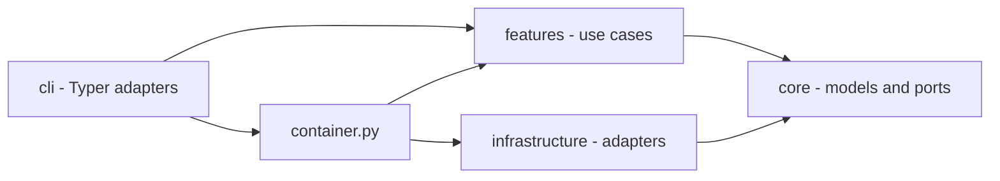

## Overview

dadaia-workspace is a Python package and local workspace runtime organized around Spec
Context Projects. The code uses three rings plus a composition root:

- `cli/` parses operator input, renders output, and delegates.
- `features/` owns product behavior by domain.
- `core/` owns pure models, protocols, constants, and classifiers.
- `infrastructure/` owns filesystem, Git, subprocess, JSON, and platform adapters.
- `container.py` is the only general composition root.

Import-linter and AST contract tests enforce the intended direction and cap deliberate
legacy exceptions. New feature code depends on ports, not concrete adapters.

**The workspace ships no agent-execution runtime.** It provides context, law,
deterministic boundaries, evidence validation, and diagnostics; the agents themselves
are driven by their harnesses against the SDD documents. A mechanism exists here only
while a demand requires it.

## Primary Subsystems

### Context and SDD

`features/spec_context/` owns ALIVE/DEAD lifecycle, binding, caller-owned session
identity, advisory presence, path classification, and workspace doctor checks. There is
no lease or locking module. `hooks/pre_gate.py` composes root whitelist, venv guard, and
the SDD path/phase/mode gate. `hooks/sdd_post_gate.py` refreshes advisory presence and
runs the nonblocking reconciler. `hooks/ctx_inject.py` emits the once-per-session
context bootstrap, re-armed when this session's own bind record is newer than its
injection sentinel.

#### The resolution seam

`core/specs_resolver.resolve_context()` is the single authority that resolves a Spec
Context NAME, and the `DADAIA.md` §3 rung law is its docstring ([[context-management]]).
There is one such function in the package: the CLI seam, `container`, the SDD gate and
ctx-inject all consume it, each supplying its own caller input — the gate passes the
write target so attribution stays path-first. Session-record reading inside `core` is a
documented §6 duplicate of `features/spec_context/session_identity`, because `core` may
not import `features`.

The import-linter contract `bind-resolution-seam-is-a-single-home` names exactly three
sanctioned direct importers — `cli._specs_resolution`, `container`, and `hooks` — and
takes zero ignored imports; a verb reaching the authority directly is a contract break.
Hooks are direct importers by law rather than by exception: they are one-shot processes
on the write hot path, and routing them through the composition root costs seconds of
import graph per gated tool call, so **no hook imports `container`**. An attesting
import-surface test pins that fact.

Exit codes tell the truth: `dadaia doctor` (and `reports validate`) exit non-zero
whenever issues remain — a green exit is proof, never a formality. Tool-initiated
commits (`alive` scaffold, `dead` sync) fall back to an injected
`dadaia-workspace <dadaia@workspace.local>` git identity when the environment has
none (`infrastructure/git_subprocess.py`), so containers and CI never die on it.

Git chokepoints are installed from:

- `public/scripts/pre-commit-presence-gate.sh` - concurrency warning only;
- `public/scripts/pre-push-ci-gate.sh` - CI preflight, branch policy, range-scoped
  denylist scan, and develop-diff security verdict.

`features/chokepoints/` is pure decision logic: it imports no `infrastructure` module and
spawns no subprocess. The I/O its gates need arrives as core ports the CLI injects at the
call site — `ProcessAncestry` for the pre-commit ancestry probe, and `GitObjectReader`
(adapter `infrastructure/git_objects.GitSubprocessObjectReader`, built at the composition
root) for listing the new objects of a pushed range ([[sdd-gate-v3]]). The object source
is a required parameter of the push decision function, so an unwired production call site
is a type error rather than a silently skipped gate; import-linter contracts pin the ring
purity.

`GitObjectReader`'s contract covers both sides of a scanned path: each object carries its
own new content **and** the prior published text of the same path at the range's base, or
an explicit absence when there is no resolvable base, no such path, or the prior blob is
over the cap or undecodable. Absence is a distinct value, never an empty string, so the
decision layer cannot mistake "nothing was published" for "nothing matched". Widening the
port rather than giving the matcher a second input source is what keeps the decision
function pure: it still takes only objects and term sources. The protocol module itself
stays data-only and zero-I/O; the adapter owns every subprocess, chunks its batched
conversation to a constant resident bound, and converts every parse failure into its own
typed read error so nothing raw escapes the ring.

`core/redaction.py` is the single stdlib-pure masking primitive — word-boundary
alternation, longest-first ordering, stable first-appearance placeholder ordinals — with
two consumers on opposite sides of the tree: `cli/redact.py`'s operator `--redact` surface
and the gate's own render boundary in `features/chokepoints/`. It lives in `core` because
`features` may import `core` and may never import `cli`, so a shared primitive is the only
placement that lets both render boundaries mask identically. It performs no I/O and is
outside the file-I/O authorized set below.

### Handoffs and reports

`features/reports/` validates, discovers, and retains handoff-first communication.
Cross-agent handoffs live under `.dadaia/handoff/<context>/`; HTML reports are optional
and live under `.dadaia/reports/<context>/<agent>/`. Handoff validation is stdlib-only
behind `ValidatorPort`.

### Panel

`features/panel/` serves a loopback-only stdlib HTTP UI. Route/view modules are split by
domain. The panel has six governance tabs — Projects, Agents, Agentic Entities,
Reports, Academy, Servers. Layer-1 model policy is the panel's only governance
editor; the Agentic Entities tab and the Agents tab's Persona cards are
server-rendered from the abstract-entity registry.

### Public assets

Canonical harness assets live in `dadaia_workspace/public/`. `public stage` copies
versioned source into `.dadaia/agentic/`; `public install` resolves its arguments once
into an immutable install plan and runs an ordered list of flag-free steps that project
runtime-specific assets to `.claude/`, `.codex/`, `.kimi-code/`, and shared
`.agents/`; `public doctor` compares source, staging, projection, privacy, and
policy-aware rendering.

Generated projection files are never edited in place. The projected law files
(`DADAIA.md` and library-originated `AGENTS.md`) are PROTECTED and human-only in an
instantiated workspace. The source repository itself must not contain generated
workspace projection roots.

The projection chain is a derivation, not an origin: every core sub-agent, hook, and
rule file the installer projects implements an abstract, harness-agnostic entity —
Persona, Deterministic Behavior, or Abstract Rule — declared in
`public/entities/registry.json`; skills and `AGENTS.md` are universal, read natively
by every entry harness. Underived core surface is forbidden (constitution §12.5,
[[agentic-entities]]), enforced by the derivation contract test and the
`entities-derivation` doctor check.

### Specs and memory

`features/specs/` owns structural validators and memory catalog generation. Markdown
atoms are the memory source; `catalog.json` and `product/index.md` are generated from
frontmatter. Memory is current truth and is writable only by product-engineer during
DEFINITION or CLOSURE. The retired `agent_tier` field is rejected by the frontmatter
schema; all nine current fields are required and unknown fields are invalid.

### Other feature domains

Backlog and bugs own intake consistency and event-sourced bug state. Certification runs
the deterministic capability checks behind `dadaia certify`. Capabilities publishes the
`dadaia-capabilities-v2` payload. Telemetry owns allowlisted local metadata and its
separate refresh serialization primitive. Server registry owns collision-free dev-port
allocation. Repos, academy, import/export, migration, workspace initialization,
and cleanup remain bounded feature packages.

## Concurrency

Workspace concurrency never blocks on another session. Mutating file-tool calls record
best-effort presence; a peer record produces an advisory warning. The caller's own READ
mode is self-protection. Ordinary filesystem and Git conflicts surface races.

This no-lock rule concerns agent/workspace coordination. Narrow implementation details
that serialize a single telemetry refresh or database write are internal adapter
primitives; they must have bounded failure behavior and cannot freeze Spec Context work.

## Runtime State

Canonical workspace state is rooted at `.dadaia/`. The binding whitelist is
`_DADAIA_ALLOWED_SUBDIRS` in `features/spec_context/doctor.py` (ROOT-4 flags anything
else); this table mirrors it:

| Path | Owner |
|---|---|
| `states/spec_contexts.json` | context registry |
| `sessions/` | caller-owned bind records (protected) |
| `states/presence/` | advisory live-session records |
| `states/server_registry.json` | development server registry |
| `states/agent_model_policy.json` | Layer-1 agent model governance overlay |
| `states/root_exceptions.txt` | operator-approved root-whitelist exceptions |
| `states/import-manifest.json` | provenance of the last `dadaia import` |
| `handoff/` | machine-readable agent handoffs |
| `reports/` | optional human-readable reports |
| `tmp/` | bounded ephemeral files (incl. `tmp/legacy-quarantine/`) |
| `agentic/` | staged public assets and manifest |
| `hooks/` | projected harness hook wrappers |
| `scripts/` | projected governance/gate scripts |
| `mcps/` | MCP server working dirs |
| `runtime/` | projected runtime assets |
| `academy/` | academy working data |
| `logs/` | hook/reconciler diagnostics |
| `dev-report/`, `dist/` | dev artifacts and built wheels |
| `.venv/`, `.cache/` | workspace Python runtime and tool caches |

Legacy `states/ctx_locks/` and `sessions/runtime/` are invalid retired state. Doctor
removes them with `--fix`. `states/bind_epoch/` is orphan state in a workspace upgraded
from an older release; the named `remove_legacy_bind_epoch_state` install migration
sweeps it and is retained for one release. Known-legacy `.dadaia/` subdirs (`bugs`, `src`, `locks`,
`figma-bridge`, `imgs`, `references`) are quarantined — never deleted — by the
reconcile `legacy-dir-quarantine` step (`features/migrate/legacy_dadaia_dirs.py`) into
`tmp/legacy-quarantine/run-<id>/` with a manifest. `dadaia import` relocates the
archive's `export-manifest.json` to `states/import-manifest.json` so an imported
workspace passes its own doctor.

No repo may contain `.dadaia/`, a virtualenv, cache directories, test-results,
Playwright reports, or coverage artifacts.

## Core file-I/O authorized set

`core/` is stdlib-pure; file I/O is allowed only in the ratchet-authorized set:
`specs_backup` (consumer-tree migration), `specs_version` (pattern-version stamp),
`specs_resolver` and `workspace_resolver` (tree walks), and `specs_repair` (removal of
unfilled placeholder atoms from old-scaffold trees; the single home both repair
surfaces, `features.specs` and `features.migrate`, may import without a forbidden
sibling edge).

## Agent Surface

Nine core agent roles with two dispatchers run inside the entry harness. Their bodies are
canonical Markdown under `public/agents/`, rendered at install with the resolved
model/effort policy and projected per harness. The ordered release ritual is owned by the
SDD documents — `ACTIVE.md`, SPEC, PLAN, TASKS, CLOSURE — and by the agents that write
them. Hooks enforce mechanical file/Git boundaries only.

## Dependencies

[[spec-context-project]], [[context-management]], [[sdd-gate-v3]],
[[agent-orchestration]], [[panel]], [[public-asset-distribution]], [[tech-stack]].
