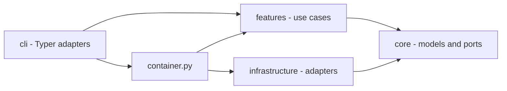

## Overview

dadaia-workspace is a Python package and local workspace runtime organized around Spec
Context Projects. The code uses three rings plus a composition root:

- `cli/` parses operator input, renders output, and delegates.
- `features/` owns product behavior by domain.
- `core/` owns pure models, protocols, constants, and classifiers.
- `infrastructure/` owns filesystem, Git, subprocess, JSON, runtime, and platform adapters.
- `container.py` is the only general composition root.

Import-linter and AST contract tests enforce the intended direction and cap deliberate
legacy exceptions. New feature code depends on ports, not concrete adapters.

## Primary Subsystems

### Context and SDD

`features/spec_context/` owns ALIVE/DEAD lifecycle, binding, caller-owned session
identity, advisory presence, path classification, and workspace doctor checks. There is
no lease or locking module. `hooks/pre_gate.py` composes root whitelist, venv guard, and
the SDD path/phase/mode gate. `hooks/sdd_post_gate.py` refreshes advisory presence and
runs the nonblocking reconciler.

Exit codes tell the truth: `dadaia doctor` (and `reports validate`) exit non-zero
whenever issues remain — a green exit is proof, never a formality. Tool-initiated
commits (`alive` scaffold, `dead` sync) fall back to an injected
`dadaia-workspace <dadaia@workspace.local>` git identity when the environment has
none (`infrastructure/git_subprocess.py`), so containers and CI never die on it.

Git chokepoints are installed from:

- `public/scripts/pre-commit-presence-gate.sh` - concurrency warning only;
- `public/scripts/pre-push-ci-gate.sh` - CI and exact-commit security verdict.

### Lifecycle

`features/lifecycle/` owns exactly four executable workflows, prompt assembly, persona
loading, model profiles/policy, worker invocation, semantic gates, immutable attempt
payloads, dependency resolution, diagnostics, and retention. The presentation catalog
is assembled in `features/lifecycle/governed_catalog.py` and exposed through
`features/workflows/dadaia_catalog.py`; `features/workflows/dag.py` renders offline SVG
diagrams.

The supported Layer-2 real runtimes are Codex and PI behind `AgentRuntimePort`. Claude
Code and Kimi Code are Layer-1-only. `fake` is the deterministic test adapter.

### Handoffs and reports

`features/reports/` validates, discovers, and retains handoff-first communication.
Workflow-internal payloads live in run state; cross-agent handoffs live under
`.dadaia/handoff/<context>/`. HTML reports are optional and live under
`.dadaia/reports/<context>/<agent>/`.

### Panel

`features/panel/` serves a loopback-only stdlib HTTP UI. Route/view modules are split by
domain. The panel has seven tabs: Projects, 1st Agentic Layer, 2nd Agentic Layer,
Reports, Academy, Servers, and Games. Workflow diagrams are server-rendered; policy and
game interactions are local JavaScript.

### Public assets

Canonical harness assets live in `dadaia_workspace/public/`. `public stage` copies
versioned source into `.dadaia/agentic/`; `public install` projects runtime-specific
assets to `.claude/`, `.codex/`, `.pi/`, `.kimi-code/`, and shared `.agents/`; `public doctor` compares
source, staging, projection, privacy, and policy-aware rendering.

Generated projection files are never edited in place. The source repository itself
must not contain generated workspace projection roots.

### Specs and memory

`features/specs/` owns structural validators and memory catalog generation. Markdown
atoms are the memory source; `catalog.json` and `product/index.md` are generated from
frontmatter. Memory is current truth and is writable only by product-engineer during
DEFINITION or CLOSURE. The retired `agent_tier` field is rejected by the frontmatter
schema; all nine current fields are required and unknown fields are invalid.

### Other feature domains

Backlog and bugs own intake consistency and event-sourced bug state. Telemetry owns
allowlisted local metadata and its separate refresh serialization primitive. Server
registry owns collision-free dev-port allocation. Repos, plugins, academy, import/export,
migration, workspace initialization, and cleanup remain bounded feature packages.

## Concurrency

Workspace concurrency never blocks on another session. Mutating file-tool calls record
best-effort presence; a peer record produces an advisory warning. The caller's own READ
mode is self-protection. Ordinary filesystem and Git conflicts surface races.

This no-lock rule concerns agent/workspace coordination. Narrow implementation details
that serialize a single telemetry refresh or database write are internal adapter
primitives; they must have bounded failure behavior and cannot freeze Spec Context work.

## Runtime State

Canonical workspace state is rooted at `.dadaia/`. The binding whitelist is
`_DADAIA_ALLOWED_SUBDIRS` in `features/spec_context/doctor.py` (ROOT-4 flags anything
else); this table mirrors it:

| Path | Owner |
|---|---|
| `states/spec_contexts.json` | context registry |
| `sessions/` | caller-owned bind records (protected) |
| `states/bind_epoch/` | context injection markers |
| `states/presence/` | advisory live-session records |
| `states/server_registry.json` | development server registry |
| `states/*model*policy*.json` | Layer-1/Layer-2 governance overlays |
| `states/root_exceptions.txt` | operator-approved root-whitelist exceptions |
| `states/import-manifest.json` | provenance of the last `dadaia import` |
| `runs/lifecycle/` | workflow run state (durable step payloads live in the Spec Context: `specs/releases/<id>/handoffs/`, backlog runs in `specs/backlog/handoffs/`) |
| `handoff/` | machine-readable agent handoffs |
| `reports/` | optional human-readable reports |
| `tmp/` | bounded ephemeral files (incl. `tmp/legacy-quarantine/`) |
| `agentic/` | staged public assets and manifest |
| `hooks/` | projected harness hook wrappers |
| `scripts/` | projected governance/gate scripts |
| `mcps/` | MCP server working dirs |
| `runtime/` | projected runtime assets |
| `academy/` | academy working data |
| `logs/` | hook/reconciler diagnostics |
| `dev-report/`, `dist/` | dev artifacts and built wheels |
| `.venv/`, `.cache/` | workspace Python runtime and tool caches |

Legacy `states/ctx_locks/` and `sessions/runtime/` are invalid retired state. Doctor
removes them with `--fix`. Known-legacy `.dadaia/` subdirs (`bugs`, `src`, `locks`,
`figma-bridge`, `imgs`, `references`) are quarantined — never deleted — by the
reconcile `legacy-dir-quarantine` step (`features/migrate/legacy_dadaia_dirs.py`) into
`tmp/legacy-quarantine/run-<id>/` with a manifest. `dadaia import` relocates the
archive's `export-manifest.json` to `states/import-manifest.json` so an imported
workspace passes its own doctor.

No repo may contain `.dadaia/`, a virtualenv, cache directories, test-results,
Playwright reports, or coverage artifacts.

## Agentic Layers

Layer 1 is the interactive agent surface: nine core roles with two dispatchers. Layer 2
is a bounded Codex/PI workflow worker governed by one of eight non-PM personas. Personas
carry role behavior only; workflow policy carries harness/model/effort.

The four workflow bodies, not AGENTS prose or hooks, own the ordered release ritual.
Hooks enforce mechanical file/Git boundaries only.

## Dependencies

[[spec-context-project]], [[context-management]], [[sdd-gate-v3]],
[[dadaia-workflows]], [[lifecycle-foundation]], [[agent-orchestration]], [[panel]],
[[public-asset-distribution]], [[tech-stack]].
