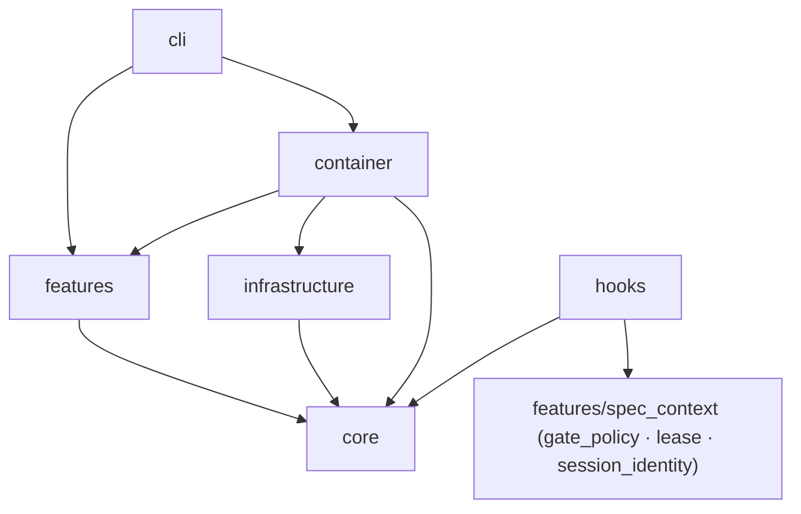
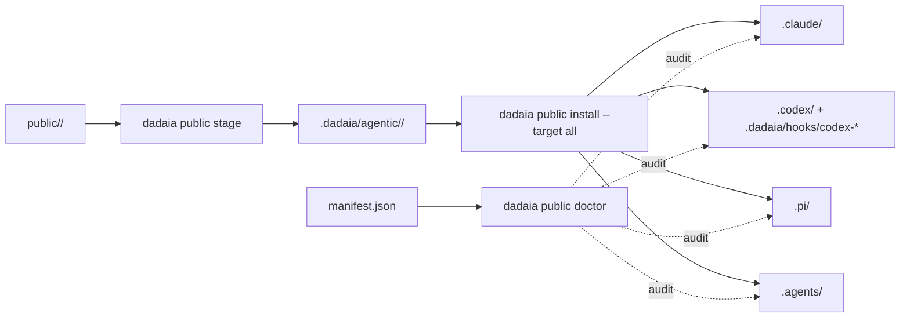

## Visão geral

Arquitetura em três anéis: (1) CLI thin em `dadaia_workspace/cli/`; (2) features isoladas em `dadaia_workspace/features/<name>/` cada uma com seu service/doctor/etc; (3) infrastructure em `dadaia_workspace/infrastructure/` (Git, JSON stores, public asset projection). Núcleo em `dadaia_workspace/core/` mantém models, protocols e exceptions. Dependency injection via `dadaia_workspace/container.py`.

Asset chain canonical → projeções: a fonte de cada asset público vive em `dadaia_workspace/public/<type>/`; staging em `.dadaia/agentic/<type>/` (snapshots imutáveis com manifest.json); instalação espalha por `.claude/`, `.codex/`, `.pi/`, `.agents/` seguindo regras por tool (`_VALID_TARGETS` = `{agents, claude, codex, pi}` + `all`). O roster de harness/runtime é single-sourced em [[tech-stack]] §Agent runtimes. A fonte de prompt-fragments do lifecycle vive em `dadaia_workspace/public/lifecycle_fragments/`; personas em `public/personas/`.

## O Spec Context Project (conceito central)

Um **Spec Context Project** é uma canonical specs folder bound to one repository — session-bindable; o binding dispara a cadeia **bind → inject → enforce → parallel-multi-project** que permite a um generic agent fleet construir projetos reais com segurança. Constitution §0 e [[spec-context-project]] são as fontes; este atom não duplica a definição.

## Camadas

**cli/** — typer app + 23 subcommands: `init`, `export`, `import`, `clean`, `context`, `lock`, `lifecycle`, `ci`, `repos`, `public`, `doctor`, `academy`, `orchestrate`, `reports`, `specs`, `server`, `migrate`, `panel`, `memory`, `release`, `backlog`, `bug`, `bugs` (os dois últimos coexistem: `bug new` é o scaffolder legado de Markdown; `bugs append|status|stats` é o event store JSONL — [[sdd-bug-backlog-governance]]). Thin wrapper sobre features; sem business logic.

**features/** — cada feature é uma pasta com `service.py` + opcionalmente `doctor.py`, `resolver.py`, `runner.py`. Features atuais (26):

- `academy` — knowledge basis navegável (panel tab + CLI).
- `agents` — canonical agent reader sobre `MarkdownAgentStore`.
- `ai_surface` — doctor da superfície AI dehydratada (guarda contra lifecycle-ritual creep).
- `backlog` — backlog-consistency engine: registry de subjects auto-derivado, classifier fail-closed, `backlog doctor` BL-*, ledger `consumed_backlog` + removal-on-release. Detalhe em [[sdd-bug-backlog-governance]].
- `bugs` — event-sourced bug telemetry: `BugService` folda streams JSONL append-only em estado por `bug_id` + stats. Detalhe em [[sdd-bug-backlog-governance]].
- `chokepoints` — backends dos git-hook gates harness-independentes (pre-commit lease gate; consumidos via `dadaia ci`). Detalhe em [[sdd-gate-v3]].
- `ci_preflight` — o preflight local de CI (ruff/mypy/pytest) do pre-push hook.
- `export` / `import_` — portabilidade do workspace ([[workspace-portability]]).
- `lifecycle` — o multi-harness procedural lifecycle engine: state machine, gates semânticos, hygiene/anti-slop, prompt builder + fragments + personas, workflow bodies, run store, policy resolver, workflow-step handoff data plane. Detalhe em [[lifecycle-foundation]] e [[dadaia-workflows]].
- `migrate` — migrações v1→v2 e tree-v2.
- `orchestration` — read-only reference (`list`/`show`); `run`/`status`/`resume` são stubs inertes de compat (dispatch retirado; execução migrou para `dadaia lifecycle`).
- `panel` — superfície de controle HTTP local ([[panel]]).
- `public` — resolução de modelo e services do asset chain ([[public-asset-distribution]]).
- `reports_next` / `reports_retention` / `reports_validation` — descoberta do próximo handoff esperado; retention de reports; validação stdlib-only de handoff JSON ([[agent-comms]]).
- `repos` — catálogo de repos conhecidos.
- `server_registry` — registry de portas de dev servers ([[server-registry]]).
- `spec_artifacts` — scaffolders de artefatos SDD (`release|backlog|bug new`, `memory product add`).
- `spec_context` — contexts ALIVE/DEAD, `lease.py` (contrato de locking central), `gate_policy.py` (classifier do gate), `session_identity.py` (single owner de pointers/session records), doctor de workspace ([[context-management]], [[workspace-doctor]]).
- `specs` — specs doctor + catalog generation ([[specs-doctor]]).
- `telemetry` — telemetria local de sessões dos entry harnesses com `RuntimeAdapter` registry `{claude, codex, pi}` (runtime roster single-source: [[tech-stack]]) ([[agent-monitoring]]).
- `workflows` — `WorkflowsService` (workflow docs reference-only) + `dadaia_catalog.py` (o catálogo governado dos dadaia-workflows) + `dag.py` (SVG renderer server-side).
- `workspace` — init/bootstrap ([[workspace-init]]).
- `workspace_clean` — `dadaia clean`: reclaim TTL-based das zonas efêmeras de `.dadaia/` (dry-run default; nunca fora de `.dadaia/`).

**Panel HTTP (resumo).** `handler.py` declara a route table com classes de rota; TODAS as rotas são servidas **sem credencial** — os guards são o bind loopback (`127.0.0.1` hard-coded) e o Host-header allowlist (`127.0.0.1`/`localhost`/`[::1]`, anti-DNS-rebinding, respondendo 403 a Host estrangeiro). Mutações (`PUT`/`POST`/`DELETE`) passam pelos mesmos guards (Host-guard primeiro) + validação de payload antes de qualquer write atômico. O endpoint `GET /api/kanban` e a view `views/kanban.py` **continuam servidos** (read-only sobre `.dadaia/sessions/*.json`), mas têm **zero consumidores de UI** desde a remoção da aba Agentic; o destino do endpoint é tracked no backlog `panel-runtime-reliability`. `window.Panel` (`core.js`) registra os módulos `sessions`, `academy` e `reports`; a aba Workflows é server-rendered (SVG via `render_dag_svg`) com `window.WorkflowPolicy` (`workflow_policy.js`) para os model pickers — não existe `workflows.js` nem `panel.js`. Detalhe completo em [[panel]].

**core/** — `models/` (dataclasses puras), `protocols/` (Protocols para DI), `exceptions.py`, `platform.py` (único site autorizado de `sys.platform`), `kernel_tunables.py` (single home das constantes do kernel; leaf), `scope_match.py` (classifier puro compartilhado Ring-1/Ring-2), `lock_liveness.py`, `model_registry.py`, `harness_models.py`. A regra é zero I/O — as **exceções autorizadas atuais** (I/O ou walk de filesystem dentro de `core/`), pendentes do backlog `import-boundary-enforcement`, são: `core/specs_backup.py`, `core/specs_version.py`, `core/specs_resolver.py` (resolução env → bind persistido de sessão viva/atribuível → cwd) e `core/workspace_resolver.py`.

**infrastructure/** — implementações concretas dos protocols: `git_subprocess` (inclui `diff_name_only` — fonte do Ring-2 `changed_paths`), `json_*_store`, `public_assets`, `markdown_workflow_store`, `markdown_agent_store`, `headless_adapter_base` (invariantes security-relevant compartilhados pelos adapters headless: redaction, env-allowlist filter, Ring-2 git-diff override, extração de payload strict-schema-first), os agent-runtime adapters por trás de `AgentRuntimePort` (`codex_runtime`, `claude_sdk_runtime` com Ring-1 via `core/scope_match`, `pi_runtime`), `runtime_config` (hook registration por runtime — comandos Python para `.claude/settings.json`; **wrappers executáveis self-locating** `.dadaia/hooks/codex-*` para `.codex/hooks.json`), `subprocess_runner` (`ProcessRunner` de produção), `excel_reader`, `python_env`, e os adapters de plataforma (`file_lock_*`, `telemetry_lock_*`, `file_permission_*`, `process_probe_adapter`, `signal_shutdown_*`). Toda I/O de adapter fica aqui.

**container.py** — sole composition root. Lê `PLATFORM`, seleciona adapters (POSIX vs Windows) e injeta via `build_*_service(workspace_root)` factories.

**hooks/** — `dadaia_workspace/hooks/` Python package (8 módulos: `__init__`, `_common`, `pre_gate`, `sdd_gate`, `root_whitelist`, `venv_guard`, `ctx_inject`, `sdd_post_gate`) — a única implementação dos hooks de governança de harness. O PreToolUse roda por UM entrypoint merged (`pre_gate`): root-whitelist (classificação por **primeiro componente de path** — um write aninhado sob um novo top-level não-whitelisted também bloqueia) → venv-guard (Bash apenas) → SDD gate, first-block-wins. Mecânica completa em [[sdd-gate-v3]]. Shell assets: exclusivamente os git chokepoints (`pre-commit-lease-gate.sh`, `pre-push-ci-gate.sh`), instalados por `dadaia ci install-hook`.

**public/** — assets canônicos versionados: `agents/`, `skills/`, `rules/`, `workflows/`, `scripts/`, `schemas/`, `templates/`, `data/`, `scaffold/`, `runtime/`, `personas/`, `lifecycle_fragments/`, `pi/`. `public_assets.py` stage/install/doctor. A função `_install_workspace_guardrail_pair` faz fan-out byte-identical de `data/AGENTS.md` para o par `AGENTS.md` + `CLAUDE.md` no workspace-root e em cada consumer-repo.

## Topologia de agentes (9 core + 3 plugins)

A topologia pública default é definida na constitution §14. Dois papéis de dispatcher; todos os demais são workers.

**Dispatchers (2):** `project-manager` (coordinator do lifecycle; holds + coordinates + releases the release lease) e `project-auditor` (audit fan-out; ADDITIVE, sem lease).

**Curator:** `product-engineer` — SPEC/PLAN/TASKS/CLOSURE + `specs/memory/**`; PM sub-agent.

**Workers leaf (6):** `software-engineer` (código + testes; PM sub-agent), `qa-engineer` (→ commit gate), `security-reviewer` (→ push gate), `code-reviewer` (→ PR gate), `ai-engineer` (superfície `public/**`; short lease próprio fora de release spans), `software-architect` (ADDITIVE; feeds fases 4/5).

**Plugins:** `frontend-engineer`, `design-specialist` (frontend-design); `devops-engineer` (devops) — stubs sem comportamento.

**Dispatcher purity (§9):** apenas PM e project-auditor despacham sub-agentes; worker→worker dispatch é impossibilidade estrutural. **Sub-agent model:** PE e SE rodam sob o single lease do PM — o lease nunca muda de mãos.

## Modelo de concorrência e lease

Constitution §8 define os invariantes; a MECÂNICA (lease record/CAS/pid-veto, cadeia de modo, session identity, heartbeat, chokepoints) é owned por [[sdd-gate-v3]] (gate + chokepoints) e [[context-management]] (bind/lease/session lifecycle) — este atom mantém só o mapa de classes e as fronteiras.

**Classificação context-relative:** o path-classifier (`features/spec_context/gate_policy.classify_path`) computa a classe sobre o caminho relativo ao contexto — a mesma taxonomia `specs/` no workspace-root e in-repo; ordem de avaliação e mecânica em [[sdd-gate-v3]].

| Classe | Paths (root e in-repo, salvo nota) | Decisão |
|--------|------------------------------------|---------|
| PROTECTED | `.dadaia/sessions/**` (root) | Block sempre — único caminho fail-closed |
| FROZEN | `specs/_archive/**` **e** `specs/{backlog,audits,bugs}/_archive/` (avaliados antes de ADDITIVE) | Block sempre (file tools; moves de archive rodam via `git mv`) |
| ADDITIVE | `specs/backlog/**`, `specs/bugs/**`, `specs/audits/**`; `.dadaia/reports\|handoff\|tmp/**` (root) | Allow — zero lease I/O |
| MEMORY | `specs/memory/**` | Allow só em fase DEFINITION/CLOSURE |
| MUTATING | `specs/releases/**`, production tree, todo in-repo path sem classe | READ-mode ⇒ block non-acquiring; senão acquire do TTL-lease ([[sdd-gate-v3]]) |
| UNGATED | demais paths workspace-root | Allow |

Exatamente um MUTATING lease por contexto; ADDITIVE nunca toca o lease. Os desfechos commit/push são gated pelos **chokepoints git**, que rodam sem hook de harness (mecânica e postura: [[sdd-gate-v3]]). O gate NÃO lê TASKS.md, `Aprovado`, markers ou write-allowlists — disciplina, não mecanismo.

## Os 3 canais de reporte/comunicação (constitution §11)

1. **User reports** — HTML em `.dadaia/reports/<context>/<agent>/`; surfaced no panel.
2. **Agent↔agent** — JSON handoffs em `.dadaia/handoff/<context>/` apenas.
3. **Audit results** — Markdown committado em `specs/audits/<ts>-<sid8>/` (archive: `specs/audits/_archive/`).

Nenhum `specs/releases/<id>/evidence/` subtree existe. Constitution §12: nenhum fato em duas fontes.

## Regras de dependência

**Proibido:** core não importa de features/infrastructure/cli; features não importam de cli; features não importam outras features (composição via container); features não importam `infrastructure/` diretamente — dependência OS-sensível é injetada via Protocol.

**Exceção declarada — hooks:** o pacote `hooks/` importa `core` **e** `features/spec_context` (gate_policy/lease/session_identity), mais um import lazy do probe de `infrastructure/process_probe_adapter` dentro de `sdd_gate` — o hook é o injetor do pid-probe porque roda fora do container.

**Layering invariant:**
- `core/` — zero I/O e zero OS-primitives, com as exceções autorizadas nomeadas em "Camadas → core/" (`specs_backup`, `specs_version`, `specs_resolver`, `workspace_resolver`; `platform.py` para `sys.platform`), pendentes do backlog `import-boundary-enforcement`.
- `infrastructure/` — todos os adapters OS (`fcntl`, `os.kill`, `subprocess`, `/proc`, `msvcrt`) atrás de Protocols.
- `features/` — business logic; capability OS via Protocol injetado.

**Enforcement (estado real):**
- `import-linter` (`setup.cfg`): contratos `features → infrastructure` ban, `features → subprocess` ban e `core → OS-primitives` ban estão **DEFINIDOS mas NÃO rodam em CI** — nenhum job invoca `lint-imports` e 5 chains estão vermelhas. Wiring + fix é o backlog `import-boundary-enforcement`. O cap de `ignore_imports` (17 edges) é pinado por `tests/contract/test_import_linter_ignore_cap.py`.
- `dadaia doctor` grep check: falha com `[ERROR]` em `import fcntl` / `os.chmod` / `os.kill` / `os.open` em `features/**/*.py`.

## Fluxo de dados — pipeline asset chain

O fluxo do gate SDD (PreToolUse → classificação → lease → PostToolUse heartbeat → chokepoints) é diagramado e detalhado em [[sdd-gate-v3]].

## Contratos entre módulos

De| Para| Tipo de contrato| Notas
---|---|---|---
cli/commands/*| container.build_*_service| Factory call| Cada command resolve workspace_root e chama factory
features/*| core/protocols/*| Protocol / ABC| Injetado via constructor
features/specs/doctor| specs/ filesystem| Path-based, read-only| Recebe specs_dir absoluto; inventário de checks em [[specs-doctor]]
infrastructure/public_assets| public/ ↔ .dadaia/agentic/ ↔ projeções| Manifest + file copy| manifest.json é o cache do que foi propagado
PreToolUse hook| `hooks.pre_gate` → `gate_policy.py` + `lease.py`| JSON stdin (lido uma vez) / stdout| First-block-wins; fail-open exceto PROTECTED; mecânica em [[sdd-gate-v3]]
PostToolUse hook| `hooks.sdd_post_gate` + `lease.py`| JSON stdin (sid harness-native)| Heartbeat via by-session index + reconciler advisory; fail-open exit 0
git chokepoints| `pre-commit-lease-gate.sh` / `pre-push-ci-gate.sh` → `dadaia ci pre-commit-check` / `ci preflight` + `ci push-gate-check`| git hook (stdin ref lines no pre-push)| Zero-false-block; security verdict por sha; independem de hooks de harness
features/spec_context/lease.py| `.dadaia/states/ctx_locks/*`| Single-record JSON TTL-lease; O_EXCL CAS| TTL piso + PID veto ([[context-management]])
features/spec_context/session_identity.py| `.dadaia/sessions/**` + `bind_epoch/`| Single-owner module| Único reader/writer de pointers, session records e bind-epoch markers
hooks/* + spec_context + ci backends| `core/kernel_tunables.py`| Leaf de constantes| Single home dos tunables do kernel
features/telemetry/aggregator| `runtimes.py` RuntimeAdapter registry| Protocol + registry| Enrichment per row + liveness per runtime (set stated once in Camadas → `telemetry`)

## Estado runtime

Locais canônicos de estado em disco:

  * `.dadaia/states/spec_contexts.json` — Spec Context Projects (`schema_version: "2"`; ALIVE/DEAD).
  * `.dadaia/states/.ws_lock` — fcntl workspace lock (Lock 1 — mutações em `spec_contexts.json`).
  * `.dadaia/states/ctx_locks/<slug>.lock` — fcntl per-context lock (Lock 2 — clone/rmtree).
  * `.dadaia/states/ctx_locks/<ctx>.lock.json` — single-record JSON TTL-lease (`{context, release, session_id, mode, pid, acquired_at, heartbeat, ttl}`).
  * `.dadaia/states/ctx_locks/<ctx>.lock.sentinel` — CAS sentinel (transient).
  * `.dadaia/states/ctx_locks/by-session/<sid>.json` — by-session heartbeat index (mesma transação CAS do lock record).
  * `.dadaia/states/bind_epoch/<ctx>` — bind-epoch marker escrito por `dadaia context bind`; o CONTEÚDO é the bind process's ancestry pid chain (one decimal pid per line, nearest-first, capped at 8) — o hook ctx-inject só honra marker cuja chain CONTÉM o seu próprio harness pid (membership; ver [[context-management]]).
  * `.dadaia/sessions/runtime/<ctx>.ptr` — stable-session-identity pointer (lease incumbent).
  * `.dadaia/sessions/runtime/<session_id>.ptr` — pointer de sessão do ctx-inject.
  * `.dadaia/sessions/<id>.json` — session record CLI-owned (`context`, `mode`, `release`, `pid`, `last_seen_at`); lido pelo gate (modo).
  * `.dadaia/hooks/codex-*` — wrappers executáveis self-locating dos hooks Codex (gerados por `runtime_config`; referenciados por `.codex/hooks.json`).
  * `.dadaia/logs/lock-events.jsonl` — audit log append-only (acquire, release, steal, HEARTBEAT, RECONCILER_FLAG).
  * `.dadaia/logs/hook-latency.jsonl` — telemetria de latência de hook (best-effort, fail-open).
  * `.dadaia/agentic/<type>/` + `manifest.json` — staging de assets + registro do propagado.
  * `.dadaia/reports/<context>/<agent>/*.html` · `.dadaia/handoff/<context>/*.handoff.json` — canais 1 e 2.
  * `.dadaia/states/report_retention.json` — important-mark set do retention de reports.
  * `.dadaia/states/root_exceptions.txt` — exceções documentadas ao root whitelist.
  * `.dadaia/states/workflow_model_policy.json` (+ `.last-good.json`) — overlay validado de política de modelo/harness por step; escrito atomicamente via panel/CLI; ausente ⇒ library defaults; inválido ⇒ bloqueia execução com last-good intacto.
  * `.dadaia/states/workflow_model_profiles.local.json` — perfis de modelo operador-locais (merged com built-ins; valida `harness=pi`; nunca projetado).
  * `.dadaia/states/backlog_subject_aliases.txt` — alias map do backlog (operador; binding de `panel`/`api`).
  * `.dadaia/states/lifecycle/<run_id>.json` — lifecycle run records (control plane).
  * `.dadaia/runs/lifecycle/<run_id>/steps/*.step-payload.json` — data plane de workflow-step handoff (payloads imutáveis; retention TTL-based).
  * `specs/releases/ACTIVE.md` — release ativa + phase.
  * `specs/audits/<ts>-<sid8>/` — canal 3 (auditor).
  * `specs/bugs/<YYYYMMDDTHH>Z-<n>.jsonl` — event store de bugs (git-tracked; [[sdd-bug-backlog-governance]]).
  * `specs/memory/*.md` + `specs/memory/product/catalog.json` — memory atômica + índice gerado.
  * `specs/_archive/releases/<id>/` — releases arquivadas; `specs/_archive/<release-id>/consumed_backlog.json` + `consumed-backlog/<slug>.md` — ledger e cópias duráveis do removal-on-release.

O mutex MUTATING é exclusivamente o single-record TTL-lease acima — nenhum outro lock/semaphore store legado existe nem deve ser recriado.

## Memory injection subsystem

Garante que agentes não iniciam trabalho sem contexto de produto. Opera nos runtimes de entrada Claude Code e Codex (hook `ctx_inject`); PI lê a law nativamente up-tree (sem hook de injeção de Layer 1).

### Lean payload

O bootstrap injetado é um **digest**: digest bounded de `tech-stack.md` (com pointer de self-pull para o atom completo) + tldr-digest de `catalog.json` (rank/slug/title/tldr/path; `summary` dropado da injeção — o arquivo em disco fica intacto). `architecture.md` é intencionalmente não injetado — é self-pulled antes de trabalho arquitetural.

### ctx_inject hook (Claude Code + Codex)

A injeção completa ocorre uma vez por sessão lógica e é **bind-driven**: `dadaia
context bind` escreve o marker `.dadaia/states/bind_epoch/<ctx>` e é o ÚNICO trigger de
context-memory; uma sessão unbound recebe só o preflight genérico. Resolution chain,
session-id resolution, sentinel/re-injection mechanics: [[context-management]];
per-runtime hook event registration: [[public-asset-distribution]].

### catalog.json generation pipeline

`features/specs/catalog.py` lê o frontmatter YAML de `specs/memory/product/**/*.md`. CLI: `dadaia memory catalog generate [--specs-dir PATH]` — escreve `catalog.json` **e regenera `index.md`** (TOC gerado; qualquer edição manual de `index.md` é sobrescrita). O script standalone `generate-memory-catalog.py` é o equivalente importless para consumers.

### CAT-1 doctor check

Verifica que o conjunto de slugs em `catalog.json` casa com os `*.md` (excluindo `index.md`) sob `specs/memory/product/`. Severity: WARNING.

## Structured-memory-source subsystem (memory-markdown-source-v1)

Memory atoms são `.md` com YAML frontmatter (`memory-frontmatter-v1`, `additionalProperties: false`; required: `slug`, `title`, `category`, `tldr`, `summary`, `tags`, `agent_tier`, `token_estimate`, `last_updated`, `release_origin`) + corpo Markdown com `##` heading allowlist (`## Changelog`/`Histórico`/`History`/`Versions` são hard errors). HTML é efêmero — o panel renderiza `.md` in-memory via `mistune~=3.0` (mermaid fence → `<pre class="mermaid">` exibido como source, sem CDN; wikilink → anchor; sanitiser XSS), cacheado por mtime; nenhum `.html` em disco. `lint-memory-atoms.py` valida frontmatter/headings/wikilinks/token-drift e é invocado pelo check LINT-1 ([[specs-doctor]]).

## Backlog-consistency subsystem (`features/backlog/`)

O backlog é mantido como um SET deduplicado, conflict-free e não-stale, **enforçado mecanicamente**: registry canônico de subjects auto-derivado da árvore viva (5 kinds: code/cli/catalog/doc/invariant; `panel`/`api` só via alias map), classifier determinístico fail-closed (same-anchor + differing-change ⇒ `DIVERGENT_CONFLICT`), `dadaia backlog doctor` (BL-SCHEMA/DUP/CONFLICT/STALE) rodando no pre-commit chokepoint (escopado a commits que tocam `specs/backlog/**`) e em CI, e o loop removal-on-release (`**Consumes:**` no SPEC → ledger `consumed_backlog.json` no define → removal residual-aware no close, com cópia durável antes do unlink). Mecânica completa, schema de intents e contratos: [[sdd-bug-backlog-governance]].

## Workflow control plane subsystem

A governança de modelo E harness do Layer 2: profile registry (built-ins + perfis operador-locais) → overlay validado (`workflow_model_policy.json`, com `extends` por contexto) → o único `WorkflowExecutionPolicyResolver` (precedência CLI > overlay > catalog; harness efetivo por step; `apply_resolved_policy` único autor de `runtime_kind`) → snapshot congelado por run antes do step 1 → panel routes + `WMP-*` doctor. CLI e panel consomem o MESMO resolver via container. Mecânica completa: [[lifecycle-foundation]]; superfície do operador: [[panel]].

## Workflow-step handoff data plane

Steps de um dadaia-workflow comunicam por um ledger producer→consumer run-scoped: control plane em `LifecycleRun.workflow_steps`, payloads imutáveis em `.dadaia/runs/lifecycle/<run_id>/steps/`, resolver que bloqueia em required-upstream ausente, consumption state machine, retention TTL-based e `handoffs doctor`. Separado do contrato `handoff-v1.1` (evidência externa durável em `.dadaia/handoff/`). Mecânica completa: [[lifecycle-foundation]].

## Multi-harness runtime parity (constitution §4)

### Two-layer agentic model

dadaia-workspace roda agentes em **duas layers**, e "harness" significa coisa diferente em cada uma. O roster concreto (Layer-1 set, Layer-2 workers, membros de `AgentRuntimeKind`) é single-sourced em [[tech-stack]] §Agent runtimes; a verdade per-harness vive em [[harness-claude-code]], [[harness-codex]], [[harness-pi]].

- **Layer 1 — entry harness (terminal).** O harness que o operador lança no terminal. Governança: `AGENTS.md` up-tree + as projeções `.claude/`/`.codex/`/`.pi/` + hooks deterministicamente onde suportados + chokepoints git.
- **Layer 2 — worker harness (dentro do lifecycle engine).** Os workers bounded que `dadaia lifecycle` dirige por step atrás de `AgentRuntimePort` (`container.build_agent_runtime(kind, *, cwd, model)`), selecionáveis via `--harness`/`--step-harness`. The selectable worker roster and the runtime-kind enum are single-sourced in [[tech-stack]] §Agent runtimes — this atom does not enumerate them; posture per harness is summarized below.
- **LAW 2 — catálogo discreto de modelo por harness** (`core/harness_models.py`): pi → 4 opções (incl. o id OpenRouter `kimi-2.7` via `LAYER2_EXTRA_MODEL_IDS`), codex → 2; allowlist-validated; nenhum id `claude-*` jamais selecionável no Layer 2. Detalhe em [[tech-stack]].
- **Persona** — role mandate harness-universal do Layer 2 (equivalente codex/pi de um sub-agent Claude): 8 arquivos em `public/personas/<role>.md`, carregados por `PersonaLoader`, injetados no prompt de TODO step model-driven de TODO verb como diretiva operativa de role (sem `model`/`tier` — o modelo é binding por step). Detalhe em [[agent-orchestration]].
- **dadaia-workflows** — os corpos Python que montam fragment + persona + contexto dinâmico por step e avançam gates Python-validados. Roster, invocabilidade e contrato de output: [[dadaia-workflows]].

### Layer-1 entry-harness enforcement parity

| Runtime | PreToolUse hooks (`pre_gate`) | Git chokepoints | Postura |
|---------|-------------------------------|-----------------|---------|
| Claude Code | sim — `python -m dadaia_workspace.hooks.pre_gate` (matcher `Edit\|Write\|MultiEdit\|NotebookEdit\|Bash`) | sim | determinístico: hooks + chokepoints |
| Codex interativo (TUI) | sim — wrapper `.dadaia/hooks/codex-pre-gate` em `.codex/hooks.json` (matcher `^(apply_patch\|Edit\|Write\|Bash)$`) | sim | determinístico: hooks + chokepoints |
| Codex headless (`codex exec`) | **não — exec não dispara hooks** (defeito upstream codex-cli 0.139.0, live-verificado) | sim | **chokepoints only** |
| PI (`pi`) | **sim (post-trust)** — `.pi/extensions/dadaia-sdd-gate.ts` `tool_call` hook delega ao `pre_gate` | sim | determinístico post-trust + chokepoints; `.pi/**` é post-trust executable |

### Layer-2 worker-runtime posture (`AgentRuntimePort`)

Roster and runtime-kind enum: single-sourced in [[tech-stack]] §Agent runtimes
(constitution §0 — never re-enumerated here). Posture by harness name: **codex** and
**pi** workers run as one-shot CLI-headless subprocesses per step with no Ring-1
pre-write boundary — they are bounded by Ring-2 (git-diff `changed_paths`) plus the git
chokepoints. **claude** is the only runtime with a real Ring-1 write boundary
(`core/scope_match`; in-process SDK transport), kept importable and tested but not
selectable as a workflow worker — Layer-1 use only. A test-only in-process fake worker
covers offline runs.

**path-scope (disciplina, não gate)** — `paths.write_allowlist` do frontmatter dos agentes é convenção de instrução (workspace-protocol §6), não enforcement: nenhum hook conhece a persona do processo que escreve.

**rules folder** — 8 arquivos canônicos públicos: `workspace-protocol.md`, `tmp-file-guardrail.md`, `plugin-scope.md`, `dadaia-workspace-dev-guardrail.md`, `harness-skill-scope.md`, `bug-registration-guardrail.md`, `backlog-ownership.md`, `release-governance.md`.

## Evidências visuais

Diagramas de classe e screenshots da CLI vão sob `specs/assets/architecture/`. Atualmente sem assets.
