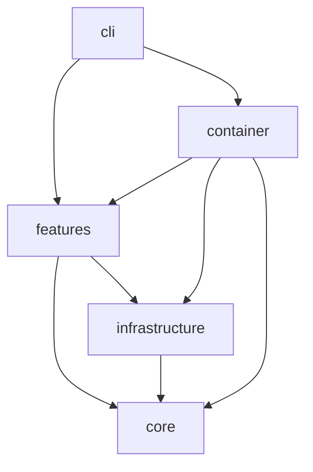
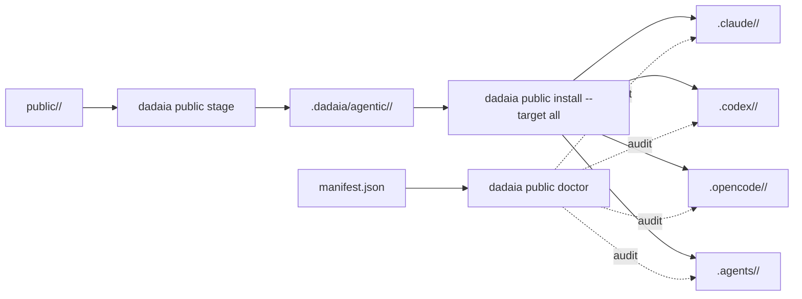
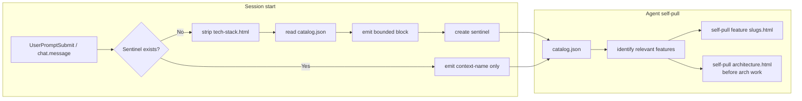
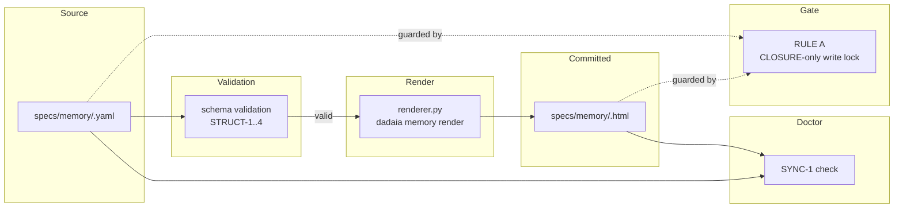

## Visão geral

Arquitetura em três anéis: (1) CLI thin em `dadaia_workspace/cli/`; (2) features isoladas em `dadaia_workspace/features/<name>/` cada uma com seu service/doctor/etc; (3) infrastructure em `dadaia_workspace/infrastructure/` (Git, JSON stores, public asset projection). Núcleo em `dadaia_workspace/core/` mantém models, protocols e exceptions — sem I/O. Dependency injection via `dadaia_workspace/container.py`.

Asset chain canonical → projeções: a fonte de cada agente, skill, rule, command, script, template, workflow vive em `dadaia_workspace/public/<type>/`; staging em `.dadaia/agentic/<type>/` (snapshots imutáveis com manifest.json); instalação espalha por `.claude/`, `.codex/`, `.opencode/`, `.agents/` seguindo regras por tool.

## Camadas

**cli/** — typer app + commands (`academy`, `context`, `doctor`, `export`, `import`, `init`, `orchestrate`, `public`, `repos`, `specs`). Thin wrapper sobre features; sem business logic.

**features/** — cada feature é uma pasta com `service.py` + opcionalmente `doctor.py`, `resolver.py`, `runner.py`. Features atuais: `academy`, `agents` (canonical agent reader sobre `MarkdownAgentStore`), `export`, `import_`, `orchestration`, `panel` (descrito em detalhe abaixo), `public`, `repos`, `server_registry`, `spec_context`, `specs`, `telemetry` (com `aggregator/queries.py` expondo `list_sessions(runtime, project=None, limit=None) -> SessionListResult` + `get_session(runtime, session_id) -> SessionDetail | None`; `aggregator/runtimes.py` declara o protocolo `RuntimeAdapter` com métodos `enrich_row`, `enrich_detail`, `liveness(session_id, cwd)` e implementações `ClaudeRuntimeAdapter` (cost via `pricing.compute_cost`, liveness via `~/.claude/sessions/*.json`) e `CodexRuntimeAdapter` (cost `None` + `cost_known=False`, liveness via `~/.codex/state_5.sqlite::threads` + tail de `~/.codex/history.jsonl` com try/except fallback para `idle`); `TelemetryAggregator` mantém registry `{runtime: adapter}` e delega enrichment per row), `workflows` (`WorkflowsService` wrapping `MarkdownWorkflowStore` com mtime cache + `dag.py` SVG renderer server-side via longest-path layout), `workspace`.   
  
**panel — arquitetura HTTP interna (pós R5):**

  * **Route categories (3 tipos declarados em`handler.py`)**: 
    * _Public_ : rotas em `_COMPILED_ROUTES`, sem autenticação — `GET /`, `GET /static/<name>`, `GET /memory/<slug>/<path>`, `GET /memory-view/<slug>/<file>`, `GET /reports/<path>` (path-traversal guard via `Path.resolve()` + `relative_to(workspace_root/.dadaia/reports/)`; 403 se fora do boundary).
    * _Bearer-only_ : `_BEARER_ONLY_ROUTES` — normalmente exigem header `Authorization: Bearer <token>`; incluem todos os `/api/*` endpoints: `/api/servers`, `/api/contexts`, `/api/agents`, `/api/agents/<id>/prompt`, `/api/workflows`, `/api/workflows/<name>`, `/api/sessions`, `/api/sessions/<runtime>/<id>`, `/api/academy`, `/api/reports`, `DELETE /api/reports/<path>`, `/api/kanban` (panel-kanban-v1). **Loopback bypass (panel-ux-fix-v1):** quando o panel inicia com `bind == "127.0.0.1"`, `loopback_bypass=True` é passado para `make_handler_class()`; o branch 401 em `handler.py` é guardado por `if not _loopback_bypass and (…)` — `GET /api/*` retorna 200 sem token em bind loopback. Detecção é no boot address (avaliado uma vez), não no peer TCP address de cada request. Mutações (`POST`, `DELETE`) não são afetadas — padrão de autenticação permanece inalterado para elas.
    * _Telemetry_ : `_tel_patterns` + telemetry required — subconjunto das bearer-only rotas de sessions que delegam para `TelemetryAggregator`.
  * **`do_DELETE` handler**: `PanelHandler.do_DELETE` adicionado ao lado de `do_GET`; espelha o padrão de auth (Bearer validation constant-time); despacha `api_report_delete` via regex dispatch; mesmo traversal guard que `GET /reports/<path>`.
  * **Static asset registry** : `static.py _ASSETS` dict é o registry central de todos os assets servidos por `/static/<name>`. CSS servido como Python string constants (Python-string modules em `views/assets/css/`). JS e SVGs lidos do filesystem em import-time em `static.py` (não em request-time — sem traversal possível). `logo-rhino-36.svg` e `logo-rhino-24.svg` registrados em `_ASSETS`. `_assets.py` não contém mais `PANEL_CSS`, `PANEL_JS`, nem `PALETTE` (removidos).
  * **View composition** : `container.py build_panel_views()` instancia e retorna o dict de 15+ view callables, incluindo `api_reports` (`GET /api/reports`), `reports_serve` (`GET /reports/<path>`), `api_report_delete` (`DELETE /api/reports/<path>`), `api_kanban` (`GET /api/kanban` — servido por `views/kanban.py`). Todos os view callables são passados para `PanelHandler` via DI.
  * **`views/kanban.py` (panel-kanban-v1)**: view read-only que lê `.dadaia/sessions/*.json` (session files de R2 — _não_ o `TelemetryDao`), agrupa cards por context e modo, mapeia modo para coluna Kanban (READ → research, SPEC → spec, BOUND_IMPLEMENTATION → implementation, BOUND_REVIEW → review, desconhecido → research), computa `is_stale` em read-time (`(now - last_seen_at) > ttl_seconds`), retorna JSON com `generated_at` + `swimlanes`. Ausência ou vazio do diretório `.dadaia/sessions/` → 200 com swimlanes vazias (nunca 500). Arquivos malformados ignorados silenciosamente. Servido em `GET /api/kanban`; endpoint bearer-only (loopback bypass de panel-ux-fix-v1 se aplica).
  * **`window.Panel` registry pattern** em `core.js`: objeto `{ register(name, mod), activate(name, opts) }` definido antes do tab loading logic. Lazy tab module loading: `register(name, mod)` registra o módulo; `activate(name, opts)` chama `mod.load(opts)` ou equivalente. Módulos registrados: `agents` (`window.Agents`), `workflows` (`window.Workflows`), `sessions`, `academy`, `reports`. `window.escHtml` promovido a global em `core.js`; todos os novos módulos JS usam `window.escHtml`. `DOMContentLoaded` em `core.js` registra Sessions, Academy e Reports via `window.Panel.register` e ativa o tab correto via hash routing (`#reports`, `#academy` são novos).
  * **`AcademyService` DI**: injetado como parâmetro opcional `academy=None` em `PanelService.__init__()`; instanciado no composition root de `panel.py`; `GET /api/academy` chama `service.academy.list_all()` quando não-None, retorna `[]` caso contrário.
  * **Workspace resolver** : `_resolve_workspace()` em `panel.py` caminha de baixo para cima do cwd até encontrar o diretório contendo `.dadaia/` — `dadaia panel` funciona de qualquer subdiretório do workspace.
  * **Telemetry hardening** : `_try_build_telemetry()` em `panel.py` usa handlers per-exception-type (`PermissionError`, `OSError`, `sqlite3.OperationalError`, `ImportError`), cada um emitindo `logging.warning` com a causa raiz antes de retornar `None` — nenhuma exception produz HTTP 503 silencioso nas rotas de sessions.


**core/** — `models/` (dataclasses puras), `protocols/` (ABCs / Protocols para DI), `exceptions.py`. Zero I/O. Pode importar stdlib apenas.

**infrastructure/** — implementações concretas dos protocols: `git_subprocess`, `json_*_store`, `public_assets`, `markdown_workflow_store`, `markdown_agent_store`, `claude_agent_dispatcher`, `cli_agent_dispatcher`, `excel_reader`, `python_env`. Toda I/O fica aqui. **Não-features-fed** : as tabelas SQLite `workflows` e `workflow_agents` permanecem em `schema.py` com marker `# DEAD:` aguardando cleanup release (migration 6); zero código de produção lê delas após R3.

**container.py** — wires features ↔ infrastructure via `build_*_service(workspace_root)` factories. CLI commands chamam o container para obter serviços.

**public/** — assets canônicos versionados: `agents/`, `skills/`, `rules/`, `commands/`, `scripts/`, `templates/`, `workflows/`, `plugins/`, `data/`, `scaffold/`. `public_assets.py` stage/install/doctor. A função `_install_workspace_guardrail_pair` faz fan-out byte-identical de uma única fonte `data/AGENTS.md` para o par `AGENTS.md` + `CLAUDE.md` no workspace-root e em cada consumer-repo carregando marker `.dadaia/agentic/` (Option C); o lib repo auto-skipa via `package_version`.

**agent topology (3 tiers, 20 agentes)** — Tier 1 _orchestrators_ com tool `Agent` (2): `project-manager` (intake + two-tier routing) e `project-auditor` (drift detection). Tier 2 _curator_ (1): `product-engineer` autor de SPEC/PLAN/TASKS/CLOSURE e guardião exclusivo de `specs/memory/*.html` em phase CLOSURE — sem tool `Agent` (leaf). Tier 3 _leaf specialists_ (17): `ai-engineer`, `backend-engineer`, `code-reviewer`, `data-analyst`, `data-engineer`, `design-specialist`, `devops-engineer`, `frontend-engineer`, `game-designer`, `game-developer`, `game-tester`, `qa-engineer`, `researcher`, `security-reviewer`, `software-architect`, `software-engineer-node`, `software-engineer-python` — todos sem tool `Agent`. Total: 20 agentes; **dois-tier PM router:** Tier-1 — 7 engine-backed workflows (`spec-refinement`, `cross-cutting-feature`, `onboarding-new-repo`, `hotfix-release`, `game-dev-cycle`, `audit-cycle`, `code-review-fan-out`) invocados via `dadaia orchestrate run <name> --input ...` — cada um tem um `*.workflow.md` em `public/workflows/`; Tier-2 — 13 PM Playbooks embedidos na skill `project-orchestration`, compostos inline pelo PM (sem custo YAML). **File-iff-X rule:** um padrão ganha arquivo `*.workflow.md` apenas se tiver multi-party `parallel_group`, gate de aprovação do operador não-opcional, ou input contract cross-surface nomeado. Padrões que não atendem ficam como PM Playbooks. **Operator UX contract:** o operador fornece somente demanda em linguagem natural; o PM classifica, reserva task_ids no TASKS.md, e emite intake report nomeando o padrão e os agentes envolvidos — nenhum prompt ao operador para nome de workflow ou task_id. **PM Playbook schema (mandatory 7 fields):** Trigger / Entry / Input contract / Steps / Gate (conditional) / Stop conditions / Done when. **Model defaults (ADR-X4):** todos os 20 agentes usam `claude-sonnet-4-6` como modelo padrão; `researcher` usa `claude-haiku-4-5-20251001`; `security-reviewer` opera em scan-mode (Haiku) ou triage-mode (Sonnet) declarado pelo dispatcher; escalação a Opus per-dispatch via env var `DADAIA_MODEL_OVERRIDE=opus`. **Skill catalogue:** Tier-A (11) catalogadas em `public/skills/` e projetadas em todos os runtimes; Tier-B (22) demoted para `docs/agent-knowledge/<agent>/` e lidas on-demand pelo agente owner (ADR-X2). **Sidecar-first emission contract (ADR-X5):** default de emissão dos 20 agentes é JSON sidecar `handoff-v1.1`; HTML só sob `--with-report` explícito ou `next_handoff.agent == "human"`. **Dispatch-to-researcher pattern (ADR-X6):** phases evidence-heavy (audit, code-review, security-scan, spec-refinement, cross-cutting-feature) fan-out researcher (Haiku) em paralelo; orquestrador sintetiza dos sidecars sem Read inline de file sets extensos. A Decision Authority Matrix em `public/skills/project-orchestration/SKILL.md` cobre 5 domínios — Python implementation (`software-engineer-python`), Node implementation server-side (`software-engineer-node`), Data engineering / pipelines / DABs (`data-engineer`), BI / dashboards / data viz (`data-analyst`), AI entities / skills / rules / workflows / hooks / personas (`ai-engineer`). `product-engineer` e `software-architect` não declaram a tool `Bash`; invocações de shell são delegadas ao `project-manager`. **Renderer split (codex-agent-orchestration-parity-v1 / ADR-1..ADR-5):** as personas canônicas em `public/agents/` são projetadas para cada runtime via adapters — Claude (verbatim, cópia byte-identical); Codex (`transform_for_codex()` substitui referências a tool `Agent` por `subagent` + remove hooks Claude-específicos; `map_model()` traduz o model identifier canônico para equivalente Codex); OpenCode (`_prepare_agent_for_opencode` em `public_assets.py`: strip de `tools:` e `color:` + emissão de bloco `permission:` por-agente mapeando tools Claude→categorias OpenCode — `Edit`/`Write`→`edit`, `Bash`→`bash`, `WebFetch`→`webfetch`, `Agent`→`task`, `allow`/`deny` conforme declaração; mais os plugins `.opencode/plugins/sdd-gate.ts` [hook `tool.execute.before` → `sdd-spec-gate.sh`, fail-open] e `ctx-inject.ts` [hook `chat.message` na assinatura `(input, output)` mutando `output.parts`]). Implementação em `dadaia_workspace/infrastructure/runtime_transforms/` com módulos `codex.py` (transform) e `model_mapping.py` (mapeamento `MODEL_MAP`). A instalação é disparada por `dadaia public install --target codex` que chama `_install_codex_agents()` em `public_assets.py` e serializa 20 TOMLs com campos `name` / `model` / `developer_instructions` em `.codex/agents/`. Doctor checks D-CX-1..5 garantem ausência de drift e zero leak de identificadores `claude-*`.

**path-scope enforcement** — O gate PreToolUse `sdd-spec-gate.sh` tem um passo 6 (post-TASKS-marker) que valida o `file_path` de Write/Edit/MultiEdit contra `paths.write_allowlist` do frontmatter do agente ativo. Todos os 20 agentes declaram bloco `paths:`. Mismatch → JSON `{"decision":"block","reason":"[PATH SCOPE ERROR] …"}`; agent-persona não detectada → fail-open com warning em `/tmp/sdd-gate.log` (NFR3). `ai-engineer` tem write authority exclusiva sobre `dadaia_workspace/public/{skills,rules,workflows,commands,agents,hooks}/**`; `software-engineer-python`/`-node` são banidos dessa superfície AI-entity (e vice-versa: `ai-engineer` não escreve código Python/Node nem specs).

**rules folder** — 4 arquivos canônicos: `game-agents-coordination.md` e `game-developer-scope.md` (boundaries cross-agent do domínio de jogos); `workspace-protocol.md` (SDD gate + context discovery + task lifecycle + report path, fatorado dos agent bodies em ADR-X3); `plugin-scope.md` (refusal pattern `[PLUGIN SCOPE ERROR]` para o plugin `frontend-design` restrito a `frontend-engineer` e `design-specialist`, ADR-X7). Per-agent scope rules (`project-manager-scope`, `project-auditor-scope`, `design-specialist-scope`) foram inlined nos próprios corpos dos agentes como seção `## Scope and forbidden actions`. `dadaia-workspace-dev-guardrail` foi absorvida pela rewrite de `data/AGENTS.md`.

## Regras de dependência

Setas indicam dependência permitida; ausência de seta significa proibição.



**Proibido:** core nunca importa de features/infrastructure/cli; features não importam de cli; features não importam outras features (passar pelo container).

## Fluxo de dados — pipeline asset chain



## Fluxo de dados — gate v3 SDD (com RULE E e PostToolUse)

```mermaid
sequenceDiagram
    participant Tool as Agent Tool
    participant PreHook as PreToolUse Hook
    participant Gate as sdd-spec-gate.sh
    participant Active as releases/ACTIVE.md
    participant Session as .dadaia/sessions/sess_*.json
    participant Lock as .dadaia/locks/implementation/
    participant TASKS as releases/<id>/TASKS.md
    participant PostHook as PostToolUse Hook
    participant PostGate as sdd-post-gate.sh
    Tool->>PreHook: Write/Edit (file_path)
    PreHook->>Gate: stdin JSON
    Gate->>Active: read phase
    Gate->>Gate: RULE A: memory/* + phase≠CLOSURE → block
    Gate->>Gate: RULE B: _archive/* → block
    Gate->>Gate: RULE D: path-scope allowlist check
    Gate->>Session: read DADAIA_SESSION_ID session file
    alt DADAIA_SESSION_ID absent
        Gate-->>PreHook: exit 0 (fail-open)
    else session present
        Gate->>Lock: read impl lock (IMPLEMENTATION mode)
        Gate->>Gate: RULE E: path-policy matrix (mode + staleness + ownership)
        Gate->>TASKS: grep [-] marker (RULE C; release from lock file if IMPL mode)
        alt allowed + task [-]
            Gate-->>PreHook: exit 0 (allow)
        else
            Gate-->>PreHook: {"decision":"block", owner session_id}
        end
    end
    PreHook-->>Tool: allow/block
    Tool->>PostHook: tool completed
    PostHook->>PostGate: DADAIA_SESSION_ID
    PostGate->>Session: renew last_seen_at (atomic)
    PostGate->>Lock: append HEARTBEAT to lock-events.jsonl
```

## Contratos entre módulos

De| Para| Tipo de contrato| Notas  
---|---|---|---  
cli/commands/*| container.build_*_service| Factory call| Cada command resolve workspace_root e chama factory  
features/*| core/protocols/*| Protocol / ABC| Injetado via constructor — features não conhecem implementação  
features/specs/doctor| specs/ filesystem| Path-based, read-only| Recebe specs_dir absoluto; nunca escreve. Inclui invariante **D-OC-1** (bidirectional): forward — cada nome Tier-1 do router PM mapeia para `public/workflows/<name>.workflow.md` existente; cada nome Tier-2 mapeia para heading `### Playbook — <name>` em SKILL.md; reverse — cada heading `### Playbook — <name>` em SKILL.md aparece como Tier-2 no router PM ou carrega anotação `[deprecated]`. Referência dangling em qualquer direção → hard error.  
infrastructure/public_assets| public/ ↔ .dadaia/agentic/ ↔ projeções| Manifest + file copy| Manifest.json é o cache do que foi propagado  
PreToolUse hook| sdd-spec-gate.sh| JSON stdin / stdout| Fail-open: erros internos → allow  
features/telemetry/reader/claude.py| features/telemetry/store DAO| Event stream → SQLite UPDATE| Extrai `agent_name` de `tool_use.input.subagent_type` em Task tool invocations de subagents despachados; propaga a persona via mapa `session_id → agent_name` a todos eventos subsequentes da mesma session; persiste via `UPDATE sessions WHERE session_id = ?` (idempotente). Backfill histórico via `scripts/backfill_telemetry_agent_name.py [--db PATH] [--dry-run]` — UPDATE em rows existentes, nunca INSERT, rodar duas vezes é no-op.  
features/telemetry/aggregator/queries.py| features/telemetry/aggregator/runtimes.py| RuntimeAdapter protocol + registry| `TelemetryAggregator` mantém registry `{runtime: RuntimeAdapter}` e delega `enrich_row(row, raw) -> SessionRow` + `enrich_detail(detail, raw) -> SessionDetail` + `liveness(session_id, cwd) -> "active"|"idle"|"ended"` per runtime. `ClaudeRuntimeAdapter` wires `pricing.compute_cost` para `cumulative_cost_usd` e seta `cost_known=True`; `CodexRuntimeAdapter` seta `cumulative_cost_usd=None` + `cost_known=False` (defensive guard impede chamada a `pricing.compute_cost` para Codex rows). Liveness classifica `active ≤ 5min`, `idle ≤ 60min`, `ended` caso contrário ou `threads.archived = 1`. Try/except wraps reads com fallback graceful para `idle`.  
  
## Estado runtime

Locais canônicos de estado em disco e seu propósito:

  * `.dadaia/states/spec_contexts.json` — todos os Spec Context Projects (`schema_version: "2"`; state ALIVE/DEAD; sem `is_primary`; campos `alive_since` e `dead_since`).
  * `.dadaia/states/.ws_lock` — fcntl workspace-wide lock (gitignored; criado em runtime; Lock 1).
  * `.dadaia/states/ctx_locks/<slug>.lock` — fcntl per-context lock (gitignored; Lock 2).
  * `.dadaia/sessions/<sess_*>.json` — session files criados por `context bind`; registram mode, release, runtime, pid, last_seen_at, ttl_seconds.
  * `.dadaia/locks/implementation/<ctx>__<release>.json` — Lock 3 per-release implementation lock (state: FREE/HELD/STALE/RECLAIMED).
  * `.dadaia/logs/lock-events.jsonl` — audit log append-only (O_APPEND; registros <1 KB; eventos: ACQUIRED, RELEASED, STALE_DETECTED, RECLAIMED, HEARTBEAT, BLOCKED_ATTEMPT).
  * `.dadaia/agentic/<type>/` — staging de assets (snapshot imutável).
  * `.dadaia/agentic/manifest.json` — registro do que foi propagado para cada tool.
  * `.dadaia/scripts/sdd-spec-gate.sh` — projeção do gate PreToolUse (instalada por `dadaia public install`).
  * `.dadaia/scripts/sdd-post-gate.sh` — projeção do gate PostToolUse / heartbeat renewal (instalada por `dadaia public install`).
  * `.dadaia/reports/<context>/<agent>/*.html` — reports HTML produzidos por especialistas (20 diretórios possíveis correspondentes aos 20 agentes), consumidos por `project-manager` no Discovery e por `project-auditor` nas auditorias.
  * `specs/releases/ACTIVE.md` — release ativa + phase.
  * `specs/memory/*.html` — memory atômica (HTML + Mermaid + assets).
  * `specs/_archive/releases/<id>/` — releases concluídas com CLOSURE.
  * `specs/_archive/legacy-features/<name>/` — features SDD pre-release-lifecycle não implementadas.
  * `specs/_archive/legacy-memory/<ts>/` — memory markdown migrado para HTML.
  * `specs/_archive/legacy-root/` — SPEC/PLAN/TASKS top-level pre-release-lifecycle.


**Removido em v2:** `.dadaia/states/primary_context.json` (deletado por `dadaia migrate`; não recriado em nenhum code path v2). O conceito de "global primary" foi substituído por session binding via `eval $(dadaia context bind ...)`.

## Memory injection subsystem

Implemented in release `memory-context-enforcement-v1`. Ensures agents never start work without product context ("agents never work blind"). The subsystem operates across three runtimes (Claude Code, OpenCode, Codex).

### Lean payload (operator decision D-5)

The injected bootstrap is **tech-stack + catalog only** (~4,584 tokens / $0.0138 at Sonnet pricing). `architecture.html` is intentionally _not_ injected — it is large (~7.5K tokens, prose + Mermaid diagrams that barely strip) and is self-pulled by agents before any architectural or cross-layer work, exactly as feature atoms are self-pulled on-demand.

Layer| What is injected| Tokens (est)  
---|---|---  
Catalog index| `specs/memory/product/catalog.json` — all features with slug, title, summary, path, tags, rank| ~2,300  
Tech stack| `memory/tech-stack.html` stripped of `<head>`, `<style>`, Mermaid `<script>`| ~2,300  
**Total injected**|  —| **~4,584 (~5K)**  
  
### ctx-inject.sh (Claude Code + OpenCode)

`dadaia_workspace/public/scripts/ctx-inject.sh` — lib-originated, projected to `.dadaia/scripts/ctx-inject.sh` by `dadaia public install`. Fires on every `UserPromptSubmit` event in Claude Code and on every `chat.message` in OpenCode. The script:

  1. Resolves `$SPECS_DIR` from `$DADAIA_CONTEXT` or `primary_context.json`.
  2. Checks a **first-message sentinel** at `.dadaia/tmp/ctx-inject-fired-<SESSION_ID>`. If the sentinel exists, emits only the context-name line and exits — no re-injection on subsequent turns of the same session.
  3. Creates the sentinel and emits the full payload inside bounded markers:


    
    
    === workspace memory (tech + catalog) ===
    ...stripped tech-stack.html content...
    ...catalog.json content...
    === end memory bootstrap ===

Fallback: when `catalog.json` is absent (consumer repos not yet generated), injects stripped `product/index.html` instead of the catalog block (no error, no empty block).

### strip-memory-html.py

`dadaia_workspace/public/scripts/strip-memory-html.py` — NEW in this release. ~25 lines, Python stdlib only (`html.parser`). Accepts a file path as `argv[1]`, removes `<head>`, `<style>`, and Mermaid `<script>` blocks, writes stripped content to stdout. Invoked inline by `ctx-inject.sh`. Preserves all prose, heading, and diagram content.

### ctx-inject.ts (OpenCode first-message guard)

`dadaia_workspace/public/plugins/ctx-inject.ts` — extended with a first-message-only guard. The OpenCode `chat.message` hook fires on every user message; without the guard, the ~5K payload would be paid on every turn. The guard uses the same session sentinel pattern as `ctx-inject.sh`. If no session env var is available, falls back to a PID-based sentinel. Any error skips injection and never breaks the chat (fail-open).

### catalog.json generation pipeline

`dadaia_workspace/features/specs/catalog.py` — NEW in this release. Public function `generate_catalog(specs_dir: Path) -> dict` reads `specs_dir/memory/product/index.html`, parses the `<ol class="catalog">` entries, and returns a dict matching the catalog JSON schema. CLI entry: `dadaia memory catalog generate [--specs-dir PATH]`. The generated file is committed as `specs/memory/product/catalog.json` (18 entries for this repo).

### CAT-1 doctor check

Added to `dadaia_workspace/features/specs/doctor.py`. Verifies that the set of slugs in `catalog.json` matches the set of `*.html` files (excluding `index.html`) in `specs/memory/product/`. Severity: WARNING (not ERROR — catalog may simply be stale). The check message names the specific out-of-sync slugs/files.

### Codex memory-ctx adapter (ADR-CX-001)

`dadaia_workspace/public/runtime/codex/memory-ctx/SKILL.md` — NEW universal Codex bootstrap adapter. Auto-discovered and installed to `.codex/skills/memory-ctx/SKILL.md` by `_install_codex_runtime_adapters` in `infrastructure/public_assets.py` via directory iteration (`sorted(src_root.iterdir())`). No `config.toml` entry is created or needed — registration is purely by directory presence (ADR-CX-001). Covered by `dadaia public doctor` check D-CX-6 (leak/missing/drift). The adapter fires before role-specific adapters (`design-ctx`, `frontend-ctx`).

### Step 0 block in all 21 agent personas

A mandatory "Step 0 — Memory bootstrap (mandatory, before any implementation)" block was inserted into all 21 agent persona files in `dadaia_workspace/public/agents/`. The block instructs agents to: (1) read the catalog, (2) self-pull `architecture.html` before architectural/cross-layer work, (3) self-pull the 1-3 relevant feature atoms. 5 previously fully-blind P0 agents (code-reviewer, design-specialist, project-auditor, researcher, security-reviewer) also gained `dadaia-workspace-spec-navigator` in their frontmatter `skills:` list.



## Structured-memory-source subsystem

Implemented in release `memory-structured-source-v1`. Inverts the data/presentation boundary for memory atoms: a schema-validated YAML file is the sole editable source; a deterministic renderer converts YAML → committed HTML; the panel serves the committed HTML unchanged.

### Schemas (atomicity-as-schema)

Four JSON Schema files live in `dadaia_workspace/public/schemas/memory/`:

Schema ID| File| Governs  
---|---|---  
`memory-architecture-v1`| `memory-architecture-v1.schema.json`| `specs/memory/architecture.yaml`  
`memory-tech-stack-v1`| `memory-tech-stack-v1.schema.json`| `specs/memory/tech-stack.yaml`  
`memory-product-index-v1`| `memory-product-index-v1.schema.json`| `specs/memory/product/index.yaml`  
`memory-product-feature-v1`| `memory-product-feature-v1.schema.json`| `specs/memory/product/<slug>.yaml`  
  
All four schemas use `"additionalProperties": false`. This makes a `changelog`, `history`, or `versions` field structurally impossible to author — atomicity is enforced at schema-validation time, not by a heuristic regex at doctor runtime (D-5 structural guarantee).

### Renderer (`features/specs/renderer.py`)

`dadaia_workspace/dadaia_workspace/features/specs/renderer.py` converts a YAML atom (validated against its schema) into the committed HTML file served by the panel. The renderer is deterministic: the same YAML input always produces byte-identical HTML output. Mermaid diagram fields are wrapped in `<pre class="mermaid">…</pre>` with the CDN script tag included. CLI entry: `dadaia memory render <path.yaml>` writes/updates the adjacent `.html` file.

### Doctor checks (STRUCT-1..4, SYNC-1, YAML-absent guard)

  * **STRUCT-1..4** : When a YAML atom is present, doctor validates it against its schema. A schema violation (missing required field, extra field) is an error that blocks `dadaia specs doctor` exit 0.
  * **SYNC-1** : When a YAML source exists and passes STRUCT validation, doctor runs the renderer and compares output to the committed HTML. A divergence is a WARN (not error) — naming the specific out-of-sync atom. Catches stale committed HTML when `dadaia memory render` was not run after editing YAML.
  * **YAML-absent guard** : When no YAML source exists for an atom (the atom is still HTML-source), STRUCT and SYNC checks are skipped with a WARN: `[WARN] YAML source absent for <atom-path>; schema validation skipped. Migrate with: dadaia migrate memory-yaml`. HTML-source consumer repos continue operating with their existing doctor checks. `dadaia specs doctor` exits 0 with WARN-only. Check #8 (changelog-grep heuristic) is skipped for atoms that have a valid YAML source — schema enforcement supersedes the heuristic.


### Gate RULE A extension

RULE A in `dadaia_workspace/public/scripts/sdd-spec-gate.sh` was extended to lock `specs/memory/**/*.yaml` and `specs/memory/**/*.yml` files with the same CLOSURE-only enforcement as HTML atoms. A Write attempt on a YAML memory source outside the CLOSURE phase is blocked with the standard memory-atomicity gate message.

### Scaffold (born-structured)

New consumer repos initialized via `dadaia init` or `dadaia context create` receive YAML stubs in `specs/memory/` (not HTML scaffold files). The old `architecture.html`, `tech-stack.html`, and `product/index.html` scaffold files were replaced by `architecture.yaml`, `tech-stack.yaml`, and `product/index.yaml` stubs that validate against their respective schemas. Stubs use `dadaia memory render` to generate their first committed HTML.

### Migration command

`dadaia migrate memory-yaml` guides existing HTML-source consumers through per-atom migration. Running it on an HTML atom produces a valid YAML file in the same directory; a second run on the same atom is a no-op with a warning (idempotent guard).

### Current state of this repo's atoms

This repo's 21 memory atoms remain HTML-source. The dogfood migration (C-6) was deferred because the v1 schemas cannot losslessly represent the richest atoms: `tech-stack` and `architecture` have rich tables and multiple diagram fields that exceed the single-value schema fields; `agent-comms` and `brand-identity` have non-standard sections with no mapping to the `memory-product-feature-v1` required-field contract. A follow-up release (`memory-structured-source-migration-v2`) will enrich the schemas and re-run the migration with a content-fidelity gate. Until then, `dadaia specs doctor` exits 0 with 21 YAML-absent WARNs (benign, expected).



## Evidências visuais

Diagramas de classe e screenshots da CLI vão sob `specs/assets/architecture/`. Atualmente sem assets — primeira batch virá em release subsequente.
