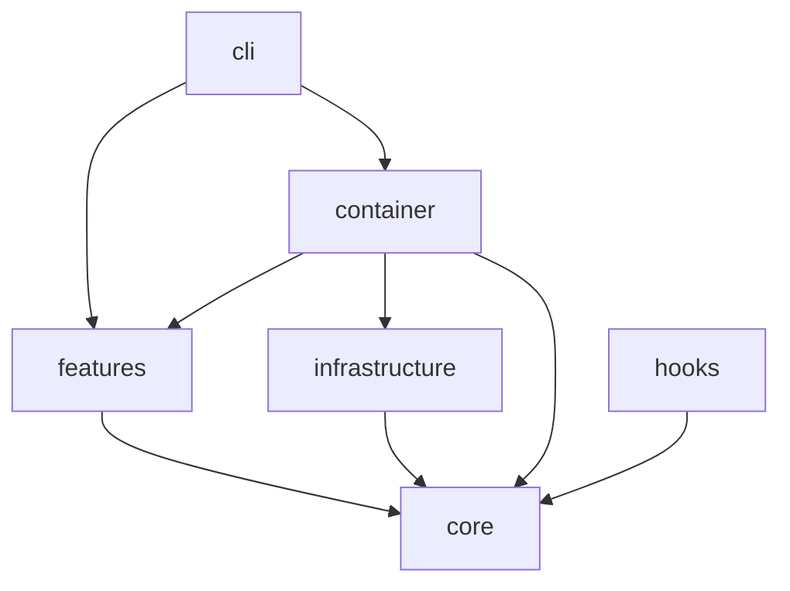
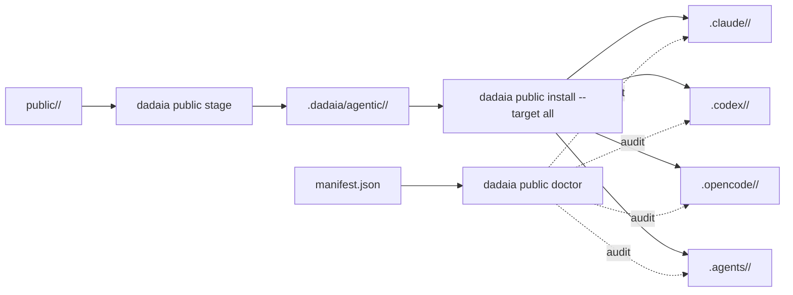

## Visão geral

Arquitetura em três anéis: (1) CLI thin em `dadaia_workspace/cli/`; (2) features isoladas em `dadaia_workspace/features/<name>/` cada uma com seu service/doctor/etc; (3) infrastructure em `dadaia_workspace/infrastructure/` (Git, JSON stores, public asset projection). Núcleo em `dadaia_workspace/core/` mantém models, protocols e exceptions — sem I/O. Dependency injection via `dadaia_workspace/container.py`.

Asset chain canonical → projeções: a fonte de cada agente, skill, rule, command, script, template, workflow vive em `dadaia_workspace/public/<type>/`; staging em `.dadaia/agentic/<type>/` (snapshots imutáveis com manifest.json); instalação espalha por `.claude/`, `.codex/`, `.opencode/`, `.agents/` seguindo regras por tool.

## O Spec Context Project (conceito central)

O **Spec Context Project** é o conceito central do dadaia-workspace (constitution §0). Um Spec Context Project é **uma canonical specs folder bound to one repository**. É session-bindable, e o binding dispara uma cadeia de valor:

1. **Bind** — a sessão se anexa a um Spec Context Project (o contexto ativo).
2. **Inject** — o binding injeta a `constitution.md` do contexto e sua `memory/` na sessão por lazy product-feature consumption (index + catalog carregam up front; feature atoms são pulled on demand).
3. **Enforce** — o ciclo SDD (constitution §7) é enforced para cada write de produção sob aquele contexto: nenhuma mudança de produção sem release aprovado e task reservada.
4. **Parallel multi-project** — porque cada contexto carrega exatamente um MUTATING lease (§8), múltiplos Spec Context Projects podem ser trabalhados concorrentemente em sessões diferentes. Trabalho ADDITIVE dentro de qualquer contexto roda em paralelo — com segurança, porque o contrato de lock torna estruturalmente impossível ter mais de um writer MUTATING por contexto.

A cadeia bind → inject → enforce → parallel-multi-project é o que permite a um generic agent fleet construir projetos reais com segurança e de forma organizada. Ver constitution §0.

## Camadas

**cli/** — typer app + 21 subcommands: `init`, `export`, `import`, `clean`, `context`, `lock`, `ci`, `repos`, `public`, `doctor`, `academy`, `orchestrate`, `reports`, `specs`, `server`, `migrate`, `panel`, `memory`, `release`, `backlog`, `bug`. Thin wrapper sobre features; sem business logic.

**features/** — cada feature é uma pasta com `service.py` + opcionalmente `doctor.py`, `resolver.py`, `runner.py`. Features atuais: `academy`, `agents` (canonical agent reader sobre `MarkdownAgentStore`), `ci_preflight`, `export`, `import_`, `migrate`, `orchestration`, `panel` (descrito em detalhe abaixo), `public`, `repos`, `reports_next`, `reports_retention`, `server_registry`, `spec_artifacts`, `spec_context` (inclui `lease.py` — contrato de locking central), `specs`, `telemetry` (com `aggregator/queries.py` expondo `list_sessions(runtime, project=None, limit=None) -> SessionListResult` + `get_session(runtime, session_id) -> SessionDetail | None`; `aggregator/runtimes.py` declara o protocolo `RuntimeAdapter` com métodos `enrich_row`, `enrich_detail`, `liveness(session_id, cwd)` e implementações `ClaudeRuntimeAdapter` e `CodexRuntimeAdapter`; `TelemetryAggregator` mantém registry `{runtime: adapter}` e delega enrichment per row), `workflows` (`WorkflowsService` wrapping `MarkdownWorkflowStore` com mtime cache + `dag.py` SVG renderer server-side via longest-path layout), `workspace`.

**panel — arquitetura HTTP interna (pós R5):**

  * **Route categories (3 tipos declarados em `handler.py`)**:
    * _Public_ : rotas em `_COMPILED_ROUTES`, sem autenticação — `GET /`, `GET /static/<name>`, `GET /memory/<slug>/<path>`, `GET /memory-view/<slug>/<file>`, `GET /reports/<path>` (path-traversal guard via `Path.resolve()` + `relative_to(workspace_root/.dadaia/reports/)`; 403 se fora do boundary).
    * _Bearer-only_ : `_BEARER_ONLY_ROUTES` — normalmente exigem header `Authorization: Bearer <token>`; incluem todos os `/api/*` endpoints: `/api/servers`, `/api/contexts`, `/api/agents`, `/api/agents/<id>/prompt`, `/api/workflows`, `/api/workflows/<name>`, `/api/sessions`, `/api/sessions/<runtime>/<id>`, `/api/academy`, `/api/reports`, `DELETE /api/reports/<path>`, `/api/kanban`. **Loopback bypass:** quando o panel inicia com `bind == "127.0.0.1"`, `loopback_bypass=True` é passado para `make_handler_class()`; `GET /api/*` retorna 200 sem token em bind loopback. Mutações (`POST`, `DELETE`) não são afetadas.
    * _Telemetry_ : `_tel_patterns` — subconjunto das bearer-only rotas de sessions que delegam para `TelemetryAggregator`.
  * **`do_DELETE` handler**: espelha o padrão de auth (Bearer validation constant-time); despacha `api_report_delete` via regex dispatch; mesmo traversal guard que `GET /reports/<path>`. `api_report_delete` remove o HTML report + canonical handoff em `.dadaia/handoff/` em um único passo atômico.
  * **Report retention**: `GET /api/reports` descobre reports por artifact HTML (HTML-first); enriquece cada row com sidecars canônicos de `.dadaia/handoff/`; deduplica para uma row por HTML report; adiciona campos `important: boolean`, `expires_at: string | null`, `is_expired: boolean`, `retention_reason: string | null`. `POST /api/reports/<path>/important` e `DELETE /api/reports/<path>/important` são as mutações de retention. Estado persiste em `.dadaia/states/report_retention.json`.
  * **Static asset registry** : `static.py _ASSETS` dict é o registry central de todos os assets servidos por `/static/<name>`.
  * **View composition** : `container.py build_panel_views()` instancia e retorna o dict de 15+ view callables. `views/kanban.py` serve `GET /api/kanban` (read-only; lê `.dadaia/sessions/*.json`; agrupa cards por context e modo; computa `is_stale` em read-time; nunca 500 para ausência do diretório).
  * **`window.Panel` registry pattern** em `core.js`: objeto `{ register(name, mod), activate(name, opts) }`. Lazy tab module loading. Módulos registrados: `agents`, `workflows`, `sessions`, `academy`, `reports`.
  * **Workspace resolver** : `_resolve_workspace()` em `panel.py` caminha de baixo para cima do cwd até encontrar o diretório contendo `.dadaia/` — `dadaia panel` funciona de qualquer subdiretório do workspace.

**core/** — `models/` (dataclasses puras), `protocols/` (ABCs / Protocols para DI), `exceptions.py`, `platform.py`. Zero I/O — a única exceção autorizada é `core/platform.py`, que lê `sys.platform` (o único site autorizado para essa chamada em todo o codebase). Pode importar stdlib apenas.

- `core/platform.py` — plataforma seam: `Capabilities` frozen dataclass com `detect()` classmethod e singleton `PLATFORM` em module-level. Flags: `has_fcntl`, `has_proc_fs`, `has_posix_chmod`, `has_sigterm`, `venv_scripts_dir`, `venv_exe_suffix`, `tmp_dir`. Nenhum outro arquivo pode ler `sys.platform` diretamente.
- `core/exceptions.py` — `PlatformSecurityError(DadaiaError)` e `PlatformCapabilityError(DadaiaError)` com atributos `feature_name: str` e `platform: str`.
- `core/protocols/` — 21 protocol files total: 4 OS-sensitive ports (`file_lock`, `telemetry_lock`, `platform_services`, `shutdown_handler`) + 17 domain protocols for DI, incluindo `process_runner` (`ProcessRunner`/`ProcessResult` — seam de execução de subprocess para features; nenhuma feature importa `subprocess` diretamente).

**infrastructure/** — implementações concretas dos protocols: `git_subprocess`, `json_*_store`, `public_assets`, `markdown_workflow_store`, `markdown_agent_store`, `claude_agent_dispatcher`, `cli_agent_dispatcher`, `excel_reader`, `python_env`, `subprocess_runner` (`SubprocessProcessRunner` — implementação production do `ProcessRunner`; consumida por `features/import_`, `features/ci_preflight`, `features/specs/doctor` e `features/server_registry` via Protocol/DI; contrato import-linter `features-no-subprocess` em `setup.cfg` proíbe `features → subprocess`). Toda I/O fica aqui. Adaptadores de plataforma: `file_lock_posix`, `file_lock_windows`, `telemetry_lock_posix`, `telemetry_lock_windows`, `file_permission_posix`, `file_permission_windows`, `process_probe_adapter`, `signal_shutdown_posix`, `signal_shutdown_windows`.

**container.py** — sole composition root. Lê `PLATFORM`, seleciona adapters (POSIX vs Windows) e injeta via `build_*_service(workspace_root)` factories. CLI commands chamam o container para obter serviços. `container.py` é o único local onde `PLATFORM` determina qual adapter concreto é instanciado.

**hooks/** — `dadaia_workspace/hooks/` Python package (6 módulos: `__init__`, `_common`, `sdd_gate`, `root_whitelist`, `ctx_inject`, `sdd_post_gate`) — a única implementação dos hooks de governança (o quarteto bash legado não existe mais no asset chain; o único shell asset remanescente é `public/scripts/pre-push-ci-gate.sh`, um git hook deliberadamente shell). Cada módulo tem entrypoint `__main__`. `runtime_config.py` emite comandos Python (`python -m dadaia_workspace.hooks.<name>`) para `.claude/settings.json` e `.codex/hooks.json`: PreToolUse com matcher de write tools (`Edit|Write|MultiEdit|NotebookEdit` no Claude; `apply_patch|Edit|Write` no Codex), PostToolUse match-all `*` no Claude (heartbeat em todo tool). `workspace/service.py` reconhece tanto o caminho `.sh` legado quanto o comando Python para evitar dupla-registro em settings pré-existentes. `sdd_gate.py` delega a `gate_policy.evaluate()` — não re-deriva política — e injeta o PID-probe no lease.

**public/** — assets canônicos versionados: `agents/`, `skills/`, `rules/`, `commands/`, `scripts/`, `templates/`, `workflows/`, `plugins/`, `data/`, `scaffold/`. `public_assets.py` stage/install/doctor. A função `_install_workspace_guardrail_pair` faz fan-out byte-identical de uma única fonte `data/AGENTS.md` para o par `AGENTS.md` + `CLAUDE.md` no workspace-root e em cada consumer-repo.

## Topologia de agentes (9 core + 3 plugins)

A topologia pública default é definida na constitution §14. Dois papéis de dispatcher; todos os demais são workers.

**Dispatchers (apenas 2 podem despachar sub-agentes via Agent tool — constitution §9):**
- `project-manager` — coordinator do lifecycle; holds + coordinates + releases the release lease; pode despachar qualquer worker.
- `project-auditor` — audit fan-out; despacha workers de auditoria (ADDITIVE, sem lease).

**Curator (1):**
- `product-engineer` — author de SPEC/PLAN/TASKS/CLOSURE; guardião de `specs/memory/**`; runs como sub-agente de PM durante MUTATING phases.

**Workers leaf (6 core):**
- `software-engineer` — implementação de produção (código + testes); PM sub-agent.
- `qa-engineer` — review → commit gate (ADDITIVE evidence; votes).
- `security-reviewer` — review → push gate (ADDITIVE evidence; votes).
- `code-reviewer` — review → PR gate (ADDITIVE evidence; votes).
- `ai-engineer` — dono da superfície AI-entity (`dadaia_workspace/public/**`); usa seu próprio short MUTATING lease fora de spans de release, bloqueado pela gate se PM lease estiver vivo.
- `software-architect` — architectural soundness; feeds findings into phases 4/5 (ADDITIVE).

**Plugins (não pertencem ao core roster):**
- `frontend-engineer`, `design-specialist` — plugin `frontend-design`.
- `devops-engineer` — plugin `devops`.

**Dispatcher purity (constitution §9):** Apenas `project-manager` e `project-auditor` podem despachar sub-agentes via Agent tool. Workers não spawnam outros agentes — surfaceiam a necessidade ao dispatcher. Worker→worker dispatch é uma impossibilidade estrutural.

**Sub-agent architecture:** `product-engineer` e `software-engineer` rodam como PM sub-agentes sob o single lease do PM coordinator. Eles nunca adquirem um lease independentemente. O "writer role" move-se entre sub-agentes quando PM despacha o próximo — o lease nunca muda de mãos. Isso torna deadlocks entre sessões em diferentes lifecycle phases estruturalmente impossíveis.

## Modelo de concorrência e lease (v0.1.10)

Constitution §8 define as duas activity classes que particionam todas as ações.

**Classificação context-relative (taxonomia classe × localização):** o path-classifier
(`features/spec_context/gate_policy.classify_path`) computa a classe sobre o caminho
**relativo ao contexto**. Para um write sob `repos/<slug>/...`, o prefixo
`repos/<slug>/` é removido e a taxonomia ordenada `specs/` (ADDITIVE → MEMORY → FROZEN)
é aplicada ao restante — exatamente a mesma que governa paths workspace-root. Um
restante in-repo que não casa com nenhuma classe é **MUTATING** (nunca cai em UNGATED):
production source e `specs/<other>` in-repo (ex. `specs/constitution.md`,
`specs/releases/**`) são MUTATING. As classes ADDITIVE de `.dadaia/` são
workspace-root-only (`.dadaia/` é proibido dentro de qualquer repo).

**ADDITIVE phases (1/2/3/4/7):** `specs/backlog/**`, `specs/bugs/**`, `specs/audits/**`
(no workspace-root **e** in-repo) + `.dadaia/reports/**`, `.dadaia/handoff/**`,
`.dadaia/tmp/**` (root). Allow com **zero leitura ou escrita de lease** — um write
ADDITIVE jamais aparece no lock record. Sessões concorrentes permitidas.

**MEMORY / FROZEN (root e in-repo):** `specs/memory/**` é gated por fase (allow apenas
em DEFINITION/CLOSURE — RULE A) e `specs/_archive/**` é read-only (RULE B) — as duas
regras executam também para os paths in-repo, onde os specs reais vivem.

**MUTATING phases (5/6/8):** `specs/releases/<id>/**`, o production tree do contexto, e
todo in-repo path sem classe. Exatamente um lease ativo por contexto. Gate bloqueia em
live-lease conflict.

### Schema do lease record (implementado em `features/spec_context/lease.py`)

```json
{
  "context": "<ctx-name>",
  "release": "<release-id>",
  "session_id": "<session-id>",
  "mode": "<mode>",
  "pid": 12345,
  "acquired_at": "<ISO 8601>",
  "heartbeat": "<ISO 8601>",
  "ttl": 120
}
```

- **Caminho:** `.dadaia/states/ctx_locks/<ctx>.lock.json`
- **Acquire E renew via O_EXCL CAS:** sentinel file (`open(path, "x")`) fecha o TOCTOU
  gap. `renew_heartbeat` roda o read→verify→write **dentro do mesmo sentinel CAS** que
  o acquire usa — um takeover estrangeiro nunca interleava entre o read e o write de uma
  renovação.
- **Liveness = TTL com PID veto** (`core/lock_liveness.is_stale`): `LEASE_TTL_SECONDS =
  120` é o piso de reclaimability, mas quando o record carrega `pid` e o probe injetado
  reporta o processo holder **vivo**, um record TTL-expirado é tratado como live —
  `acquire` estrangeiro **bloqueia** em vez de TAKEOVER (no-steal). O `pid` gravado é o
  do **processo harness de vida longa**, resolvido pelo hook
  (`hooks/sdd_gate._resolve_holder_pid`: `harness_pid`/`parent_pid`/`ppid` do payload
  stdin, senão `os.getppid()`) e threaded até `lease.acquire` — nunca o pid do
  subprocesso efêmero do hook. Pid morto/ausente,
  ou probe indisponível na plataforma (`PLATFORM.has_os_kill_liveness`) ⇒ fallback
  TTL-only (TAKEOVER). O probe (`infrastructure/process_probe_adapter.OsProcessProbe`,
  platform-seamed) é injetado pelo hook layer (`hooks/sdd_gate.py`) — `features/lease.py`
  nunca importa o adapter.
- **Holder-safe past TTL:** um holder confirmado (mesmo `session_id` ou `.ptr` match)
  renova mesmo com heartbeat expirado — nunca perde o próprio lease para a própria
  staleness.
- **Lock directory:** `0700`; lock file: `0600`.

### Heartbeat — PostToolUse com session id harness-native

`python -m dadaia_workspace.hooks.sdd_post_gate` roda após cada tool call e renova o
heartbeat de **todo lease cujo record nomeia o sid desta sessão**:

- O session id é resolvido do **payload stdin** do hook (`_common.resolve_session_id` —
  harness-native); `DADAIA_SESSION_ID` é apenas override de operador.
- O alvo da renovação são os lock records que este sid efetivamente segura — **nunca**
  `DADAIA_CONTEXT` → first-ALIVE (a rota da contaminação cross-context).
- A renovação roda fora de qualquer guard de session-file; fail-open exit 0 sempre.
- No Claude Code o matcher PostToolUse é match-all `*`; no Codex o bloco PostToolUse
  vem **sem** matcher — a forma canônica match-all do Codex. Em ambos os harnesses o
  heartbeat dispara após todo tool (inclusive Bash) — um holder dentro de um pytest
  longo renova entre as calls, e uma única call que ultrapasse o TTL é coberta pelo
  PID veto (TTL-stale + pid harness vivo ⇒ block, não steal).

### Identidade de sessão — `session_identity.py` (single owner)

`features/spec_context/session_identity.py` é o **único** reader/writer dos pointer
namespaces e do session record:

- `.dadaia/sessions/runtime/<ctx>.ptr` — pointer do incumbente do contexto (lease
  holder ou último bind; o `bind` o atualiza e o gate o lê na resolução de modo —
  honrado apenas quando nenhum lease **vivo** nomeia outro sid: liveness do holder
  vence o pointer, anti-downgrade).
- `.dadaia/sessions/runtime/<session_id>.ptr` — pointer de sessão do ctx-inject.
- `.dadaia/sessions/<id>.json` — session record (`session_id`, `context`, `mode`,
  `release`, `pid`, `bound_at`, `last_seen_at`, `ttl_seconds`).

`lease.py` mantém ownership do lock record em si, mas roteia todo pointer I/O por aqui.
A coerência lock-holder ↔ incumbent ptr ↔ session record é contract-tested e validada
post-hoc por `dadaia specs doctor` (SPEC-DOC-029). Artefatos legados de layouts
anteriores são ignored-and-superseded, nunca migrados.

Lógica de acquire (FR-P1-15 + pid veto):
1. `.ptr` file matches `session_id` → **RENEW** incondicionalmente (mesmo se o record mostrar outro session_id por relaunch).
2. Record com `session_id` matching → **RENEWED**, mesmo past-TTL (holder-safe).
3. Record ausente, ou TTL-stale com pid do holder morto/ausente → **ACQUIRED** (takeover).
4. Record foreign live — TTL-fresh, **ou** TTL-stale com pid vivo (veto) → **LockHeldError** com yield message. Gate bloqueia o write.

### Canal de modo — bind → session record → gate

`dadaia context bind <ctx>` (`--mode` opcional, default `read`) **persiste** o modo no
session record via `session_identity` **e atualiza o incumbent pointer do contexto**
(`sessions/runtime/<ctx>.ptr`) — o bind vincula o CONTEXTO: o sid que o CLI cunha não é
o sid que o harness reporta, então é via incumbent que o gate resolve o modo bound no
fluxo default. O bind não emite eval-exports por default; `--print-env` é o escape
back-compat para operadores que ainda rodam `eval $(dadaia context bind ...)`.
Mapeamento de modos: `read`/`spec` (legacy) → `READ`; `implementation` →
`BOUND_IMPLEMENTATION`; `review` → `BOUND_REVIEW` (modos lease-taking exigem
`--release`).

O gate resolve o modo da sessão na ordem: (1) `DADAIA_MODE` env (escape de shell do
operador — harness nunca o seta), (2) `mode` do session record keyed pelo sid
harness-native (sessão que se auto-bindou; vence o incumbent — um holder vivo nunca é
downgraded), (3) modo do **incumbent do contexto** via `<ctx>.ptr` — o caminho
harness-real do bind default; honrado só se não contradiz um lease holder vivo
(anti-downgrade guard: lease record nomeando outro sid ⇒ incumbent stale, ignorado),
(4) default `IMPLEMENTATION`. Sessão READ-resolved é **non-acquiring**: write MUTATING é bloqueado
**antes** de qualquer chamada ao lease (sessão read nunca cria, renova ou rouba lease);
ADDITIVE flui normalmente. Sessão sem modo (nenhum bind, nenhum env — toda sessão
harness comum) permanece IMPLEMENTATION-capable: pode adquirir um lease **livre**, mas
nunca TAKEOVER de um holder vivo (Decision D-3 + PID veto).

### Escopo do determinismo (Decision D-2)

O envelope determinístico do gate cobre apenas **file-write tools** (Claude PreToolUse
matcher `Edit|Write|MultiEdit|NotebookEdit`; Codex `apply_patch|Edit|Write`). Writes
feitos por comandos Bash ficam fora do envelope — postura fail-open documentada; o
backstop pós-hoc é a coerência lease↔session do doctor (SPEC-DOC-029). O gate **não lê**
`TASKS.md`, status `Aprovado`, markers `[-]` nem write-allowlists de agente — o que ele
enforça deterministicamente é path-class × lease × fase × modo; markers, aprovações e
allowlists são disciplina de agente/PM (workspace-protocol), não mecanismo.

**Reclaim-iff-stale, yield-iff-live-foreign:** o gate reclaims e heals em lease ausente
ou expirado-com-holder-morto (nunca bloqueia em lease stale/missing reclaimable); em
lease estrangeiro vivo (TTL-fresh ou pid-vivo): yield informativo. A mensagem **nunca**
instrui o operador a rebind, relaunch, ou steal — nenhuma cerimônia manual de
desbloqueio.

**GC:** `dadaia doctor --fix` reclama leases TTL-expirados cujo holder está morto ou é
unprobeable (`LOCK-GC` — records pré-`pid` são unprobeable ⇒ reclaimable por TTL puro; um
holder com pid **vivo** nunca é reclaimed, mesmo past-TTL; probe injetado no composition
root via `container`), além de session files e sentinel files órfãos. `dadaia lock steal
<ctx>` é probe-gated: recusa quando o pid registrado do holder está vivo. Bind/session
records decaem por TTL medido contra `last_seen_at`, que o heartbeat PostToolUse renova a
cada tool use — uma sessão READ ativa nunca decai para IMPLEMENTATION; records sem
`last_seen_at` mantêm TTL-from-creation. O pid do session record (pid do bind-CLI, morto
por construção) não participa do bind-GC.

**fcntl Lock-1/Lock-2 retidos** em `locking.py` — serializam curtas git ops no mesmo processo (workspace-level e per-context). Não são usados para mutex de release.

**Staleness predicates — `core/lock_liveness.py`:** `is_stale(record, clock, pid_probe)`
é a única fonte de verdade para staleness de lease (TTL piso + PID veto, zero I/O, seams
injetados); `is_stale_session(last_seen_at, ttl_seconds)` é a fonte para staleness de
sessão, consumida pelo painel Kanban (`features/panel/views/kanban.py`) e por
`features/spec_context/locking.py`.

## Os 3 canais de reporte/comunicação (constitution §11)

dadaia-workspace tem exatamente três canais, cada um com um único destino canônico:

1. **User reports** — HTML, escrito em `.dadaia/reports/<context>/<agent>/`. Surfaced no panel. Para consumo humano quando explicitamente solicitado.
2. **Agent↔agent communication** — JSON handoffs, escrito em `.dadaia/handoff/<context>/` apenas. Este é o contrato máquina entre agentes.
3. **Audit results** — Markdown committado, escrito em `specs/audits/<ts>-<session_id_8chars>/` (archive: `specs/audits/_archive/`). Project-auditor escreve findings versionados ao lado das specs que audita.

Nenhum `specs/releases/<id>/evidence/` subtree existe ou é autorizado. Constitution §12 anti-slop: nenhum fato é gravado em duas fontes.

## Regras de dependência

Setas indicam dependência permitida; ausência de seta significa proibição.



**Proibido:** core nunca importa de features/infrastructure/cli; features não importam de cli; features não importam outras features (passar pelo container); **features não importam `infrastructure/` diretamente** — toda dependência OS-sensível é injetada via Protocol por `container.py`.

**Layering invariant (v0.1.8):**
- `core/` — zero I/O, zero `sys.platform` (exceto `core/platform.py`). Zero `import fcntl / signal / subprocess / msvcrt`.
- `infrastructure/` — todos os adapters OS. Todo `fcntl`, `os.kill`, `os.chmod`, `signal.signal`, `subprocess`, `/proc`, `msvcrt` vive aqui atrás de Protocol interfaces.
- `features/` — business logic only. Zero `import fcntl / import signal / os.chmod / os.kill` direto. Recebe capability OS via Protocol injetado.
- `container.py` — sole composition root. Lê `PLATFORM`, seleciona adapters, injeta.

**Enforcement (dois layers):**
- `import-linter` (`setup.cfg`): contrato `features → infrastructure` import ban + `core → OS-primitive modules` ban. `core.platform` whitelisted para `sys`. Roda no CI `lint` job.
- `dadaia doctor` grep check: falha com `[ERROR]` em qualquer `import fcntl` / `os.chmod` / `os.kill` / `os.open` em `features/**/*.py`.

**Transitional debt (ADR-1):** Guards `sys.platform` em function bodies de `locking.py` e `telemetry/service.py` são permitidos durante a janela transitional, cada um anotado `# TODO: Replace with PLATFORM.has_<flag>`. `import-linter` tem 7 `ignore_imports` para o backlog item `features-import-infrastructure-direct-debt`. A remoção completa dessas dependências diretas é escopo de release futura.

## Fluxo de dados — pipeline asset chain



## Fluxo de dados — gate v3 SDD (v0.1.10: Python hooks)

O gate usa um path-classifier de 6 classes — ADDITIVE / MEMORY / FROZEN / MUTATING /
PROTECTED / UNGATED — computado **context-relative** (prefixo `repos/<slug>/` removido
antes da taxonomia `specs/`). O hook é `python -m dadaia_workspace.hooks.sdd_gate`
(Python puro; Windows/macOS/Linux); ele resolve o slug PATH-first do write target,
resolve o modo (env → session record → incumbent do contexto → IMPLEMENTATION) e delega a
`gate_policy.evaluate()` — não re-deriva política. `.dadaia/sessions/**` é PROTECTED
(o único caminho fail-closed, SEC-01). O gate não lê TASKS.md nem status de specs —
markers e aprovações são disciplina, não mecanismo.

```mermaid
sequenceDiagram
    participant Tool as Agent Tool
    participant PreHook as PreToolUse Hook (write tools)
    participant Gate as hooks/sdd_gate.py (Python)
    participant Classifier as gate_policy.py (context-relative)
    participant Active as releases/ACTIVE.md
    participant Sess as session_identity (mode record)
    participant Lease as lease.py (O_EXCL CAS + pid veto)
    participant PostHook as PostToolUse Hook (todos os tools)
    Tool->>PreHook: Write/Edit (file_path)
    PreHook->>Gate: stdin JSON (tool_name + file_path + session_id)
    Gate->>Classifier: classify path (strip repos/<slug>/)
    alt PROTECTED (.dadaia/sessions/**)
        Gate-->>PreHook: block (fail-closed, SEC-01)
    else ADDITIVE (backlog/bugs/audits root+in-repo; reports/handoff/tmp root)
        Classifier-->>Gate: allow (zero lease I/O)
    else MEMORY (specs/memory/** root+in-repo)
        Gate->>Active: read phase
        alt phase == CLOSURE or DEFINITION
            Gate-->>PreHook: allow
        else
            Gate-->>PreHook: block
        end
    else FROZEN (specs/_archive/** root+in-repo)
        Gate-->>PreHook: block
    else MUTATING (production + in-repo sem classe)
        Gate->>Sess: resolve mode (env -> record -> incumbent -> IMPLEMENTATION)
        alt mode == READ
            Gate-->>PreHook: block (non-acquiring, sem lease I/O)
        else lease-taking
            Gate->>Lease: acquire(ctx, session_id, release, mode, pid_probe)
            alt ACQUIRED or RENEWED
                Gate-->>PreHook: exit 0 (allow)
            else LockHeldError (TTL-fresh OU TTL-stale com pid vivo)
                Gate-->>PreHook: block with yield message
            end
        end
    else UNGATED
        Gate-->>PreHook: allow
    end
    PreHook-->>Tool: allow/block
    Tool->>PostHook: tool completed (qualquer tool, incl. Bash no Claude)
    PostHook->>Lease: renew heartbeat dos leases deste sid (CAS atômico)
```

## Contratos entre módulos

De| Para| Tipo de contrato| Notas
---|---|---|---
cli/commands/*| container.build_*_service| Factory call| Cada command resolve workspace_root e chama factory
features/*| core/protocols/*| Protocol / ABC| Injetado via constructor — features não conhecem implementação
features/specs/doctor| specs/ filesystem| Path-based, read-only| Recebe specs_dir absoluto; nunca escreve. Inclui D-OC-1 (bidirectional router/workflow wikilink validation) e os ledger invariants SPEC-DOC-024 (fase ↔ markers), 026 (release ids únicos releases+archive), 027 (naming canon `^v\d+\.\d+\.\d+$`), 028 (file refs da constitution resolvem) e 029 (coerência lease↔session, backstop D-2).
infrastructure/public_assets| public/ ↔ .dadaia/agentic/ ↔ projeções| Manifest + file copy| Manifest.json é o cache do que foi propagado
PreToolUse hook| `python -m dadaia_workspace.hooks.sdd_gate` (+ `root_whitelist`) + `gate_policy.py` + `lease.py`| JSON stdin / stdout + O_EXCL CAS| Fail-open: erros não-PROTECTED → allow; `.dadaia/sessions/**` PROTECTED → fail-closed (SEC-01); live-foreign lease (TTL-fresh ou pid-vivo) → block; READ-mode → block non-acquiring; context-slug derivado PATH-first do write target; pid-probe injetado pelo hook
PostToolUse hook| `python -m dadaia_workspace.hooks.sdd_post_gate` + `lease.py`| JSON stdin (session_id harness-native)| Renova heartbeat de todo lease cujo record nomeia este sid; nunca via DADAIA_CONTEXT→first-ALIVE; fail-open exit 0
features/spec_context/lease.py| `.dadaia/states/ctx_locks/<ctx>.lock.json`| Single-record JSON TTL-lease; O_EXCL CAS em acquire E renew| `LEASE_TTL_SECONDS = 120` piso + PID veto (`core/lock_liveness.is_stale`); holder-safe past TTL; pointer I/O via `session_identity`
features/spec_context/session_identity.py| `.dadaia/sessions/runtime/*.ptr` + `.dadaia/sessions/<id>.json`| Single-owner module| Único reader/writer dos pointers e session records; consumido por lease, hooks, bind CLI e doctor GC; coerência validada por SPEC-DOC-029
features/telemetry/aggregator/queries.py| features/telemetry/aggregator/runtimes.py| RuntimeAdapter protocol + registry| `TelemetryAggregator` mantém registry `{runtime: RuntimeAdapter}` e delega enrichment per row + liveness per runtime.

## Estado runtime

Locais canônicos de estado em disco e seu propósito:

  * `.dadaia/states/spec_contexts.json` — todos os Spec Context Projects (`schema_version: "2"`; state ALIVE/DEAD; sem flag global de contexto; campos `alive_since` e `dead_since`).
  * `.dadaia/states/.ws_lock` — fcntl workspace-wide lock (gitignored; criado em runtime; Lock 1 — serializa mutações em `spec_contexts.json`).
  * `.dadaia/states/ctx_locks/<slug>.lock` — fcntl per-context lock (gitignored; Lock 2 — serializa git clone/rmtree).
  * `.dadaia/states/ctx_locks/<ctx>.lock.json` — single-record JSON TTL-lease; schema `{context, release, session_id, mode, pid, acquired_at, heartbeat, ttl}`; acquire e renew via O_EXCL CAS; staleness = TTL piso + PID veto.
  * `.dadaia/states/ctx_locks/<ctx>.lock.sentinel` — CAS sentinel file (transient; criado e deletado atomicamente durante acquire/renew).
  * `.dadaia/sessions/runtime/<ctx>.ptr` — stable-session-identity pointer (lease incumbent); contém `session_id` do holder; RENEW incondicionalmente quando match. I/O exclusivo via `session_identity.py`.
  * `.dadaia/sessions/runtime/<session_id>.ptr` — pointer de sessão do ctx-inject (idempotência de injeção). I/O exclusivo via `session_identity.py`.
  * `.dadaia/sessions/<id>.json` — session record CLI-owned (`session_id`, `context`, `mode`, `release`, `pid`, `bound_at`, `last_seen_at`, `ttl_seconds`); escrito por `dadaia context bind` via `session_identity`; lido pelo gate (resolução de modo), pelo `sdd_post_gate` (refresh `last_seen_at`) e pelo Kanban do panel.
  * `.dadaia/logs/lock-events.jsonl` — audit log append-only (O_APPEND; eventos: acquire, release, steal, HEARTBEAT).
  * `.dadaia/agentic/<type>/` — staging de assets (snapshot imutável).
  * `.dadaia/agentic/manifest.json` — registro do que foi propagado para cada tool.
  * `dadaia_workspace/hooks/` — Python package de governança (6 módulos); única implementação dos hooks (não existem scripts bash de gate); registrado em `.claude/settings.json` e `.codex/hooks.json` por `infrastructure/runtime_config.py`.
  * `.dadaia/reports/<context>/<agent>/*.html` — reports HTML produzidos por especialistas; consumidos por `project-manager` no Discovery e por `project-auditor` nas auditorias.
  * `.dadaia/handoff/<context>/*.handoff.json` — agent↔agent JSON handoffs (canal 2 dos 3 canais).
  * `.dadaia/states/report_retention.json` — important-mark set para report retention; keys são caminhos workspace-relativos.
  * `.dadaia/states/root_exceptions.txt` — lista de entradas de root permitidas além do whitelist canônico.
  * `specs/releases/ACTIVE.md` — release ativa + phase.
  * `specs/audits/<ts>-<session_id_8chars>/` — audit results committados (canal 3 dos 3 canais; project-auditor).
  * `specs/memory/*.md` — memory atômica (Markdown + frontmatter YAML; rendered in-memory pelo panel via mistune).
  * `specs/memory/product/catalog.json` — gerado por `generate-memory-catalog.py` a partir do frontmatter dos `.md`; committed; índice machine-readable.
  * `specs/_archive/releases/<id>/` — releases concluídas com CLOSURE.

**Stores que não existem (não recriar):** `.dadaia/locks/implementation/<ctx>__<release>.json` (Lock 3), `.dadaia/states/ctx_locks/<ctx>.semaphore.json` (semaphore / Lock 4), `.dadaia/logs/semaphore-reclaims.jsonl`, marcador global de contexto, e qualquer script bash de gate em `.dadaia/scripts/`. O mutex MUTATING é exclusivamente o TTL-lease em `.dadaia/states/ctx_locks/<ctx>.lock.json`; o session record `.dadaia/sessions/<id>.json` não é mecanismo de locking — carrega identidade/modo da sessão (lido pelo gate para resolução de modo) e alimenta o Kanban.

## Memory injection subsystem

O subsistema garante que agentes nunca iniciam trabalho sem contexto de produto. Opera em três runtimes (Claude Code, OpenCode, Codex).

### Lean payload

O bootstrap injetado é **tech-stack + catalog apenas** (~2.400 tokens). `architecture.md` é intencionalmente não injetado — é large e é self-pulled pelos agentes antes de qualquer trabalho arquitetural ou cross-layer, exatamente como feature atoms são pulled on demand.

### ctx_inject hook (Claude Code + Codex + OpenCode)

`python -m dadaia_workspace.hooks.ctx_inject` — módulo do pacote de hooks Python. Em Codex roda no `SessionStart` (matcher `startup|resume`) carregando o contexto completo **uma vez por sessão**; em Claude Code roda no `UserPromptSubmit` e em OpenCode via plugin TS. Os hooks podem disparar a cada prompt, mas a injeção completa ocorre só uma vez por sessão lógica.

O hook:
1. Resolve o specs dir de `DADAIA_CONTEXT`, session record ligado, ou first-ALIVE no registry.
2. Resolve um `SESSION_ID` **estável** (env harness-native `CLAUDE_CODE_SESSION_ID`/`CODEX_SESSION_ID`/`OPENCODE_SESSION_ID`, depois o `session_id` do payload stdin; sem fallback de PID) e o sanitiza antes de usá-lo como componente de filename. Verifica o sentinel de first-message keyed nesse id. Se existir, **não emite nada** e sai — a injeção completa já ocorreu.
3. Cria o sentinel (pointer de sessão via `session_identity`) e emite o payload completo dentro de bounded markers:

```
=== workspace memory (tech + catalog) ===
...tech-stack.md content verbatim...
...catalog.json content...
=== end memory bootstrap ===
```

### catalog.json generation pipeline

`dadaia_workspace/features/specs/catalog.py` — reads frontmatter YAML blocks from `specs/memory/product/*.md` files. CLI: `dadaia memory catalog generate [--specs-dir PATH]`. O generated file é committed como `specs/memory/product/catalog.json`. O script `generate-memory-catalog.py` é o equivalente standalone.

### CAT-1 doctor check

Verifica que o conjunto de slugs em `catalog.json` matches o conjunto de `*.md` files (excluindo `index.md`) em `specs/memory/product/`. Severity: WARNING.

## Structured-memory-source subsystem (memory-markdown-source-v1)

Memory atoms são `.md` files com YAML frontmatter + Markdown body. HTML é ephemeral (rendered in-memory pelo panel via `mistune`; nunca escrito em disco).

### Source format

Cada atom é um `.md` file com strict YAML frontmatter block (`---` delimiters). Frontmatter schema: `memory-frontmatter-v1` (`additionalProperties: false`). Required fields: `slug`, `title`, `category`, `tldr`, `summary`, `tags`, `agent_tier`, `token_estimate`, `last_updated`, `release_origin`. Body: Markdown com `##` heading allowlist. `## Changelog`, `## Histórico`, `## History`, `## Versions` são hard errors.

### Panel render path (`features/panel/views/_md_render.py`)

O panel lê `.md` source em serve time, converte para HTML usando `mistune~=3.0` com custom hooks:
- Mermaid fenced code block → `<pre class="mermaid">…</pre>`
- `wikilink` → `<a href="…">` anchor
- Sanitiser: strips inline `<script>` e `<style>` do rendered output (XSS guard)

Output é cached by mtime. Nenhum `.html` file é escrito em disco.

### Lint tooling (`lint-memory-atoms.py`)

Valida cada atom:
- Frontmatter present, parseable, required fields, no extra fields
- `##` headings são subset do allowlist; sem duplicates
- `slug` wikilinks resolvem para `.md` files reais em `specs/memory/`
- Forbidden headings — hard ERROR

Invocado por doctor check `LINT-1`. Exit 0 = all valid; exit 1 = ao menos um ERROR.

## Multi-harness runtime parity (constitution §4)

| Runtime | Hook enforcement | Notes |
|---------|-----------------|-------|
| Claude Code | Real PreToolUse block (`python -m dadaia_workspace.hooks.sdd_gate`) | Strongest enforcement; Python, no bash dependency |
| Codex | Guardrail in trusted-workspace mode | `python -m dadaia_workspace.hooks.sdd_gate` registered in `.codex/hooks.json`; advisory on untrusted Codex |
| OpenCode | `.ts` plugins call Python subprocess | `sdd-gate.ts` + `ctx-inject.ts` call Python hooks via venv-path resolution (`.dadaia/.venv/bin/python` → `.dadaia/.venv/Scripts/python.exe` → bare `python`); Bun cross-platform `.env()` API used for env-passing — governed on Windows; `dadaia public doctor` reporta `[unsupported]` para PostToolUse target opencode — esperado |

Codex-specific behavior é expresso em termos Codex-nativos: `AGENTS.md` context, `.codex/config.toml`, `.codex/skills`, hooks onde suportados, e deferred tool discovery para multi-agent capability.

**path-scope (disciplina, não gate)** — `paths.write_allowlist` do frontmatter dos agentes é **convenção de instrução de agente** (workspace-protocol §6), não enforcement do gate: nenhum hook conhece a persona do processo que escreve. O que o gate PreToolUse enforça deterministicamente é path-class × lease × fase × modo sobre os write tools. A divisão de superfície (`ai-engineer` dono de `dadaia_workspace/public/{skills,rules,workflows,commands,agents}/**`; `software-engineer` dono do código Python, incluindo `dadaia_workspace/hooks/*.py`) é mantida por disciplina de persona e review.

**rules folder** — 8 arquivos canônicos públicos: `workspace-protocol.md`, `tmp-file-guardrail.md`, `plugin-scope.md`, `dadaia-workspace-dev-guardrail.md`, `harness-skill-scope.md` (restringe `ai-harness-claude-code`, `ai-harness-codex`, `ai-context-engineering` ao `ai-engineer`; `harness-primitives` é explicitamente não-restrita), `bug-registration-guardrail.md`, `backlog-ownership.md`, `release-governance.md`.

## Evidências visuais

Diagramas de classe e screenshots da CLI vão sob `specs/assets/architecture/`. Atualmente sem assets — primeira batch virá em release subsequente.
