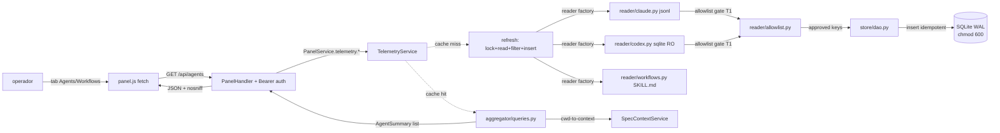

CLI surface: integrado ao `dadaia panel` (abas Agents + Workflows) · Closure: agent-monitoring-v1 · 2026-05-17

## Propósito

Telemetria local de agentes e workflows consumida exclusivamente de arquivos do operador (Claude Code `~/.claude/projects/*.jsonl` + Codex `~/.codex/sessions.sqlite`) — zero APIs remotas, zero dependências Node, zero `ccusage`. O módulo `features/telemetry/` (peer de `features/panel/`) materializa uma camada SQLite local (`~/.dadaia/state/telemetry/telemetry.sqlite`) com WAL + foreign keys + schema versionado via `PRAGMA user_version`, e expõe dois novos endpoints autenticados (`/api/agents`, `/api/workflows` + drill-down `/api/agents/{id}/sessions`) consumidos por duas novas abas do [[panel]].

Resolve a invisibilidade dos custos e padrões de uso por agente: o operador roda em paralelo product-engineer / software-engineer / software-architect / 7 outros agentes especialistas e até a release `agent-monitoring-v1` não tinha forma de inspecionar quem consumiu quanto, por modelo, por Spec Context, por dia. A release entrega uma superfície numbers-only (D-AM-20) — sem thresholds, sem alerts, sem push — onde o operador inspeciona visualmente. Privacidade por construção: **nenhum endpoint serve conteúdo bruto de mensagens** — allowlist gate hardcoded no reader é a única porta para SQLite.

## Fluxo de uso

  1. **Boot do panel** : `dadaia panel` faz boot do `TelemetryService` em modo "no-telemetry" se `PRAGMA integrity_check` falhar (devops T10 → SQLite renomeado para `telemetry.sqlite.corrupt.<ts>` + endpoints 503 com mensagem human-readable). Se OK, service registra Bearer token em `~/.dadaia/state/panel.token` (chmod 600) e fica pronto.
  2. **Operador abre aba Agents** : `panel.js` faz `fetch('/api/agents', { headers: { Authorization: 'Bearer <token>' } })`. Service detecta cache miss (cache TTL 30s) ou cache hit. Em cache miss: chama `refresh()` que (a) adquire lock via `fcntl.flock` em `~/.dadaia/state/telemetry/telemetry.lock`; (b) reader factory escolhe Claude jsonl reader e/ou Codex sqlite reader; (c) ambos rodam com budget enforced (`MAX_BYTES_PER_FILE_PER_CYCLE`, `MAX_LINE_LENGTH`, `MAX_EVENTS_PER_CYCLE`); (d) allowlist gate filtra cada evento mantendo apenas keys aprovadas; (e) DAO insere events idempotentes via `event_id = sha1(sessionId||uuid)[:20]`; (f) aggregator queries com `cwd→spec_context` lookup em query time via `SpecContextService.list_all()`.
  3. **UI Agents** : card grid (`repeat(auto-fill, minmax(360px, 1fr))`). Cada card: header (nome + modelo dominante + ícone placeholder), métricas (session_count, total_cost_usd ou "—" se `cost_known=false`, last_activity_at), breakdown por Spec Context Project com barras `%`, drill-down lazy via `/api/agents/{id}/sessions` on toggle (`aria-expanded`). SessionId truncado a 8 chars + `...` (devops T9 anti-enumeração). Banner amarelo (`var(--color-warning-bg)`) se `pricing_age_days > 90`.
  4. **UI Workflows** : card grid (`repeat(auto-fill, minmax(280px, 1fr))`). Cada card: header + description + source_hint (`.claude/skills/` ou `.agents/skills/`). Chips clicáveis (`<button aria-label="Filtrar por agente: ...">`) navegam para Agents tab com hash filter `#agents?filter=<name>`. Sem cost numbers nesta aba (D-01 frontend).
  5. **Sub-agents** : identidade vem do evento Claude `type=agent-name` (`agentName` field). `is_subagent` derivado de `isSidechain=1` + `sub_slug`. Sub-agents (e.g. software-architect, devops-engineer) aparecem como cards próprios separados do "claude (main)".

## Trigger típico

Operador inspeciona consumo de tokens/custos por agente para decidir trade-offs de escolha de modelo, ou correlaciona spike de custo com Spec Context específico, ou descobre workflows registrados localmente que aceitam invocação. Critério mecânico: **se o operador quer ver "quem consumiu quanto, onde, quando", ele abre a aba Agents do panel.**

## Diferencial

Sem este módulo, `ccusage` (npm) era a única alternativa: dependência Node externa, sem suporte a Codex sqlite, sem agregação por Spec Context Project, sem allowlist gate. A telemetria local entrega: (a) **stdlib-only** — zero novas dependências, zero supply-chain surface; (b) **privacy by construction** — allowlist gate hardcoded antes do SQLite + nenhum endpoint serve conteúdo de mensagens (T1 CRITICAL devops); (c) **reproducibilidade de preços** — denormalização via `events.cost_micro_usd` + `events.pricing_version` preserva preços históricos quando `pricing.py` muda; (d) **agregação por Spec Context** resolved em query time, bucket "unassigned" para cwd fora dos contextos; (e) **sub-agents tracked separately** via evento `type=agent-name` + `isSidechain`; (f) **boot defensivo** — corrupt SQLite degrada para 503 com mensagem, não crash.

## Estado runtime tocado

  * **Read** : `~/.claude/projects/*/.jsonl` (Claude Code transcripts) incremental tail com `byte_offset` checkpoint em `reader_state` + inode detection para rotação (devops T7); `~/.codex/sessions.sqlite` via `sqlite3.connect(f"file:{path}?mode=ro", uri=True, timeout=5.0)` com defensive column selection; `.claude/skills/*/SKILL.md` + `.agents/skills/*/SKILL.md` para workflows.
  * **Read+Write** : `~/.dadaia/state/telemetry/telemetry.sqlite` (chmod 600, dir 0o700) com schema `PRAGMA user_version=5`: 6 tables (`reader_state`, `sessions`, `agents`, `events`, `workflows`, `workflow_agents`) + 6 indices. WAL + synchronous=NORMAL + foreign_keys=ON. **NO** column de conteúdo (`content`/`text`/`messages`/`snapshot`/`thinking`/`prompt`/`response`) — bloqueado por construção via allowlist gate.
  * **Read+Write** : `~/.dadaia/state/panel.token` (chmod 600) — Bearer token gerado via `secrets.token_urlsafe(32)` em primeiro boot; constant-time compare na validação.
  * **Read+Write** : `~/.dadaia/state/telemetry/telemetry.lock` — process lock via `fcntl.flock` evita refresh concorrente.
  * **HTTP routes** : `GET /api/agents` (query params: `limit` default 50, `context` slug, `days` default 180), `GET /api/agents/{id}/sessions` (paginação), `GET /api/workflows`. Todas exigem `Authorization: Bearer <token>`; 401 sem header válido (sem body). CSP `default-src 'self'; script-src 'self' 'unsafe-inline'; style-src 'unsafe-inline'` em HTML; `X-Content-Type-Options: nosniff` em JSON.
  * **Retention** : 180d raw events em `events` + agregados perpétuos em `events_daily` (compactação por janela diária após 30d, cron interna lazy-on-request). Eventos > 180d são apagados de `events` mas mantidos em agregados.
  * **Guard** : `os.getuid() == 0` recusa start do TelemetryService (devops T6 — não lê `~/.claude/projects/` de outros usuários).

## Dependências

  * Consumido por [[panel]]: abas Agents e Workflows fazem fetch dos endpoints; `PanelService` injeta `TelemetryService` via DI.
  * Consome [[context-management]] via `SpecContextService.list_all()` para cwd→context lookup em query time (architect D9); bucket "unassigned" para cwd fora dos contextos.
  * Consome tokens da [[brand-identity]] (`--color-cost`, `--color-warning-bg`, `--color-alert`, `--color-accent`, `--color-accent-secondary`) com fallback aos valores anteriores (D-AM-22). Coupling de cronograma zero — release agnóstica de ordem.
  * Stdlib only: `sqlite3`, `secrets`, `fcntl`, `subprocess`, `pathlib`, `json`, `dataclasses`, `datetime`, `re`. Zero novas dependências (NFR3).
