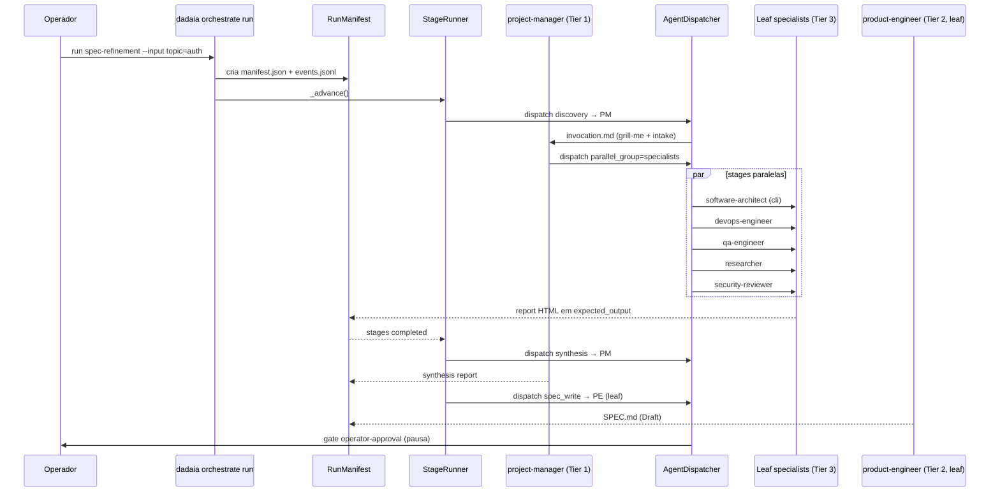

CLI surface: `dadaia orchestrate {list|show|run|status|resume}` · Closure: orchestration-consolidation-v1

## Propósito

Executa **workflows** (DAGs de stages) sobre uma topologia de **20 agentes em 3 tiers** : Tier 1 orquestradores com tool `Agent` — `project-manager` (intake + dispatch) e `project-auditor` (drift detection); Tier 2 curator (`product-engineer`) autor de SPEC/PLAN/TASKS/CLOSURE e guardião de `specs/memory/*.html` em phase CLOSURE; Tier 3 leaf specialists (17 agentes) sem tool `Agent`, em ordem alfabética: `ai-engineer`, `backend-engineer`, `code-reviewer`, `data-analyst`, `data-engineer`, `design-specialist`, `devops-engineer`, `frontend-engineer`, `game-designer`, `game-developer`, `game-tester`, `qa-engineer`, `researcher`, `security-reviewer`, `software-architect`, `software-engineer-node`, `software-engineer-python`. `product-engineer` e `software-architect` não declaram `Bash`; invocações de shell são delegadas ao PM.

**Split do software-engineer (r3):** a persona genérica `software-engineer` foi retirada e dividida em dois especialistas focados — `software-engineer-python` (Python lib, scripts, pytest, FastAPI/Flask, Docker, AWS Lambda) e `software-engineer-node` (Node 20 LTS+, TypeScript/JavaScript server-side, security-conscious, sem superfície de browser). A motivação operacional foi a de que `software-engineer` havia se tornado genérico demais, absorvendo runtime concerns de duas linguagens distintas e bloqueando a clareza de dispatch.

**Novos especialistas r3 — data + BI + AI:** três domínios ganharam personas próprias. `data-engineer` cobre SQL+NoSQL, OLTP/OLAP, Spark/Airflow/Kafka, Databricks (DABs, Delta Tables, notebooks, workflows) e file formats (CSV/AVRO/JSON/Parquet/Delta/Iceberg); escopo primário em `repos/redacted-slug-explorer/**`, disponível cross-project. `data-analyst` é o BI specialist — Databricks Genie + Dashboards via DABs, data viz + storytelling, Playwright dashboard evaluation; pareia com `design-specialist` para review visual (mesmo padrão de `frontend-engineer` ↔ `design-specialist`). O pairing `data-engineer` → `data-analyst` segue o pattern de cadeia: o data-engineer cura pipelines e materializa tabelas Delta/Iceberg que o data-analyst consome para construir dashboards e relatórios BI.

**AI-entity surface authority:** `ai-engineer` é o owner **exclusivo** do conjunto de arquivos markdown de entidades AI da lib — `dadaia_workspace/public/{skills,rules,workflows,commands,agents,hooks}/**`. Conhece context engineering, prompt design, análise de eficiência de skill/rule/workflow/hook, e fundamentos de runtime do claude-code + codex + opencode. Gera reports de eficiência de prompt e cost vs output. Não toca implementação Python/Node nem specs. `product-engineer` retém autoria de SPEC/PLAN/TASKS/CLOSURE e memory atoms; perdeu autoridade _de facto_ sobre `public/agents/*.md`, agora delegada ao `ai-engineer` (a primeira passada de autoria das 5 novas personas em r3 foi feita por `product-engineer` como bootstrap; a primeira passada recursiva do `ai-engineer` sobre sua própria superfície fica para uma release seguinte).

Cada stage dispatcha um agente em runtime escolhido (cli, Claude API, Codex, OpenCode). Suporta dependências, paralelização via `parallel_group`, gates de aprovação humana (`operator-approval`), binding de inputs e retomada após falhas/gates. Cada run produz **manifest** imutável + **event log** JSONL para auditoria completa.

O catálogo declarativo tem **7 workflows** (Tier-1); padrões sem custo YAML ficam como **13 PM Playbooks** (Tier-2) embedidos na skill `project-orchestration`, compostos inline pelo `project-manager`. A separação obedece à **file-iff-X rule** : um padrão ganha arquivo `*.workflow.md` apenas se tiver multi-party `parallel_group` topology, gate de aprovação do operador não-opcional, ou input contract cross-surface nomeado. Tudo abaixo desse limiar fica como PM Playbook. **PM Playbook schema (mandatory 7 fields):** Trigger / Entry / Input contract / Steps / Gate (conditional) / Stop conditions / Done when. **Operator UX contract:** o operador fornece somente demanda em linguagem natural — sem nome de workflow, sem task_id; o PM classifica, auto-reserva task_ids em TASKS.md, e emite intake report nomeando o padrão e os agentes. **Tier-2 → Tier-1 promotion path:** um PM Playbook que adquira multi-party parallel topology, operator-approval gate, ou enforced cross-surface input contract é candidato a promoção para workflow engine em release futura.

### Decision Authority Matrix — domínios novos (r3)

Snapshot dos 5 domínios introduzidos em r3, na ordem em que aparecem em `dadaia_workspace/public/skills/project-orchestration/SKILL.md`. Lista completa da matrix vive no SKILL.md.

Domínio| Autoridade primária| Pode objetar (com evidência)| Tie-breaker  
---|---|---|---  
Python implementation| `software-engineer-python`| `software-architect`| `software-architect`  
Node implementation (server-side)| `software-engineer-node`| `software-architect`, `security-reviewer`| `software-architect`  
Data engineering / pipelines / DABs| `data-engineer`| `software-architect`| `software-architect`  
BI / dashboards / data viz| `data-analyst`| `design-specialist` (visual), `data-engineer` (source)| `design-specialist` (visual), `data-engineer` (data)  
AI entities / skills / rules / workflows / hooks / personas| `ai-engineer`| `product-engineer`| `product-engineer`  
  
## Fluxo de uso

  1. `dadaia orchestrate list` — lista os 7 workflows Tier-1 pré-instalados: `spec-refinement`, `cross-cutting-feature`, `onboarding-new-repo`, `hotfix-release`, `game-dev-cycle`, `audit-cycle`, `code-review-fan-out`. Todos atendem à file-iff-X rule (multi-party parallel, operator-approval gate, ou cross-surface input contract). Padrões que não atendem essa regra vivem como os 13 PM Playbooks Tier-2 na skill `project-orchestration`.
  2. `dadaia orchestrate show audit-cycle` — mostra o schema do workflow (inputs, stages com `needs`/`parallel_group`/`gate`, `expected_output`).
  3. `dadaia orchestrate run spec-refinement --input topic=auth` — cria run (id gerado), persiste `manifest.json`, emite `RUN_STARTED`, identifica stages prontas e despacha-as.
  4. O `StageRunner` agrupa stages com mesmo `parallel_group` e despacha simultaneamente via `AgentDispatcher` (cli/claude/codex/opencode). Cada stage recebe seu `invocation.md` em `.dadaia/runs/<run_id>/<stage_id>/`.
  5. Stages de orquestração (`discovery`, `synthesis`) rodam em `project-manager`; stage `spec_write` roda em `product-engineer` como leaf invocado pelo PM. Stages de implementação rodam nos leaf specialists do Tier 3.
  6. Quando um stage termina, escreve seu output no caminho declarado em `expected_output`; o runner recalcula próximas stages prontas e despacha novamente. Gates pausam o run; `dadaia orchestrate status <run_id>` e `resume <run_id>` permitem inspeção e retomada.

## Trigger típico

Quando o operador endereça `project-manager` com uma demanda em linguagem natural — feature, bug, audit, release, research, design, security. O PM classifica a demanda em dois tiers: Tier-1 (7 engine-backed workflows invocados via `dadaia orchestrate run`) ou Tier-2 (13 PM Playbooks compostos inline a partir da skill `project-orchestration`). O operador nunca nomeia o tier, o workflow, ou o playbook — isso é derivado pelo PM. Também usado por hooks/cron schedules para tarefas recorrentes (ex.: `audit-cycle` semanal).

## Diferencial

A separação em 3 tiers elimina três problemas estruturais da topologia anterior: (1) **product-engineer não é mais bottleneck** — discovery/dispatch/synthesis foram movidos para `project-manager`, e PE volta a ser leaf invocável quando uma spec precisa ser escrita; (2) **sub-agente nunca tenta spawnar sub-agente** — apenas Tier 1 (PM/auditor) declara tool `Agent`, evitando silent failures no harness Claude; (3) **design decoupled de implementação** — `design-specialist` emite specs visuais que `frontend-engineer` consome, sem que FE arbitre UX. Adicionalmente, `project-auditor` traz drift detection de primeira classe entre `specs/memory/*.html` e o código, com compliance score 1–10 em 6 dimensões.

**Path-scope enforcement (r2 + r3):** o gate PreToolUse `sdd-spec-gate.sh` valida `file_path` de Write/Edit/MultiEdit contra `paths.write_allowlist` declarado no frontmatter de cada agente; mismatch → bloqueio com mensagem `[PATH SCOPE ERROR]`. Os 20 agentes declaram `paths:`. Em r3, os allowlists das 5 novas personas seguem essa convenção: `ai-engineer` só escreve em `dadaia_workspace/public/{skills,rules,workflows,commands,agents,hooks}/**` (e seu próprio diretório de reports); `software-engineer-python` e `software-engineer-node` são banidos de `public/**` (território do `ai-engineer`). Apenas 2 rule files canônicos sobrevivem (`game-agents-coordination.md`, `game-developer-scope.md`); rules per-agent inlined nos próprios corpos como seção `## Scope and forbidden actions`. `data/AGENTS.md` é fonte única (Option C) fanned-out para o par `AGENTS.md` + `CLAUDE.md` em workspace-root e em consumer-repos com marker `.dadaia/agentic/`.

## Estado runtime tocado

  * `.dadaia/runs/<run_id>/manifest.json` — registro imutável do run
  * `.dadaia/runs/<run_id>/events.jsonl` — append-only log (RUN_STARTED, STAGE_DISPATCHED, STAGE_COMPLETED, GATE_AWAITING, RUN_COMPLETED, RUN_FAILED)
  * `.dadaia/runs/<run_id>/<stage_id>/invocation.md` — prompt da stage
  * `.dadaia/reports/<context>/<agent>/<ts>-<type>.html` — reports HTML produzidos por cada um dos 20 agentes (diretórios `project-manager`, `project-auditor`, `product-engineer`, `software-engineer-python`, `software-engineer-node`, `backend-engineer`, `frontend-engineer`, `qa-engineer`, `software-architect`, `devops-engineer`, `data-engineer`, `data-analyst`, `ai-engineer`, `game-developer`, `game-designer`, `game-tester`, `code-reviewer`, `researcher`, `security-reviewer`, `design-specialist`) + sidecar `<stem>.handoff.json`

### Sidecar-first emission contract (ADR-X5)

Default de emissão dos 20 agentes é JSON sidecar `handoff-v1.1` em `.dadaia/reports/<context>/<agent>/<stem>.handoff.json`. Campos novos obrigatórios em v1.1: `findings[].detail_md`, `findings[].fix_recommendation`, `scope`, `metrics`. `artifact.path` (HTML) é opcional. HTML só é emitido quando (a) o operador explicitamente solicita via `--with-report` ao dispatcher OU (b) `next_handoff.agent == "human"`. Reports extensos quebram em múltiplos HTMLs com `index.html` de entrada. `project-manager` codifica no playbook a pergunta "HTML or sidecar?" antes de emitir.

Validação: `dadaia reports validate <sidecar.json>` distingue v1.0 vs v1.1; `dadaia reports lint <dir>` flagga orphan HTMLs (sem sidecar), oversized HTMLs (> 30 KB) e missing required fields. Workflows YAML declaram `consumes: [sidecar-path]` — não HTML.

### Dispatch-to-researcher pattern (ADR-X6)

Para phases evidence-heavy — `audit-cycle`, `code-review-fan-out`, `cross-cutting-feature`, `spec-refinement` — o orquestrador (`project-manager`, `project-auditor`, `software-architect`, `code-reviewer`, `security-reviewer`, `devops-engineer`) despacha N agentes `researcher` (Haiku 4.5) em paralelo, cada um com pergunta tightly-scoped. O orquestrador **sintetiza a partir dos sidecars** — não faz Read inline de file sets extensos. Os 4 workflows read-heavy ganharam stage `researcher` injetada em P2-D. Playbook canônico documentado em `dadaia_workspace/public/skills/project-orchestration/SKILL.md`.

Motivação operacional: Read inline em arquivos grandes pelos modelos Sonnet/Opus quebra o target `cache_read / msg ≤ 80 K`; delegando a Haiku 4.5 via sidecar, o cost token cai em ~70% para a mesma cobertura de evidência.

### Plugin-scope enforcement (ADR-X7)

O plugin `frontend-design` é restrito aos agentes `frontend-engineer` e `design-specialist`. Todos os outros agentes da topologia devem recusar invocações com `[PLUGIN SCOPE ERROR]`, mirroring o pattern de `game-developer-scope.md`. Enforcement em três camadas:

  1. Rule canônica em `dadaia_workspace/public/rules/plugin-scope.md` projetada em `.claude/rules/plugin-scope.md` via `dadaia public install`; sempre ativa no workspace.
  2. Allow-list line explícita nos bodies de `frontend-engineer.md` e `design-specialist.md`: _"Plugins authorised: frontend-design, playwright (this agent only — see plugin-scope rule)."_
  3. Verificação opcional pelo `dadaia public doctor` do alinhamento allow-list ↔ rule (drift detection futura).

Justificativa: o plugin polui context surface de agentes non-UI e cria risco de design-pattern leakage fora da superfície UI/UX. `playwright` permanece universal (sem restrição de escopo) — usado por `qa-engineer` (E2E), `data-analyst` (dashboard evaluation) e `frontend-engineer`.

### Codex Dispatcher Capability Matrix (ADR-3)

Introduzida em `codex-agent-orchestration-parity-v1` (2026-05-20). O `CodexAgentDispatcher` suporta sequential e parallel em modo best-effort; capabilities ausentes lançam `OrchestrationUnsupportedError` com motivo legível. Implementado em `dadaia_workspace/infrastructure/codex_agent_dispatcher.py`.

Capability| ClaudeAgentDispatcher| CodexAgentDispatcher| CliAgentDispatcher  
---|---|---|---  
sequential| NATIVE| NATIVE| CLI (manual)  
parallel| NATIVE| best-effort| CLI (manual)  
fan-out| NATIVE| best-effort| CLI (manual)  
audit-loop| NATIVE| best-effort| unsupported  
UserPromptSubmit| NATIVE| not-applicable| not-applicable  
  
## Dependências

  * Depende de [[context-management]] (resolve context ativo para path templating).
  * Depende de [[public-asset-distribution]] (20 agentes + 7 workflows + Option C dual-name pair installer instalados a partir de `public/agents/`, `public/workflows/` e `public/data/AGENTS.md`).
  * Depende de [[agent-comms]] (sidecars `handoff-v1` de cada report; consumido por `project-auditor` em auditorias).
  * Os 20 agentes + 7 workflows (Tier-1) + 2 rules canônicos + 13 PM Playbooks (Tier-2) na skill `project-orchestration` vivem como assets canônicos versionados. Skills cross-cutting: `project-orchestration`, `architecture-code-review`, `security-audit-protocol`, `drift-detection`, `ux-ui-review`, `dadaia-workspace-doctor`, `dev-server-registry`. A consistência entre router PM e artefatos (workflow files + playbook headings) é garantida pelo invariante **D-OC-1** (bidirectional) no `dadaia specs doctor`.
