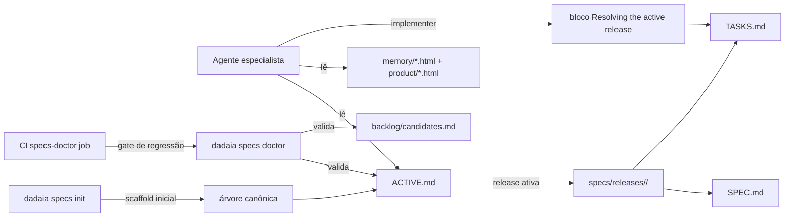

CLI surface: `dadaia specs init [--specs-dir <path>] [--name <project>] [--force]` · Closure: agent-sdd-alignment-v1

## Propósito

Garantir que as definições de **agentes, skills, workflows e templates** em `dadaia_workspace/public/` sejam SDD release-aware: o caminho primário é `specs/releases/<active-release>/{SPEC,TASKS}.md` resolvido via `specs/releases/ACTIVE.md`; `specs/features/<feat>/{SPEC,TASKS}.md` permanece suportado apenas como Legacy compat para repos ainda não migrados (via `SDD_LEGACY_FEATURES=1`). Memória passa a ser lida como HTML atômico: `specs/memory/architecture.html`, `specs/memory/tech-stack.html` e `specs/memory/product/index.html` + `specs/memory/product/<slug>.html` on-demand.

Resolve um gap cognitivo: o gate v3 já bloqueava escritas erradas mecanicamente, mas os 6 agentes especialistas não-game-engine (`software-architect`, `software-engineer`, `qa-engineer`, `devops-engineer`, `frontend-engineer`, `backend-engineer`) e 4 skills + 4 workflows ainda referenciavam caminhos legacy. Implementers recebiam 0 hits ao procurar `features/<x>/TASKS.md` e dependiam de compat env var; ONBOARD/REVIEW workflows silenciosamente pulavam memory HTML. Esta release fechou a lacuna.

## Fluxo de uso

  1. **Discovery** : agente precisa de contexto SDD — lê `specs/releases/ACTIVE.md` para descobrir release ativa (`release: <id> / phase: <phase>`). Se `release: none`, opera apenas em modo read-only ou em escopo de scaffolding.
  2. **Memory load** : lê `specs/memory/architecture.html` + `specs/memory/tech-stack.html` + `specs/memory/product/index.html`; per-feature HTMLs (`product/<slug>.html`) são carregados sob demanda. Doctor garante atomicidade via SPEC-DOC-005/006/008.
  3. **Spec load** : lê `specs/releases/<active-release>/{SPEC,TASKS}.md`. Para implementers (`software-engineer`, `frontend-engineer`), bloco "Resolving the active release" no agente formaliza o protocolo. Compat legacy: se `ACTIVE.md` ausente ou `release: none` + repo legacy detectado, cair em `specs/features/<feat>/{SPEC,TASKS}.md` com `SDD_LEGACY_FEATURES=1`.
  4. **Scaffold** : novo repo entra no modelo via `dadaia specs init --specs-dir specs/ --name <project>`. Cria 8 outputs canônicos + 3 `.gitkeep`. `ACTIVE.md` nasce com `release: none / phase: none` (canonical phase suportada via E3).
  5. **Doctor** : `dadaia specs doctor` valida SPEC-DOC-003 estendido (ACTIVE.md sem empty values) e SPEC-DOC-012 (schema do `backlog/candidates.md`). CI roda `poetry run dadaia specs doctor` em todo PR via job `specs-doctor` em `.github/workflows/ci.yml`.
  6. **Migração** : repos legacy seguem `docs/sdd-migration-playbook.md` (6 passos canônicos referenciando `sdd-release-lifecycle-v1/SPEC.md` Phase 6 como case study).

## Trigger típico

Qualquer sessão de agente especialista que precise consultar SPEC/TASKS/memory; criação de novo repo no workspace (`dadaia specs init`); migração de repo legacy seguindo `docs/sdd-migration-playbook.md`; PR no CI que dispara o job `specs-doctor`. Critério mecânico: **se o agente é um dos 6 especialistas não-game-engine, ele já fala release-based nativamente; se o repo é novo, scaffold + ACTIVE.md com`release: none / phase: none` é o ponto de partida.**

## Diferencial

Sem este alinhamento, agentes referenciavam paths inexistentes (`specs/memory/product.html` singular, `specs/features/<feat>/...` em repos já migrados) e implementers dependiam de compat env var para qualquer escrita — degradando confiança na pipeline SDD. Ao reescrever os agentes/skills/workflows com **surgical patches** (sem reescrita completa, mantendo voz/estrutura), o custo cognitivo é zero e a compat legacy permanece intacta para repos não-migrados. O endurecimento do doctor (SPEC-DOC-003 + SPEC-DOC-012) garante que regressões estruturais (ACTIVE.md malformado, backlog poluído) sejam detectadas no CI antes de chegarem a produção. O subcomando `dadaia specs init` torna o modelo replicável: novo repo recebe toda a árvore SDD canônica em uma chamada, com templates Jinja2 gracefully fallback para projetos vazios.

## Estado runtime tocado

  * Read: `specs/releases/ACTIVE.md`, `specs/memory/{architecture,tech-stack}.html`, `specs/memory/product/index.html`, `specs/memory/product/<slug>.html` on-demand, `specs/releases/<active>/{SPEC,TASKS}.md`, `specs/backlog/candidates.md`.
  * Write (apenas implementers durante phase TASKS/IMPLEMENTATION com task `[-]` ativa): código de produção + `specs/releases/<active>/TASKS.md` markers.
  * Doctor checks ativos: **SPEC-DOC-003 estendido** (ACTIVE.md sem empty values em `release:` ou `phase:`); **SPEC-DOC-012** (backlog schema: bullets sob `## Candidatas ativas` seguem regex documentado; seções `## Histórico*` e `## Hotfixes pendentes` tratadas separadamente).
  * CLI surface adicional: `dadaia specs init` grupo `specs`; templates em `dadaia_workspace/public/templates/memory-{architecture,tech-stack,product-index}.html.j2` com defaults graceful (`{{ project_name }}`, `{{ today }}`, `{{ last_release_id }}="none"`, catálogo vazio, layers vazias).
  * Compat legacy: `SDD_LEGACY_FEATURES=1` env var ativa fallback para `specs/features/<feat>/{SPEC,TASKS}.md` em repos ainda não migrados.

## Dependências

  * Roda sobre [[sdd-gate-v3]] sem modificá-lo — gate continua bloqueando writes em `specs/memory/*` fora de `phase: CLOSURE` e exigindo task `[-]` ativa para edits em produção.
  * [[specs-doctor]] ganha SPEC-DOC-003 estendido e SPEC-DOC-012 (backlog schema); `"none"` adicionado a `CANONICAL_PHASES` para suportar repo recém-scaffoldado sem release ativa.
  * [[public-asset-distribution]] propaga agentes/skills/workflows atualizados via `dadaia public stage && dadaia public install --target all`; `dadaia public doctor` retorna `[ok]` em todos os targets.
  * CI (`.github/workflows/ci.yml`) ganhou job `specs-doctor` executando `poetry run dadaia specs doctor --specs-dir specs` — gate de regressão automatizado.
  * [[sdd-hotfix-track]] compartilha doctor + scaffolder; coexiste sem modificação (hotfix release é apenas outro tipo de release SemVer).
  * Migration playbook `docs/sdd-migration-playbook.md` referencia `sdd-release-lifecycle-v1/SPEC.md` Phase 6 como case study trabalhado da migração do próprio dadaia-workspace.

## Fora de escopo (drifts conhecidos)

  * Agentes de jogo (`game-developer`, `game-designer`) continuam em legacy path. Tracked no backlog como `game-agents-split`. Workflow `game-spec-definition.workflow.md` recebeu apenas patch de path.
  * OpenCode hooks (readiness audit item #5) e `primary_context` choice/multi-context (#7) não tocados — releases futuras.
  * Stale tasks de `sdd-release-lifecycle-v1/TASKS.md` (T-5.2 a T-5.6 + T-V.1 a T-V.6) permanecem `[ ]` apesar de implementadas — será resolvido na CLOSURE daquela meta-release.
  * Migration playbook não é propagado via `dadaia public` — vive em `docs/` (operator-facing, mesmo padrão de `docs/sdd_patterns.md`).
  * Pre-commit hook local — apenas CI nesta release; pode virar release subsequente.
