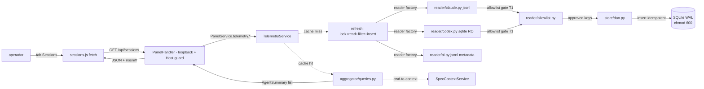

CLI surface: integrado ao `dadaia panel` (aba Sessions + endpoints `/api/agents`, `/api/sessions`)

## Propósito

Telemetria local de agentes consumida exclusivamente de arquivos do operador (Claude Code `~/.claude/projects/*.jsonl` + Codex `~/.codex/state_5.sqlite`) — zero APIs remotas, zero dependências Node, zero `ccusage`. O módulo `features/telemetry/` (peer de `features/panel/`) materializa uma camada SQLite local (`~/.dadaia/state/telemetry/telemetry.sqlite`) com WAL + foreign keys + schema versionado via `PRAGMA user_version`, e expõe os endpoints `/api/agents` (+ drill-down `/api/agents/{id}/sessions`) e `/api/sessions` consumidos pela aba Sessions do [[panel]] — servidos **sem credencial**, atrás do bind loopback + Host allowlist do panel.

**Os três runtimes de telemetria são `{claude, codex, pi}`.** O `reader/pi.py` ingere metadata de sessão PI de `~/.pi/agent/sessions/` (jsonl por dir-slug) e o `PiRuntimeAdapter` (`ADAPTER_REGISTRY["pi"]`, `aggregator/runtimes.py`) faz enrichment + liveness por mtime de session-file, espelhando a postura Claude/Codex; custo é desconhecido para PI (sem per-event pricing) ⇒ `cumulative_cost_usd=None`/`cost_known=False`, nunca fakeado. Invariant T1: o reader lê só linhas `session`/`model_change`/`thinking_level_change` (id, cwd, timestamp, modelId, provider) e **exclui a linha `message` inteira** (nenhum body/conteúdo), degradando idle em falha de IO/parse. PI sessions aparecem na aba Sessions quando existe um source local real.

**Limite conhecido:** o factory pragmatizado `store/schema.open_connection` (WAL + synchronous=NORMAL + foreign_keys) **existe mas não está wired** nos caminhos de conexão reais — o SQLite do panel corrompe sob Playwright concorrente (bug tracked; unificação no backlog `panel-runtime-reliability`).

Resolve a invisibilidade dos custos e padrões de uso por agente: o operador roda em paralelo product-engineer / software-engineer / software-architect / 7 outros agentes especialistas e até a release `agent-monitoring-v1` não tinha forma de inspecionar quem consumiu quanto, por modelo, por Spec Context, por dia. A release entrega uma superfície numbers-only (D-AM-20) — sem thresholds, sem alerts, sem push — onde o operador inspeciona visualmente. Privacidade por construção: **nenhum endpoint serve conteúdo bruto de mensagens** — allowlist gate hardcoded no reader é a única porta para SQLite.

## Fluxo de uso

  1. **Boot do panel** : `dadaia panel` faz boot do `TelemetryService` em modo "no-telemetry" se `PRAGMA integrity_check` falhar (SQLite renomeado para `telemetry.sqlite.corrupt.<ts>` + endpoints 503 com mensagem human-readable). Nenhum token é criado — as rotas são servidas sem credencial.
  2. **Operador abre a aba Sessions** : `sessions.js` faz `fetch('/api/sessions?runtime=…')`. Service detecta cache miss (cache TTL 30s) ou cache hit. Em cache miss: chama `refresh()` que (a) adquire lock via `fcntl.flock` em `~/.dadaia/state/telemetry/telemetry.lock`; (b) reader factory escolhe os readers Claude jsonl / Codex sqlite / PI jsonl; (c) rodam com budget enforced (`MAX_BYTES_PER_FILE_PER_CYCLE`, `MAX_LINE_LENGTH`, `MAX_EVENTS_PER_CYCLE`); (d) allowlist gate filtra cada evento mantendo apenas keys aprovadas; (e) DAO insere events idempotentes via `event_id = sha1(sessionId||uuid)[:20]`; (f) aggregator queries com `cwd→spec_context` lookup em query time via `SpecContextService.list_all()`.
  3. **Endpoints de agregação** : `/api/agents` (+ `/api/agents/{id}/sessions`) permanecem servidos para agregação por agente (não há aba dedicada Agents); SessionId truncado a 8 chars + `...` (anti-enumeração).
  4. **Sub-agents** : identidade vem do evento Claude `type=agent-name` (`agentName` field). `is_subagent` derivado de `isSidechain=1` + `sub_slug`; aparecem separados do "claude (main)".

## Trigger típico

Operador inspeciona consumo de tokens/custos por agente para decidir trade-offs de escolha de modelo, ou correlaciona spike de custo com Spec Context específico. Critério mecânico: **se o operador quer ver "quem consumiu quanto, onde, quando", ele abre a aba Sessions do panel** (there is no Agents tab; `/api/agents` remains served with no dedicated tab).

## Diferencial

Sem este módulo, `ccusage` (npm) era a única alternativa: dependência Node externa, sem suporte a Codex sqlite, sem agregação por Spec Context Project, sem allowlist gate. A telemetria local entrega: (a) **stdlib-only** — zero novas dependências, zero supply-chain surface; (b) **privacy by construction** — allowlist gate hardcoded antes do SQLite + nenhum endpoint serve conteúdo de mensagens (T1 CRITICAL devops); (c) **reproducibilidade de preços** — denormalização via `events.cost_micro_usd` + `events.pricing_version` preserva preços históricos quando `pricing.py` muda; (d) **agregação por Spec Context** resolved em query time, bucket "unassigned" para cwd fora dos contextos; (e) **sub-agents tracked separately** via evento `type=agent-name` + `isSidechain`; (f) **boot defensivo** — corrupt SQLite degrada para 503 com mensagem, não crash.

## Estado runtime tocado

  * **Read** : `~/.claude/projects/*/.jsonl` (Claude Code transcripts) incremental tail com `byte_offset` checkpoint em `reader_state` + inode detection para rotação; `~/.codex/state_5.sqlite` (default; env-overridable) via `sqlite3.connect(f"file:{path}?mode=ro", uri=True, timeout=5.0)` com defensive column selection; `~/.pi/agent/sessions/` (PI session jsonl por dir-slug, metadata-only, T1). Telemetry does NOT ingest workflows — workflow ingestion was removed (the panel reads workflows from the canonical store; [[panel]]).
  * **Read+Write** : `~/.dadaia/state/telemetry/telemetry.sqlite` (chmod 600, dir 0o700) com schema `PRAGMA user_version=6` (`store/schema.py`, migrations 1→6): 4 tables (`reader_state`, `sessions`, `agents`, `events`) + 6 indices — migration 6 dropped the dead `workflows`/`workflow_agents` tables (workflow data moved to the canonical store). WAL + synchronous=NORMAL + foreign_keys=ON. **NO** column de conteúdo (`content`/`text`/`messages`/`snapshot`/`thinking`/`prompt`/`response`) — bloqueado por construção via allowlist gate.
  * **Read+Write** : `~/.dadaia/state/telemetry/telemetry.lock` — process lock via `fcntl.flock` evita refresh concorrente. (Não há arquivo de token: o panel é no-auth; um path residual `panel.token` em `service.py` é dead-code tracked no backlog `hygiene-and-dead-code-cleanup`.)
  * **HTTP routes** : `GET /api/sessions?runtime=…`, `GET /api/sessions/<runtime>/<id>`, `GET /api/agents` (query params: `limit` default 50, `context` slug, `days` default 180), `GET /api/agents/{id}/sessions` (paginação). (`GET /api/workflows` is NOT telemetry — it is served by the panel's WorkflowsService from `.dadaia/agentic/workflows/`.) Todas servidas **sem credencial** — guards: bind loopback + Host allowlist ([[panel]]). `X-Content-Type-Options: nosniff` em JSON.
  * **Retention** : none — no retention/compaction/deletion machinery exists and there is no daily-aggregate table; raw events accumulate in `events` indefinitely. The only 180-day figure is the aggregation-query default `window_days=180` (`features/telemetry/service.py`), surfaced as the `days` query param default.
  * **Guard** : `os.getuid() == 0` recusa start do TelemetryService (devops T6 — não lê `~/.claude/projects/` de outros usuários).

## Dependências

  * Consumido por [[panel]]: a aba Sessions faz fetch dos endpoints (`/api/sessions`); there is no Agents tab (`/api/agents` é servido sem consumer de UI dedicado); `PanelService` injeta `TelemetryService` via DI.
  * Consome [[context-management]] via `SpecContextService.list_all()` para cwd→context lookup em query time (architect D9); bucket "unassigned" para cwd fora dos contextos.
  * Consome tokens da [[brand-identity]] (`--color-cost`, `--color-warning-bg`, `--color-alert`, `--color-accent`, `--color-accent-secondary`) com fallback aos valores anteriores (D-AM-22). Coupling de cronograma zero — release agnóstica de ordem.
  * Stdlib only: `sqlite3`, `secrets`, `fcntl`, `subprocess`, `pathlib`, `json`, `dataclasses`, `datetime`, `re`. Zero novas dependências (NFR3).
