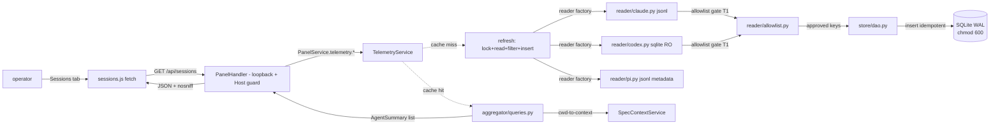

CLI surface: integrated into `dadaia panel` (Sessions tab + endpoints `/api/agents`, `/api/sessions`)

## Purpose

Local agent telemetry consumed exclusively from the operator's files (Claude Code `~/.claude/projects/*.jsonl` + Codex `~/.codex/state_5.sqlite`) — zero remote APIs, zero Node dependencies, zero `ccusage`. The `features/telemetry/` module (peer of `features/panel/`) materializes a local SQLite layer (`~/.dadaia/state/telemetry/telemetry.sqlite`) with WAL + foreign keys + schema versioned via `PRAGMA user_version`, and exposes the `/api/agents` (+ drill-down `/api/agents/{id}/sessions`) and `/api/sessions` endpoints consumed by the [[panel]] Sessions tab — served **with no credential**, behind the panel's loopback bind + Host allowlist.

**The three telemetry runtimes are `{claude, codex, pi}`.** `reader/pi.py` ingests PI session metadata from `~/.pi/agent/sessions/` (jsonl per dir-slug) and the `PiRuntimeAdapter` (`ADAPTER_REGISTRY["pi"]`, `aggregator/runtimes.py`) does enrichment + liveness by session-file mtime, mirroring the Claude/Codex posture; cost is unknown for PI (no per-event pricing) ⇒ `cumulative_cost_usd=None`/`cost_known=False`, never faked. Invariant T1: the reader reads only `session`/`model_change`/`thinking_level_change` lines (id, cwd, timestamp, modelId, provider) and **excludes the entire `message` line** (no body/content), degrading idle on IO/parse failure. PI sessions contribute to the Sessions dashboard aggregate when a real local source exists.

The pragmatized factory `store/schema.open_connection` (WAL + synchronous=NORMAL + foreign_keys) **is wired into the real connection paths** (since v0.1.52 — `features/telemetry/service.py`, `aggregator/queries.py`); a corrupt database at boot degrades to the 503 "no-telemetry" mode described in the usage flow.

It solves the invisibility of per-agent costs and usage patterns: the operator runs product-engineer / software-engineer / software-architect / 7 other specialist agents in parallel, and until the `agent-monitoring-v1` release there was no way to inspect who consumed how much, per model, per Spec Context, per day. The release delivers a numbers-only surface (D-AM-20) — no thresholds, no alerts, no push — where the operator inspects visually. Privacy by construction: **no endpoint serves raw message content** — the hardcoded allowlist gate in the reader is the only door to SQLite.

## Usage flow

  1. **Panel boot**: `dadaia panel` boots the `TelemetryService` in "no-telemetry" mode if `PRAGMA integrity_check` fails (SQLite renamed to `telemetry.sqlite.corrupt.<ts>` + endpoints 503 with a human-readable message). No token is created — the routes are served with no credential.
  2. **Operator opens the Sessions tab**: `sessions.js` does `fetch('/api/sessions?runtime=…')`. The service detects a cache miss (cache TTL 30s) or a cache hit. On cache miss: it calls `refresh()` which (a) acquires the lock via `fcntl.flock` on `~/.dadaia/state/telemetry/telemetry.lock`; (b) the reader factory picks the Claude jsonl / Codex sqlite / PI jsonl readers; (c) they run with an enforced budget (`MAX_BYTES_PER_FILE_PER_CYCLE`, `MAX_LINE_LENGTH`, `MAX_EVENTS_PER_CYCLE`); (d) the allowlist gate filters each event keeping only approved keys; (e) the DAO inserts events idempotently via `event_id = sha1(sessionId||uuid)[:20]`; (f) the aggregator queries with a `cwd→spec_context` lookup at query time via `SpecContextService.list_all()`. Since v0.1.52 `/api/sessions` returns the **aggregate-only envelope** — `sessions.js` renders it as the 4-card summary dashboard; **the Sessions tab is dashboard-only** (no per-session rows, no list table, no detail drawer).
  3. **Aggregation endpoints**: `/api/agents` (+ `/api/agents/{id}/sessions`) remain served for per-agent aggregation (there is no dedicated Agents tab); SessionId truncated to 8 chars + `...` (anti-enumeration).
  4. **Sub-agents**: identity comes from the Claude event `type=agent-name` (`agentName` field). `is_subagent` derived from `isSidechain=1` + `sub_slug`; they appear separate from "claude (main)".

## Typical trigger

The operator inspects per-agent token/cost consumption to decide model-choice trade-offs, or correlates a cost spike with a specific Spec Context. Mechanical criterion: **if the operator wants to see "who consumed how much, where, when", they open the panel's Sessions tab** — a dashboard-only surface (4 aggregate stat cards; no per-session list or detail view). There is no Agents tab; `/api/agents` remains served with no dedicated tab.

## Differentiator

Without this module, `ccusage` (npm) was the only alternative: an external Node dependency, no Codex sqlite support, no aggregation by Spec Context Project, no allowlist gate. Local telemetry delivers: (a) **stdlib-only** — zero new dependencies, zero supply-chain surface; (b) **privacy by construction** — hardcoded allowlist gate before SQLite + no endpoint serves message content (T1 CRITICAL devops); (c) **price reproducibility** — denormalization via `events.cost_micro_usd` + `events.pricing_version` preserves historical prices when `pricing.py` changes; (d) **per-Spec-Context aggregation** resolved at query time, "unassigned" bucket for cwd outside the contexts; (e) **sub-agents tracked separately** via the `type=agent-name` event + `isSidechain`; (f) **defensive boot** — corrupt SQLite degrades to 503 with a message, not a crash.

## Runtime state touched

  * **Read**: `~/.claude/projects/*/.jsonl` (Claude Code transcripts) incremental tail with `byte_offset` checkpoint in `reader_state` + inode detection for rotation; `~/.codex/state_5.sqlite` (default; env-overridable) via `sqlite3.connect(f"file:{path}?mode=ro", uri=True, timeout=5.0)` with defensive column selection; `~/.pi/agent/sessions/` (PI session jsonl per dir-slug, metadata-only, T1). Telemetry does NOT ingest workflows — workflow ingestion was removed (the panel reads workflows from the canonical store; [[panel]]).
  * **Read+Write**: `~/.dadaia/state/telemetry/telemetry.sqlite` (chmod 600, dir 0o700) with schema `PRAGMA user_version=6` (`store/schema.py`, migrations 1→6): 4 tables (`reader_state`, `sessions`, `agents`, `events`) + 6 indices — migration 6 dropped the dead `workflows`/`workflow_agents` tables (workflow data moved to the canonical store). WAL + synchronous=NORMAL + foreign_keys=ON. **NO** content column (`content`/`text`/`messages`/`snapshot`/`thinking`/`prompt`/`response`) — blocked by construction via the allowlist gate.
  * **Read+Write**: `~/.dadaia/state/telemetry/telemetry.lock` — process lock via `fcntl.flock` prevents concurrent refresh. (There is no token file: the panel is no-auth; no `panel.token` residue remains in `features/telemetry/` — the tracked cleanup completed.)
  * **HTTP routes**: `GET /api/sessions?runtime=…` (aggregate-only envelope), `GET /api/agents` (query params: `limit`, `context`, `days`), and `GET /api/agents/{id}/sessions` (pagination). Workflow presentation belongs to the panel's `2º Agentic Layer` and has no separate `/api/workflows` endpoint. All routes are served **with no credential** behind the loopback bind + Host allowlist ([[panel]]), with `X-Content-Type-Options: nosniff` on JSON.
  * **Retention**: none — no retention/compaction/deletion machinery exists and there is no daily-aggregate table; raw events accumulate in `events` indefinitely. The only 180-day figure is the aggregation-query default `window_days=180` (`features/telemetry/service.py`), surfaced as the `days` query param default.
  * **Guard**: `os.getuid() == 0` refuses to start the TelemetryService (devops T6 — does not read other users' `~/.claude/projects/`).

## Dependencies

  * Consumed by [[panel]]: the dashboard-only Sessions tab fetches the `/api/sessions` aggregate; there is no Agents tab (`/api/agents` is served with no dedicated UI consumer); `PanelService` injects `TelemetryService` via DI.
  * Consumes [[context-management]] via `SpecContextService.list_all()` for the cwd→context lookup at query time (architect D9); "unassigned" bucket for cwd outside the contexts.
  * Consumes [[brand-identity]] tokens (`--color-cost`, `--color-warning-bg`, `--color-alert`, `--color-accent`, `--color-accent-secondary`) with fallback to the previous values (D-AM-22). Zero schedule coupling — release is order-agnostic.
  * Stdlib only: `sqlite3`, `secrets`, `fcntl`, `subprocess`, `pathlib`, `json`, `dataclasses`, `datetime`, `re`. Zero new dependencies (NFR3).
