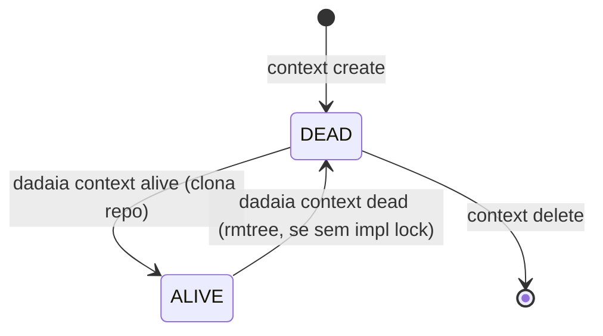

CLI surface: `dadaia context {create|list|show|alive|dead|bind|release|heartbeat|delete}` · `dadaia migrate [--dry-run] [--yes]` · `dadaia {release|backlog|bug} new` · `dadaia memory product add` · `dadaia migrate tree-v2` · Closure: r2-lock-toctou-hardening-v1

## Propósito

Gerencia múltiplos **Spec Context Projects** — cada um mapeia `nome → repo_slug → repo_url` e tem state machine binária: **ALIVE** (repo clonado em `repos/<repo_slug>/`, disponível para implementação) ou **DEAD** (repo removido do disco, fora de uso). Não existe "global primary": o context ativo por sessão é estabelecido via _session binding_ (`eval $(dadaia context bind ...)`), exportando `DADAIA_CONTEXT`, `DADAIA_SESSION_ID` e `DADAIA_MODE` no shell da sessão.

O modelo v2 (semver 2.0.0) elimina o contexto global implícito. Cada sessão de agente declara seu contexto explicitamente. O gate `sdd-spec-gate.sh` valida a identidade da sessão e o ownership do implementation lock antes de permitir qualquer write em produção.

### State machine ALIVE/DEAD

### Session binding e três camadas de locking

Uma sessão de agente obtém identidade via:

    eval $(dadaia context bind <name> --mode implementation --release <id>)
    # → exporta DADAIA_CONTEXT, DADAIA_SESSION_ID (sess_<uuid4>), DADAIA_MODE=IMPLEMENTATION

Três camadas de lock garantem operações concorrentes seguras:

Lock| Caminho| Impl| Escopo
---|---|---|---
Lock 1 (workspace)| `.dadaia/states/.ws_lock`| fcntl LOCK_EX, 5 s timeout| Toda mutação em `spec_contexts.json` (`alive()`, `dead()`, `create()`, `delete()`, `DoctorService.fix()`, `context bind`, `context release`)
Lock 2 (per-context)| `.dadaia/states/ctx_locks/<slug>.lock`| fcntl LOCK_EX, 5 s timeout| `git clone` e `shutil.rmtree` por context (fora do Lock 1; L1>L2 é a única direção safe)
Lock 3 (per-release)| `.dadaia/locks/implementation/<ctx>__<release>.json`| JSON state machine (FREE → HELD → STALE → RECLAIMED)| Direito de BOUND_IMPLEMENTATION para um par context/release; heartbeat TTL 300 s; PID liveness fast-path

### Modos de sessão (--mode)

Mode| Cria Lock 3?| Semântica
---|---|---
`read`| Não| Sessão read-only; gate bloqueia todos os writes de produção, memory e releases.
`spec`| Não| Permite escrever em `specs/memory/**`; bloqueia produção e releases com impl lock ativo (R-9).
`implementation`| Sim (BOUND_IMPLEMENTATION)| Requer `--release <id>`; permite escrever em produção quando lock é próprio; resolve release ativa do lock file, não do ACTIVE.md.
`review`| Não (BOUND_REVIEW session file)| Sessão de revisão; pode escrever em `.dadaia/reports/**`; não pode escrever produção. Impl-XOR-Review: exclui-se mutuamente com BOUND_IMPLEMENTATION para o mesmo context/release. Um impl lock **STALE** (heartbeat expirado ou PID morto) bloqueia o review bind da mesma forma que HELD — o operador deve reclamar ou liberar o lock antes que a revisão prossiga (`dadaia context bind --force --reason ...` ou `dadaia context release` na sessão original). O check-then-act em `bind()` é atômico sob o workspace fcntl lock para ambos os caminhos IMPLEMENTATION (non-force) e REVIEW.

### Heartbeat e reclaim

O hook PostToolUse `sdd-post-gate.sh` renova `last_seen_at` atomicamente a cada tool call da sessão. TTL default: 300 s. Lock com `last_seen_at` mais antigo que TTL → estado STALE. PID inativo → STALE imediato. Reclaim: `dadaia context bind --force --reason <texto>` (reason obrigatório; evento RECLAIMED gravado em `lock-events.jsonl`). `dadaia context heartbeat` renova manualmente para sessões read-only longas.

### Migração v1→v2 (`dadaia migrate`)

Qualquer workspace v1 (`schema_version: "1"` ou `state: "ativo"`) é bloqueado com loud guard ao rodar qualquer comando `dadaia context`. Migração:

    dadaia migrate [--dry-run] [--yes]

Ações: mapeamento de estados (`"ativo"`→`"alive"`, `"inativo"`→`"dead"`), renomeação de campos (`activated_at`→`alive_since`), remoção do flag global legado, adição de `dead_since: null`, atualização de `schema_version` para `"2"`, deleção do marcador global legado, criação de `.dadaia/sessions/`, `.dadaia/locks/implementation/`, `.dadaia/states/ctx_locks/`. Idempotente em workspace v2.

### Canonical specs/ tree v2 (scaffold baseline pós spec-context-tree-v2)

O scaffold de novo consumer repo (`dadaia init` + `dadaia context create`) entrega a árvore v2:

  * `specs/constitution.md` — leis absolutas do produto.
  * `specs/memory/architecture.md` e `specs/memory/tech-stack.md` — memory Markdown atômica.
  * `specs/memory/product/index.md` — entry point do catalog; `dadaia memory product add <slug>` cria feature Markdown e regenera o catalog.
  * `specs/backlog/`, `specs/bugs/`, `specs/releases/` — diretórios de lifecycle com `README.md` e `.gitkeep`.
  * `specs/AGENTS.md` — contrato SDD do spec tree para o operador do consumer repo.
  * **Removidos do scaffold:** `specs/foundation/` (depreciado) e `specs/SPEC.md` na raiz (pre-release-model).

Doctor TREE-1..7 enforça e repara esta árvore: `dadaia specs doctor` em workspace recém-scaffoldado deve sair com 0 violations.

**CLIs de criação de artefatos SDD** (evitam frontmatter manual):

  * `dadaia release new <id>` — cria `specs/releases/<id>/SPEC.md` stub com frontmatter canônico.
  * `dadaia backlog new <slug>` — cria `specs/backlog/<slug>.md` stub.
  * `dadaia bug new <slug>` — cria `specs/bugs/<slug>.md` com `session_id: null`.
  * `dadaia memory product add <slug>` — cria feature Markdown em `specs/memory/product/<slug>.md` e regenera `catalog.json` de forma idempotente.

**Migration path para consumer repos existentes (tree layout):** `dadaia migrate tree-v2` move `specs/foundation/` → `specs/releases/legacy/foundation/` e `specs/SPEC.md` → `specs/releases/legacy/SPEC.md` de forma atômica e idempotente.

## Fluxo de uso

  1. `dadaia context create my-project --repo dadaia-workspace` — registra o context (DEAD, sem clone).
  2. `dadaia context alive my-project` — clona o repo em `repos/dadaia-workspace/`, faz checkout da branch, marca ALIVE.
  3. `dadaia context list` — mostra todos com state (ALIVE/DEAD), repo slug, datas.
  4. `eval $(dadaia context bind my-project --mode implementation --release my-release-v1)` — cria sessão BOUND_IMPLEMENTATION; exporta `DADAIA_CONTEXT`, `DADAIA_SESSION_ID`, `DADAIA_MODE`; cria Lock 3 em `.dadaia/locks/implementation/`.
  5. `dadaia context release` — deleta o session file e o Lock 3; libera o pair context/release para outro agente.
  6. `dadaia context dead my-project` — remove o repo do disco (rmtree), marca DEAD. Bloqueado se Lock 3 HELD para o context.

O hook `.dadaia/scripts/ctx-inject.sh` (instalado por `workspace-init`) executa em cada UserPromptSubmit e injeta contexto a partir do binding de sessão exportado via `eval $(dadaia context bind ...)`. Quando não há sessão ligada, o hook pode emitir orientação read-only para descoberta, mas produção, release e memory writes continuam bloqueados até `DADAIA_CONTEXT`, `DADAIA_SESSION_ID` e `DADAIA_MODE` apontarem para uma sessão válida.

## Trigger típico

Quando o operador vai começar a trabalhar em um repositório novo, ou quando um agente precisa adquirir o direito exclusivo de implementação em um release específico de um context ALIVE.

## Diferencial

Sem context management v2, múltiplos agentes em paralelo podem editar a mesma release simultaneamente (R-8), um agente pode remover o repo enquanto outro tem fds abertos (R-4), ou duas sessões podem corromper `spec_contexts.json` por update perdido (R-1). O modelo ALIVE/DEAD + session binding + três camadas de locking fecha esse surface completamente sem depender de serialização de processo externo. A exclusão mútua Impl-XOR-Review habilita o fluxo de Review/Quality do Kanban com garantia de que um revisor nunca sobrescreve o que um implementador está produzindo.

## Estado runtime tocado

  * `.dadaia/states/spec_contexts.json` — registro de todos os contexts (`schema_version: "2"`; state ALIVE/DEAD; `alive_since`; `dead_since`; sem flag global)
  * `.dadaia/states/.ws_lock` — fcntl workspace lock (gitignored; criado em runtime)
  * `.dadaia/states/ctx_locks/<slug>.lock` — fcntl per-context lock (gitignored)
  * `.dadaia/sessions/<sess_*>.json` — session files (criados por `context bind`; deletados por `context release`)
  * `.dadaia/locks/implementation/<ctx>__<release>.json` — Lock 3 implementation lock (criado por bind IMPLEMENTATION; deletado por release)
  * `.dadaia/logs/lock-events.jsonl` — audit log append-only (eventos: ACQUIRED, RELEASED, STALE_DETECTED, RECLAIMED, HEARTBEAT, BLOCKED_ATTEMPT)
  * `repos/<repo_slug>/` — repo clonado durante `alive`, removido em `dead`
  * `DADAIA_CONTEXT`, `DADAIA_SESSION_ID`, `DADAIA_MODE` — env vars exportadas por `eval $(dadaia context bind ...)`

**Removido em v2:** o antigo marcador global de contexto é deletado por `dadaia migrate` e não é recriado em nenhum code path v2.

## Dependências

  * Depende de [[workspace-init]] (cria `spec_contexts.json` e o hook ctx-inject; garante que `.dadaia/sessions/`, `.dadaia/locks/`, `.dadaia/states/ctx_locks/` existam após `dadaia migrate`).
  * `alive()` indiretamente usa git clone (infra); `dead()` usa rmtree.
  * [[sdd-gate-v3]] lê os session files e o Lock 3 para validar identidade + ownership por sessão.
  * [[workspace-doctor]] valida invariantes LOCK-1..6 sobre os lock files e session files.
  * [[agent-orchestration]] consome `DADAIA_CONTEXT` exportado por bind para resolver paths de specs.
