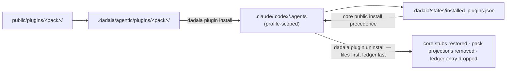

## Purpose

Three agents ship as behavior-less stubs in the core install — `frontend-engineer` and
`design-specialist` (browser HTML/CSS/JS/TS/React + UX/UI) and `devops-engineer` (CI/CD,
GitHub Actions, gitflow, deploy). They are **not** part of the 9-core roster (constitution
§14). Plugin packs are how an operator **enables** them for a specific workspace, turning
the `[PLUGIN REQUIRED]` stub into a real, dispatchable agent with a genuine SDD-role body.

Packs are distributed **in-package** (no network, offline-safe, privacy-clean): the source
lives under `dadaia_workspace/public/plugins/<pack>/` and is staged like every other public
asset type. Two packs ship, each with a **4-skill corpus** (hard-ceiling enumerated,
contract-locked to a per-pack roster map): `frontend-design` (agents `frontend-engineer` +
`design-specialist`; skills `browser-frontend-implementation`, `design-system-authoring`,
`frontend-component-architecture`, `visual-review-protocol`) and `devops` (agent
`devops-engineer`; skills `github-actions-cicd`, `gitflow-release-engineering`,
`container-build-and-deploy`, `cicd-security-hardening`). Each pack carries a `pack.json`
descriptor whose `skills[]` roster equals the on-disk skill dirs, and every pack-agent
`skills:` frontmatter ref is machine-checked — a plugin-aware sweep on the
`check_agent_skill_refs` `[drift]` surface resolves each ref against `public/skills/` ∪ the
pack's own `plugins/<pack>/skills/`, reported through `public doctor` (non-zero on drift).

## Usage flow

1. The operator runs `dadaia plugin install <pack>` (`frontend-design` or `devops`) for a
   workspace. A bogus pack name is a clear usage error (exit 2).
2. Install projects the pack's agents/skills/rules from `.dadaia/agentic/plugins/<pack>/`
   into the runtime roots — **profile-scoped exactly like core `public install --target all`**
   (a claude-only workspace projects only the `.claude/` agent, never a `.codex/` orphan;
   absent profile ⇒ all targets). The pack's real agent body **overwrites the projected core
   stub**; the Codex agent TOML renders the pack model (`gpt-5.3-codex`, the sonnet/plugin
   tier).
3. Install records the pack in the per-workspace ledger `.dadaia/states/installed_plugins.json`
   (`{"schema_version":"1","plugins":[...]}`); re-installing the same pack is a no-op.
4. `dadaia plugin list` shows available vs installed packs; `dadaia plugin doctor` reports
   `[ok]`/`[drift]`/`[missing]` per installed-pack file.
5. **Precedence:** a later core `dadaia public install` reads the ledger and re-projects the
   pack body (not the stub) for any installed plugin — an installed pack agent is never
   silently reverted.
6. **Uninstall:** `dadaia plugin uninstall <pack>` is the exact inverse of install.
   Profile-scoped, it re-projects the **core stub** over each pack agent (`.claude/` md +
   `.codex/` stub render), deletes pack-only skill/rule projections (+ now-empty dirs), and
   drops the pack from the ledger **last** (files first, ledger last — an interrupted
   uninstall never leaves a silent half-state; `plugin doctor` stays ledger-driven). A
   hand-edited projection is restored/removed anyway, **never silently** (one
   `[drift-restored]`/`[drift-removed]` line per file — runtime projections are lib-owned);
   a known-but-not-installed pack is an exit-0 no-op; an unknown pack is a usage error
   (exit 2). An install→uninstall cycle leaves the runtime surface **equivalent to a
   never-installed workspace** (asserted both same-run A/B and against the durable
   never-installed golden baseline), and a reinstall lands the real bodies again.

## Typical trigger

The operator wants browser-frontend / design-review / CI-CD agents active in a workspace
(e.g. building a web UI or a deploy pipeline) instead of routing that work to the operator.

## Differentiator

Before v0.1.60 the plugin agents were permanent stubs and the `plugin-scope` rule said "no
install command exists", so plugin-domain work always routed to the operator (and releases
like v0.1.59 needed a recorded `plugin-scope` deviation to let core agents do browser/UX
work). The install command **retires that deviation class**: plugin capability is now a real,
per-workspace opt-in — and a reversible one: install has its exact inverse, so enabling a pack
is never a one-way door. The design maximizes reuse of proven machinery — it rides the v0.1.58
`_COPY_DIRS` "plugins" staging and mirrors the `harness_profile` ports-and-adapters seam. The
platform is complete for the 2-pack surface: each pack ships its full enumerated skill corpus
(4 skills per pack, ceiling contract-locked; refs machine-checked), and the uninstall inverse
restores the never-installed state doctor-clean.

## Estado runtime tocado

- `dadaia_workspace/public/plugins/<pack>/` — canonical in-package pack source (agents,
  skills, `pack.json`).
- `.dadaia/agentic/plugins/<pack>/` — staged pack assets.
- `.dadaia/states/installed_plugins.json` — the per-workspace installed-plugins ledger.
- `.claude/agents/<name>.md`, `.codex/agents/<name>.toml`, `.agents/skills/`,
  `.claude/rules/` — the projected pack surfaces (pack bodies overwrite the core stub on
  install; core stubs are restored and pack-only projections removed on uninstall;
  profile-scoped both ways).

## Dependencies

- [[public-asset-distribution]] — the plugin projection is an extension of the public
  stage/install/doctor chain (hash-compare, profile-scoping, manifest, `public doctor`).
- [[agent-orchestration]] — the 3 plugin agents and their off-opus (`plugin`/sonnet, `tier:
  3`) model assignment.
- [[tech-stack]] — the registry `plugin` tier and the two "tier" axes.
- [[workspace-init]] — the harness profile that scopes pack projection.
