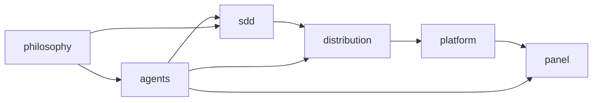

# Product Memory — dadaia-workspace

## Vision

dadaia-workspace is a self-hosting, AI-native workspace generator: one library that
scaffolds spec-driven (SDD) workspaces and projects a single canonical agent surface to
every runtime (Claude Code, Codex, opencode). The product memory below is the current-state
design-of-record for each capability — atomic, grouped by theme, never a changelog.

## Users

The operator who runs a dadaia workspace and the AI agents (project-manager, product-engineer,
software-engineer, the gate + audit personas, ai-engineer) that execute the development
lifecycle inside it. Each agent self-pulls the 1–3 atoms relevant to its task.

## Catalog

Features grouped by thematic area. Each link is a relative path to the atom.

<ol class="catalog">

**agents/** — the agent surface and how it runs
<li><a href="agents/agent-sdd-alignment.md">agent-sdd-alignment</a> — SDD release-aware agents/skills/workflows/templates</li>
<li><a href="agents/agent-orchestration.md">agent-orchestration</a> — DAG runner + PM two-tier dispatch router</li>
<li><a href="agents/agent-monitoring.md">agent-monitoring</a> — local stdlib telemetry feeding the panel Agents/Workflows tabs</li>
<li><a href="agents/agent-comms.md">agent-comms</a> — the handoff-v1.1 contract + `dadaia reports` validation</li>
<li><a href="agents/harness-primitives.md">harness-primitives</a> — all-agent literacy on AI-entity primitives</li>
<li><a href="agents/ai-harness-claude-code.md">ai-harness-claude-code</a> — Claude Code harness decision protocols (ai-engineer)</li>
<li><a href="agents/ai-harness-codex.md">ai-harness-codex</a> — Codex harness decision protocols (ai-engineer)</li>
<li><a href="agents/ai-context-engineering.md">ai-context-engineering</a> — context-engineering craft (ai-engineer)</li>

**sdd/** — the spec-driven-development engine
<li><a href="sdd/sdd-gate-v3.md">sdd-gate-v3</a> — the PreToolUse path-classifier gate + TTL-lease enforcement</li>
<li><a href="sdd/sdd-bug-backlog-governance.md">sdd-bug-backlog-governance</a> — bugs+backlog → release maturity model</li>
<li><a href="sdd/sdd-hotfix-track.md">sdd-hotfix-track</a> — the hotfix fast-lane track</li>
<li><a href="sdd/specs-doctor.md">specs-doctor</a> — structural SDD invariant validation</li>
<li><a href="sdd/quality-assurance.md">quality-assurance</a> — five-layer test architecture + CI split + no-slop policy</li>

**panel/** — the local control surface
<li><a href="panel/panel.md">panel</a> — the local web panel (servers, contexts, reports, memory, kanban)</li>
<li><a href="panel/brand-identity.md">brand-identity</a> — visual identity + design tokens</li>

**platform/** — workspace lifecycle and host integration
<li><a href="platform/context-management.md">context-management</a> — multi-context ALIVE/DEAD lifecycle + the TTL-lease</li>
<li><a href="platform/workspace-init.md">workspace-init</a> — workspace initialization</li>
<li><a href="platform/workspace-doctor.md">workspace-doctor</a> — runtime drift diagnosis + repair</li>
<li><a href="platform/workspace-portability.md">workspace-portability</a> — cross-host / cross-platform portability</li>
<li><a href="platform/server-registry.md">server-registry</a> — dev-server port registry</li>
<li><a href="platform/multi-platform-parity.md">multi-platform-parity</a> — Claude/Codex/opencode parity guarantees</li>

**distribution/** — how the canonical surface ships
<li><a href="distribution/public-asset-distribution.md">public-asset-distribution</a> — `public/` → runtime projection (stage/install/doctor)</li>
<li><a href="distribution/academy.md">academy</a> — copy-from-template course system for onboarding</li>

**philosophy/** — cross-cutting design stance
<li><a href="philosophy/repos-catalog.md">repos-catalog</a> — the spec-context repos catalog model</li>

</ol>

## Capability map

## Limits

dadaia-workspace is **not**: an AI model provider (it orchestrates external harnesses, it
does not serve models); a CI/CD system (it gates and validates locally, but delegates
pipelines to GitHub Actions); a cloud service (it is a local-first library + CLI); a
general project-management tool (its scope is the SDD release lifecycle for code workspaces).
