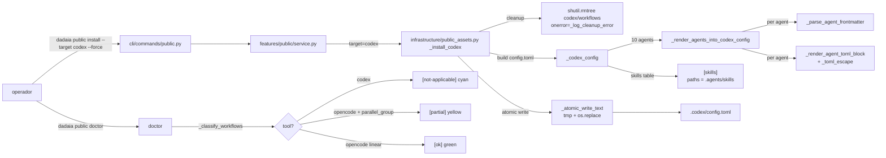

CLI surface: `dadaia public install --target codex --force` · `dadaia public doctor` · Closure: multi-platform-parity-v1 · 2026-05-17

## Propósito

**Multi-platform parity** fecha o _Pilar 3_ da constituição entre as três tools agentic suportadas — **Claude Code** , **Codex** e **OpenCode** — no nível do `.codex/config.toml` e do reporting de `dadaia public doctor`. Antes desta release, o Codex recebia `.codex/agents/` via copy-tree (não consumido pelo runtime do Codex) e `.codex/workflows/` (também não consumido), enquanto o doctor reportava `[unsupported] codex:agents` — uma mentira fria: o slot existia, só estava no formato errado. Agora a paridade é estrutural: Codex carrega 10 blocos `[agents.<name>]` nativos em `.codex/config.toml` (com quoted keys para nomes hifenados), uma tabela `[skills]` com `paths = [".agents/skills"]`, e workflows reportados como `[not-applicable]` em cyan (Codex não tem runtime de workflow). OpenCode mantém `[partial]` para os 5 workflows com `parallel_group` (limite runtime documentado, G3 do platform-boundaries analysis).

Resolve um gap de honestidade: o produto deixa de afirmar "Codex não suporta agentes" (falso — suporta via `[agents.<name>]`) e passa a afirmar "Codex não tem runtime de workflow" (verdadeiro). O doctor vira fonte de verdade legível: cyan para diferença estrutural intrínseca da tool, yellow para drift corrigível, green para parity completa.

**Hardening da projeção OpenCode (agentes + plugins).** `_prepare_agent_for_opencode` em `infrastructure/public_assets.py` ajusta o frontmatter de cada agente para o runtime OpenCode 1.14.x: (a) remove `tools:` (forma de lista, incompatível); (b) remove `color:` (campo Claude-específico que quebra o parse — preservado nas projeções Claude/Codex); (c) emite um bloco `permission:` por-agente mapeando as tools Claude para categorias OpenCode (`Edit`/`Write`→`edit`, `Bash`→`bash`, `WebFetch`→`webfetch`, `Agent`→`task`) com `allow` quando a tool é declarada e `deny` caso contrário (`WebSearch` sem equivalente gera comentário `# [opencode-unsupported]`). Dois plugins em `.opencode/plugins/`: `sdd-gate.ts` intercepta o hook `tool.execute.before` e delega a decisão allow/block ao mesmo `.dadaia/scripts/sdd-spec-gate.sh` do Claude Code (fail-open em erro); `ctx-inject.ts` usa o hook `chat.message` na assinatura `(input, output)`, mutando `output.parts`.

## Fluxo de uso

  1. **Install** : operador roda `dadaia public install --target codex --force`. `_install_codex()` em `infrastructure/public_assets.py` chama `_codex_config()` que monta `config.toml` em três partes: header preservado verbatim, depois `_render_agents_into_codex_config(agents_dir)` que itera `.dadaia/agentic/agents/*.md` e por agent chama `_parse_agent_frontmatter()` (regex stdlib, whitelist `_TOML_SAFE_AGENT_FIELDS = {"name", "description", "model", "tools"}`) + `_render_agent_toml_block(name, fm)` (que aplica `_toml_escape()` em nomes com hifen e descrições em `"""..."""`), depois append da tabela `[skills]\npaths = [".agents/skills"]`.
  2. **Atomic write** : `_write_generated()` delega para `_atomic_write_text(dst, content)` que escreve em `dst.with_suffix(dst.suffix + ".tmp")` e faz `os.replace()` — constitution L105 enforce. `find .codex -name "*.tmp"` empty após install (smoke ADR-ENG-6).
  3. **Cleanup unconditional** : antes do install propagar, `_install_codex()` emite linha `[removed] {path} (not-applicable: codex has no workflow runtime) — N entries` em stderr e roda `shutil.rmtree(codex_dir / "workflows", onerror=_log_cleanup_error)`. O helper `_log_cleanup_error` grava `[cleanup-warning] {path}: {exc}` em stderr sem re-raise (Defensive coding policy floor #2 — substitui o anti-pattern `ignore_errors=True`).
  4. **Doctor** : `dadaia public doctor` usa `_classify_workflows()` que agora reconhece o branch Codex-específico: para todo workflow em `public/workflows/*.workflow.md`, emite `[not-applicable] codex:workflows/<wf>` (linear ou parallel — não importa, Codex não tem runtime). OpenCode mantém `[ok]`/`[partial]` conforme presença de `parallel_group`. CLI styling em `cli/commands/public.py:74` aplica `style="cyan"` a `[not-applicable]` e `[unsupported]` (color reuse via ADR-ENG-1).
  5. **Roundtrip TOML** : `python3 -c "import tomllib; tomllib.loads(open('.codex/config.toml').read())"` não levanta — adversarial inputs em `_toml_escape()` (aspas, brackets, newlines no name; triple-quote na description) cobertos pelos testes T-PB-1 #7/#8.

## Trigger típico

Sessão de operador que onboarding nova máquina ou sincroniza assets agentic depois de mudança em `dadaia_workspace/public/agents/*.md`: `dadaia public stage && dadaia public install --target all`. Critério mecânico: **se houve mudança em`public/agents/` ou `public/skills/`, rodar install. Para auditar sincronia: `dadaia public doctor` — verde geral, cyan para Codex workflows (intencional), yellow apenas se algo derivou.**

## Diferencial

Sem esta release, o produto mentia ao Codex: o slot `.codex/agents/` existia como copy-tree mas o runtime do Codex nunca o lia (Codex lê `[agents.<name>]` em `config.toml`, não diretórios). Workflows idem — copiados, nunca executados. O doctor reportava `[unsupported] codex:agents`, o que confundia: _era_ suportado, só estava no formato errado. A release substitui essa mentira por uma verdade estrutural em três camadas: (a) `[agents.<name>]` blocks emitidos no formato que o Codex de fato consome; (b) `[skills]` table com `paths = [".agents/skills"]` (acordo com o lookup do Codex para o slot skills); (c) doctor honest com `[not-applicable]` + cyan para o que é genuinamente fora do escopo do runtime do Codex (workflows), distinto de `[partial]` + yellow para limites de runtime do OpenCode (parallel sequentialization). O conjunto desbloqueia Codex sessions com persona-per-agent + skills acessíveis sem tocar em `core/`, `features/` ou introduzir runtime deps (stdlib-only, constitution L33+ preserved).

## Estado runtime tocado

  * Read: `.dadaia/agentic/agents/*.md` (10 agentes), `dadaia_workspace/public/workflows/*.workflow.md` (12+ workflows) — via `Path.read_text()` ASCII safe.
  * Write: `.codex/config.toml` (atomic via `_atomic_write_text`); `.codex/workflows/` é unconditionally removido via `shutil.rmtree(onerror=_log_cleanup_error)`; `.codex/agents/` não é mais criado (removido do `_install_codex` tuple).
  * Stderr: `[removed] {path} ... — N entries` antes do rmtree; `[cleanup-warning] {path}: {exc}` em caso de `PermissionError` / `OSError` (sem re-raise — install completa).
  * Helpers privados novos em `infrastructure/public_assets.py` (~89 LoC novas): `_atomic_write_text`, `_parse_agent_frontmatter`, `_toml_escape`, `_render_agent_toml_block`, `_render_agents_into_codex_config`, `_log_cleanup_error`, branch novo em `_classify_workflows` para Codex.
  * Whitelist: `_TOML_SAFE_AGENT_FIELDS = {"name", "description", "model", "tools"}` — frontmatter fields fora dela são _dropped silently_ (R4 mitigation). Bloco inteiro é dropped se `name` ausente.
  * Cobertura: 76% no módulo (97 linhas não cobertas — todas pré-existentes ao escopo da release; ver [CLOSURE Drift §1](../../_archive/releases/multi-platform-parity-v1/CLOSURE.md)).

## Dependências

  * Roda sobre [[public-asset-distribution]] (canonical → `.dadaia/agentic/` → projeções multi-tool); o stage step alimenta `.dadaia/agentic/agents/*.md` que esta release lê.
  * [[specs-doctor]] não é tocado — multi-platform parity opera no `public` doctor (`dadaia public doctor`), separate plane.
  * Zero novas runtime deps: `re`, `pathlib`, `shutil`, `os`, `sys`, `tomllib` (apenas em testes via roundtrip) — tudo stdlib (NFR-4, constitution L33+).
  * Zero overlap com [[agent-comms]]: `handoff_validator.py`, `handoff-v1.schema.json` e `specs/_archive/releases/agent-comms-v1/` intocados (AC-13, AC-15 PASS).
  * Pilar 3 da constituição (`specs/constitution.md` L15–31, amended 2026-05-16) é o mandato binding — pillar text fixa o floor: workflows com `parallel_group` são Claude-exclusive; OpenCode `[partial]`; Codex `[not-applicable]`.

## Próximos passos

  * **`agents-md-hierarchical-v1`** (candidato em `specs/backlog/candidates.md`) — G4 deferido: introduzir Codex hierarchical AGENTS.md rendering (múltiplos `AGENTS.md` em sub-dirs com herança), substituindo a abordagem single-file persona atual. Mantido fora de escopo nesta release para preservar delta gerenciável (~148 LoC) e evitar mistura de mudança de modelo (G4) com paridade de runtime atual (G1/G2/G3/G5 fechados). Owner sugerido: product-engineer (discovery) + software-engineer (impl).
  * **`public-assets-coverage-lift-v1`** (candidato em `specs/backlog/candidates.md`) — fecha o drift AC-12: cobrir testes para os trechos pré-existentes não cobertos em `infrastructure/public_assets.py` (ranges 378–433 em `doctor()`, 595–650 em `_runtime_expectations`, 675–696 nos helpers utilitários), elevando cobertura de 76% para ≥80% (idealmente ≥90% para headroom). Owner sugerido: software-engineer.
  * **Codex schema drift monitoring** (R3 mitigation residual) — manter watch no Codex changelog para sub-table semantics drift; pin schema version em code comment já documenta a assumption. Revisitar via grill-me se Codex shippar mudança breaking.
