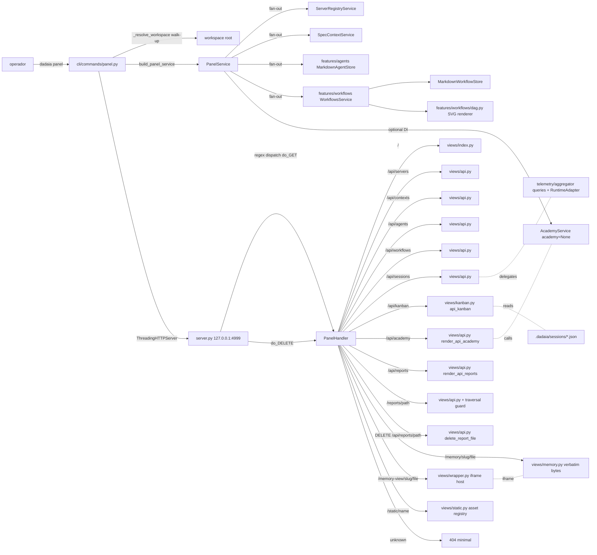

CLI surface: `dadaia panel [--port 4999] [--no-open] [--bind 127.0.0.1]` · Closure: panel-kanban-v1 · 2026-05-31

## Propósito

O **Dadaia Workspace Panel** é a **superfície de controle local** do workspace: uma single-page app servida em `http://127.0.0.1:4999/` que torna o produto navegável em uma janela única, sem ler markdown nem rodar comandos. Tem oito abas, na ordem canônica: _Projects_ (default; cards dos contextos ativos com 4-zone anatomy, local/remote terminology, memory pill chips), _Agents_ (cards compactos com modal dialog nativa para detalhes, per-tab runtime toggle), _Workflows_ (12 cards com detail view + DAG SVG server-rendered + in-panel zoom controls), _Sessions_ (tabela ordenável + drawer + auto-refresh + error state com Retry button), _Kanban_ (board read-only swimlane por Spec Context Project × 4 colunas — Research, Definition, Implementation, Review — sobre os session files de R2 em `.dadaia/sessions/*.json`; Impl ↔ Review XOR lock visual; sem drag/ações em v1), _Reports_ (visualizador de reports indexados por `.handoff.json` sidecars, com delete inline), _Academy_ (infrastructure de módulos de cursos via `AcademyService`), e _Servers_ (registry de dev servers + "Unregistered listeners" com badge LAN-exposed).

Um **theme switcher** no topbar oferece três paletas (Mint default, Sage, Warm) persistidas em `localStorage["dadaia-panel-theme"]`, com pre-paint script que evita FOUC. O topbar exibe o logo rhino em 36px (SVG stroke-based, `logo-rhino-36.svg`, `viewBox 0 0 48 48`, `currentColor` via `--color-cost` #633d2e, WCAG AAA). O runtime switcher (Claude / Codex) foi movido do topbar para os section headers das abas Agents, Workflows e Sessions (per-tab toggle), evitando a pivotagem global — cada aba mantém seu próprio estado de runtime. Hash routing segue gramática `#<tab>[?key=val]` — extensões: `#reports` e `#academy` são novos. O DAG é renderizado **server-side em SVG** via algoritmo longest-path layout — sem Mermaid no browser. Stdlib-only no runtime; Bearer token via `secrets.token_urlsafe(32)` em `~/.dadaia/state/panel.token` (chmod 600); CSP + nosniff em todas as respostas; bind _loopback-only_. **Loopback bypass de autenticação (panel-ux-fix-v1):** quando o panel inicia com bind `127.0.0.1`, `loopback_bypass=True` é passado para `make_handler_class()` e todos os `GET /api/*` retornam 200 sem Bearer token — deliberate dev-local trade-off para uso do operador e de bots locais; mutações (`POST`, `DELETE`) continuam exigindo token. Startup warning: `[PANEL] Auth disabled for loopback (127.0.0.1) connections.`. A detecção é no bind address do servidor (em `panel.py`), não no peer address de cada request. **Memory pages visual identity (panel-ux-fix-v1):** memory HTML é servido com identidade visual do panel via rota wrapper `/memory-view/<slug>/<file>` que injeta `/assets/css/memory.css` (brand palette, typography, spacing tokens). **Agent cards visual identity (panel-ux-fix-v1):** cards de agentes usam brand palette (mint/sage/warm), font sizes ≥ 0.75rem, WCAG AA nos badges de status.

`_resolve_workspace()` em `panel.py` caminha de baixo para cima a partir do cwd para encontrar o workspace root (diretório contendo `.dadaia/`) — `dadaia panel` funciona de qualquer subdiretório do workspace, incluindo `repos/dadaia-workspace/`.

**Handoff-v1.1`verdict` field (panel-kanban-v1):** o schema de handoff em `dadaia_workspace/public/schemas/handoff-v1.schema.json` ganhou um campo opcional `verdict: "APPROVED" | "REJECTED"` + `verdict_reason` (string, opcional). Backward-compatible: sidecars sem `verdict` continuam válidos. Habilita o dual-approval gate: `jq '.verdict' <qa-handoff.json>` e `jq '.verdict' <security-handoff.json>` devem retornar `"APPROVED"` para que o CLOSURE check do CI passe. O job `verdict-gate` em `ci.yml` (script `scripts/check-verdict.sh`) é no-op em push/PR normais (sidecars são gitignored) e é executado em `workflow_dispatch` CLOSURE.

## Fluxo de uso

  1. **Boot** : operador roda `dadaia panel` a partir de qualquer diretório dentro do workspace. `_resolve_workspace()` caminha de baixo para cima até encontrar `.dadaia/`; resolve o workspace root. Bind `127.0.0.1:4999` via `ThreadingHTTPServer` (stdlib), imprime `Panel running at http://127.0.0.1:4999/`, chama `webbrowser.open()` a menos que `--no-open`, e bloqueia até SIGINT. Pre-paint script lê `localStorage["dadaia-panel-theme"]` e seta `data-theme=<mint|sage|warm>` antes do first contentful paint — zero FOUC. `_try_build_telemetry()` é chamado no boot path com handlers per-exception-type (`PermissionError`, `OSError`, `sqlite3.OperationalError`, `ImportError`) que emitem `logging.warning` com a causa raiz antes de retornar `None` — nenhuma das exceptions produz HTTP 503 silencioso.
  2. **Index** : `GET /` renderiza HTML com 7 sections + topbar com theme switcher e logo 36px. **Default-active tab é Projects** ; ordem canônica das abas: Projects → Agents → Workflows → Sessions → Reports → Academy → Servers. Tab switching client-side via `core.js` com `role="tablist"` + `role="tab"` + `role="tabpanel"` + keyboard nav (ArrowLeft/ArrowRight cycle, Home/End jump, Enter/Space activate). `window.Panel.activate(name, opts)` é o ponto de entrada canônico para ativação de módulo; `core.js` registra Sessions, Academy e Reports via `window.Panel.register` no `DOMContentLoaded`. Hash routing: `#projects`, `#agents`, `#workflows`, `#sessions`, `#reports`, `#academy`, `#servers` + `#workflows?detail=<name>`. Hash `#memories` ainda ativa Projects (back-compat). Auth obrigatória via Bearer token em header `Authorization` ou cookie — primeiro load via URL `?token=<value>`.
  3. **Projects** : card por Spec Context Project. Status renomeado: `local` (repo está no disco) / `remote` (repo não está na máquina) — API `GET /api/contexts` retorna os novos labels. Anatomia do card em 4 zonas: Zone A (nome em negrito), Zone B (repo e branch em linhas separadas, monospace, truncado com `text-overflow: ellipsis`), Zone C (session binding — condicional, tintado `--color-session-bg`, exibido apenas quando ≥ 1 sessão ativa; max 3 linhas + "+N more"), Zone D (três memory pill chips — Architecture, Tech Stack, Product — com `--color-chip-memory-bg` background, `--color-accent` border, `--radius-pill`). Todos os cards têm `4px solid var(--color-accent)` left accent; sem badge PRIMARY. Sem contador "N active contexts — 1 primary" — substituído por "N projects" plain count badge. Memory view: two-route split `/memory-view/<slug>/<file>` (iframe wrapper com memory.css brand-identity) + `/memory/<slug>/<file>` (bytes renderizados in-memory de `.md` → HTML via mistune; D-4 — sem arquivo `.html` em disco).
  4. **Agents** : `agents.js` faz `fetch('/api/agents?active_window_days=N&runtime=…')` lazy on tab activation. Card grid compacto (Zones A–D): Zone A (status badge + nome + tier), Zone B (description, 2-line clamp), Zone C (3-col stats: Sessions / Cost Life / Last Seen), Zone D (skill chips + "+N more"); sem expand chevron inline — **clique no card abre modal nativa**. Modal: `<dialog>` nativa com `.showModal()` / `.close()`; ARIA: `role="dialog"`, `aria-modal="true"`, `aria-labelledby="agent-modal-title"`; focus trap (Tab cicla dentro; Escape fecha; foco retorna ao card); close button 44×44px com `aria-label="Close"`; animação opacity 0→1, translateY(12px)→0, 250ms, `--easing-decelerate`; `prefers-reduced-motion`: sem transform, opacity instantânea. Runtime toggle movido para section header (right-aligned `margin-left: auto`); usa classes `.runtime-switcher` + `.runtime-btn` existentes. Source canônica: `MarkdownAgentStore` — 16 arquivos em `.dadaia/agentic/agents/`, 16 cards renderizados. Scroll-margin-top aplicado em cards e triggers de modal: `calc(var(--topbar-h) + var(--nav-h) + var(--space-sm))`.
  5. **Workflows** : `workflows.js` faz `fetch('/api/workflows?runtime=…')` lazy. Card grid com header (nome, description, agent chips, stats footer). Detail view via `#workflows?detail=<name>` + `GET /api/workflows/<name>`. DAG SVG server-rendered via longest-path layout; `role="img"` + `<title>` + per-node `aria-label`. **Zoom controls** : toolbar acima do SVG `[−] [zoom%] [+] [Fit]`; range 50%–300%, step 25%; SVG em `div.workflow-dag-viewport` (`overflow: hidden`, `min-height: 280px`); `transform: scale(N)` via JS; keyboard: `+` zoom in / `−` zoom out / `0` fit (ativo quando foco está dentro da seção DAG); Fit reseta para `scale(1.0)`. Runtime toggle no section header (mesmo padrão de Agents). 12 workflow cards.
  6. **Sessions** : `sessions.js` faz `fetch('/api/sessions?runtime=…')` lazy. Tabela ordenável com 8 colunas: Session / Project / Model / AI Turns / Context / Cost / Last Activity / Status; row click abre drawer. Auto-refresh 10s pausado quando `document.hidden === true`. **Column widths (panel-ux-fix-v1):** cada `<th>`/`<td>` carrega uma classe CSS (ex: `.cell-session`, `.cell-project`, …, `.cell-status`) com `min-width` declarado via CSS class selector — abordagem correta sob `table-layout:fixed` onde `min-width` em `<col>` é silenciosamente ignorado. Valores: SESSION 120px, PROJECT 96px, MODEL 160px, AI TURNS 72px, CONTEXT 80px, COST 72px, LAST ACTIVITY 112px, STATUS 80px (floor total ≈ 792px). Container `.sessions-table-container` tem `overflow-x: auto` — h-scroll abaixo de 792px. `<colgroup>` com percentuais permanece para alocação proporcional em viewports largas. **Codex placeholder (panel-ux-fix-v1):** para Codex sessions sem projeto, a célula PROJECT renderiza `&mdash;`; estilos: `color: var(--color-muted); font-style: italic;` — contraste #666 on white = 5.52:1 (WCAG AA pass). **Error state redesenhado** : container com `role="alert"` abrange todo o table body; inclui `[Retry]` `<button>` com texto explícito que re-dispara `GET /api/sessions`. Scroll-margin-top aplicado no error container. Runtime toggle no section header. Quando `runtime=codex`, coluna Cost vira "—" e banner "Cost not tracked for Codex" aparece. Coluna Context renderiza `context_size_tokens = input_tokens + cache_creation_input_tokens + cache_read_input_tokens`.
  7. **Kanban** : `kanban.js` faz `GET /api/kanban` (bearer-only, loopback bypass aplica) lazy. Board swimlane × 4 colunas (Research / Definition / Implementation / Review). Uma swimlane por Spec Context Project detectado nos session files. Fonte de dados: `views/kanban.py` que lê `.dadaia/sessions/*.json` — _não_ o `TelemetryDao`. Cada card mostra session ID (monospace), runtime, age e dot de status. `is_stale` computado em read-time: card recebe `data-stale="true"`. **Impl ↔ Review XOR lock visual:** quando uma swimlane tem card em `review`, a coluna `implementation` é dimmed (`opacity: 0.40`, classe `kanban-column--locked`, `data-locked="true"`) e vice-versa; ícone de lock no header da coluna bloqueada; ARIA supplement no header. Empty states: coluna vazia → placeholder dashed (`data-testid="kanban-empty-placeholder"`); swimlane sem sessões → "No active sessions"; board sem contextos → "No Spec Context Projects available". Horizontal scroll abaixo de 800px. WCAG AA compliance (contrast ratios auditados em SPEC §3 K-2). Tokens: `--color-kanban-separator`, `--color-kanban-lane-header-bg`, `--opacity-kanban-locked: 0.40`, `--kanban-col-min-w: 200px`, `--kanban-card-min-h: 72px`. Hash route: `#kanban`. POST `/api/kanban` → 405. **v1 é read-only:** sem unbind action, sem drag, sem per-card detail drawer — deferred to v2.
  8. **Reports** : aba nova. `reports.js` faz `GET /api/reports` (bearer-only) lazy. Lista reports agrupados por context via `
/
`. Cada linha: agent tag chip (`--color-report-tag-bg`, `--radius-pill`), title button, date, trash icon button (44×44px touch target, `aria-label="Delete report: [title]"`). Trash click mostra confirmação inline "Are you sure? [Delete] [Cancel]"; Delete chama `DELETE /api/reports/<path>` e remove a linha. Title click: busca e renderiza HTML inline em scoped `
` com `max-height: 80vh` + breadcrumb `[← Back to Reports]` (conteúdo servido por `GET /reports/<path>`). Indexação HTML-first (v0.1.5/rc-2): `GET /api/reports` descobre reports via rglob direto em `*.html` (sidecar-less reports visíveis) e enriquece com sidecars de `.dadaia/handoff/` e `.dadaia/reports/`; deduplica por path HTML. `dadaia reports doctor` (ou `dadaia specs doctor`) valida o invariante `RPT-1`: qualquer sidecar `.handoff.json` cujo `artifact.path` aponta para arquivo não-HTML ou arquivo ausente é flagrado como `[dangling-artifact-path]`. Regista via `window.Panel.register('reports', Reports)`; usa `window.escHtml`.
  9. **Academy** : aba nova. `academy.js` faz `GET /api/academy` (bearer-only) lazy. Lista módulos em grid 2-col (≥ 768px) / 1-col: card com type chip (`--color-academy-chip-bg`, `--color-cost` text, `--radius-pill`), left accent `4px solid var(--color-warning-bg)` (warm olive), title, 2-line description, "Open →" CTA. Click: content view com `[← Back to Academy]`. Empty state: "No academy modules available. Run `dadaia academy create` to add a module." API retorna lista de `AcademyService.list_all()`; retorna `[]` com 200 quando `service.academy is None`. Regista via `window.Panel.register('academy', Academy)`; usa `window.authedFetch` e `window.escHtml`.
  10. **Servers** : `panel.js` faz `fetch('/api/servers')` a cada 5s e swap do `<tbody>` agrupado. Best-effort match de `project.lower() == repo_slug.lower()` contra contextos ativos. Sub-seção "Unregistered listeners" com badge LAN-exposed para bind `0.0.0.0`.
  11. **Theme switcher** : botão visível no topbar abre dropdown com 3 opções (Mint / Sage / Warm). Selecionar seta `data-theme` no root e persiste em `localStorage["dadaia-panel-theme"]`. Escape fecha dropdown e devolve foco ao trigger.
  12. **Shutdown** : Ctrl+C envia SIGINT; signal handler spawn daemon thread que chama `server.shutdown()`, processo exita 0 e libera a porta em ≤2s.

## Trigger típico

O operador quer **visão de controle** do workspace: trocar de tema, conferir quais agentes estão ativos e seu custo cumulativo, inspecionar o estado multi-agente atual no Kanban (qual contexto está em Implementation, em Review, qual sessão está stale), inspecionar a DAG de um workflow antes de despachar, abrir a memory HTML de um Spec Context Project, ver reports produzidos por agentes especialistas, acessar módulos do Academy, e ver se algum dev server está LAN-exposed. Critério mecânico: **se precisa de uma janela única para enxergar e operar o workspace, ele roda`dadaia panel`. Para CI, headless e automação, a CLI direta continua a interface canônica.**

## Diferencial

Sem este panel, o workspace é invisível ao operador casual: precisa-se ler markdown para descobrir agentes e workflows, abrir editores para conferir memory HTML, rodar `dadaia server list` para ver portas, navegar arquivos para ler reports, e não há forma de ver de relance em qual fase está cada contexto multi-agente. O panel pós-panel-kanban-v1 unifica em oito abas com seis decisões load-bearing: (1) **sources canônicas** — agentes vêm de `.dadaia/agentic/agents/*.md`, workflows de `.dadaia/agentic/workflows/*.md`, reports indexados por `.handoff.json` sidecars, academy via `AcademyService`, Kanban via `.dadaia/sessions/*.json` (session files R2, não DAO); (2) **DAG server-side em SVG** via longest-path layout — zero Mermaid no browser, zero JS de layout, SVG cacheado por mtime, accessibility built-in; (3) **3 paletas axe-clean** com tokens CSS extensíveis (`[data-theme="X"]`); (4) **modal nativa`<dialog>`** para detalhes de agentes com focus trap e ARIA conformante — grade permanece intacta; (5) **window.Panel registry** em `core.js` — lazy tab module loading via `register(name, mod)` / `activate(name, opts)` evitando globals avulsos; (6) **Kanban board read-only** (panel-kanban-v1) — swimlane por context × 4 colunas com XOR lock visual Impl ↔ Review, WCAG AA, aria-labelledby em cada lane e coluna, empty states tratados; dados exclusivamente de session files, sem acesso ao TelemetryDao (separação clara de dados). A two-route split de memory permanece (`/memory/` render in-memory + `/memory-view/` wrapper com memory.css). `mistune~=3.0` é a única nova dep de runtime adicionada nesta área (memory-markdown-source-v1; D-1). Stdlib-only nas demais áreas mantém custo de manutenção trivial.

## Estado runtime tocado

  * Read: `.dadaia/states/server_registry.json`, `.dadaia/states/spec_contexts.json`, `.dadaia/agentic/agents/<name>.md` (16 arquivos), `.dadaia/agentic/workflows/<name>.md` (12 arquivos), `repos/<slug>/specs/memory/<path>` (memory `.md` atoms + assets; rendered in-memory via mistune — D-4), telemetria local via [[agent-monitoring]], `.dadaia/reports/**/*.handoff.json` (indexação para Reports tab), `.dadaia/academy/academy.json` (lista de cursos via AcademyService), `.dadaia/sessions/*.json` (session files R2 — Kanban tab, read-only; sem acesso ao TelemetryDao) — todos via `Path.read_bytes()` / `Path.read_text()` sem mutação.
  * Write: apenas `DELETE /api/reports/<path>` deleta o arquivo HTML do report e seu sidecar `.handoff.json` quando solicitado — ambos sob path-traversal guard com `Path.resolve()` + `relative_to(workspace_root/.dadaia/reports/)`. O panel em si é read-only para tudo mais — não toca `specs/memory/*`, não escreve em `server_registry.json`, não se registra no registry.
  * HTTP routes — **três categorias declaradas em`handler.py`**:
    * **Public** (em `_COMPILED_ROUTES`, sem auth): `GET /`, `GET /static/<name>`, `GET /memory/<slug>/<path>`, `GET /memory-view/<slug>/<file>`, `GET /reports/<path>` (path-traversal guard via `Path.resolve()` + `relative_to()`, 403 se fora do boundary).
    * **Bearer-only** (`_BEARER_ONLY_ROUTES` + `_tel_patterns` dispatch): `GET /api/servers`, `GET /api/contexts` (retorna `local`/`remote` — antes `active`/`inactive`), `GET /api/agents?active_window_days=N&runtime=…`, `GET /api/agents/<id>/prompt`, `GET /api/workflows?runtime=…`, `GET /api/workflows/<name>`, `GET /api/sessions?runtime=…`, `GET /api/sessions/<runtime>/<id>`, `GET /api/academy`, `GET /api/reports`, `DELETE /api/reports/<path>`, `GET /api/kanban` (panel-kanban-v1 — board read-only; loopback bypass aplica; POST → 405).
    * **Telemetry** (`_tel_patterns` + telemetry required): `GET /api/sessions?runtime=…`, `GET /api/sessions/<runtime>/<id>` — delegam a `TelemetryAggregator` com `RuntimeAdapter`.
  * **do_DELETE handler** : `PanelHandler.do_DELETE` espelha o padrão de auth de `do_GET`; despacha `api_report_delete` via `container.py build_panel_views()`.
  * Asset modules: `features/panel/views/assets/css/` e `features/panel/views/assets/js/` são módulos Python com string constants. SVGs lidos do filesystem em import-time via `static.py`. `_assets.py` retém apenas constantes de path de legacy (sem `PANEL_CSS`, `PANEL_JS`, `PALETTE` — removidos). `static.py _ASSETS` dict: registry central de todos os arquivos servidos por `/static/<name>` incluindo `logo-rhino-36.svg` e `logo-rhino-24.svg` (lidos em import-time).
  * **window.Panel registry** em `core.js`: objeto `{ register(name, mod), activate(name, opts) }` definido antes do tab loading logic. Módulos: `agents` (`window.Agents`), `workflows` (`window.Workflows`), `sessions`, `kanban` (panel-kanban-v1 — `kanban.js` registrado via `window.Panel.register('kanban', Kanban)`), `academy`, `reports` — todos registrados via `window.Panel.register`. `window.escHtml` promovido para global em `core.js`; todos os novos módulos JS usam `window.escHtml`; cópias locais em `agents.js`, `workflows.js`, `sessions.js` receberam comentário `// TODO: replace with window.escHtml`.
  * View composition: `container.py build_panel_views()` instancia 15+ view callables incluindo `api_reports`, `reports_serve`, `api_report_delete`, `api_kanban` (panel-kanban-v1). Módulos de view: `views/index.py` (SSR HTML), `views/api.py` (todos os endpoints JSON/HTML), `views/kanban.py` (Kanban board view — lê `.dadaia/sessions/*.json`), `views/academy.py` (scaffold), `views/reports.py` (scaffold), `views/memory.py`, `views/wrapper.py`, `views/static.py`.
  * **Auth + headers** : Bearer token via `secrets.token_urlsafe(32)` em `~/.dadaia/state/panel.token` (chmod 600); validação constant-time. **Loopback bypass (panel-ux-fix-v1):** quando `bind == "127.0.0.1"`, `loopback_bypass=True` é passado para `make_handler_class()`; a lógica de autenticação em `handler.py` é encapsulada em `if not _loopback_bypass and (…): respond 401` — `GET /api/*` retorna 200 sem Bearer token em bind loopback. Startup warning `[PANEL] Auth disabled for loopback (127.0.0.1) connections.` emitido ao iniciar. Detecção é no bind address (avaliado uma vez em `panel.py` no boot), não no peer address de cada request. CSP `default-src 'self'; script-src 'self' 'unsafe-inline'; style-src 'self' 'unsafe-inline'` em HTML; `X-Content-Type-Options: nosniff` em JSON.
  * Bind: `127.0.0.1` hard-coded. Theme persistence: `localStorage["dadaia-panel-theme"]` recebe `"mint" | "sage" | "warm"`. Runtime persistence por tab: cada módulo JS mantém seu próprio `localStorage["dadaia-panel-runtime-<tab>"]` via per-tab toggle (não mais global).
  * CSS tokens: conjunto completo adicionado em `tokens.py` — spacing (`--space-2xs`, `--space-3xl`), border-radius (`--radius-modal`, `--radius-pill`), shadows (`--shadow-card`, `--shadow-modal`, `--shadow-none`), z-index (`--z-modal-overlay`, `--z-modal`, `--z-toast`), motion (`--duration-fast/normal/slow`, `--easing-standard/decelerate/accelerate`), dimensions (`--modal-max-w`, `--modal-max-h`), colors (`--color-session-bg`, `--color-modal-overlay`, `--color-modal-border`, `--color-delete-icon`, `--color-delete-icon-hover`, `--color-academy-chip-bg`, `--color-report-tag-bg`, `--color-error-bg`, `--color-error-border`, `--color-chip-memory-bg`, `--color-chip-memory-border`). `--nav-h` atualizado de `44px` para `48px`. Kanban tokens (panel-kanban-v1 via `tokens.py`): `--color-kanban-separator: #888888` (3.54:1 on `--color-bg`, WCAG 1.4.11 pass), `--color-kanban-lane-header-bg: var(--color-primary-bg)`, `--color-kanban-locked-overlay: var(--color-bg)` (60% alpha via CSS), `--opacity-kanban-locked: 0.40`, `--kanban-col-min-w: 200px`, `--kanban-card-min-h: 72px`, `--kanban-card-gap: var(--space-sm)`, `--kanban-lane-gap: var(--space-xs)`.

## Dependências

  * Roda sobre [[server-registry]] (consome `.dadaia/states/server_registry.json`), [[context-management]] (consome `.dadaia/states/spec_contexts.json`), [[agent-monitoring]] (consome `TelemetryService` via DI para Sessions — `TelemetryAggregator.list_sessions` / `get_session` com `RuntimeAdapter` registry) e [[public-asset-distribution]] (consome `.dadaia/agentic/agents/` e `.dadaia/agentic/workflows/`).
  * [[academy]]: `AcademyService` wired como DI opcional em `PanelService(academy=None)`; instanciado no composition root em `panel.py`; aba Academy consome via `GET /api/academy`.
  * [[specs-doctor]] valida memory atoms via LINT-1 (lint-memory-atoms.py) e o invariante RPT-1 via `dadaia reports doctor` (`features/panel/reports_doctor.py`): sidecar `.handoff.json` com `artifact.path` apontando para arquivo não-HTML ou ausente é flagrado como `[dangling-artifact-path]`. O invariante SPEC-DOC-008 (byte-identity do HTML commitado) foi retirado em memory-markdown-source-v1 — D-4 proíbe HTML commitado na pasta memory. Unit tests em `tests/unit/features/panel/test_views_memory.py` cobrem o render path `.md → HTML` in-memory.
  * [[sdd-gate-v3]] não é tocado — panel é read-only (exceção: DELETE de reports) e nunca escreve em `specs/memory/*`.
  * Tokens visuais: três paletas (Mint / Sage / Warm) consomem tokens base de [[brand-identity]] e estendem via `[data-theme="<name>"]` selectors. Warm carrega regra `focus-visible` dedicada (double outline) para passar WCAG AA contrast.
  * Runtime deps: `http.server.ThreadingHTTPServer`, `pathlib`, `json`, `webbrowser`, `signal`, `threading`, `secrets`, `pyyaml`, e `mistune~=3.0` (adicionado em memory-markdown-source-v1 para render in-memory de `.md` → HTML; D-1). Renderização do DAG é Python puro; Mermaid permanece carregado apenas dentro dos iframes de memory view.
