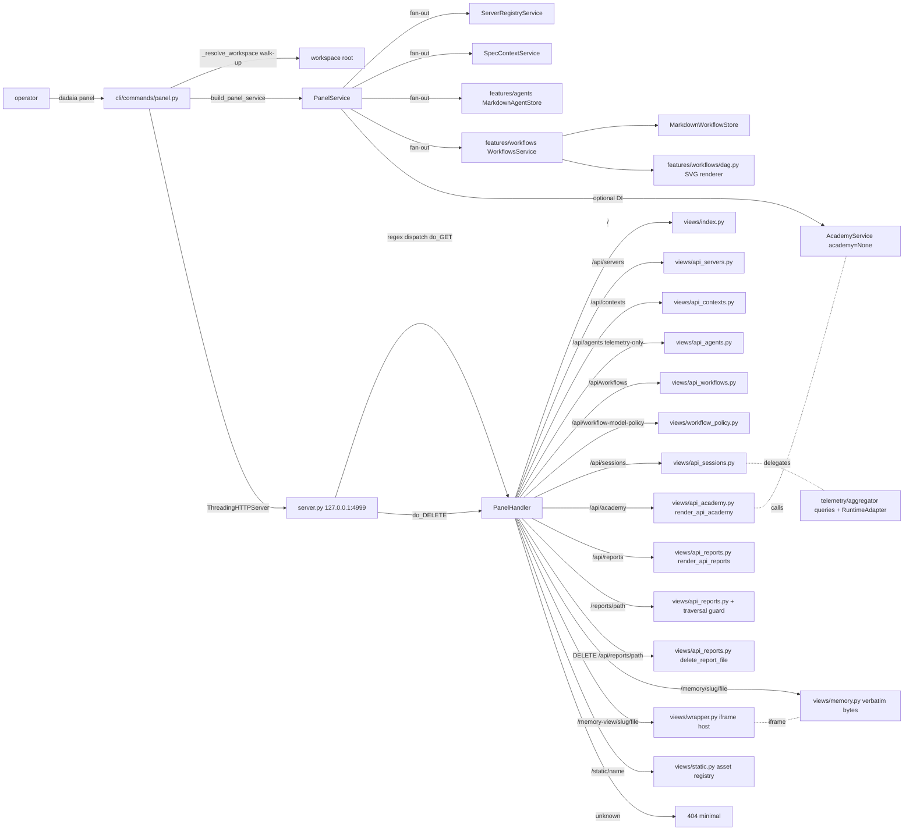

CLI surface: `dadaia panel [--port 4999] [--no-open] [--bind 127.0.0.1]`

## Purpose

The **Dadaia Workspace Panel** is the workspace's **local control surface**: a single-page app served at `http://127.0.0.1:4999/` that makes the product navigable in a single window, without reading markdown or running commands. After the v0.1.45 redesign it has **six tabs**, in canonical order: _Projects_ (default; cards of active contexts with 4-zone anatomy, local/remote terminology, memory pill chips), _Workflows_ (the tab that **leads** the control surface — a catalog of server-SVG diagram-cards with inline per-step model pickers; see "Workflows control plane" below), _Sessions_ (v0.1.52: an **aggregated-cost dashboard ONLY** — 4 stat cards + cost-unknown banner + last-updated badge; the sortable table, filter toolbar, detail drawer, skeleton rows, and 10s list auto-refresh were deleted by operator decision), _Reports_ (viewer of reports indexed by `.handoff.json` sidecars, with inline delete), _Academy_ (course-module infrastructure via `AcademyService`), and _Servers_ (dev-server registry + "Unregistered listeners" with LAN-exposed badge). **There is no Agentic tab** (the old tab that consolidated Agents + Layer-2 personas + the Kanban board was judged unjustified by the operator and removed — nav + sections + JS). `GET /api/personas` does not exist; `GET /api/agents` is served because telemetry consumes it; **the kanban chain was DELETED in v0.1.52** (route, dispatch, 405 mechanism, `views/kanban.py`, CSS file, tokens, container wiring — `grep -i kanban` over production returns nothing). The Layer-2 persona surface is documented in memory ([[agent-orchestration]], [[architecture]]), not rendered in the panel.

A **theme switcher** in the topbar offers three palettes (Mint default, Sage, Warm) persisted in `localStorage["dadaia-panel-theme"]`, with a pre-paint script that avoids FOUC. The topbar displays the rhino logo at 36px (stroke-based SVG, `logo-rhino-36.svg`, `viewBox 0 0 48 48`, `currentColor` via `--color-cost` #633d2e, WCAG AAA). The runtime switcher renders THREE options — Claude / Codex / PI (`runtime.js` accepts exactly `{claude, codex, pi}`, default `claude`) — in the Sessions tab's section header; the selection persists in a single global key `localStorage["dadaia-panel-runtime"]` (`window.Runtime`). Hash routing is initial-load only and handles exactly `#workflows`, `#reports`, `#academy` (prefix match, `core.js`); any other fragment is inert — there are no `#agents`/`#kanban` routes, and the Projects tab's `data-section` is `memories`. The DAG is rendered **server-side as SVG** via a longest-path layout algorithm — no Mermaid in the browser. Stdlib-only at runtime; CSP + nosniff on every response. **NO-AUTH security model (operator decision):** the panel is a local dev tool served **with no credential whatsoever** — there is no token file, no credential validation, no startup warning about auth. The two silent guards are (1) the **loopback-only bind** (`--bind` option, default `127.0.0.1`, loopback-validated — non-loopback values are rejected at startup; the security boundary is the machine) and (2) the **Host-header allowlist** (`127.0.0.1`/`localhost`/`[::1]`, with or without port; anti-DNS-rebinding — a foreign Host receives 403; a missing Host is allowed for non-browser clients). Mutations (`PUT`, `POST`, `DELETE`) go through the SAME guards (Host-guard first) + payload validation — no route requires a credential. **Memory pages visual identity (panel-ux-fix-v1):** memory HTML is served with the panel's visual identity via the wrapper route `/memory-view/<slug>/<file>`, which injects `/assets/css/memory.css` (brand palette, typography, spacing tokens).

`_resolve_workspace()` in `panel.py` walks up from the cwd to find the workspace root (the directory containing `.dadaia/`) — `dadaia panel` works from any subdirectory of the workspace, including `repos/dadaia-workspace/`.

**Handoff-v1.1 `verdict` field (panel-kanban-v1):** the handoff schema at `dadaia_workspace/public/schemas/handoff-v1.schema.json` gained an optional field `verdict: "APPROVED" | "REJECTED"` + `verdict_reason` (string, optional). Backward-compatible: sidecars without `verdict` remain valid. Enables the dual-approval gate: `jq '.verdict' <qa-handoff.json>` and `jq '.verdict' <security-handoff.json>` must return `"APPROVED"` for the CI's CLOSURE check to pass. The `verdict-gate` job in `ci.yml` (script `scripts/check-verdict.sh`) is a no-op on normal push/PR (sidecars are gitignored) and runs on `workflow_dispatch` CLOSURE.

## Usage flow

  1. **Boot**: the operator runs `dadaia panel` from any directory inside the workspace. `_resolve_workspace()` walks up until it finds `.dadaia/`; resolves the workspace root. Binds `127.0.0.1:4999` via `ThreadingHTTPServer` (stdlib), prints `Panel running at http://127.0.0.1:4999/`, calls `webbrowser.open()` unless `--no-open`, and blocks until SIGINT. The pre-paint script reads `localStorage["dadaia-panel-theme"]` and sets `data-theme=<mint|sage|warm>` before the first contentful paint — zero FOUC. `_try_build_telemetry()` is called on the boot path with per-exception-type handlers (`PermissionError`, `OSError`, `sqlite3.OperationalError`, `ImportError`) that emit `logging.warning` with the root cause before returning `None` — none of the exceptions produces a silent HTTP 503.
  2. **Index**: `GET /` renders HTML with 6 sections + a topbar with the theme switcher and the 36px logo. **The default-active tab is Projects**; canonical tab order (post v0.1.45): Projects → Workflows → Sessions → Reports → Academy → Servers. Client-side tab switching via `core.js` with `role="tablist"` + `role="tab"` + `role="tabpanel"` + keyboard nav (ArrowLeft/ArrowRight cycle, Home/End jump, Enter/Space activate). `window.Panel.activate(name, opts)` is the canonical entry point for module activation; `core.js` registers Sessions, Academy and Reports via `window.Panel.register` on `DOMContentLoaded`. Hash routing (initial-load only, `core.js`): exactly `#workflows`, `#reports`, `#academy` activate their tabs; every other fragment is inert — there are no per-tab hashes for the remaining tabs, no `#agents`/`#kanban` routes, and the `?detail=` suffix is not consumed by any code. No credential on any load — see the no-auth model above.
  3. **Projects**: one card per Spec Context Project. Status renamed: `local` (repo is on disk) / `remote` (repo is not on the machine) — the `GET /api/contexts` API returns the new labels. 4-zone card anatomy: Zone A (name in bold), Zone B (repo and branch on separate lines, monospace, truncated with `text-overflow: ellipsis`), Zone C (session binding — conditional, tinted `--color-session-bg`, shown only when ≥ 1 active session; max 3 lines + "+N more"), Zone D (five memory pill chips — Constitution, Architecture, Tech Stack, Quality, Product — with `--color-chip-memory-bg` background, `--color-accent` border, `--radius-pill`). All cards have a `4px solid var(--color-accent)` left accent; no PRIMARY badge. Card elevation uses the shared rest→hover-lift language (`--shadow-card-rest` → `--shadow-card-hover` + `--lift-hover`, soft `--radius-lg`), motion-guarded; the "N projects" count badge sits right-aligned on the section-header title row. No "N active contexts — 1 primary" counter — replaced by a plain "N projects" count badge. Memory view: two-route split `/memory-view/<slug>/<file>` (iframe wrapper with memory.css brand-identity) + `/memory/<slug>/<file>` (bytes rendered in-memory from `.md` → HTML via mistune; D-4 — no `.html` file on disk).
  4. **Workflows** (leading tab of the control surface): the tab is **server-rendered** (there is no `workflows.js`); the tab's JS is `workflow_policy.js` (`window.WorkflowPolicy`), which loads the policy/matrix and the model pickers. The **diagram-cards** catalog is default-visible at the top (`render_workflows_first_class_section` — the test `test_diagram_cards_lead_and_policy_matrix_is_secondary` pins the order). Each large card shows display-name, purpose, availability badge, step count and a **server-SVG flow diagram** via `render_dag_svg(stages, node_meta=…)`, where `node_meta` is an optional map keyed by stage-id (default `None`, keeping the first-class detail-view byte-identical) carrying role + gate marker (⊙) + harness/model; `StageDTO` is NOT widened — the enrichment lives on the catalog side (`dadaia_catalog`). `role="img"` + `<title>` + per-node `aria-label`; text escaped/truncated. The card's **expand** was rebuilt from a monospace text-wall into a **FLOW strip + formatted per-step cards + inline per-step model pickers** (codex/pi toggle + profile dropdown, incl. the built-in profile `pi-openrouter-kimi-high` exposing the OpenRouter id `kimi-2.7:high` as selectable/persistable; default/reset); each card is a native server-rendered `
` disclosure inline in the page (`views/workflows.py::_render_dadaia_workflow_card`) — CSP-clean, no client script, no fetch on expand, not `<dialog>`. `GET /api/workflows/<name>` remains served but has no UI consumer. The per-step model-governance **policy matrix** is demoted to a collapsed `Model policy` disclosure (`
`; `#wfp-root` populated on-load regardless of the disclosure state). The card's old dead client-Mermaid layer + the orphan producer chain (`render_step_mermaid`, `diagram_mermaid` field, detail-path consumers) were removed — the server-side SVG is the sole diagram source in card and detail (grep of the served HTML: no `<pre class="mermaid">`, no `diagram_mermaid` residue). Token-anchored restyle: card elevation + motion-guarded hover lift (`--radius-lg`, `--shadow-card-rest`, `--shadow-card-hover`, `--lift-hover`).
  5. **Sessions (v0.1.52 — aggregated-cost dashboard ONLY):** `sessions.js` (211 lines) does a lazy `fetch('/api/sessions?runtime=…')` which returns a SERVER-side aggregate envelope `{runtime, total_sessions, active_sessions, total_cost_usd: float|null, cost_known, total_messages, top_agent: {name, session_count}|null, generated_at}` (computed by `TelemetryAggregator.aggregate_sessions` behind the `TelemetryService.aggregate_sessions` facade — the old client-side `computeStats` over a full list is gone). Renders exactly 4 stat cards — Total Sessions (with the "N active" sub-label), Total Cost, AI Turns, Top Agent (with a session-count sub-label) — plus the cost-unknown banner and the `#sessions-last-updated` badge. **Cost render mapping:** 'N/A' for cost-unknown runtimes (codex/pi, `isCostUnknownRuntime`; the server also forces `total_cost_usd: null` for them), '—' for claude with a null aggregate, `'$X.XX'` otherwise including `'$0.00'` for a known zero. Re-fetches on the `dadaia:runtime-change` event; there is NO auto-refresh interval, NO table, NO filter toolbar, NO detail drawer, and NO `/api/sessions/<runtime>/<id>` detail endpoint (deleted). All API-sourced values pass through `escHtml`. Runtime toggle stays in the section header.
  6. **Reports**: `reports.js` does a lazy `GET /api/reports`. Lists reports grouped by context via `
/
`. Each row: agent tag chip (`--color-report-tag-bg`, `--radius-pill`), title button, date, trash icon button (44×44px touch target, `aria-label="Delete report: [title]"`). Trash click shows the inline confirmation "Are you sure? [Delete] [Cancel]"; Delete calls `DELETE /api/reports/<path>` and removes the row. Title click: fetches and renders HTML inline in a scoped `
` with `max-height: 80vh` + `[← Back to Reports]` breadcrumb (content served by `GET /reports/<path>`). HTML-first indexing (v0.1.5/rc-2): `GET /api/reports` discovers reports via a direct rglob over `*.html` (sidecar-less reports visible) and enriches with sidecars from `.dadaia/handoff/` and `.dadaia/reports/`; deduplicates by HTML path. `dadaia reports doctor` (or `dadaia specs doctor`) validates the `RPT-1` invariant: any `.handoff.json` sidecar whose `artifact.path` points at a non-HTML or missing file is flagged as `[dangling-artifact-path]`. Registers via `window.Panel.register('reports', Reports)`; uses `window.escHtml`.
  7. **Academy**: `academy.js` does a lazy `GET /api/academy` — the API lists ALL shipped `knowledge_basis` modules (`dadaia_workspace/features/academy/knowledge_basis/`) with title and lesson count; no `dadaia academy create` is a precondition. Cards in a 2-col grid (≥ 768px) / 1-col with type chip (`--color-academy-chip-bg`, `--color-cost` text, `--radius-pill`), left accent `4px solid var(--color-warning-bg)`, title, description, "Open →" CTA. Clicking a module expands its lessons; clicking a lesson loads the read-only route `GET /academy/<module>/<lesson>` (traversal-guarded: single-segment + `Path.resolve()` + `is_relative_to`) that renders the lesson's Markdown via `views/_md_render.py`, with the `[← Back to Academy]` breadcrumb. Registers via `window.Panel.register('academy', Academy)`; uses `window.escHtml`.
  8. **Servers**: `core.js` does a `fetch('/api/panel-status')` every 5s and swaps the grouped `<tbody>` (there is no `panel.js`). Best-effort match of `project.lower() == repo_slug.lower()` against active contexts. "Unregistered listeners" sub-section with a LAN-exposed badge for `0.0.0.0` binds.
  9. **Theme switcher**: a visible topbar button (`#theme-btn`, `aria-haspopup="menu"`) opens a dropdown (`#theme-menu`, `role="menu"`) with 3 options (Mint / Sage / Warm). Selecting sets `data-theme` on the root and persists in `localStorage["dadaia-panel-theme"]`. Escape closes the dropdown and returns focus to the trigger. The button + popover are styled from tokens (spacing, radius, `--shadow-card-hover` elevation, active-row treatment); Warm carries the `--color-accent-dark` focus-ring token.
  10. **Shutdown**: Ctrl+C sends SIGINT; the signal handler spawns a daemon thread that calls `server.shutdown()`, the process exits 0 and frees the port in ≤2s.

## Workflows control plane (v0.1.28, redesigned in v0.1.45)

Workflows is the tab that **leads** the panel (D-5): the default-visible control surface,
no longer an Ops subtab. It is the operator UX for the [[lifecycle-foundation]] workflow model
governance layer: see, change, audit and reproduce which model runs each prompt step, without
reading Python source. The panel never resolves policy on its own — it reads through the same
container-wired `WorkflowExecutionPolicyResolver` over the governed `dadaia_catalog` that the
CLI uses.

- **Diagram-cards lead (v0.1.45)** — the catalog of large cards with a server-SVG flow
  diagram (`render_dag_svg(stages, node_meta=…)`; nodes carry role + gate marker +
  harness/model) is default-visible at the top (`render_workflows_first_class_section`, order
  pinned by test). `GET /api/workflow-catalog` enumerates the 7 governed workflows (v0.1.29):
  the 3 runnable + `closure` (its real `close` step) with availability, plus `audit`/`research`/
  `bug_report`.
- **Expand = detail with per-step cards + inline model pickers (v0.1.45)** — the card's expand
  is a native server-rendered `
` inline (CSP-clean, no client script, no fetch;
  not `<dialog>`); `GET /api/workflows/<name>` remains served with no UI consumer.
  Rebuilt from a monospace text-wall into a FLOW strip +
  formatted per-step cards. Each step card carries an **inline model picker**: segmented
  codex/pi toggle + harness-filtered profile dropdown, incl. the built-in profile
  `pi-openrouter-kimi-high` exposing `kimi-2.7:high`; default/reset. The policy matrix
  `Step | Role | Harness | Effective profile | Concrete model | Fragments | Gate` (with the
  **default-vs-effective** diff carrying `is_overridden` + `harness_overridden` per row) is
  **demoted** to a collapsed `Model policy` disclosure. The **"Run snapshots" UI**
  (`/api/lifecycle-runs`) was **folded out** of the panel in the v0.1.45 de-clutter — the
  endpoint remains served, only the rendering left.
- **Policy editor** — per-step profile dropdown **filtered by harness**, the **segmented
  codex/pi toggle** (v0.1.29) that persists a real harness change, reset-to-default,
  **validate-before-save**, save through a guarded mutation route. Writes a **validated JSON
  overlay** (`.dadaia/states/workflow_model_policy.json`) — never Python source or projected
  assets. An invalid policy blocks execution; absent = library defaults. The toggle
  writes the step's `harness` in the PUT body (`harnesses` / `default_harness`); the resolver
  honors the persisted harness. A harness-only PUT validates (the resolver auto-selects the
  harness's default profile). **v0.1.45:** `pi-openrouter-kimi-high` made the OpenRouter id
  `kimi-2.7:high` selectable and persistable through the same validated path (round-trip
  PUT/GET/resolver proven).
- **Read-only fragment inspector** — each model step links its prompt-fragment ids + resolved
  body (via `FragmentLoader`), dynamic-context selectors and output schema. Editing
  fragments remains source-controlled release work (the inspector is read-only).
- **Routes.** GET (read): `GET /api/workflow-catalog[/<id>]`,
  `GET /api/workflow-model-profiles`, `GET /api/workflow-model-policy`,
  `GET /api/lifecycle-runs?workflow=&context=` (served; no dedicated UI), plus the
  fragment-body route. Mutation: `PUT /api/workflow-model-policy` +
  `POST /api/workflow-model-policy/validate`. The
  mutation surface enforces the same guards as every route (no-auth model stated
  once in Purpose) and runs the guard order **Host-guard first → 415 (non-JSON
  content type) → 413 (oversized body, capped before reading the socket) → 400
  (invalid JSON / shape with field-path errors) → 400 (context resolve) → 400
  (semantic resolve)** BEFORE any atomic write; the store takes a `.last-good.json`
  backup from the prior valid file so an invalid candidate never overwrites a good
  one. The fragment-id route validates against a conservative regex
  (`^[A-Za-z0-9_]+\.[A-Za-z0-9_]+$`) blocking path traversal before any disk read,
  and never echoes filesystem paths.

## Typical trigger

The operator wants a **control view** of the workspace: inspect the workflow catalog as diagram-cards, read each workflow's server-SVG flow diagram and adjust inline which `(harness, model)` runs each step before dispatching, switch themes, check session state and cumulative cost, open a Spec Context Project's memory, view reports produced by specialist agents, access Academy modules, and see whether any dev server is LAN-exposed. Mechanical criterion: **if a single window is needed to see and operate the workspace, they run `dadaia panel`. For CI, headless and automation, the direct CLI remains the canonical interface.**

## Differentiator

Without this panel, the workspace is invisible to the casual operator: one must read markdown to discover workflows, open editors to check memory, run `dadaia server list` to see ports, and browse files to read reports. The post-redesign v0.1.45 panel unifies it in six tabs with load-bearing decisions: (1) **canonical sources** — workflows from the governed `dadaia_catalog` (via the container-wired `WorkflowExecutionPolicyResolver`), reports indexed by `.handoff.json` sidecars, academy via `AcademyService`, sessions via `TelemetryAggregator`; (2) **Workflows as the leading tab** — a diagram-cards catalog with a **server-side SVG** flow diagram (`render_dag_svg` + optional `node_meta`; longest-path layout; zero Mermaid in the browser, zero layout JS, SVG cached by mtime, accessibility built-in) and **inline per-step model pickers** persisting to the validated overlay `.dadaia/states/workflow_model_policy.json` without touching Python source; (3) **3 axe-clean palettes** over a **cohesive token-driven design system** (`[data-theme="X"]`): a rationalized typography scale, spacing rhythm, elevation/radius, and shadows in `tokens.py`; **uniformly styled controls** and **single-line header/control rows** (no inline `style=`); `<header>` section-header landmarks with consistent card density — every restyled control style consumes `var(--…)` with **no ad-hoc literal** (grep-falsifiable); (4) **window.Panel registry** in `core.js` — lazy tab module loading via `register(name, mod)` / `activate(name, opts)`; (5) **lean surface** — the Agentic tab (Agents + personas + Kanban) was deleted in v0.1.45 after being judged unjustified; the Layer-2 persona surface lives in memory, not in the panel. The memory two-route split remains (`/memory/` in-memory render + `/memory-view/` wrapper with memory.css). `mistune~=3.0` remains this area's only non-stdlib runtime dep (memory-markdown-source-v1; D-1); no new dep in v0.1.45. Stdlib-only in the remaining areas keeps maintenance cost trivial.

## Runtime state touched

  * Read: `.dadaia/states/server_registry.json`, `.dadaia/states/spec_contexts.json`, `.dadaia/agentic/agents/<name>.md` (via `/api/agents`, retained for telemetry/Sessions), `.dadaia/agentic/workflows/<name>.md`, the governed `dadaia_catalog` (Workflows), `repos/<slug>/specs/memory/<path>` (memory `.md` atoms + assets; rendered in-memory via mistune — D-4), local telemetry via [[agent-monitoring]], `.dadaia/reports/**/*.handoff.json` (indexing for the Reports tab), `.dadaia/academy/academy.json` (course list via AcademyService) — all via `Path.read_bytes()` / `Path.read_text()` with no mutation. Telemetry store reads open per-call read-only factory connections (`file:...?mode=ro`, busy_timeout; v0.1.52 — no shared cross-thread connection).
  * Write: `DELETE /api/reports/<path>` deletes the report's HTML file and its `.handoff.json` sidecar when requested — both under a path-traversal guard with `Path.resolve()` + `relative_to(workspace_root/.dadaia/reports/)`. **`PUT /api/workflow-model-policy` (v0.1.28)** writes the validated overlay `.dadaia/states/workflow_model_policy.json` via atomic temp(0600)+rename with a `.last-good.json` backup (validate-before-write; invalid never overwrites good); `POST /api/workflow-model-policy/validate` is a dry-run (does not write). The panel does not touch `specs/memory/*`, does not write Python source or projected assets, does not write to `server_registry.json`, does not register itself in the registry.
  * HTTP routes — the route table in `handler.py` declares route classes by historical origin, but all follow the same no-auth model (stated once in Purpose):
    * **Static/render**: `GET /`, `GET /health`, `GET /static/<name>`, `GET /memory/<slug>/<path>`, `GET /memory-view/<slug>/<file>`, `GET /reports/<path>` (path-traversal guard via `Path.resolve()` + `relative_to()`, 403 if outside the boundary), `GET /academy/<module>/<lesson>` (traversal-guarded).
    * **JSON API**: `GET /api/panel-status` (status + servers), `GET /api/contexts` (returns `local`/`remote`), `GET /api/agents?active_window_days=N&runtime=…` (served for telemetry; there is no Agents tab), `GET /api/agents/<id>/prompt`, `GET /api/agents/<id>/sessions`, `GET /api/workflows[/<name>]`, `GET /api/dadaia-workflows[/<name>]`, `GET /api/workflow-catalog[/<id>]`, `GET /api/workflow-model-profiles`, `GET /api/workflow-model-policy`, `GET /api/workflow-fragments/<id>`, `GET /api/workflow-step-ledger`, `GET /api/lifecycle-runs` (no dedicated UI), `GET /api/sessions?runtime=…` (v0.1.52: returns the AGGREGATE envelope, not a list), `GET /api/academy`, `GET /api/reports`. Deleted in v0.1.52: `GET /api/sessions/<runtime>/<id>` and `GET /api/kanban`. (`GET /api/personas` does not exist.)
    * **Mutation**: `PUT /api/workflow-model-policy`, `POST /api/workflow-model-policy/validate`, `POST|DELETE /api/reports/<path>/important`, `DELETE /api/reports/<path>` — same guards + payload validation before any write.
    * **Telemetry-backed**: the sessions/agents routes delegate to `TelemetryAggregator` with `RuntimeAdapter`; 503 with a message when telemetry is unavailable.
  * **do_DELETE handler**: `PanelHandler.do_DELETE` mirrors the `do_GET` guards; dispatches `api_report_delete` via `container.py build_panel_views()`.
  * Asset modules: `features/panel/views/assets/css/` and `features/panel/views/assets/js/` are Python modules with string constants. SVGs read from the filesystem at import-time via `static.py` (the old `views/_assets.py` module was removed entirely — no `PANEL_CSS`, `PANEL_JS`, or `PALETTE` constants exist). The `static.py _ASSETS` dict: central registry of every file served by `/static/<name>`, including `logo-rhino-36.svg` and `logo-rhino-24.svg` (read at import-time).
  * **window.Panel registry** in `core.js`: object `{ register(name, mod), activate(name, opts) }` defined before the tab loading logic. Registered modules: `sessions`, `academy`, `reports` (registered by `core.js` on `DOMContentLoaded`) + `workflow_policy` (self-registers via `workflow_policy.js`, which also exposes `window.WorkflowPolicy`). The Workflows tab is server-rendered — **there is no `workflows.js` or `panel.js`**; the real JS files are `core.js`, `runtime.js`, `themes.js`, `sessions.js`, `reports.js`, `academy.js`, `workflow_policy.js`. `window.escHtml` is a global in `core.js`.
  * View composition: `container.py build_panel_views()` instantiates the view callables including `api_reports`, `reports_serve`, `api_report_delete` and the workflow-policy views. View modules: `views/index.py` (SSR HTML), the eight per-domain JSON/HTML endpoint modules `views/api_{servers,contexts,agents,workflows,sessions,academy,reports,health}.py` (the monolithic `views/api.py` was decomposed per-domain and **deleted** in v0.1.55; `container.build_panel_views` wires each `render_api_*` via named imports, no facade), `views/workflows.py` (diagram-cards), `views/workflow_policy.py` (policy editor + inline model pickers), `views/sessions.py` (Sessions section markup + runtime switcher), `views/academy.py`, `views/reports.py`, `views/memory.py`, `views/_md_render.py` (shared Markdown→HTML render; mermaid fences entity-escaped since v0.1.52 — no client renderer exists), `views/wrapper.py`, `views/static.py`. (`views/kanban.py` deleted in v0.1.52.)
  * **Guards + headers**: no-auth model (stated once in Purpose; the loopback guard is evaluated on the server's bind address). **CSP (strict):** `script-src 'self'` + exactly **two inline sha256 hashes** (`_CSP_SCRIPT_HASH_1/2` in `handler.py`, covering the index's only two inline scripts — theme pre-paint + runtime-detect); no `'unsafe-inline'` for scripts, no external/CDN origin. Every real script is external `/static/*.js`. A falsifiable test (`test_security_headers.py::TestInlineScriptCspCoverage`) renders the real index, extracts each inline `<script>`, recomputes base64(sha256) and asserts the CSP covers it. `X-Content-Type-Options: nosniff` on JSON.
  * Bind: `--bind` option, default `127.0.0.1`, loopback-validated (`_LOOPBACK_ONLY` in `cli/commands/panel.py` — non-loopback rejected). Theme persistence: `localStorage["dadaia-panel-theme"]` receives `"mint" | "sage" | "warm"`. Runtime persistence: **a single global key** `localStorage["dadaia-panel-runtime"]` (`window.Runtime` in `runtime.js`; default `claude`) — the per-tab toggles read/write the same key.
  * CSS tokens + design system: `tokens.py` carries the **rationalized semantic design system** — a typography scale, spacing rhythm, border-radius, shadows, z-index, motion, dimensions and colors — consumed by `[data-theme="mint|sage|warm"]`. **Token-anchored controls (falsifiable by `grep`):** every restyled interactive control (`.nav-tab`, `.theme-btn` + popover, `.runtime-btn`, the workflow per-step pickers `.wfp-*`, report/academy CTAs and the report trash button) consumes `var(--…)` from `tokens.py` with **no ad-hoc literal** (hex / px-font-size / px-radius); the unit lock `test_control_tokens.py` scans each rule body from the served stylesheet strings over an explicit selector allowlist (excluding the token-definition file `tokens.py`) and fails on any reject regex. Redesign tokens `--radius-lg`, `--shadow-card-rest`, `--shadow-card-hover`, `--lift-hover` drive card elevation + motion-guarded hover lift (`prefers-reduced-motion`) + soft radius. **Single-line header/control rows:** the shared `.section-header` + `.runtime-switcher` pattern lays out on one line by default (`.section-header:has(.runtime-switcher){display:flex;flex-wrap:nowrap;min-width:0}` + title ellipsis) — the three inline `style=` hacks that formerly positioned the topbar-right, the theme-switcher, and the runtime-switcher were removed and replaced by token-anchored CSS classes (`grep 'style=' index.py sessions.py` == 0); every top-level section header is a `<header class="section-header">` landmark. No row-wrap/overflow at 1024/1440px, enforced by the GH-only bounding-box e2e `header-row-width.spec.ts` (3 themes × {1024,1440}). 3 palettes + the brand-identity 5-color canon ([[brand-identity]]) + WCAG AA/AAA are **preserved** (no palette hex change). **Dead-CSS purged:** the orphan `agents.py#AGENTS_CSS` module and the removed-feature selectors in `STRUCTURE_CSS` (`.card-header`/`.card-primary-badge`/`.card-links`/`.memory-link*`/`.context-card.primary`/`.context-count`/`.agents-grid--compact`/`.workflows-grid--compact`) were removed under grep-proven zero live references; the Kanban and agent-modal/agent-grid tokens are gone with the Agentic-tab removal.

## Dependencies

  * Runs on top of [[server-registry]] (consumes `.dadaia/states/server_registry.json`), [[context-management]] (consumes `.dadaia/states/spec_contexts.json`), [[agent-monitoring]] (consumes `TelemetryService` via DI for Sessions — `TelemetryAggregator.list_sessions` / `get_session` with the `RuntimeAdapter` registry `{claude, codex, pi}`; PI via `reader/pi.py` + `PiRuntimeAdapter`) and [[public-asset-distribution]] (consumes `.dadaia/agentic/agents/` and `.dadaia/agentic/workflows/`).
  * [[academy]]: `AcademyService` wired as optional DI in `PanelService(academy=None)`; instantiated at the composition root in `panel.py`; the Academy tab consumes it via `GET /api/academy`.
  * [[specs-doctor]] validates memory atoms via LINT-1 (lint-memory-atoms.py) and the RPT-1 invariant via `dadaia reports doctor` (`features/panel/reports_doctor.py`): a `.handoff.json` sidecar with `artifact.path` pointing at a non-HTML or missing file is flagged as `[dangling-artifact-path]`. The committed-HTML byte-identity check was retired in memory-markdown-source-v1 — D-4 forbids committed HTML in the memory folder (SPEC-DOC-008 is a different check, alive: forbidden changelog/history headings — see [[specs-doctor]]). Unit tests in `tests/unit/features/panel/test_views_memory.py` cover the in-memory `.md → HTML` render path.
  * [[sdd-gate-v3]] is not touched — the panel is read-only (exception: report DELETE) and never writes to `specs/memory/*`.
  * Visual tokens: three palettes (Mint / Sage / Warm) consume base tokens from [[brand-identity]] and extend them via `[data-theme="<name>"]` selectors. Warm carries a dedicated `focus-visible` rule (double outline) to pass WCAG AA contrast.
  * Runtime deps: `http.server.ThreadingHTTPServer`, `pathlib`, `json`, `webbrowser`, `signal`, `threading`, `secrets`, `pyyaml`, and `mistune~=3.0` (added in memory-markdown-source-v1 for the in-memory `.md` → HTML render; D-1). DAG rendering is pure Python; no Mermaid client ships anywhere in the panel — mermaid fences are entity-escaped and displayed as source (stated once in the view-composition bullet above).
