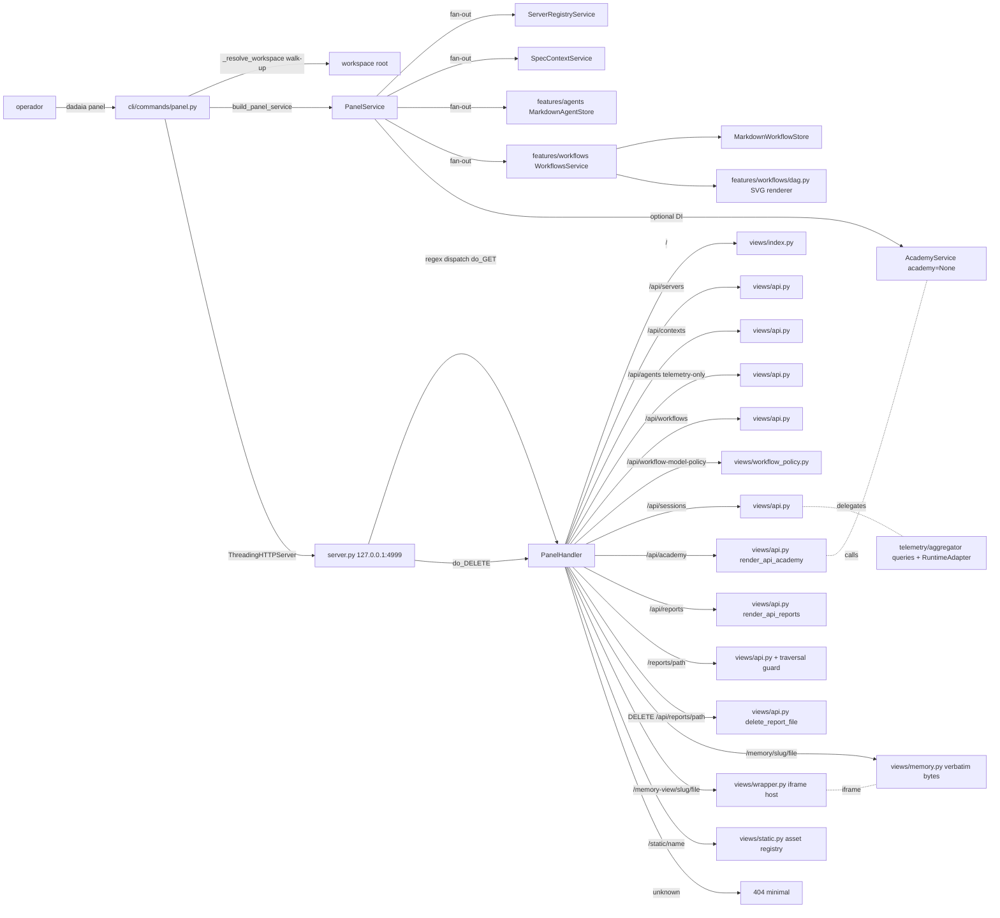

CLI surface: `dadaia panel [--port 4999] [--no-open] [--bind 127.0.0.1]`

## Propósito

O **Dadaia Workspace Panel** é a **superfície de controle local** do workspace: uma single-page app servida em `http://127.0.0.1:4999/` que torna o produto navegável em uma janela única, sem ler markdown nem rodar comandos. Após o redesign v0.1.45 tem **seis abas**, na ordem canônica: _Projects_ (default; cards dos contextos ativos com 4-zone anatomy, local/remote terminology, memory pill chips), _Workflows_ (a aba que **lidera** a superfície de controle — catálogo de diagram-cards server-SVG com model pickers inline por step; ver "Workflows control plane" abaixo), _Sessions_ (tabela ordenável + drawer + auto-refresh + error state com Retry button), _Reports_ (visualizador de reports indexados por `.handoff.json` sidecars, com delete inline), _Academy_ (infrastructure de módulos de cursos via `AcademyService`), e _Servers_ (registry de dev servers + "Unregistered listeners" com badge LAN-exposed). **Não existe aba Agentic** (a antiga aba que consolidava Agents + Layer-2 personas + o board Kanban foi julgada injustificada pelo operador e removida — nav + sections + JS). `GET /api/personas` não existe; `GET /api/agents` é servido porque a telemetria/Sessions o consome; **`GET /api/kanban` + `views/kanban.py` continuam servidos** (read-only sobre `.dadaia/sessions/*.json`) mas com **zero consumidores de UI** — o destino do endpoint é tracked no backlog `panel-runtime-reliability`. A superfície de persona Layer-2 é documentada em memory ([[agent-orchestration]], [[architecture]]), não renderizada no painel.

Um **theme switcher** no topbar oferece três paletas (Mint default, Sage, Warm) persistidas em `localStorage["dadaia-panel-theme"]`, com pre-paint script que evita FOUC. O topbar exibe o logo rhino em 36px (SVG stroke-based, `logo-rhino-36.svg`, `viewBox 0 0 48 48`, `currentColor` via `--color-cost` #633d2e, WCAG AAA). O runtime switcher (Claude / Codex) fica nos section headers das abas Workflows e Sessions; a seleção persiste numa única chave global `localStorage["dadaia-panel-runtime"]` (`window.Runtime`). Hash routing segue gramática `#<tab>[?key=val]`; não existem rotas `#agents`/`#kanban`. O DAG é renderizado **server-side em SVG** via algoritmo longest-path layout — sem Mermaid no browser. Stdlib-only no runtime; CSP + nosniff em todas as respostas. **Modelo de segurança NO-AUTH (decisão do operador):** o panel é uma ferramenta dev local servida **sem nenhuma credencial** — não existe arquivo de token, não existe validação de credencial, não existe warning de startup sobre auth. Os dois guards silenciosos são (1) o **bind loopback-only** (`127.0.0.1` hard-coded — a fronteira de segurança é a máquina) e (2) o **Host-header allowlist** (`127.0.0.1`/`localhost`/`[::1]`, com ou sem porta; anti-DNS-rebinding — Host estrangeiro recebe 403; Host ausente é permitido para clients não-browser). Mutações (`PUT`, `POST`, `DELETE`) passam pelos MESMOS guards (Host-guard primeiro) + validação de payload — nenhuma rota exige credencial. **Memory pages visual identity (panel-ux-fix-v1):** memory HTML é servido com identidade visual do panel via rota wrapper `/memory-view/<slug>/<file>` que injeta `/assets/css/memory.css` (brand palette, typography, spacing tokens). **Agent cards visual identity (panel-ux-fix-v1):** cards de agentes usam brand palette (mint/sage/warm), font sizes ≥ 0.75rem, WCAG AA nos badges de status.

`_resolve_workspace()` em `panel.py` caminha de baixo para cima a partir do cwd para encontrar o workspace root (diretório contendo `.dadaia/`) — `dadaia panel` funciona de qualquer subdiretório do workspace, incluindo `repos/dadaia-workspace/`.

**Handoff-v1.1`verdict` field (panel-kanban-v1):** o schema de handoff em `dadaia_workspace/public/schemas/handoff-v1.schema.json` ganhou um campo opcional `verdict: "APPROVED" | "REJECTED"` + `verdict_reason` (string, opcional). Backward-compatible: sidecars sem `verdict` continuam válidos. Habilita o dual-approval gate: `jq '.verdict' <qa-handoff.json>` e `jq '.verdict' <security-handoff.json>` devem retornar `"APPROVED"` para que o CLOSURE check do CI passe. O job `verdict-gate` em `ci.yml` (script `scripts/check-verdict.sh`) é no-op em push/PR normais (sidecars são gitignored) e é executado em `workflow_dispatch` CLOSURE.

## Fluxo de uso

  1. **Boot** : operador roda `dadaia panel` a partir de qualquer diretório dentro do workspace. `_resolve_workspace()` caminha de baixo para cima até encontrar `.dadaia/`; resolve o workspace root. Bind `127.0.0.1:4999` via `ThreadingHTTPServer` (stdlib), imprime `Panel running at http://127.0.0.1:4999/`, chama `webbrowser.open()` a menos que `--no-open`, e bloqueia até SIGINT. Pre-paint script lê `localStorage["dadaia-panel-theme"]` e seta `data-theme=<mint|sage|warm>` antes do first contentful paint — zero FOUC. `_try_build_telemetry()` é chamado no boot path com handlers per-exception-type (`PermissionError`, `OSError`, `sqlite3.OperationalError`, `ImportError`) que emitem `logging.warning` com a causa raiz antes de retornar `None` — nenhuma das exceptions produz HTTP 503 silencioso.
  2. **Index** : `GET /` renderiza HTML com 6 sections + topbar com theme switcher e logo 36px. **Default-active tab é Projects** ; ordem canônica das abas (pós v0.1.45): Projects → Workflows → Sessions → Reports → Academy → Servers. Tab switching client-side via `core.js` com `role="tablist"` + `role="tab"` + `role="tabpanel"` + keyboard nav (ArrowLeft/ArrowRight cycle, Home/End jump, Enter/Space activate). `window.Panel.activate(name, opts)` é o ponto de entrada canônico para ativação de módulo; `core.js` registra Sessions, Academy e Reports via `window.Panel.register` no `DOMContentLoaded`. Hash routing: `#projects`, `#workflows`, `#sessions`, `#reports`, `#academy`, `#servers` + `#workflows?detail=<name>` (não existem rotas `#agents`/`#kanban`). Hash `#memories` ainda ativa Projects (back-compat). Nenhuma credencial em nenhum load — ver o modelo no-auth acima.
  3. **Projects** : card por Spec Context Project. Status renomeado: `local` (repo está no disco) / `remote` (repo não está na máquina) — API `GET /api/contexts` retorna os novos labels. Anatomia do card em 4 zonas: Zone A (nome em negrito), Zone B (repo e branch em linhas separadas, monospace, truncado com `text-overflow: ellipsis`), Zone C (session binding — condicional, tintado `--color-session-bg`, exibido apenas quando ≥ 1 sessão ativa; max 3 linhas + "+N more"), Zone D (três memory pill chips — Architecture, Tech Stack, Product — com `--color-chip-memory-bg` background, `--color-accent` border, `--radius-pill`). Todos os cards têm `4px solid var(--color-accent)` left accent; sem badge PRIMARY. Sem contador "N active contexts — 1 primary" — substituído por "N projects" plain count badge. Memory view: two-route split `/memory-view/<slug>/<file>` (iframe wrapper com memory.css brand-identity) + `/memory/<slug>/<file>` (bytes renderizados in-memory de `.md` → HTML via mistune; D-4 — sem arquivo `.html` em disco).
  4. **Workflows** (aba líder da superfície de controle) : a aba é **server-rendered** (não existe `workflows.js`); o JS da aba é `workflow_policy.js` (`window.WorkflowPolicy`), que carrega a policy/matrix e os model pickers. O catálogo de **diagram-cards** é default-visible no topo (`render_workflows_first_class_section` — teste `test_diagram_cards_lead_and_policy_matrix_is_secondary` pina a ordem). Cada card grande mostra display-name, purpose, availability badge, step count e um **fluxograma server-SVG** via `render_dag_svg(stages, node_meta=…)`, onde `node_meta` é um mapa opcional keyed por stage-id (default `None`, mantendo o detail-view first-class byte-idêntico) carregando role + gate marker (⊙) + harness/model; `StageDTO` NÃO é widened — o enrichment vive no lado do catálogo (`dadaia_catalog`). `role="img"` + `<title>` + per-node `aria-label`; texto escapado/truncado. O **expand** do card foi reconstruído de um text-wall monospace para uma **FLOW strip + per-step cards formatados + model pickers inline por step** (toggle codex/pi + profile dropdown, incl. o profile built-in `pi-openrouter-kimi-high` que expõe o id OpenRouter `kimi-2.7:high` selecionável/persistível; default/reset); reusa a rota detail `#workflows?detail=<name>` + `GET /api/workflows/<name>` (server-rendered, CSP-clean — não `<dialog>`). O **policy matrix** de model-governance por step é demovido para um disclosure `Model policy` colapsado (`
`; `#wfp-root` populado on-load independente do estado do disclosure). A antiga camada dead client-Mermaid do card + a cadeia producer órfã (`render_step_mermaid`, campo `diagram_mermaid`, consumidores detail-path) foram removidas — o SVG server-side é a única fonte de diagrama em card e detail (grep do HTML servido: sem `<pre class="mermaid">`, sem residue `diagram_mermaid`). Runtime toggle no section header. Restyle token-ancorado: card elevation + hover lift motion-guarded (`--radius-lg`, `--shadow-card-rest`, `--shadow-card-hover`, `--lift-hover`).
  5. **Sessions** : `sessions.js` faz `fetch('/api/sessions?runtime=…')` lazy. Tabela ordenável com 8 colunas: Session / Project / Model / AI Turns / Context / Cost / Last Activity / Status; row click abre drawer. Auto-refresh 10s pausado quando `document.hidden === true`. **Column widths (panel-ux-fix-v1):** cada `<th>`/`<td>` carrega uma classe CSS (ex: `.cell-session`, `.cell-project`, …, `.cell-status`) com `min-width` declarado via CSS class selector — abordagem correta sob `table-layout:fixed` onde `min-width` em `<col>` é silenciosamente ignorado. Valores: SESSION 120px, PROJECT 96px, MODEL 160px, AI TURNS 72px, CONTEXT 80px, COST 72px, LAST ACTIVITY 112px, STATUS 80px (floor total ≈ 792px). Container `.sessions-table-container` tem `overflow-x: auto` — h-scroll abaixo de 792px. `<colgroup>` com percentuais permanece para alocação proporcional em viewports largas. **Codex placeholder (panel-ux-fix-v1):** para Codex sessions sem projeto, a célula PROJECT renderiza `&mdash;`; estilos: `color: var(--color-muted); font-style: italic;` — contraste #666 on white = 5.52:1 (WCAG AA pass). **Error state redesenhado** : container com `role="alert"` abrange todo o table body; inclui `[Retry]` `<button>` com texto explícito que re-dispara `GET /api/sessions`. Scroll-margin-top aplicado no error container. Runtime toggle no section header. Quando `runtime=codex`, coluna Cost vira "—" e banner "Cost not tracked for Codex" aparece. Coluna Context renderiza `context_size_tokens = input_tokens + cache_creation_input_tokens + cache_read_input_tokens`.
  6. **Reports** : `reports.js` faz `GET /api/reports` lazy. Lista reports agrupados por context via `
/
`. Cada linha: agent tag chip (`--color-report-tag-bg`, `--radius-pill`), title button, date, trash icon button (44×44px touch target, `aria-label="Delete report: [title]"`). Trash click mostra confirmação inline "Are you sure? [Delete] [Cancel]"; Delete chama `DELETE /api/reports/<path>` e remove a linha. Title click: busca e renderiza HTML inline em scoped `
` com `max-height: 80vh` + breadcrumb `[← Back to Reports]` (conteúdo servido por `GET /reports/<path>`). Indexação HTML-first (v0.1.5/rc-2): `GET /api/reports` descobre reports via rglob direto em `*.html` (sidecar-less reports visíveis) e enriquece com sidecars de `.dadaia/handoff/` e `.dadaia/reports/`; deduplica por path HTML. `dadaia reports doctor` (ou `dadaia specs doctor`) valida o invariante `RPT-1`: qualquer sidecar `.handoff.json` cujo `artifact.path` aponta para arquivo não-HTML ou arquivo ausente é flagrado como `[dangling-artifact-path]`. Regista via `window.Panel.register('reports', Reports)`; usa `window.escHtml`.
  7. **Academy** : `academy.js` faz `GET /api/academy` lazy — a API lista TODOS os módulos da `knowledge_basis` shipped (`dadaia_workspace/features/academy/knowledge_basis/`) com título e contagem de lições; nenhum `dadaia academy create` é pré-condição. Cards em grid 2-col (≥ 768px) / 1-col com type chip (`--color-academy-chip-bg`, `--color-cost` text, `--radius-pill`), left accent `4px solid var(--color-warning-bg)`, title, description, "Open →" CTA. Clicar em um módulo expande suas lições; clicar em uma lição carrega a rota read-only `GET /academy/<module>/<lesson>` (traversal-guarded: single-segment + `Path.resolve()` + `is_relative_to`) que renderiza o Markdown da lição via `views/_md_render.py`, com breadcrumb `[← Back to Academy]`. Regista via `window.Panel.register('academy', Academy)`; usa `window.escHtml`.
  8. **Servers** : `core.js` faz `fetch('/api/panel-status')` a cada 5s e swap do `<tbody>` agrupado (não existe `panel.js`). Best-effort match de `project.lower() == repo_slug.lower()` contra contextos ativos. Sub-seção "Unregistered listeners" com badge LAN-exposed para bind `0.0.0.0`.
  9. **Theme switcher** : botão visível no topbar abre dropdown com 3 opções (Mint / Sage / Warm). Selecionar seta `data-theme` no root e persiste em `localStorage["dadaia-panel-theme"]`. Escape fecha dropdown e devolve foco ao trigger.
  10. **Shutdown** : Ctrl+C envia SIGINT; signal handler spawn daemon thread que chama `server.shutdown()`, processo exita 0 e libera a porta em ≤2s.

## Workflows control plane (v0.1.28, redesenhado em v0.1.45)

Workflows é a aba que **lidera** o painel (D-5): a superfície de controle default-visible,
não mais uma subtab de Ops. É o operator UX para o [[lifecycle-foundation]] workflow model
governance layer: ver, mudar, auditar e reproduzir qual modelo roda cada prompt step, sem
ler Python source. O painel nunca resolve política sozinho — lê pelo mesmo
`WorkflowExecutionPolicyResolver` container-wired sobre o `dadaia_catalog` governado que o
CLI usa.

- **Diagram-cards lideram (v0.1.45)** — o catálogo de cards grandes com fluxograma
  server-SVG (`render_dag_svg(stages, node_meta=…)`; nós carregam role + gate marker +
  harness/model) é default-visible no topo (`render_workflows_first_class_section`, ordem
  pinada por teste). `GET /api/workflow-catalog` enumera os 7 workflows governados (v0.1.29):
  os 3 runnable + `closure` (seu `close` step real) com availability, e `audit`/`research`/
  `bug_report`.
- **Expand = detail com per-step cards + model pickers inline (v0.1.45)** — o expand do card
  reusa a rota `#workflows?detail=<name>` + `GET /api/workflows/<name>` (server-rendered,
  CSP-clean; não `<dialog>`), reconstruído de um text-wall monospace para uma FLOW strip +
  per-step cards formatados. Cada step card traz um **model picker inline**: toggle
  segmentado codex/pi + profile dropdown filtrado por harness, incl. o profile built-in
  `pi-openrouter-kimi-high` que expõe `kimi-2.7:high`; default/reset. A matriz de policy
  `Step | Role | Harness | Effective profile | Concrete model | Fragments | Gate` (com a diff
  **default-vs-effective** carregando `is_overridden` + `harness_overridden` por linha) é
  **demovida** para um disclosure `Model policy` colapsado. A **UI "Run snapshots"**
  (`/api/lifecycle-runs`) foi **folded out** do painel no de-clutter v0.1.45 — o endpoint
  continua servido, só a renderização saiu.
- **Policy editor** — per-step profile dropdown **filtrado por harness**, o **toggle
  segmentado codex/pi** (v0.1.29) que persiste uma mudança real de harness, reset-to-default,
  **validate-before-save**, save por rota de mutação guardada. Escreve um **JSON overlay
  validado** (`.dadaia/states/workflow_model_policy.json`) — nunca Python source nem assets
  projetados. Política inválida bloqueia execução; ausente = library defaults. O toggle
  escreve o `harness` do step no PUT body (`harnesses` / `default_harness`); o resolver honra
  o harness persistido. Um PUT harness-only valida (resolver auto-seleciona o profile default
  do harness). **v0.1.45:** o `pi-openrouter-kimi-high` fez o id OpenRouter `kimi-2.7:high`
  selecionável e persistível pelo mesmo caminho validado (round-trip PUT/GET/resolver
  provado).
- **Read-only fragment inspector** — cada model step linka seus prompt-fragment ids + corpo
  resolvido (via `FragmentLoader`), dynamic-context selectors e output schema. Editar
  fragments continua release work source-controlled (o inspector é read-only).
- **Routes.** GET (read): `GET /api/workflow-catalog[/<id>]`,
  `GET /api/workflow-model-profiles`, `GET /api/workflow-model-policy`,
  `GET /api/lifecycle-runs?workflow=&context=` (servido; sem UI dedicada), mais a
  rota de fragment-body. Mutação: `PUT /api/workflow-model-policy` +
  `POST /api/workflow-model-policy/validate`. The
  mutation surface enforces the SAME loopback bind + Host-header allowlist as every
  route (no credential) and runs the guard order **Host-guard first → 415 (non-JSON
  content type) → 413 (oversized body, capped before reading the socket) → 400
  (invalid JSON / shape with field-path errors) → 400 (context resolve) → 400
  (semantic resolve)** BEFORE any atomic write; the store takes a `.last-good.json`
  backup from the prior valid file so an invalid candidate never overwrites a good
  one. The fragment-id route validates against a conservative regex
  (`^[A-Za-z0-9_]+\.[A-Za-z0-9_]+$`) blocking path traversal before any disk read,
  and never echoes filesystem paths.

## Trigger típico

O operador quer **visão de controle** do workspace: inspecionar o catálogo de workflows como diagram-cards, ler o fluxograma server-SVG de cada workflow e ajustar inline qual `(harness, model)` roda cada step antes de despachar, trocar de tema, conferir o estado das sessões e seu custo cumulativo, abrir a memory de um Spec Context Project, ver reports produzidos por agentes especialistas, acessar módulos do Academy, e ver se algum dev server está LAN-exposed. Critério mecânico: **se precisa de uma janela única para enxergar e operar o workspace, ele roda`dadaia panel`. Para CI, headless e automação, a CLI direta continua a interface canônica.**

## Diferencial

Sem este panel, o workspace é invisível ao operador casual: precisa-se ler markdown para descobrir workflows, abrir editores para conferir memory, rodar `dadaia server list` para ver portas, e navegar arquivos para ler reports. O panel pós-redesign v0.1.45 unifica em seis abas com decisões load-bearing: (1) **sources canônicas** — workflows do `dadaia_catalog` governado (via `WorkflowExecutionPolicyResolver` container-wired), reports indexados por `.handoff.json` sidecars, academy via `AcademyService`, sessions via `TelemetryAggregator`; (2) **Workflows como aba líder** — catálogo de diagram-cards com fluxograma **server-side em SVG** (`render_dag_svg` + `node_meta` opcional; longest-path layout; zero Mermaid no browser, zero JS de layout, SVG cacheado por mtime, accessibility built-in) e **model pickers inline por step** que persistem no overlay validado `.dadaia/states/workflow_model_policy.json` sem tocar Python source; (3) **3 paletas axe-clean** com tokens CSS extensíveis (`[data-theme="X"]`) + o restyle token-ancorado v0.1.45 (card elevation, hover lift motion-guarded, radius suave, accent pills nos gate markers) — nenhum literal ad-hoc nos control styles restilizados; (4) **window.Panel registry** em `core.js` — lazy tab module loading via `register(name, mod)` / `activate(name, opts)`; (5) **superfície enxuta** — a aba Agentic (Agents + personas + Kanban) foi deletada em v0.1.45 por ser julgada injustificada; a superfície de persona Layer-2 vive em memory, não no painel. A two-route split de memory permanece (`/memory/` render in-memory + `/memory-view/` wrapper com memory.css). `mistune~=3.0` continua a única dep de runtime não-stdlib desta área (memory-markdown-source-v1; D-1); nenhuma dep nova em v0.1.45. Stdlib-only nas demais áreas mantém custo de manutenção trivial.

## Estado runtime tocado

  * Read: `.dadaia/states/server_registry.json`, `.dadaia/states/spec_contexts.json`, `.dadaia/agentic/agents/<name>.md` (via `/api/agents`, retido para telemetria/Sessions), `.dadaia/agentic/workflows/<name>.md`, o `dadaia_catalog` governado (Workflows), `repos/<slug>/specs/memory/<path>` (memory `.md` atoms + assets; rendered in-memory via mistune — D-4), telemetria local via [[agent-monitoring]], `.dadaia/reports/**/*.handoff.json` (indexação para Reports tab), `.dadaia/academy/academy.json` (lista de cursos via AcademyService), `.dadaia/sessions/*.json` (lidos pelo endpoint `/api/kanban`, UI-less) — todos via `Path.read_bytes()` / `Path.read_text()` sem mutação.
  * Write: `DELETE /api/reports/<path>` deleta o arquivo HTML do report e seu sidecar `.handoff.json` quando solicitado — ambos sob path-traversal guard com `Path.resolve()` + `relative_to(workspace_root/.dadaia/reports/)`. **`PUT /api/workflow-model-policy` (v0.1.28)** escreve o overlay validado `.dadaia/states/workflow_model_policy.json` via atomic temp(0600)+rename com backup `.last-good.json` (validate-before-write; invalid nunca sobrescreve good); `POST /api/workflow-model-policy/validate` é dry-run (não escreve). O panel não toca `specs/memory/*`, não escreve Python source nem assets projetados, não escreve em `server_registry.json`, não se registra no registry.
  * HTTP routes — a route table em `handler.py` declara classes de rota por origem histórica, mas **todas são servidas sem credencial** (guards: loopback bind + Host allowlist, iguais para todas):
    * **Estáticas/render**: `GET /`, `GET /health`, `GET /static/<name>`, `GET /memory/<slug>/<path>`, `GET /memory-view/<slug>/<file>`, `GET /reports/<path>` (path-traversal guard via `Path.resolve()` + `relative_to()`, 403 se fora do boundary), `GET /academy/<module>/<lesson>` (traversal-guarded).
    * **API JSON**: `GET /api/panel-status` (status + servers), `GET /api/contexts` (retorna `local`/`remote`), `GET /api/agents?active_window_days=N&runtime=…` (servido para telemetria; não há aba Agents), `GET /api/agents/<id>/prompt`, `GET /api/agents/<id>/sessions`, `GET /api/workflows[/<name>]`, `GET /api/dadaia-workflows[/<name>]`, `GET /api/workflow-catalog[/<id>]`, `GET /api/workflow-model-profiles`, `GET /api/workflow-model-policy`, `GET /api/workflow-fragments/<id>`, `GET /api/workflow-step-ledger`, `GET /api/lifecycle-runs` (sem UI dedicada), `GET /api/sessions?runtime=…`, `GET /api/sessions/<runtime>/<id>`, `GET /api/academy`, `GET /api/reports`, **`GET /api/kanban` (servido; zero consumidores de UI — fate no backlog `panel-runtime-reliability`)**. (`GET /api/personas` não existe.)
    * **Mutação**: `PUT /api/workflow-model-policy`, `POST /api/workflow-model-policy/validate`, `POST|DELETE /api/reports/<path>/important`, `DELETE /api/reports/<path>` — mesmos guards + validação de payload antes de qualquer write.
    * **Telemetry-backed**: as rotas de sessions/agents delegam a `TelemetryAggregator` com `RuntimeAdapter`; 503 com mensagem quando a telemetria não está disponível.
  * **do_DELETE handler** : `PanelHandler.do_DELETE` espelha os guards de `do_GET`; despacha `api_report_delete` via `container.py build_panel_views()`.
  * Asset modules: `features/panel/views/assets/css/` e `features/panel/views/assets/js/` são módulos Python com string constants. SVGs lidos do filesystem em import-time via `static.py`. `_assets.py` retém apenas constantes de path de legacy (sem `PANEL_CSS`, `PANEL_JS`, `PALETTE` — removidos). `static.py _ASSETS` dict: registry central de todos os arquivos servidos por `/static/<name>` incluindo `logo-rhino-36.svg` e `logo-rhino-24.svg` (lidos em import-time).
  * **window.Panel registry** em `core.js`: objeto `{ register(name, mod), activate(name, opts) }` definido antes do tab loading logic. Módulos registrados: `sessions`, `academy`, `reports` (registrados por `core.js` no `DOMContentLoaded`) + `workflow_policy` (auto-registra via `workflow_policy.js`, que também expõe `window.WorkflowPolicy`). A aba Workflows é server-rendered — **não existe `workflows.js` nem `panel.js`**; os JS reais são `core.js`, `runtime.js`, `themes.js`, `sessions.js`, `reports.js`, `academy.js`, `workflow_policy.js`. `window.escHtml` é global em `core.js`.
  * View composition: `container.py build_panel_views()` instancia os view callables incluindo `api_reports`, `reports_serve`, `api_report_delete` e as views de workflow-policy. Módulos de view: `views/index.py` (SSR HTML), `views/api.py` (endpoints JSON/HTML), `views/workflows.py` (diagram-cards), `views/workflow_policy.py` (policy editor + model pickers inline), `views/academy.py`, `views/reports.py`, `views/memory.py`, `views/wrapper.py`, `views/static.py`, `views/kanban.py` (endpoint servido; sem UI).
  * **Guards + headers** : NENHUMA credencial (sem arquivo de token, sem validação de credencial, sem warning de startup). Guards: bind loopback-only (avaliado no bind address do servidor) + Host-header allowlist (403 a Host estrangeiro). **CSP (estrita):** `script-src 'self'` + exatamente **dois hashes sha256 inline** (`_CSP_SCRIPT_HASH_1/2` em `handler.py`, cobrindo os únicos dois scripts inline do index — theme pre-paint + runtime-detect); nenhum `'unsafe-inline'` para scripts, nenhuma origem externa/CDN. Todo script real é externo `/static/*.js`. Um teste falsificável (`test_security_headers.py::TestInlineScriptCspCoverage`) renderiza o index real, extrai cada `<script>` inline, recomputa base64(sha256) e assere que o CSP o cobre. `X-Content-Type-Options: nosniff` em JSON.
  * Bind: `127.0.0.1` hard-coded. Theme persistence: `localStorage["dadaia-panel-theme"]` recebe `"mint" | "sage" | "warm"`. Runtime persistence: **uma única chave global** `localStorage["dadaia-panel-runtime"]` (`window.Runtime` em `runtime.js`; default `claude`) — os toggles per-tab leem/escrevem a mesma chave.
  * CSS tokens: `tokens.py` carrega o conjunto semântico — spacing, border-radius, shadows, z-index, motion, dimensions e colors — consumido por `[data-theme="mint|sage|warm"]`. **Restyle token-ancorado v0.1.45 (arch finding #4 — falsificável por `grep`):** todo control style restilizado consome `var(--…)` de `tokens.py`, sem literais ad-hoc (hex/px/radius/font-size). Tokens novos do redesign: `--radius-lg`, `--shadow-card-rest`, `--shadow-card-hover`, `--lift-hover` — aplicados como card elevation + hover lift motion-guarded (`prefers-reduced-motion`) + radius suave nos diagram-cards de Workflows e accent pills nos gate markers; 3 paletas + brand tokens ([[brand-identity]]) + WCAG AA preservados, sem row-wrap/overflow em 1024/1440px. (Os tokens Kanban e de modal de agentes tornaram-se dead com a remoção da aba Agentic.)

## Dependências

  * Roda sobre [[server-registry]] (consome `.dadaia/states/server_registry.json`), [[context-management]] (consome `.dadaia/states/spec_contexts.json`), [[agent-monitoring]] (consome `TelemetryService` via DI para Sessions — `TelemetryAggregator.list_sessions` / `get_session` com `RuntimeAdapter` registry `{claude, codex, pi}`; PI via `reader/pi.py` + `PiRuntimeAdapter`) e [[public-asset-distribution]] (consome `.dadaia/agentic/agents/` e `.dadaia/agentic/workflows/`).
  * [[academy]]: `AcademyService` wired como DI opcional em `PanelService(academy=None)`; instanciado no composition root em `panel.py`; aba Academy consome via `GET /api/academy`.
  * [[specs-doctor]] valida memory atoms via LINT-1 (lint-memory-atoms.py) e o invariante RPT-1 via `dadaia reports doctor` (`features/panel/reports_doctor.py`): sidecar `.handoff.json` com `artifact.path` apontando para arquivo não-HTML ou ausente é flagrado como `[dangling-artifact-path]`. O invariante SPEC-DOC-008 (byte-identity do HTML commitado) foi retirado em memory-markdown-source-v1 — D-4 proíbe HTML commitado na pasta memory. Unit tests em `tests/unit/features/panel/test_views_memory.py` cobrem o render path `.md → HTML` in-memory.
  * [[sdd-gate-v3]] não é tocado — panel é read-only (exceção: DELETE de reports) e nunca escreve em `specs/memory/*`.
  * Tokens visuais: três paletas (Mint / Sage / Warm) consomem tokens base de [[brand-identity]] e estendem via `[data-theme="<name>"]` selectors. Warm carrega regra `focus-visible` dedicada (double outline) para passar WCAG AA contrast.
  * Runtime deps: `http.server.ThreadingHTTPServer`, `pathlib`, `json`, `webbrowser`, `signal`, `threading`, `secrets`, `pyyaml`, e `mistune~=3.0` (adicionado em memory-markdown-source-v1 para render in-memory de `.md` → HTML; D-1). Renderização do DAG é Python puro; Mermaid permanece carregado apenas dentro dos iframes de memory view.
