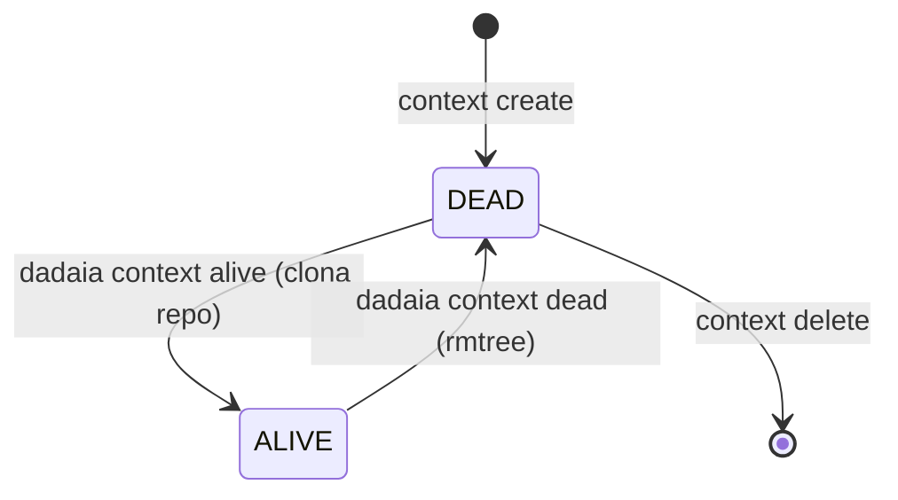

CLI surface: `dadaia context {create|list|show|alive|dead|bind|release|update|heartbeat|delete}` · `dadaia migrate [--dry-run] [--yes]` · `dadaia {release|backlog|bug} new` · `dadaia memory product add` · `dadaia migrate tree-v2`

## Propósito

Gerencia múltiplos **Spec Context Projects** — cada um mapeia `nome → repo_slug → repo_url` e tem state machine binária: **ALIVE** (repo clonado em `repos/<repo_slug>/`, disponível para implementação) ou **DEAD** (repo removido do disco, fora de uso). Não existe "global primary": o binding de sessão (`dadaia context bind <name>`) **persiste** contexto, modo, release e pid em um session record CLI-owned (`.dadaia/sessions/<id>.json`, via `session_identity`) — o store que os hooks realmente leem. O bind não emite eval-exports por default; `--print-env` é o escape back-compat para `eval $(...)`.

O modelo v2 (semver 2.0.0) elimina o contexto global implícito. A policy SDD (dentro do entrypoint PreToolUse único `python -m dadaia_workspace.hooks.pre_gate`) deriva o contexto PATH-first do write target, resolve o modo da sessão (env → session record → incumbent → IMPLEMENTATION) e valida o lease antes de permitir qualquer write em produção. Bind nunca é precondição de trabalho: uma sessão sem bind permanece IMPLEMENTATION-capable (lease livre apenas; nunca takeover de holder vivo).

### State machine ALIVE/DEAD



### Ciclo de vida do `repo_url`

O record `nome → repo_slug → repo_url` tem quatro superfícies de manutenção da URL:

  * `dadaia context create <name> --repo <slug> [--url <url>]` — `--url` persiste a URL
    explicitamente e **vence** o lookup do catálogo (repos.xlsx).
  * **Back-fill automático:** `context alive` e `context dead` preenchem `repo_url` a
    partir de `git remote get-url origin` (via o git-ops port per-context, nunca
    subprocess em features) quando a URL do record está vazia e o repo existe em disco
    (`alive` dentro do Lock 2; `dead` antes do rmtree).
  * `dadaia context update <name> --url <url>` — verbo de reparo sobre o `update()` do
    store (cenário de migração VPS sem repo em disco para back-fill).
  * `dadaia doctor` flags `CTX-URL-1` para context ALIVE com `repo_url` vazio (manual;
    roteia para `context update`).

Um context com URL preenchida é portável: `dadaia export` → import em outra máquina →
`context alive` clona da URL do record.

### Session binding e camadas de locking

Uma sessão obtém um binding via:

```
dadaia context bind <name> [--mode read|implementation|review] [--release <id>]
# → persiste {context, mode, release, pid, session_id (sess_<hex8>)} no session record
# → atualiza o incumbent pointer (sessions/runtime/<ctx>.ptr)
# → escreve o bind-epoch marker .dadaia/states/bind_epoch/<ctx> (trigger de injeção)
# --mode é opcional (default read); --release é exigido para implementation/review
# --print-env: adicionalmente emite as linhas legacy `export DADAIA_*` (eval-compat)
```

**Bind-driven context injection (DP-2):** `bind` é o ÚNICO trigger de injeção de
context-memory. O marker standalone `.dadaia/states/bind_epoch/<ctx>` (NÃO um campo do
`.ptr` — o `.ptr` é lease-incumbency) dobra como a fonte de descoberta de contexto do
hook `ctx_inject`, cuja cadeia de resolução é: `DADAIA_CONTEXT` env → session record
self-keyed (contexto bound) → **marker bind-epoch mais novo que o sentinel desta
sessão** → preflight genérico apenas (preflight de dispatcher + lista de contexts
ALIVE; SEM context memory). O first-ALIVE foi deletado da injeção (permanece válido só
na resolução de lease-context do gate — outro trabalho). O hook re-injeta quando (a)
não há sentinel para o sid, ou (b) um marker é mais novo que o mtime do sentinel —
re-bind para outro contexto re-injeta; marker pré-existente nunca binda sessão fresca
(sem sentinel ⇒ preflight genérico, que estampa o sentinel). Bind binda o CONTEXTO:
pode re-injetar numa sessão paralela concorrente no próximo prompt (canon NF-2).
Bind permanece non-blocking para trabalho ADDITIVE — o fluxo nunca para para exigir
um bind.

Três camadas de lock garantem operações concorrentes seguras:

| Lock | Caminho | Impl | Escopo |
|------|---------|------|--------|
| Lock 1 (workspace) | `.dadaia/states/.ws_lock` | `WorkspaceLock` protocol; POSIX adapter (`infrastructure/file_lock_posix.py`) uses `fcntl LOCK_EX`, 5s timeout | Toda mutação em `spec_contexts.json` (`alive()`, `dead()`, `create()`, `delete()`, `DoctorService.fix()`, `context bind`, `context release`) |
| Lock 2 (per-context) | `.dadaia/states/ctx_locks/<slug>.lock` | `ContextLock` protocol; POSIX adapter uses `fcntl LOCK_EX`, 5s timeout | `git clone` e `shutil.rmtree` por context (fora do Lock 1; L1>L2 é a única direção safe) |
| TTL-lease (per-context) | `.dadaia/states/ctx_locks/<ctx>.lock.json` | JSON O_EXCL CAS | Mutex de MUTATING release para o context; TTL 120s piso + PID veto; heartbeat renovado pelo PostToolUse hook (todo tool no Claude) e nos próprios writes MUTATING |

Lock-1 e Lock-2 operam através dos protocolos `WorkspaceLock` e `ContextLock`
(`core/protocols/file_lock.py`), com o adapter POSIX em `infrastructure/file_lock_posix.py`.
A implementação concreta (`fcntl`) nunca importa diretamente em `features/` — apenas o
protocol é injetado via `container.py`.

**O TTL-lease** é o único mecanismo que serializa writers MUTATING. Ele foi introduzido em v0.1.6 substituindo o modelo 4-store anterior (sessions, Lock-3, semaphore).

### Modos de sessão (--mode)

| Mode | Persistido como | Semântica |
|------|-----------------|-----------|
| `read` (default; alias legacy `spec`) | `READ` | Non-acquiring: o gate bloqueia writes MUTATING **sem tocar o lease**; ADDITIVE (bugs/backlog/audits/reports/handoff/tmp) flui. |
| `implementation` | `BOUND_IMPLEMENTATION` | Requer `--release <id>`; acquire do TTL-lease no primeiro write MUTATING. |
| `review` | `BOUND_REVIEW` | Requer `--release <id>`; lease-taking, tratado como implementation no gate. |
| (sem bind) | — | Default IMPLEMENTATION no gate: pode adquirir lease **livre**, nunca takeover de holder vivo (D-3). ADDITIVE sempre flui. |

### TTL-lease: acquire e liveness

O lease é adquirido inline pelo gate no primeiro write MUTATING da sessão (não em `context bind`). Schema: `{context, release, session_id, mode, pid, acquired_at, heartbeat, ttl}`.

- **Acquire e renew:** O_EXCL CAS via sentinel file — fecha o TOCTOU gap; o renew roda dentro do mesmo CAS (sem interleave com acquire estrangeiro). `acquire`/`steal`/`release` escrevem/removem a entrada do **by-session index** (`ctx_locks/by-session/<sid>.json`) dentro da MESMA transação CAS — record e index não podem divergir; o PostToolUse renova heartbeat via index sem full scan do lock dir (fallback full-scan quando o dir do index está ausente, janela de migração).
- **TTL + PID veto:** `LEASE_TTL_SECONDS` (single home `core/kernel_tunables.py`; piso 120s; re-export em `lease` por uma release) é o piso; um record TTL-stale cujo `pid` proba vivo é tratado como live (block, não takeover). Heartbeat renovado pelo hook PostToolUse (session id do stdin; todo tool no Claude Code) e nos próprios writes MUTATING; holder confirmado renova mesmo past-TTL.
- **Release explícito:** `dadaia context release` solta o(s) lease(s) que a sessão segura ANTES de remover o session record. Predicados por fluxo: (a) **eval flow** (`--print-env`, `DADAIA_SESSION_ID` exportado) — solta todo lock record que nomeia o sid do env; (b) **default flow** (sid do CLI ≠ sid do harness) — resolve o contexto bound do session record e solta o lease daquele contexto apenas se o pid do holder está morto OU casa com a ancestralidade do processo chamador (port `ProcessAncestry`); um lease de holder estrangeiro vivo NUNCA é solto por nome de contexto. Pós-release, `renew_heartbeat` não ressuscita o lease (nunca recria record ausente/foreign-sid; DP-3: não há guard de renovação baseado em session record — holder unbound continua renovando, invariante v0.1.10 FR-R2-01). `context dead <ctx>` procede após um release bem-sucedido.
- **Stable-session-identity (D1):** `.dadaia/sessions/runtime/<ctx>.ptr` contém o `session_id` incumbente (I/O via `session_identity`). Se `.ptr` match a sessão atual, o lease é RENEWED incondicionalmente (mesmo após relaunch — elimina freeze root cause).
- **Reclaim-iff-stale:** lease TTL-stale com holder morto/ausente é reclaimed automaticamente pelo próximo acquire. `dadaia lock steal <ctx>` é o reclaim manual de emergência, **probe-gated**: recusa quando o pid registrado do holder está vivo, mesmo past-TTL; record sem `pid` (pré-pid) segue a regra TTL pura. O acquire de `lease._main` threads o mesmo probe — não existe caminho de acquire/steal sem probe.
- **Yield-iff-live-foreign:** lease estrangeiro vivo (TTL-fresh ou pid vivo) → LockHeldError com yield message informativa. A mensagem **nunca** instrui rebind, relaunch, ou steal.
- **GC:** `dadaia doctor --fix` reclama via `LOCK-GC` os leases TTL-expirados cujo holder está morto ou é unprobeable (records pré-`pid` inclusos — TTL-only reclaimable); um holder com pid vivo NUNCA é reclaimed; orphan sentinel files também são limpos. Bind/session records decaem por TTL medido contra `last_seen_at`, renovado pelo heartbeat PostToolUse a cada tool use — um READ bind de sessão ativa nunca decai (sem READ→IMPLEMENTATION silencioso); record sem `last_seen_at` mantém TTL-from-creation; o pid do session record (bind-CLI, morto por construção) não é consultado. O doctor de specs valida coerência lease↔session com triagem em 3 estados (SPEC-DOC-029: stale-dead ⇒ WARN com remediação; live-incoerente ⇒ ERR; coerente ⇒ ok).

### Migração v1→v2 (`dadaia migrate`)

Qualquer workspace v1 (`schema_version: "1"` ou `state: "ativo"`) é bloqueado com loud guard ao rodar qualquer comando `dadaia context`. Migração:

```
dadaia migrate [--dry-run] [--yes]
```

Ações: mapeamento de estados, renomeação de campos, remoção do flag global legado, adição de `dead_since: null`, atualização de `schema_version` para `"2"`, deleção do marcador global legado, criação de `.dadaia/sessions/`, `.dadaia/states/ctx_locks/`. Idempotente em workspace v2.

### Canonical specs/ tree v2 (scaffold baseline)

O scaffold de novo consumer repo (`dadaia init` + `dadaia context create`) entrega a árvore v2:

  * `specs/constitution.md` — leis absolutas do produto.
  * `specs/memory/architecture.md` e `specs/memory/tech-stack.md` — memory Markdown atômica.
  * `specs/memory/product/index.md` — entry point do catalog; `dadaia memory product add <slug>` cria feature Markdown e regenera o catalog.
  * `specs/backlog/`, `specs/bugs/`, `specs/releases/`, `specs/audits/` — diretórios de lifecycle com `README.md` e `.gitkeep`.
  * `specs/AGENTS.md` — contrato SDD do spec tree para o operador do consumer repo.

Doctor TREE-1..7 enforça e repara esta árvore: `dadaia specs doctor` em workspace recém-scaffoldado deve sair com 0 violations.

**CLIs de criação de artefatos SDD** (evitam frontmatter manual):

  * `dadaia release new <id>` — cria `specs/releases/<id>/SPEC.md` stub com frontmatter canônico.
  * `dadaia backlog new <slug>` — cria `specs/backlog/<slug>.md` stub.
  * `dadaia bug new <slug>` — cria `specs/bugs/<slug>.md` com `session_id: null`.
  * `dadaia memory product add <slug>` — cria feature Markdown em `specs/memory/product/<slug>.md` e regenera `catalog.json` de forma idempotente.

## Fluxo de uso

  1. `dadaia context create my-project --repo dadaia-workspace [--url <git-url>]` — registra o context (DEAD, sem clone); `--url` persiste a remote URL (senão lookup do catálogo; back-fill posterior em alive/dead).
  2. `dadaia context alive my-project` — clona o repo em `repos/dadaia-workspace/`, faz checkout da branch, marca ALIVE.
  3. `dadaia context list` — mostra todos com state (ALIVE/DEAD), repo slug, datas.
  4. `dadaia context bind my-project --mode implementation --release my-release-v1` — persiste o session record (contexto, modo, release, pid). O lease é adquirido inline no primeiro write MUTATING.
  5. `dadaia context release` — solta o(s) lease(s) que a sessão segura (predicados eval/default flow acima) e remove o session record, liberando o contexto para outro agente.
  6. `dadaia context dead my-project` — remove o repo do disco (rmtree com retry chmod para objetos git user-owned read-only normais), marca DEAD. Bloqueado se TTL-lease HELD para o context. **Review gate:** com arquivos untracked e sem `--commit`, `dead()` recusa e não faz push; com `--commit`, um secret scan (privacy engine) roda sobre o conteúdo staged e bloqueia o push em qualquer finding.

O hook `python -m dadaia_workspace.hooks.ctx_inject` executa no SessionStart/UserPromptSubmit. A injeção é **bind-driven**: sessão unbound recebe apenas o preflight genérico + lista de contexts ALIVE (sem context memory); após `dadaia context bind X`, o próximo prompt injeta a memory de X (tech-stack + catalog) uma vez por sessão lógica; re-bind para Y re-injeta Y. Para ADDITIVE writes (reports, handoffs, bugs, backlog, audits), o bind não é necessário — o gate permite esses paths sem lease.

## Trigger típico

Quando o operador vai começar a trabalhar em um repositório, ou quando um agente de implementação precisa adquirir o direito exclusivo de mutar um release específico de um context ALIVE.

## Diferencial

Sem context management v2, múltiplos agentes em paralelo podem editar a mesma release simultaneamente, um agente pode remover o repo enquanto outro tem fds abertos, ou duas sessões podem corromper `spec_contexts.json` por update perdido. O modelo ALIVE/DEAD + session binding + TTL-lease fecha esse surface completamente. O TTL-lease com stable-session-identity (D1) elimina o soft-deadlock: uma sessão relaunched é reconhecida como incumbente e RENEWS sem conflict.

## Estado runtime tocado

  * `.dadaia/states/spec_contexts.json` — registro de todos os contexts (`schema_version: "2"`; state ALIVE/DEAD; `alive_since`; `dead_since`; sem flag global)
  * `.dadaia/states/.ws_lock` — fcntl workspace lock (gitignored; criado em runtime)
  * `.dadaia/states/ctx_locks/<slug>.lock` — fcntl per-context lock (gitignored)
  * `.dadaia/states/ctx_locks/<ctx>.lock.json` — single-record JSON TTL-lease com `pid` (criado inline no primeiro write MUTATING; TTL piso 120s via `kernel_tunables` + PID veto)
  * `.dadaia/states/ctx_locks/by-session/<sid>.json` — by-session heartbeat index (escrito/removido na mesma transação CAS do lock record; renovação O(1) sem full scan)
  * `.dadaia/states/bind_epoch/<ctx>` — bind-epoch marker escrito por `context bind` (trigger e fonte de descoberta da injeção bind-driven)
  * `.dadaia/sessions/<id>.json` — session record CLI-owned escrito por `bind` via `session_identity` (`context`, `mode`, `release`, `pid`, `last_seen_at`); lido pelo gate (modo) e pelo Kanban
  * `.dadaia/sessions/runtime/<ctx>.ptr` — stable-session-identity pointer (escrito em acquire; I/O via `session_identity`)
  * `.dadaia/logs/lock-events.jsonl` — audit log append-only (eventos: acquire, release, steal, HEARTBEAT)
  * `repos/<repo_slug>/` — repo clonado durante `alive`, removido em `dead`
  * `DADAIA_CONTEXT`, `DADAIA_SESSION_ID`, `DADAIA_MODE` — env vars opcionais de operador, emitidas apenas com `--print-env` (overrides; o caminho harness-real é o session record)

**Stores que não existem (não recriar):** `.dadaia/locks/implementation/<ctx>__<release>.json` (Lock 3) e `.dadaia/states/ctx_locks/<ctx>.semaphore.json` (semaphore / Lock 4). O mutex MUTATING é exclusivamente o single-record TTL-lease.

## Dependências

  * Depende de [[workspace-init]] (cria `spec_contexts.json` e o hook ctx-inject; garante que `.dadaia/states/ctx_locks/` exista).
  * `alive()` indiretamente usa git clone (infra); `dead()` usa rmtree.
  * [[sdd-gate-v3]] invoca `lease.py` para validar identidade + ownership por sessão.
  * [[workspace-doctor]] valida invariantes sobre o TTL-lease e session state.
  * [[agent-orchestration]] consome `DADAIA_CONTEXT` exportado por bind para resolver paths de specs.
