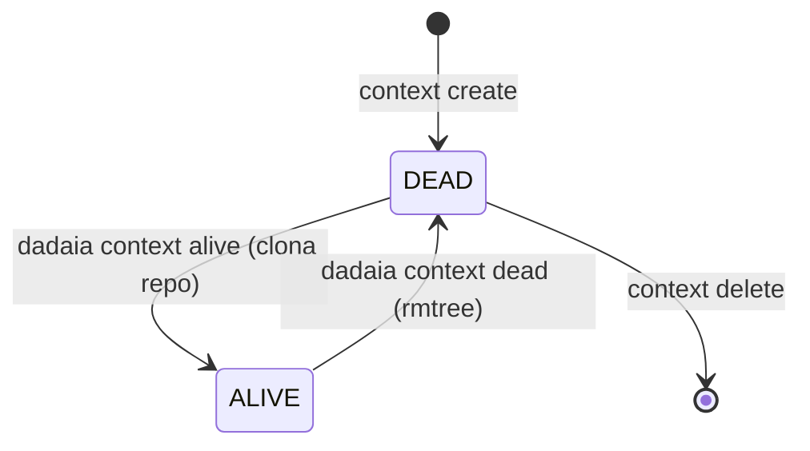

CLI surface: `dadaia context {create|list|show|alive|dead|bind|release|heartbeat|delete}` · `dadaia migrate [--dry-run] [--yes]` · `dadaia {release|backlog|bug} new` · `dadaia memory product add` · `dadaia migrate tree-v2`

## Propósito

Gerencia múltiplos **Spec Context Projects** — cada um mapeia `nome → repo_slug → repo_url` e tem state machine binária: **ALIVE** (repo clonado em `repos/<repo_slug>/`, disponível para implementação) ou **DEAD** (repo removido do disco, fora de uso). Não existe "global primary": o context ativo por sessão é estabelecido via _session binding_ (`eval $(dadaia context bind ...)`), exportando `DADAIA_CONTEXT`, `DADAIA_SESSION_ID` e `DADAIA_MODE` no shell da sessão.

O modelo v2 (semver 2.0.0) elimina o contexto global implícito. Cada sessão de agente declara seu contexto explicitamente. O gate `sdd-spec-gate.sh` valida a identidade da sessão e o lease antes de permitir qualquer write em produção.

### State machine ALIVE/DEAD



### Session binding e camadas de locking

Uma sessão de agente obtém identidade via:

```
eval $(dadaia context bind <name> --mode implementation --release <id>)
# → exporta DADAIA_CONTEXT, DADAIA_SESSION_ID (sess_<uuid4>), DADAIA_MODE=IMPLEMENTATION
```

Três camadas de lock garantem operações concorrentes seguras:

| Lock | Caminho | Impl | Escopo |
|------|---------|------|--------|
| Lock 1 (workspace) | `.dadaia/states/.ws_lock` | `WorkspaceLock` protocol; POSIX adapter (`infrastructure/file_lock_posix.py`) uses `fcntl LOCK_EX`, 5s timeout | Toda mutação em `spec_contexts.json` (`alive()`, `dead()`, `create()`, `delete()`, `DoctorService.fix()`, `context bind`, `context release`) |
| Lock 2 (per-context) | `.dadaia/states/ctx_locks/<slug>.lock` | `ContextLock` protocol; POSIX adapter uses `fcntl LOCK_EX`, 5s timeout | `git clone` e `shutil.rmtree` por context (fora do Lock 1; L1>L2 é a única direção safe) |
| TTL-lease (per-context) | `.dadaia/states/ctx_locks/<ctx>.lock.json` | JSON O_EXCL CAS (v0.1.6) | Mutex de MUTATING release para o context; TTL 120s; heartbeat a cada PreToolUse |

Lock-1 e Lock-2 operam através dos protocolos `WorkspaceLock` e `ContextLock`
(`core/protocols/file_lock.py`), com o adapter POSIX em `infrastructure/file_lock_posix.py`.
A implementação concreta (`fcntl`) nunca importa diretamente em `features/` — apenas o
protocol é injetado via `container.py`.

**O TTL-lease** é o único mecanismo que serializa writers MUTATING. Ele foi introduzido em v0.1.6 substituindo o modelo 4-store anterior (sessions, Lock-3, semaphore).

### Modos de sessão (--mode)

| Mode | Semântica |
|------|-----------|
| `read` | Sessão read-only; gate bloqueia todos os writes de produção, memory e releases. |
| `implementation` | Requer `--release <id>`; acquire do TTL-lease no primeiro write MUTATING. |
| (sem bind) | ADDITIVE writes (reports, handoffs, backlog) permitidos sem bind. |

### TTL-lease: acquire e liveness

O lease é adquirido inline pelo gate no primeiro write MUTATING da sessão (não em `context bind`). Schema: `{context, release, session_id, mode, acquired_at, heartbeat, ttl}`.

- **Acquire:** O_EXCL CAS via sentinel file — fecha o TOCTOU gap.
- **TTL:** `LEASE_TTL_SECONDS = 120s` (OQ-1, operador 2026-06-06). Heartbeat renovado a cada PreToolUse.
- **Stable-session-identity (D1):** `.dadaia/sessions/runtime/<ctx>.ptr` contém o `session_id` incumbente. Se `.ptr` match a sessão atual, o lease é RENEWED incondicionalmente (mesmo após relaunch — elimina freeze root cause).
- **Reclaim-iff-stale:** lease com heartbeat > 120s é reclaimed automaticamente pelo próximo acquire. `dadaia lock steal <ctx>` para reclaim manual.
- **Yield-iff-live-foreign:** lease estrangeiro vivo → LockHeldError com yield message informativa. A mensagem **nunca** instrui rebind, relaunch, ou steal.
- **GC:** `dadaia doctor --fix` deleta `.lock.json` stale e orphan sentinel files.

### Migração v1→v2 (`dadaia migrate`)

Qualquer workspace v1 (`schema_version: "1"` ou `state: "ativo"`) é bloqueado com loud guard ao rodar qualquer comando `dadaia context`. Migração:

```
dadaia migrate [--dry-run] [--yes]
```

Ações: mapeamento de estados, renomeação de campos, remoção do flag global legado, adição de `dead_since: null`, atualização de `schema_version` para `"2"`, deleção do marcador global legado, criação de `.dadaia/sessions/`, `.dadaia/states/ctx_locks/`. Idempotente em workspace v2.

### Canonical specs/ tree v2 (scaffold baseline)

O scaffold de novo consumer repo (`dadaia init` + `dadaia context create`) entrega a árvore v2:

  * `specs/constitution.md` — leis absolutas do produto.
  * `specs/memory/architecture.md` e `specs/memory/tech-stack.md` — memory Markdown atômica.
  * `specs/memory/product/index.md` — entry point do catalog; `dadaia memory product add <slug>` cria feature Markdown e regenera o catalog.
  * `specs/backlog/`, `specs/bugs/`, `specs/releases/`, `specs/audits/` — diretórios de lifecycle com `README.md` e `.gitkeep`.
  * `specs/AGENTS.md` — contrato SDD do spec tree para o operador do consumer repo.

Doctor TREE-1..7 enforça e repara esta árvore: `dadaia specs doctor` em workspace recém-scaffoldado deve sair com 0 violations.

**CLIs de criação de artefatos SDD** (evitam frontmatter manual):

  * `dadaia release new <id>` — cria `specs/releases/<id>/SPEC.md` stub com frontmatter canônico.
  * `dadaia backlog new <slug>` — cria `specs/backlog/<slug>.md` stub.
  * `dadaia bug new <slug>` — cria `specs/bugs/<slug>.md` com `session_id: null`.
  * `dadaia memory product add <slug>` — cria feature Markdown em `specs/memory/product/<slug>.md` e regenera `catalog.json` de forma idempotente.

## Fluxo de uso

  1. `dadaia context create my-project --repo dadaia-workspace` — registra o context (DEAD, sem clone).
  2. `dadaia context alive my-project` — clona o repo em `repos/dadaia-workspace/`, faz checkout da branch, marca ALIVE.
  3. `dadaia context list` — mostra todos com state (ALIVE/DEAD), repo slug, datas.
  4. `eval $(dadaia context bind my-project --mode implementation --release my-release-v1)` — exporta `DADAIA_CONTEXT`, `DADAIA_SESSION_ID`, `DADAIA_MODE`. O lease é adquirido inline no primeiro write MUTATING.
  5. `dadaia context release` — libera o lease e a sessão para outro agente.
  6. `dadaia context dead my-project` — remove o repo do disco (rmtree), marca DEAD. Bloqueado se lease TTL-lease HELD para o context.

O hook `.dadaia/scripts/ctx-inject.sh` (instalado por `workspace-init`) executa em cada UserPromptSubmit e injeta contexto a partir do binding de sessão exportado via `eval $(dadaia context bind ...)`. Para ADDITIVE writes (reports, handoffs, backlog), o bind não é necessário — o gate permite esses paths incondicionalmente.

## Trigger típico

Quando o operador vai começar a trabalhar em um repositório, ou quando um agente de implementação precisa adquirir o direito exclusivo de mutar um release específico de um context ALIVE.

## Diferencial

Sem context management v2, múltiplos agentes em paralelo podem editar a mesma release simultaneamente, um agente pode remover o repo enquanto outro tem fds abertos, ou duas sessões podem corromper `spec_contexts.json` por update perdido. O modelo ALIVE/DEAD + session binding + TTL-lease fecha esse surface completamente. O TTL-lease com stable-session-identity (D1) elimina o soft-deadlock: uma sessão relaunched é reconhecida como incumbente e RENEWS sem conflict.

## Estado runtime tocado

  * `.dadaia/states/spec_contexts.json` — registro de todos os contexts (`schema_version: "2"`; state ALIVE/DEAD; `alive_since`; `dead_since`; sem flag global)
  * `.dadaia/states/.ws_lock` — fcntl workspace lock (gitignored; criado em runtime)
  * `.dadaia/states/ctx_locks/<slug>.lock` — fcntl per-context lock (gitignored)
  * `.dadaia/states/ctx_locks/<ctx>.lock.json` — single-record JSON TTL-lease (criado inline no primeiro write MUTATING; TTL 120s)
  * `.dadaia/sessions/runtime/<ctx>.ptr` — stable-session-identity pointer (escrito em acquire; D1 soul-fold)
  * `.dadaia/logs/lock-events.jsonl` — audit log append-only (eventos: acquire, release, steal, HEARTBEAT)
  * `repos/<repo_slug>/` — repo clonado durante `alive`, removido em `dead`
  * `DADAIA_CONTEXT`, `DADAIA_SESSION_ID`, `DADAIA_MODE` — env vars exportadas por `eval $(dadaia context bind ...)`

**Removido em v0.1.6:** `.dadaia/sessions/<sess_*>.json` (session files), `.dadaia/locks/implementation/<ctx>__<release>.json` (Lock 3), `.dadaia/states/ctx_locks/<ctx>.semaphore.json` (semaphore / Lock 4). Esses foram substituídos pelo single-record TTL-lease.

## Dependências

  * Depende de [[workspace-init]] (cria `spec_contexts.json` e o hook ctx-inject; garante que `.dadaia/states/ctx_locks/` exista).
  * `alive()` indiretamente usa git clone (infra); `dead()` usa rmtree.
  * [[sdd-gate-v3]] invoca `lease.py` para validar identidade + ownership por sessão.
  * [[workspace-doctor]] valida invariantes sobre o TTL-lease e session state.
  * [[agent-orchestration]] consome `DADAIA_CONTEXT` exportado por bind para resolver paths de specs.
