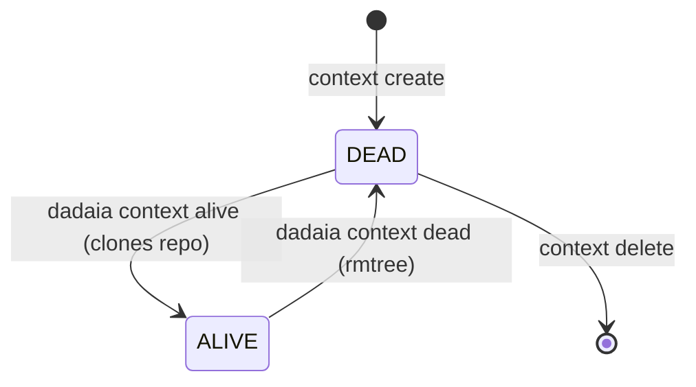

CLI surface: `dadaia context {create|list|show|alive|dead|bind|release|update|heartbeat|delete}` · `dadaia migrate [--dry-run] [--yes]` · `dadaia {release|backlog} new` · `dadaia bugs append` (event-sourced bug intake, see [[sdd-bug-backlog-governance]]) · `dadaia memory product add` · `dadaia migrate tree-v2`

## Purpose

Manages multiple **Spec Context Projects** — each maps `name → repo_slug → repo_url` and has a binary state machine: **ALIVE** (repo cloned into `repos/<repo_slug>/`, available for implementation) or **DEAD** (repo removed from disk, out of use). There is no "global primary": session binding (`dadaia context bind <name>`) **persists** context, mode, release and pid in a CLI-owned session record (`.dadaia/sessions/<id>.json`, via `session_identity`) — the store the hooks actually read. Bind emits no eval-exports by default; `--print-env` is the back-compat escape for `eval $(...)`.

The v2 model (semver 2.0.0) eliminates the implicit global context. The SDD policy (inside the single PreToolUse entrypoint `python -m dadaia_workspace.hooks.pre_gate`) derives the context PATH-first from the write target, resolves the session's mode (env → session record → incumbent → IMPLEMENTATION) and validates the lease before allowing any production write. Bind is never a precondition for work: an unbound session remains IMPLEMENTATION-capable (free lease only; never a takeover of a live holder).

### State machine ALIVE/DEAD



### `repo_url` lifecycle

The `name → repo_slug → repo_url` record has four URL-maintenance surfaces:

  * `dadaia context create <name> --repo <slug> [--url <url>]` — `--url` persists the URL
    explicitly and **wins** over the catalog lookup (repos.xlsx).
  * **Automatic back-fill:** `context alive` and `context dead` fill `repo_url` from
    `git remote get-url origin` (via the per-context git-ops port, never
    subprocess in features) when the record's URL is empty and the repo exists on disk
    (`alive` inside Lock 2; `dead` before the rmtree).
  * `dadaia context update <name> --url <url>` — repair verb over the store's
    `update()` (VPS-migration scenario with no repo on disk to back-fill from).
  * `dadaia doctor` flags `CTX-URL-1` for an ALIVE context with empty `repo_url`
    (manual; routes to `context update`).

A context with a filled-in URL is portable: `dadaia export` → import on another machine →
`context alive` clones from the record's URL.

### Session binding and locking layers

A session obtains a binding via:

```
dadaia context bind <name> [--mode read|implementation|review] [--release <id>]
# → persists {context, mode, release, pid, session_id (sess_<hex8>)} in the session record
# → refreshes the incumbent pointer (sessions/runtime/<ctx>.ptr)
# → writes the bind-epoch marker .dadaia/states/bind_epoch/<ctx> (injection trigger)
# --mode is optional (default read); --release is required for implementation/review
# --print-env: additionally emits the legacy `export DADAIA_*` lines (eval-compat)
```

**Bind-driven context injection (DP-2) with session attribution:** `bind` is the ONLY
context-memory injection trigger. The standalone marker
`.dadaia/states/bind_epoch/<ctx>` (NOT a field of the `.ptr` — the `.ptr` is
lease-incumbency) carries as CONTENT the bind process's **ancestry pid chain** — one
decimal pid per line, nearest-first (line 1 = the bind CLI's parent), capped at 8 entries
(`features/spec_context/session_identity.py::write_bind_epoch`). Recording the chain
instead of a single pid closes the ephemeral-shell gap that caused cross-session
contamination: when `dadaia context bind` runs through a harness Bash tool the immediate
parent is a short-lived shell that dies — the long-lived harness pid deeper in the chain
is the stable anchor. The `ctx_inject` hook's resolution
chain: `DADAIA_CONTEXT` env → self-keyed session record (bound context) →
**bind-epoch marker newer than this session's sentinel AND whose recorded ancestry chain
CONTAINS this session's harness pid (membership test — `hooks/ctx_inject.py`; the specs
resolver attributes the same way)** → generic preflight only (dispatcher preflight + list
of ALIVE contexts; NO context memory). Membership attribution guarantees that a
parallel session's bind never steals this session's injection; an empty/legacy marker
(empty chain) is non-attributable ⇒ ignored for injection (never another session's
context). First-ALIVE was deleted from injection (it remains valid only in the gate's
lease-context resolution). The hook re-injects when (a) there is no sentinel for the
sid, or (b) a marker attributable to this session is newer than the sentinel's mtime —
a re-bind to another context re-injects; a pre-existing marker never binds a fresh
session (no sentinel ⇒ generic preflight, which stamps the sentinel). Bind remains
non-blocking for ADDITIVE work — the flow never stops to demand a bind.

**Hook execution detail (`hooks/ctx_inject.py`):** the hook resolves a stable
`SESSION_ID` via the shared `hooks/_common.resolve_session_id` — order (v0.1.50):
`DADAIA_SESSION_ID` (operator override) → the stdin payload's `session_id` (harness
live-truth) → inherited `CLAUDE_CODE_SESSION_ID` → `CODEX_SESSION_ID` (no PID
fallback), sanitized before becoming a filename component. On injection it stamps the sentinel (session
pointer via `session_identity`) and emits the payload inside bounded markers
(`=== workspace memory (tech + catalog) === … === end memory bootstrap ===`).
Per-runtime hook event registration (which events/matchers each harness wires):
[[public-asset-distribution]].

**specs_dir resolution in a bound shell (CLI):** `core/specs_resolver.py` resolves the
`specs_dir` of commands like `dadaia specs doctor`/`bugs`/`backlog` in the order env →
**persisted bind of an attributable/live session** (the context's incumbent, attributed
by ancestry-chain MEMBERSHIP) → cwd — a bound workspace shell resolves without the
`--specs-dir` flag. Since v0.1.50 every specs-dir-taking CLI command consumes the ONE
shared seam `cli/_specs_resolution.resolve_specs_dir_for_cli` (which threads the
invoking process's full `ancestry_pids` into the resolver — a deep-ancestor bind marker
attributes correctly; the omission class that produced
`bugs-append-bound-session-falls-through-to-cwd-specs` is structurally impossible), and
the cwd fallback **refuses** a `specs/` directly at the workspace root (Workspace Root
Law; redaction-safe message) instead of silently writing there.

Three lock layers guarantee safe concurrent operations:

| Lock | Path | Impl | Scope |
|------|---------|------|--------|
| Lock 1 (workspace) | `.dadaia/states/.ws_lock` | `WorkspaceLock` protocol; POSIX adapter (`infrastructure/file_lock_posix.py`) uses `fcntl LOCK_EX`, 5s timeout | Every mutation of `spec_contexts.json` (`alive()`, `dead()`, `create()`, `delete()`, `DoctorService.fix()`, `context bind`, `context release`) |
| Lock 2 (per-context) | `.dadaia/states/ctx_locks/<slug>.lock` | `ContextLock` protocol; POSIX adapter uses `fcntl LOCK_EX`, 5s timeout | `git clone` and `shutil.rmtree` per context (outside Lock 1; L1>L2 is the only safe direction) |
| TTL-lease (per-context) | `.dadaia/states/ctx_locks/<ctx>.lock.json` | JSON TTL-lease (mechanics: [[sdd-gate-v3]]) | MUTATING release mutex for the context |

Lock-1 and Lock-2 operate through the `WorkspaceLock` and `ContextLock` protocols
(`core/protocols/file_lock.py`), with the POSIX adapter in `infrastructure/file_lock_posix.py`.
The concrete implementation (`fcntl`) is never imported directly in `features/` — only the
protocol is injected via `container.py`.

**The TTL-lease** is the only mechanism that serializes MUTATING writers. It was introduced in v0.1.6, replacing the previous 4-store model (sessions, Lock-3, semaphore).

### Session modes (--mode)

| Mode | Persisted as | Semantics |
|------|-----------------|-----------|
| `read` (default; legacy alias `spec`) | `READ` | Non-acquiring: the gate blocks MUTATING writes **without touching the lease**; ADDITIVE (bugs/backlog/audits/reports/handoff/tmp) flows. |
| `implementation` | `BOUND_IMPLEMENTATION` | Requires `--release <id>`; TTL-lease acquire on the first MUTATING write. |
| `review` | `BOUND_REVIEW` | Requires `--release <id>`; lease-taking, treated as implementation by the gate. |
| (no bind) | — | Default IMPLEMENTATION in the gate: may acquire a **free** lease, never a takeover of a live holder (D-3). ADDITIVE always flows. |

### TTL-lease: bind/release lifecycle (mechanics owned by [[sdd-gate-v3]])

The lease is acquired inline by the gate on the session's first MUTATING write (not at
`context bind`). Schema: `{context, release, session_id, mode, pid, acquired_at,
heartbeat, ttl}`. The full acquire/liveness mechanics — O_EXCL CAS sentinel, the
by-session index written in the same CAS transaction, TTL floor + PID veto, PostToolUse
heartbeat renewal, stable-session-identity via `.ptr`, yield-iff-live-foreign,
probe-gated `dadaia lock steal`, and doctor LOCK-GC reclaim — are owned by
[[sdd-gate-v3]] and are not restated here. This atom owns the lifecycle around the
lease: bind, explicit release, and session/bind-record decay.

- **Explicit release:** `dadaia context release` drops the lease(s) the session holds BEFORE removing the session record. Per-flow predicates: (a) **eval flow** (`--print-env`, `DADAIA_SESSION_ID` exported) — drops every lock record that names the env's sid; (b) **default flow** (CLI sid ≠ harness sid) — resolves the session record's bound context and drops that context's lease only if the holder's pid is dead OR matches the calling process's ancestry (`ProcessAncestry` port); a live foreign holder's lease is NEVER dropped by context name. Post-release, the heartbeat never resurrects the lease ([[sdd-gate-v3]], DP-3). `context dead <ctx>` proceeds after a successful release.
- **Bind/session record decay:** bind/session records decay by TTL measured against `last_seen_at`, renewed by the PostToolUse heartbeat on every tool use — an active session's READ bind never decays (no silent READ→IMPLEMENTATION); a record without `last_seen_at` keeps TTL-from-creation; the session record's pid (bind-CLI, dead by construction) is not consulted. The specs doctor validates lease↔session coherence with 3-state triage (SPEC-DOC-029: stale-dead ⇒ WARN with remediation; live-incoherent ⇒ ERR; coherent ⇒ ok).

### v1→v2 migration (`dadaia migrate`)

Any v1 workspace (`schema_version: "1"` or `state: "ativo"`) is blocked with a loud guard when running any `dadaia context` command. Migration:

```
dadaia migrate [--dry-run] [--yes]
```

Actions: state mapping, field renaming, removal of the legacy global flag, addition of `dead_since: null`, update of `schema_version` to `"2"`, deletion of the legacy global marker, creation of `.dadaia/sessions/` and `.dadaia/states/ctx_locks/`. Idempotent on a v2 workspace.

### Canonical specs/ tree v2 (scaffold baseline)

The new-consumer-repo scaffold (`dadaia init` + `dadaia context create`) delivers the v2 tree:

  * `specs/constitution.md` — the product's absolute laws.
  * `specs/memory/architecture.md` and `specs/memory/tech-stack.md` — atomic memory Markdown.
  * `specs/memory/product/index.md` — catalog entry point; `dadaia memory product add <slug>` creates the feature Markdown and regenerates the catalog.
  * `specs/backlog/`, `specs/bugs/`, `specs/releases/`, `specs/audits/` — lifecycle directories with `README.md` and `.gitkeep`.
  * `specs/AGENTS.md` — the spec tree's SDD contract for the consumer-repo operator.

Doctor TREE-1..7 enforces and repairs this tree: `dadaia specs doctor` on a freshly scaffolded workspace must exit with 0 violations.

**SDD artifact-creation CLIs** (avoid manual frontmatter):

  * `dadaia release new <id>` — creates the `specs/releases/<id>/SPEC.md` stub with canonical frontmatter.
  * `dadaia backlog new <slug>` — creates the `specs/backlog/<slug>.md` stub.
  * `dadaia bugs append` — the **only** bug-intake path: appends an event-sourced `bug-event-v1` JSON line to `specs/bugs/<YYYYMMDDTHH>Z-<n>.jsonl` (there is no Markdown bug scaffolder) — see [[sdd-bug-backlog-governance]].
  * `dadaia memory product add <slug>` — creates the feature Markdown at `specs/memory/product/<slug>.md` and regenerates `catalog.json` idempotently.

## Usage flow

  1. `dadaia context create my-project --repo dadaia-workspace [--url <git-url>]` — registers the context (DEAD, no clone); `--url` persists the remote URL (otherwise catalog lookup; later back-fill on alive/dead).
  2. `dadaia context alive my-project` — clones the repo into `repos/dadaia-workspace/`, checks out the branch, marks ALIVE.
  3. `dadaia context list` — shows all contexts with state (ALIVE/DEAD), repo slug, dates.
  4. `dadaia context bind my-project --mode implementation --release my-release-v1` — persists the session record (context, mode, release, pid). The lease is acquired inline on the first MUTATING write.
  5. `dadaia context release` — drops the lease(s) the session holds (eval/default-flow predicates above) and removes the session record, freeing the context for another agent.
  6. `dadaia context dead my-project` — removes the repo from disk (rmtree), marks DEAD. Blocked if the TTL-lease is HELD for the context. **Review gate:** with untracked files and no `--commit`, `dead()` refuses and does not push; with `--commit`, a secret scan (privacy engine) runs over the staged content and blocks the push on any finding. **Exit path (v0.1.50):** all refusal pre-checks run BEFORE the push phase (a late failure can no longer strand a half-dead context); the push uses an explicit refspec `HEAD:<upstream-branch>` parsed from the tracking ref (a differently-named upstream no longer fails under `push.default=simple`) and is skipped entirely when `rev-list @{u}..HEAD` is empty; the rmtree uses `shutil.rmtree(onexc=chmod-and-retry)` — 0444 git loose objects are handled in-flight, replacing the old per-file non-writable pre-scan that falsely rejected standard git repos.

The `python -m dadaia_workspace.hooks.ctx_inject` hook runs on SessionStart/UserPromptSubmit. Injection is **bind-driven**: an unbound session receives only the generic preflight + list of ALIVE contexts (no context memory); after `dadaia context bind X`, the next prompt injects X's memory (tech-stack + catalog) once per logical session; a re-bind to Y re-injects Y. For ADDITIVE writes (reports, handoffs, bugs, backlog, audits), bind is not required — the gate allows those paths without a lease.

## Typical trigger

When the operator is about to start working on a repository, or when an implementation agent needs to acquire the exclusive right to mutate a specific release of an ALIVE context.

## Differentiator

Without context management v2, multiple parallel agents can edit the same release simultaneously, one agent can remove the repo while another has open fds, or two sessions can corrupt `spec_contexts.json` through a lost update. The ALIVE/DEAD model + session binding + TTL-lease closes that surface completely. The TTL-lease with stable-session-identity (D1) eliminates the soft-deadlock: a relaunched session is recognized as the incumbent and RENEWS without conflict.

## Runtime state touched

  * `.dadaia/states/spec_contexts.json` — registry of all contexts (`schema_version: "2"`; ALIVE/DEAD state; `alive_since`; `dead_since`; no global flag)
  * `.dadaia/states/.ws_lock` — fcntl workspace lock (gitignored; created at runtime)
  * `.dadaia/states/ctx_locks/<slug>.lock` — fcntl per-context lock (gitignored)
  * `.dadaia/states/ctx_locks/<ctx>.lock.json` — single-record JSON TTL-lease (created inline on the first MUTATING write; mechanics: [[sdd-gate-v3]])
  * `.dadaia/states/ctx_locks/by-session/<sid>.json` — by-session heartbeat index ([[sdd-gate-v3]])
  * `.dadaia/states/bind_epoch/<ctx>` — bind-epoch marker written by `context bind` (trigger and discovery source of bind-driven injection; content = the bind process's ancestry pid chain, one decimal pid per line, nearest-first, capped at 8 — consumers attribute a marker to a session by MEMBERSHIP of the session's harness pid in the chain)
  * `.dadaia/sessions/<id>.json` — CLI-owned session record written by `bind` via `session_identity` (`context`, `mode`, `release`, `pid`, `last_seen_at`); read by the gate (mode)
  * `.dadaia/sessions/runtime/<ctx>.ptr` — stable-session-identity pointer (written on acquire; I/O via `session_identity`)
  * `.dadaia/logs/lock-events.jsonl` — append-only audit log (events: acquire, release, steal, HEARTBEAT)
  * `repos/<repo_slug>/` — repo cloned during `alive`, removed on `dead`
  * `DADAIA_CONTEXT`, `DADAIA_SESSION_ID`, `DADAIA_MODE` — optional operator env vars, emitted only with `--print-env` (overrides; the real harness path is the session record)

**Stores that do not exist (do not recreate):** `.dadaia/locks/implementation/<ctx>__<release>.json` (Lock 3) and `.dadaia/states/ctx_locks/<ctx>.semaphore.json` (semaphore / Lock 4). The MUTATING mutex is exclusively the single-record TTL-lease.

## Dependencies

  * Depends on [[workspace-init]] (creates `spec_contexts.json` and the ctx-inject hook; ensures `.dadaia/states/ctx_locks/` exists).
  * `alive()` indirectly uses git clone (infra); `dead()` uses rmtree.
  * [[sdd-gate-v3]] invokes `lease.py` to validate per-session identity + ownership.
  * [[workspace-doctor]] validates invariants over the TTL-lease and session state.
  * [[agent-orchestration]] resolves spec paths via the discovery chain (optional operator `DADAIA_CONTEXT` env → registry/session record → `dadaia context show --json`); `bind` does NOT export env vars — only `--print-env` emits the legacy `export DADAIA_*` lines.
