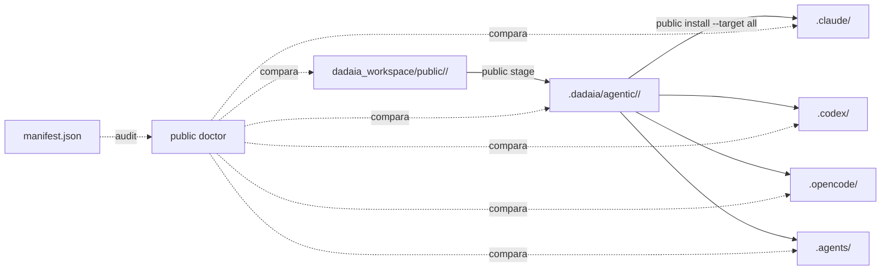

CLI surface: `dadaia public {stage|install|doctor}` · Closure: sdd-release-lifecycle-v1

## Propósito

Centraliza a fonte canônica de agents, skills, workflows, commands, rules, templates e scripts em `dadaia_workspace/public/<type>/` (dentro do pacote Python) e propaga-os para os runtime dirs das quatro tools agentic suportadas: `.claude/` (Claude Code), `.codex/` (Codex), `.opencode/` (OpenCode), `.agents/` (agents nativos).

Mudanças nos canônicos viram releases versionadas do pacote dadaia-workspace; cada workspace consumidor roda `public install` para sincronizar projeções. O `doctor` detecta drift entre fonte → staging → projeções.

## Fluxo de uso

  1. `dadaia public stage` — lê `dadaia_workspace/public/` e copia tudo para `.dadaia/agentic/<type>/` gerando um `manifest.json` com metadata de cada asset.
  2. `dadaia public install --target all [--force]` — projeta staged assets para cada tool conforme as regras do tool: `.claude/agents/`, `.claude/skills/`, `.opencode/agents/`, `.codex/agents/`, `.agents/skills/`, etc. `--force` sobrescreve drift.
  3. `dadaia public doctor` — compara source ↔ staging ↔ projeção e relata `[ok]`, `[missing]`, `[drift]`, `[unsupported]` por target e asset.

## Trigger típico

Disparado automaticamente por `workspace-init` e `context-management` (no `activate`/`promote`). Manualmente: após upgrade da versão do dadaia-workspace, ou para diagnosticar drift suspeito.

## Diferencial

Sem esta feature, cada workspace teria cópias manuais dos agentes/skills, divergindo silenciosamente. A regra **"NEVER directly edit a lib-originated file"** (declarada no `dadaia-workspace-dev-guardrail` rule) só funciona porque `public install` dá um caminho oficial para mudanças — operador edita o canonical, roda `stage && install`, e `doctor` confirma que tudo está alinhado.

## Estado runtime tocado

  * `.dadaia/agentic/<type>/` — staging area (snapshot)
  * `.dadaia/agentic/manifest.json` — metadata de quais assets foram propagados
  * `.claude/agents/`, `.claude/skills/`, `.codex/agents/`, `.opencode/agents/`, `.opencode/skills/`, `.agents/skills/` — projeções runtime
  * `opencode.json` e `.codex/hooks.json` — config files projetados

## Dependências

  * Depende de [[workspace-init]] (cria as runtime dirs).
  * Disparado por [[context-management]] em activate/promote.
  * É consumido por [[agent-orchestration]] (workflows instalados) e [[sdd-gate-v3]] (script projetado).
