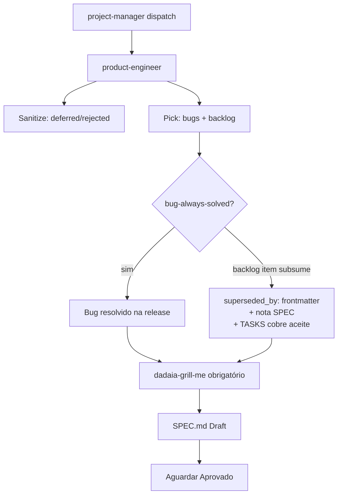

Skill: `dadaia-release-definition` · Rule: `release-governance.md` (always-on) · Rule: `backlog-ownership.md` (always-on, D5) · ADRs: ADR-1..5 in `specs/releases/v0.1.5/SPEC.md §8`

## Propósito

Define o ciclo completo de **como bugs e backlog viram releases** e **como releases
maturam e são revisadas** no dadaia-workspace. Antes desta release (v0.1.5), não havia
regra que governasse quem pega quais bugs/backlog, nem como o processo de maturação
(implementação → revisão → ship) se estruturava. Isso produziu colisões de versão
(dois `v0.1.4.3`), releases empurradas com CI vermelho, e fastlanes sem auditoria.

A governança tem três pilares:
1. **Bug/Backlog → Release** — protocolo formal para transformar itens dos ficheiros
   `specs/bugs/` e `specs/backlog/` em uma release definida e rastreável.
2. **Modelo de maturação** — o modelo `alpha-N → rc-N` que substitui o anti-padrão de
   4-segmentos (`v0.1.4.1`, `v0.1.4.2`, …) por uma estrutura onde cada release cresce
   dentro de um folder `v<M>.<m>.<p>/` com segmentos ordenados.
3. **Backlog-ownership enforcement (D5, v0.1.5-rc-1)** — somente `project-manager` cria
   entradas em `specs/backlog/**`; todos os outros agentes são readers; `product-engineer`
   consome backlog criado pelo PM para criar release specs. Enforcement mecânico via:
   - Regra always-on `backlog-ownership.md` que declara a ownership.
   - Hard PreToolUse gate que bloqueia qualquer Write/Edit em `specs/backlog/**` por
     agentes não-PM, com erro explicitando o agente violador.

## Fluxo de uso

### Parte 1 — Bug/Backlog → Release (skill `dadaia-release-definition`)

1. **Dispatch.** `project-manager` despacha `product-engineer` para definir uma release
   a partir de `specs/bugs/` (status `open`) + `specs/backlog/` (status
   `candidate`/`idea`). PE nunca auto-inicia — precisa de dispatch de PM.

2. **Sanitização.** PE revisa bugs e backlog; marca stale/inválidos como `deferred` ou
   `rejected` com um campo `reason:` no frontmatter. **Nunca deleta** arquivos de bug
   ou backlog.

3. **Pick.** PE seleciona o conjunto de bugs + backlog para a release. Todo bug picked
   **deve** ser resolvido na release — regra **bug-always-solved**.

4. **Subsumption.** Exceção ao bug-always-solved: se um item de backlog picked oferece
   uma solução mais completa que resolve o bug como subconjunto, o bug pode ser
   **subsumed** pelo backlog item. Nesse caso:
   - Campo `superseded_by: <backlog-slug>` no frontmatter do bug.
   - Nota na SPEC indicando a subsumption.
   - As TASKS do backlog item **devem cobrir** o critério de aceite do bug.
   - O bug nunca é silenciosamente descartado.

5. **Grill obrigatório.** Antes de escrever a SPEC, PE executa uma sessão
   `dadaia-grill-me` sobre o conjunto picked. Sem esse grill, PM não avança a
   release para SPEC.

6. **SPEC.** PE escreve a SPEC como Draft, aguarda aprovação.



### Parte 2 — Modelo de Maturação (ADR-1 / ADR-5)

Uma release é um folder `v<M>.<m>.<p>/` que matura através de segmentos ordenados
`alpha-1 → alpha-N → rc-1 → rc-N`. Cada segmento tem seus próprios
`SPEC.md`, `PLAN.md`, `TASKS.md`, e `CLOSURE.md` dentro de
`specs/releases/v<x>/<segment>/`.

`specs/releases/ACTIVE.md` usa schema v2 com campo `segment:` opcional:

```
release: v0.2.0
segment: alpha-1
phase: IMPLEMENTATION
```

O campo `segment:` está ausente para releases flat (sem segmentos, compatibilidade
retroativa).

O scaffolder cria segmentos via:
- `dadaia specs release open v<x>` → cria folder + `alpha-1` + atualiza ACTIVE.
- `dadaia specs segment open <alpha-N|rc-N>` → abre próximo segmento.

### Parte 3 — Cadência de revisão (ADR-3)

Uma branch única `feature/{version}` por release (ex: `feature/0.1.5`). Segmentos
alpha **nunca** criam sub-branches.

**Fim de cada `alpha-N`:**
- Apenas `qa-engineer` revisa.
- Resultado: commit na feature branch.
- Sem push, sem PR, sem outros revisores.

**Fim de cada `rc-N`** — operador escolhe:
- **Ship**: convocar trio (`qa-engineer` + `code-reviewer` + `security-reviewer`).
  Todos devem `APPROVE`. Então: push + PR → merge → CLOSURE → próxima release.
- **Iterar**: abrir `rc-(N+1)`. Sem trio necessário.

Esse modelo **substitui** o per-task reviewer fan-out. A disciplina per-task de
implementação (markers, testes, pre-push gate) permanece inalterada.

### Parte 4 — Hotfix unification (ADR-2)

Hotfixes são releases normais sob o mesmo modelo ADR-1. A distinção é que um
hotfix tipicamente abre `alpha-1` e faz ship imediatamente dali (sem rc).

O atom [[sdd-hotfix-track]] está **anotado como superseded** por ADR-2. O fluxo
condensado descrito lá ainda é válido como referência histórica, mas o modelo
canônico é o ADR-1 + ADR-2 documentado aqui.

A reconciliação mecânica de `dadaia specs hotfix open` + SPEC-DOC-016 para o modelo
de segmentos foi entregue por T-ENG-07.

### Parte 5 — Pre-push CI gate (T-GATE-01)

Script `dadaia_workspace/public/scripts/pre-push-ci-gate.sh` instalado como git
`pre-push` hook. Executa:
- `ruff format --check`
- `ruff check`
- `mypy --strict`
- `pytest` (caches fora do repo)

Bloqueia `git push` em qualquer falha. Motivação: a família v0.1.4 foi empurrada com
CI vermelho — CI é rede de segurança, não primeira linha de defesa.

## Trigger típico

Início de ciclo de planejamento de release: PM consulta `specs/bugs/` + `specs/backlog/`
e despacha PE para definir a próxima release. Ou no encerramento de um `alpha-N` (PE
avança para o próximo segmento). Ou quando um incidente em produção gera um novo bug
que precisa de subsumption ou nova release.

## Diferencial

Sem esta governança: bugs são silenciosamente descartados ao serem cobertos por
backlog items sem rastreamento; releases são abertas sem grill (resultando em SPEC
que descobre problemas durante implementação); a família de versões se fragmenta em
anti-padrão (v0.1.4.1, v0.1.4.2, v0.1.4.3 × 2); e CI vermelho chega ao histórico
do repo principal.

Com esta governança: toda decisão de release tem dono explícito (PE, dispatch de PM),
toda subsumption é rastreada, todo bug tem destino declarado, toda release nasce de
grill, e o segmento model impede colisões de versão.

## Estado runtime tocado

- Read: `specs/bugs/*.md` (frontmatter: status, superseded_by), `specs/backlog/*.md`,
  `specs/releases/ACTIVE.md` (release + segment + phase), `specs/releases/<ver>/<seg>/TASKS.md`.
- Write (CLOSURE phase only): `specs/memory/product/*.md` (product-engineer apenas).
- Write (implementation): `specs/releases/v<x>/<seg>/{SPEC,PLAN,TASKS,CLOSURE}.md`,
  `specs/releases/ACTIVE.md`, `specs/bugs/*.md` (frontmatter updates), `specs/backlog/*.md`.
- Script runtime: `dadaia_workspace/public/scripts/pre-push-ci-gate.sh` (git pre-push hook).

## Dependências

- [[sdd-gate-v3]] — gate RULE A valida que `specs/memory/` só é escrito em fase CLOSURE; RULE C exige marker `[-]` ativo; gate path-resolution aponta para `releases/<ver>/<seg>/TASKS.md` quando `segment:` está presente em ACTIVE; hard backlog gate (D5) bloqueia writes não-PM em `specs/backlog/**`.
- [[specs-doctor]] — valida estrutura de segmentos (T-ENG-05: SPEC-DOC-004 segment-aware; SPEC-DOC-016 replaced by segment-structure check).
- [[public-asset-distribution]] — propaga `pre-push-ci-gate.sh`, skill `dadaia-release-definition`, rule `release-governance.md`, rule `backlog-ownership.md`, persona edits (`product-engineer.md`, `project-manager.md`) via `dadaia public install --target all`.
- [[sdd-hotfix-track]] — superseded by ADR-2; mantido como histórico, não deletado.
- [[agent-sdd-alignment]] — agents resolve active segment via navigator skill (T-ENG-09: `dadaia-workspace-spec-navigator` updated).
