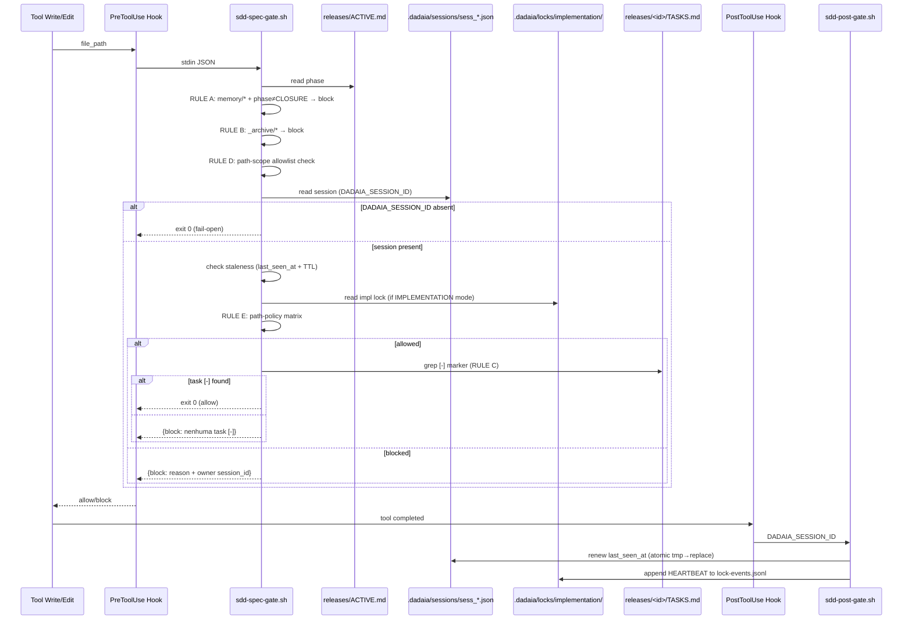

Assets: `.dadaia/scripts/sdd-spec-gate.sh` (PreToolUse) · `.dadaia/scripts/sdd-post-gate.sh` (PostToolUse) · Codex also projects `UserPromptSubmit` where supported · Closure: public-agentic-hygiene-codex-readiness

## Propósito

Par de hooks bash que intercepta invocações de ferramentas em Claude Code,
Codex e equivalentes. `sdd-spec-gate.sh` decide **allow** ou **block** antes de
writes; `sdd-post-gate.sh` mantém heartbeat após chamadas de ferramenta. Codex
usa matchers amplos para manter paridade comportamental com Claude Code, e os
scripts decidem se o payload é relevante.

  * **RULE A (memory atomicity):** bloqueia edits em `specs/memory/**/*.md` fora da fase CLOSURE e bloqueia sempre formatos legados `.html`, `.yaml` e `.yml`.
  * **RULE B (archive read-only):** bloqueia qualquer write em `specs/_archive/**`.
  * **RULE D (path-scope):** valida `file_path` contra `paths.write_allowlist` do frontmatter do agente ativo.
  * **RULE E (session + lock enforcement, T-13/T-8 completion):** valida identidade de sessão e ownership do implementation lock. Ver detalhes abaixo.
  * **RULE C (task marker):** exige que exista pelo menos uma task `[-]` em `specs/releases/<active-release-id>/TASKS.md`. Para sessões IMPLEMENTATION-mode, o release ativo é resolvido do lock file — não do `ACTIVE.md` (T-8 completion, ADR D-9).

Fail-open: qualquer erro interno → allow (nunca bloqueia trabalho legítimo por crash do hook). `DADAIA_SESSION_ID` ausente → fail-open com warning em `/tmp/sdd-gate.log` (compatibilidade retroativa: sessões sem bind continuam funcionando sem proteção de lock).

### RULE E — Session identity resolution

Ordem de resolução da identidade da sessão (a mesma em todos os runtimes):

  1. **`DADAIA_SESSION_ID` env var** — exportado por `eval $(dadaia context bind ...)`. É a chave estável e portável. O gate usa este como primary.
  2. **Fail-open** — se ausente, gate loga warning e exit 0. Lock enforcement só ativa quando a identidade está estabelecida.

O `session_id` nativo do stdin payload do Claude Code é usado apenas para correlation logging, não como chave de identidade.

### Path-policy matrix por modo de sessão

Modo de sessão| Código produção (`repos/<slug>/`)| `specs/memory/**`| `releases/<id>/SPEC.md` (impl lock HELD)| `releases/<id>/TASKS.md`| `.dadaia/reports/**`
---|---|---|---|---|---
Sem sessão (fail-open)| Allowed (cai para RULE C)| Allowed| Allowed| Allowed| Allowed
READ| BLOCK| BLOCK| BLOCK| BLOCK| Allowed
SPEC| BLOCK| Allowed| BLOCK (R-9)| BLOCK (R-9)| Allowed
IMPLEMENTATION (owns lock)| Allowed| Allowed| BLOCK (read-only once impl started)| Allowed| Allowed
IMPLEMENTATION (não owns lock)| BLOCK| Allowed| BLOCK| BLOCK| Allowed
BOUND_REVIEW (mesmo context/release)| BLOCK (read-only)| BLOCK (read-only)| BLOCK (read-only)| BLOCK| Allowed

**R-9 (SPEC §T-13):** quando um impl lock está HELD para context/release X, sessões SPEC-mode são bloqueadas de escrever em `releases/X/SPEC.md` e `releases/X/PLAN.md` — o contrato não muda sob os pés do implementador.

**T-8 completion (ADR D-9):** para sessões IMPLEMENTATION-mode, o release ativo é resolvido do lock file (`.dadaia/locks/implementation/<ctx>__<release>.json`), não do `ACTIVE.md`. Isso garante que o gate valida a TASKS.md correta mesmo quando `ACTIVE.md` já apontou para outra release.

## Fluxo de uso

  1. Agente invoca uma tool de escrita (ex. `Write` em `dadaia_workspace/foo.py`).
  2. Claude Code (ou Codex/OpenCode) executa o hook `sdd-spec-gate.sh` passando JSON em stdin com tool_name + file_path.
  3. O gate resolve `WORKSPACE_ROOT`, `PRIMARY_SLUG`, `PRIMARY_SPECS`; lê `releases/ACTIVE.md` para phase; lê `DADAIA_SESSION_ID` do env.
  4. Aplica regras A, B, D, E, C nessa ordem. A primeira regra que decida block-or-allow encerra o gate.
  5. Allow → exit 0 (silencioso); Block → STDOUT JSON `{"decision":"block","reason":"..."}` com mensagem orientada e owner session_id quando relevante.
  6. Após o allow (PostToolUse), `sdd-post-gate.sh` renova `last_seen_at` do Lock 3 atomicamente (`tmp → os.replace()`) e appenda evento HEARTBEAT em `lock-events.jsonl`.
  7. Logs em `/tmp/sdd-gate.log` registram cada decisão com timestamp, tool, path, release-id e motivo.

## Trigger típico

Automaticamente invocado a cada Write/Edit/MultiEdit em sessões de agente (PreToolUse) e após cada tool call (PostToolUse para heartbeat). Operador raramente interage diretamente — só quando recebe um `{"decision":"block"}` que precisa ser entendido e resolvido (ex: session STALE, lock não próprio).

## Diferencial

Sem este gate, agentes podem escrever em qualquer lugar a qualquer momento — memory vira changelog, archive ganha edits acidentais, dois agentes editam a mesma release simultaneamente (R-8), um agente muda a SPEC enquanto outro a lê (R-9). O gate é a camada mecânica do tripé de atomicidade: junto com o contrato product-engineer e o doctor post-hoc, torna o modelo release-lifecycle não apenas documentado mas enforceável em runtime. O PostToolUse heartbeat garante que locks são liberados automaticamente por TTL quando uma sessão crasheia, evitando o bloqueio permanente (R-10).

## Estado runtime tocado

  * Read-only pelo PreToolUse gate: `releases/ACTIVE.md`, `releases/<active-id>/TASKS.md`, `.dadaia/sessions/<sess_*>.json`, `.dadaia/locks/implementation/<ctx>__<release>.json`. Em modo legado (`SDD_LEGACY_FEATURES=1`): também `features/*/TASKS.md`.
  * Write pelo PostToolUse gate (`sdd-post-gate.sh`): `.dadaia/sessions/<sess_*>.json` (`last_seen_at`); `.dadaia/logs/lock-events.jsonl` (append HEARTBEAT event).
  * Write: `/tmp/sdd-gate.log` (append-only audit log do gate).
  * Saída: STDOUT JSON quando bloqueia; exit 0 (silencioso) quando permite.

**Removido em v2:** o gate não lê mais `primary_context.json` (arquivo deletado por `dadaia migrate`). Context resolution usa `DADAIA_CONTEXT` env var ou fallback por workspace scan.

## Dependências

  * Depende de [[context-management]] (`DADAIA_SESSION_ID` exportado por `eval $(dadaia context bind ...)`; Lock 3 files criados por bind).
  * Depende de [[agent-orchestration]] indiretamente (releases ativas geradas pelo product-engineer durante orchestration).
  * Projetado para `.dadaia/scripts/` via [[public-asset-distribution]].
  * Variáveis de ambiente: `WORKSPACE_ROOT` (override), `DADAIA_CONTEXT` (context resolution), `DADAIA_SESSION_ID` (identidade de sessão), `DADAIA_MODE` (modo de bind), `SDD_LEGACY_FEATURES` (habilita fallback para features/*).

### Hook injection por runtime

Runtime| PreToolUse| PostToolUse| Observação
---|---|---|---
Claude Code| `.claude/settings.json hooks.PreToolUse[*]`| `hooks.PostToolUse[*]`| Shell script direto; ambos instalados via `dadaia public install --target claude`
Codex| `.codex/hooks.json pre_tool_call`| `post_tool_call`| Shell script direto; instalado via `dadaia public install --target codex`
OpenCode| Plugin TS `sdd-gate.ts` (`tool.execute.before`)| Inline no path allow do pre-gate (fallback OQ-3)| OpenCode não suporta shell post-hook separado; heartbeat inlineado no exit path do sdd-spec-gate.sh; doctor reporta `[unsupported]` para PostToolUse target opencode — esperado.
