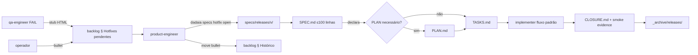

CLI surface: `dadaia specs hotfix open <v-id> --patches <release-id> [--severity LOW|MEDIUM|HIGH|CRITICAL]` · Closure: sdd-hotfix-track-v1

## Propósito

Versionamento **SemVer (`vMAJOR.MINOR.PATCH`)** em `specs/releases/` e diferenciação entre **release de feature** (`PATCH=0`) e **release de hotfix** (`PATCH≥1`) _pelo número da versão_ — sem trilha paralela, sem novo schema, sem novo status ladder. Toda release vive sob `specs/releases/v<M>.<m>.
/` e segue o mesmo gate e doctor existentes; a diferença está no **fluxo condensado** que um hotfix usa (SPEC + TASKS obrigatórios; PLAN opcional; CLOSURE com smoke evidence obrigatório) e na **origem obrigatória** via seção `## Hotfixes pendentes` do backlog.

Resolve um problema duplo: (a) "como diferenciar bug-fix urgente de feature work sem criar burocracia paralela?" — resposta: pelo PATCH; (b) "como impedir que hotfix vire fast-lane para features pequenas?" — resposta: D4 (origem obrigatória) + D10 (fastlane recusa quando memory deve ser tocado).

## Fluxo de uso

  1. **Detecção** : qa-engineer (Deploy Validation FAIL) ou operador identifica incidente. qa-engineer emite stub HTML em `.dadaia/reports/<context>/qa-engineer/<ts>-hotfix-candidate.html` com timestamp, affected release, failing scenario e suggested PATCH bump.
  2. **File** : bullet em `specs/backlog/candidates.md § Hotfixes pendentes` no formato `- <YYYY-MM-DDTHHMMSSZ> <severity> <component> — <one-liner> (post-mortem: <link>)`.
  3. **Promoção** : product-engineer atribui `v<M>.<m>.<p+1>` (bump PATCH da feature release atual), **move** bullet para `## Histórico` com o release-id, executa `dadaia specs hotfix open <v-id> --patches <release-id> --severity <S>` que cria `specs/releases/v<v-id>/SPEC.md` + `TASKS.md` a partir de templates enxutos, atualiza `ACTIVE.md`.
  4. **SPEC** : 6 seções obrigatórias — Incident summary, Affected memory features, Root cause, Fix scope (declara se requer PLAN), Rollback plan, Acceptance + smoke test. Limite ≤100 linhas.
  5. **TASKS / PLAN** : TASKS sempre criada; PLAN só se SPEC declarou. Implementer roda fluxo padrão (marker `[-]`).
  6. **CLOSURE** : CLOSURE.md com bloco `## Validations` contendo evidence triples (_description, command, evidence_) que comprovam que o bug não existe em produção. Memory update opcional (D16). `git mv` para `_archive/releases/`.

## Trigger típico

Incidente em produção (regressão em release arquivada), bug que demanda atualizar `specs/memory/product/<feature>.md`, ou bug com blast radius > 1 arquivo e múltiplos implementers. Critério mecânico: **se memory precisa ser atualizado, é hotfix release. Se spec não precisa existir, é fastlane.**

## Diferencial

Sem este modelo, hotfix vira folder paralelo (catch-22 do gate), single-file ad-hoc (perde rastreabilidade), ou pior — vira PATCH ad-hoc sem auditoria. Ao diferenciar feature de hotfix **apenas pelo PATCH no folder name** , todo o ferramental existente (gate v3, doctor, scaffolder, archive flow) funciona sem modificação. A complexidade adicional vive em camadas opcionais: doctor checa SemVer (SPEC-DOC-016) e dual-section backlog (SPEC-DOC-012 estendido); scaffolder oferece template enxuto; mas o gate **não muda** — hotfix é uma release como qualquer outra.

## Estado runtime tocado

  * Read: `specs/backlog/candidates.md` (ambas seções), `specs/releases/ACTIVE.md`, manifest de release atual.
  * Write: `specs/releases/v<v-id>/{SPEC,TASKS,PLAN?,CLOSURE}.md`, `specs/backlog/candidates.md` (bullet move), `specs/releases/ACTIVE.md` (single-pointer), opcional `specs/memory/product/*.md` (em CLOSURE phase apenas).
  * Doctor checks ativos: **SPEC-DOC-016** (folder name SemVer, WARNING→ERROR após 2026-07-01, Vintage excluído via cutoff `Created:` ≤ 2026-05-17); **SPEC-DOC-012 estendido** (dual-section validation + 72h cutoff para bullets em `## Hotfixes pendentes`).

## Dependências

  * Roda sobre [[sdd-gate-v3]] sem modificá-lo (D6 — gate inalterado).
  * [[specs-doctor]] valida SemVer (SPEC-DOC-016) e dual-section backlog (SPEC-DOC-012 estendido).
  * [[public-asset-distribution]] propaga templates novos (`release_hotfix.md.j2`, `closure_hotfix.md.j2`) e workflow `hotfix-release.workflow.md` via `dadaia public install --target all`.
  * CI (`.github/workflows/ci.yml`) ganhou branch trigger `hotfix/v*` e validação SemVer do branch name (D19); rejeita MAJOR/MINOR ou pré-release tags.
  * Constitution `specs/constitution.md` L148 atualizada (D17) para mencionar hotfix releases (PATCH≥1) seguindo o mesmo caminho de archive.
