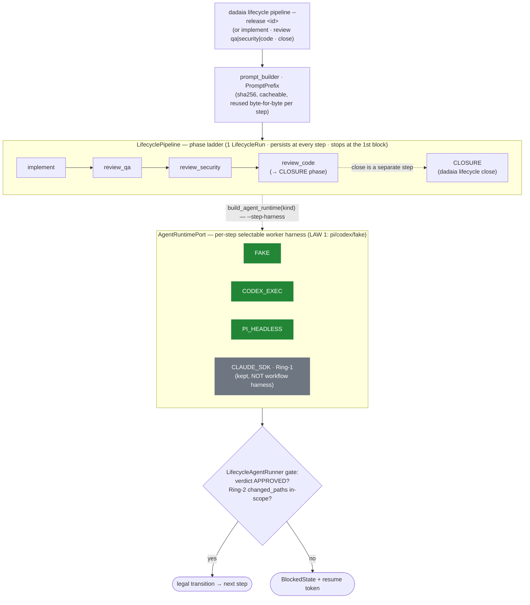

CLI surface: `dadaia lifecycle status`, `preflight`, `hygiene status`, `hygiene clean`, `report`, `resume`, `slop`, `clean`, `backlog define`, `release define`, `implement`, `review qa`, `review security`, `review code`, `close`, `pipeline`, `workflow policy show`, `workflow profiles list`, `workflow doctor`, `handoffs doctor`. Run verbs accept `--step-model <step>=<profile-id>` (profile ids only) + `--show-policy`/`--json`.

The engine is the **Layer-2** half of the two-layer model (see [[architecture]] for the
full two-layer picture): a Layer-1 entry harness invokes `dadaia lifecycle`, which threads
one `LifecycleRun` through the phase ladder, running each step on a per-step selectable
worker harness behind `AgentRuntimePort` and advancing only when the gate passes.



## Purpose

The lifecycle foundation moves workflow authority out of broad agent instructions and into deterministic Python services. Agents can still reason and produce evidence, but Python decides whether state advances. Every transition consumes structured inputs: release identity, context, task group, handoff JSON, verdicts, commit SHA, hygiene counters, and bounded runtime outputs.

## Core services

- `core/models/lifecycle.py` and `core/models/hygiene.py` define pure run, gate, blocked-state, agent-request, and hygiene models. `AgentRuntimeKind` has four members (roster single source: [[tech-stack]] §Agent runtimes).
- `core/scope_match.py` is the shared, pure path classifier used by BOTH the runner's Ring-2 out-of-scope detection and the Claude adapter's Ring-1 write-permission decider — one classifier, two boundaries.
- `core/protocols/agent_runtime.py` and `core/protocols/runtime_files.py` define the runtime and artifact ports.
- `features/lifecycle/state_machine.py` owns legal, illegal, blocked, and resume transitions.
- `features/lifecycle/gates.py` validates handoff evidence semantically: agent, context, release, verdict, artifact hash, commit SHA, task group, age, and severity thresholds.
- `features/lifecycle/phase_workflow.py` (`LifecyclePhaseWorkflow`) threads a scoped prompt → factory-selected `AgentRuntimePort` → `LifecycleAgentRunner` gate → legal transition → persisted run, for any single lifecycle step.
- `features/lifecycle/pipeline.py` (`LifecyclePipeline`) threads ONE `LifecycleRun` through an ordered phase ladder (IMPLEMENTATION→QA→SECURITY→CODE→CLOSURE), each step running on its declared `AgentRuntimeKind` via an injected runtime factory, persisting at every step and stopping at the first blocked gate. Each `PipelineStep` carries a **discrete model** chosen from the selected harness's catalog (the hardcoded `"sonnet"/"opus"` tiers were removed in v0.1.24; default model is derived from `core/harness_models.py`).
- `core/harness_models.py` is the discrete per-harness model catalog (LAW 2): `harness → ordered model options` with a `validate(harness, model) → (model_id, effort?)` helper, consistent with — but not a tier-view of — `core/model_registry.py`. The per-harness options are enumerated once in [[tech-stack]] §Agent runtimes. Both catalogs are allowlist-validated (a Layer-2 id must be in the union of registry codex ids + `LAYER2_EXTRA_MODEL_IDS`, the curated Layer-2-native set); no `claude-*` id is ever a Layer-2 option. An invalid `(harness, model)` pair is rejected with the valid set.
- `features/lifecycle/fragments/loader.py` loads + validates the prompt-fragment library at `dadaia_workspace/public/lifecycle_fragments/` (Markdown + frontmatter `id/role/workflow/step/static_inputs/dynamic_inputs/output_schema/max_context_policy`; projected + manifest-tracked). `features/lifecycle/context_selector.py` selects dynamic context per step under explicit max-context policies (`exact-files-only`/`summary`/`catalog-only`/`diff-only`/`previous-handoff-only`). `features/lifecycle/workflows/` carries the executable dadaia-workflow bodies — the workflow roster and operator invocability are owned by [[dadaia-workflows]]. Every workflow body is fully fragment-driven: each step's prompt is `role + fragment bundle + selected context + output schema + discrete (harness, model)`; Python owns step order and blocks on missing/rejected handoffs; steps communicate via the workflow-step handoff data plane (see below). `bug_report` writes only ADDITIVE `specs/bugs/**` (enforced at the runner via `core.scope_match.out_of_scope_paths`); `audit` produces disposition-ready output.
- `features/lifecycle/prompt_builder.py` builds scoped worker prompts; `PromptPrefix.from_sections` assembles a byte-identical, sha256-hashed, order-independent context block, and `build(scope, prefix=)` prepends it verbatim and records `prefix_hash`. The pipeline builds the prefix once and every step reuses the same bytes (provider-cache-friendly). Whole-workspace or repo-wide scopes are rejected. v0.1.24 adds a fragment-suffix path: a workflow step's prompt is assembled from a fragment bundle (not the generic "Run the step" suffix). **Prompt observability (v0.1.24):** each lifecycle run record persists, per step, the fragment ids, dynamic context refs, `prefix_hash`, the discrete model, the runtime kind, the output schema, and the gate result — surfaced in a panel/report view; whole-memory injection is never the default (context selection is scoped).
- `features/lifecycle/hygiene.py` owns the canonical `SlopPolicy`: reports TTL 48h, handoffs TTL 24h, tmp TTL 24h, safe-zone cleanup, protected residuals, unknown `.dadaia/` top-level detection, malformed/orphan handoffs, and elapsed scan metrics.
- `features/lifecycle/antislop/slop_scan.py` is the directory-aware slop metric: a directory tree counts as ONE entry with recursive size (closing the directory-blind gap where multi-GB caches/venvs hid from the file-only metric); the canonical manifest derives from `hooks/root_whitelist._WHITELIST`, never hand-copied. Surfaced via `dadaia lifecycle slop`.
- `features/lifecycle/antislop/retention.py` (`RetentionSweep.sweep`) is the deleter: dry-run by default, deletes only with `apply=True`; reclaims past-TTL non-canonical swept-zone entries; has a HARD liveness gate (never reclaims a live run's tmp); refuses canonical/outside-`.dadaia`/symlink-escape paths (resolve + relative_to, TOCTOU re-confine). Surfaced via `dadaia lifecycle clean [--apply]`.
- `features/lifecycle/report_workflow.py` writes human report HTML, matching handoff JSON, baseline/final hygiene snapshots, and optional explicit cleanup.
- `features/lifecycle/run_store.py` and `infrastructure/json_lifecycle_run_store.py` persist lifecycle run records under canonical workspace state/run zones and reject repo-tree stores.

## Harness runtime boundary

Lifecycle code depends on `AgentRuntimePort`; `build_agent_runtime(kind, *, cwd=None, model=None)` in `container.py` is the factory that maps a kind to its adapter: `FAKE→FakeAgentRuntime`, `CODEX_EXEC→CodexExecAdapter` (`infrastructure/codex_runtime.py`), `CLAUDE_SDK→ClaudeSdkAdapter` (`infrastructure/claude_sdk_runtime.py`), `PI_HEADLESS→PiHeadlessAdapter` (`infrastructure/pi_runtime.py`). The factory stays total over the enum and threads the discrete `model` into `PiHeadlessConfig.model` (PI honors `pi --model <id>`) and `CodexExecConfig.model`+`reasoning_effort` (Codex takes the discrete `(id, effort)` verbatim; the tier fallback remains only when no discrete model is given). **LAW 1:** the workflow `--harness` choices are `{pi, codex, fake}`; `claude` is rejected with a Layer-1 pointer (the SDK adapter stays importable + unit-tested). `--harness pi` / `--step-harness x=pi` + `--model`/`--step-model` resolve across every `dadaia lifecycle` verb with zero change to `phase_workflow.py` / `pipeline.py`. CI uses the fake runtime to prove that Python advances only after structured output and write-scope evidence pass validation.

The Codex adapter does not read project-local provider/auth/profile configuration, does not pass through `os.environ`, accepts only an explicit environment allowlist, redacts credential-looking values, and records sandbox/profile widening only when operator-controlled input requests it. The Claude SDK adapter derives a real Ring-1 `write_permission` decider from the request's allowed/forbidden paths via the same `core/scope_match` classifier the runner's Ring-2 uses; its transport is injectable (`query_fn`) so permission + result mapping are tested hermetically. `claude-agent-sdk` is an OPTIONAL, operator-installed runtime extra (not a locked dependency, offline-first build); the default transport lazily imports it and returns an actionable `pip install claude-agent-sdk` message when absent.

The PI adapter (`PiHeadlessAdapter` + frozen `PiHeadlessConfig`) is a structural twin of `CodexExecAdapter`: it drives `pi --mode json --tools <csv> -p` (prompt on stdin) over an injectable subprocess runner, imports no PI client at module load (offline-first preserved), and accepts only an explicit env allowlist (incl. `ANTHROPIC_API_KEY`, redacted from output). Result mapping parses the line-delimited JSON stream and takes the **last** `message_end` event's assistant text from `message.content`, handling both string and content-block shapes; an absent or unparseable `message_end` degrades to raw stdout as the summary (SUCCEEDED, never crashes). **Structured-payload extraction is single-sourced and shared:** result extraction lives once in `headless_adapter_base` (`SubprocessAdapterMixin`) and is shared by both `pi_runtime` and `codex_runtime`. It scans candidates from a fenced ```` ```json ```` block, the whole bare message, or the outermost `{…}` slice, and accepts a payload by strict `schema == expected_schema` as the PRIMARY path with structural acceptance (non-empty `artifact_refs` + `status`/`summary`/`structured_output`, `normalize_artifact_refs` taking string OR object refs) as documented defence-in-depth — without making the create-step gate permissive (a no-op worker still yields empty `artifact_refs` and BLOCKs). Worker compliance does not *depend* on the structural tolerance: the coherent worker-output contract (one `schema` field, one `agent-run-result-v1` value, step-kind-aware — see "Gating note" below) makes real workers pass via the strict path. A valid terminal `message_end` maps to SUCCEEDED **even when `pi` exits non-zero** — the terminal assistant message is trusted over the raw exit code (deliberate precedence); the downstream verdict gate and the Ring-2 write boundary still apply. PI's Ring-2 write boundary is real: `changed_paths` is computed from the injected git client's `diff_name_only(cwd)` (working-tree + staged + untracked, non-ignored) at result time and written into `structured_output["changed_paths"]`, **unconditionally overwriting any model self-report** — so the runner's Ring-2 out-of-scope block fires for PI exactly as for Codex. The Layer-2 `PI_HEADLESS` worker (this adapter, `pi --mode json` headless) has no CLI-level pre-disk (Ring-1) gate: its enforcement posture is Ring-2 + git chokepoints, identical to Codex. (The **Layer-1** interactive `pi` entry harness is separate and DOES have a Ring-1 SDD-gate extension — `.pi/extensions/dadaia-sdd-gate.ts`, active post-trust — see [[architecture]] §"two-layer agentic model".) The live `pi --mode json` event schema — specifically the `AgentMessage.content` shape — is verified via the opt-in `DADAIA_PI_LIVE=1` / `DADAIA_E2E_REAL_WORKER=1` integration tests (`tests/integration/pi_live/`), not CI-gated; the end-to-end live proof of this seam is stated once in "Current limits" below.

## Workflow model governance (control plane, v0.1.28)

Layer-2 model selection is **governed**, not ad hoc: a named profile registry layered over
the discrete `harness_models` catalog, a validated operator overlay, one shared resolver,
and a per-run policy snapshot. The resolver is the single policy seam consumed by both the
CLI and the panel (see [[panel]] for the panel control plane).

- `features/lifecycle/model_profiles.py` — the `WorkflowModelProfile` registry. As of
  v0.1.30 `list_profiles`/`profiles_for` **merge the built-in recommended profiles with
  operator-added profiles** from the local store (see "Operator profiles + per-context
  overlays" below); v0.1.28 shipped built-in only. Six built-in profiles: Codex `codex-implementation-standard`
  (`gpt-5.5:medium`), `codex-review-deep` (`gpt-5.5:high`); PI `pi-implementation-standard`
  (`gpt-5.3-codex:medium`), `pi-reasoning-high` (`gpt-5.5:high`), `pi-reasoning-low`
  (`gpt-5.5:low`), `pi-openrouter-kimi-high` (`kimi-2.7:high` — no registry pricing row; cost
  reports "unknown", never fabricated). Each profile resolves to a real `harness_models.HarnessModelOption`; an
  import-time `_assert_profiles_resolve` (mirrors `_assert_ids_known`) fails loudly on any
  ungoverned `(model_id, effort)` pair, a `claude-*` id (registry/allowlist-validated Layer-2 invariant; never `claude-*`), a
  non-Layer-2 harness, a duplicate id, or a deprecated profile without a known replacement —
  so this is **never a second drifting model table**. Accessors: `list_profiles`,
  `profiles_for(harness)`, `resolve(profile_id) → WorkflowModelProfile`, `to_option`.
- `core/models/workflow_execution.py` — the pure DTOs threaded through every layer:
  `WorkflowModelProfile`, `ResolvedModelConfig` (`profile_id, harness, model, reasoning,
  source`), and `WorkflowPolicySnapshot` (`workflow_id, policy_id, resolved_at,
  source_precedence[], steps{step → {harness, model_profile, model, reasoning, fragments[],
  output_schema}}`). Zero I/O, core-clean.
- `infrastructure/json_workflow_model_policy_store.py` — the atomic overlay store over the
  FIXED path `.dadaia/states/workflow_model_policy.json` (schema `workflow-model-policy-v1`).
  Reuses the `JsonLifecycleRunStore` atomic temp+rename pattern (`mkstemp` 0600 in target dir
  → `os.replace`); `load()` returns `None` on missing (⇒ library defaults); raises a typed
  error on invalid JSON / unknown top-level field; `save()` writes `.last-good.json` from the
  prior valid file before overwriting. **Missing ≠ invalid:** absent file = defaults; a
  present-but-invalid overlay blocks execution before the first model call with the last-good
  intact. **v0.1.30:** non-`default` context keys are now honored via an additive `extends`
  inheritance chain (the v0.1.28 D-2 collapse was removed — see "Operator profiles +
  per-context overlays" below).
- `features/lifecycle/policy_resolver.py` — the single shared
  `WorkflowExecutionPolicyResolver` over the governed catalog + profile registry + overlay.
  `resolve(workflow_id, context, cli_overrides) → WorkflowPolicySnapshot` applies the
  precedence **CLI > context overlay > default overlay > library default**, validating every
  override against catalog step ids + profile ids + harness match (a deprecated profile
  without an explicit replacement path is a hard failure).
- `core/models/lifecycle.py` (extended) — `AgentRunRequest.resolved_model:
  ResolvedModelConfig | None` (additive; `model_profile` kept for observability) and
  `LifecycleRun.workflow_policy: WorkflowPolicySnapshot | None` (additive optional; old v1
  records load to `None` — the run-store schema literal is deliberately unchanged for
  back-compat read).
- **Resolve-once-before-step-1 (LAW 7).** The pipeline/phase workflow resolve the policy and
  freeze the snapshot onto `LifecycleRun.workflow_policy` **before** the first worker call;
  the snapshot is preserved across transitions via `dataclasses.replace`. An overlay mutated
  after a run starts does not change the in-flight run; the panel reads the persisted
  snapshot for run history (current policy only governs future runs).
- **Adapters consume the resolved model (AC-12).** `CodexExecAdapter` prefers
  `request.resolved_model` in `_model_and_effort` and passes `-m <id> -c
  model_reasoning_effort=<effort>`; `PiHeadlessAdapter._command()` adds `--model <id>` from
  the per-request resolved model; `FakeAgentRuntime` echoes the resolved config so tests
  assert policy resolution offline. The model string that reaches argv is the profile's
  registry-constant `model_id` (D-3: no free-text reaches a worker).
- **CLI (D-3).** `--step-model <step>=<profile-id>` resolves through the profile registry; a
  raw `<id>:<effort>` string / unknown / harness-mismatched / deprecated profile is rejected
  with an actionable message. `--show-policy` + `--json` print the resolved policy.
  Read-only `dadaia lifecycle workflow policy show <workflow> --context --json` and
  `workflow profiles list --harness --json` make the governance scriptable.
- **Governed catalog (Wave B).** `features/workflows/dadaia_catalog.py` carries each step's
  `default_harness` + `default_profile` per supported harness + fragment ids, and is the
  single governed source the resolver and panel both read (`_assert_catalog_defaults_resolve`
  ties every default profile to the registry at import). The old `*.workflow.md`
  (`WorkflowsService.get_detail`/`list_summaries`) is **reference/doc-only** — no longer the
  authority for executable workflow behavior.
- **Governance doctor (AC-10).** `dadaia lifecycle workflow doctor` runs the `WMP-*`
  invariants (`policy_doctor.py`): invalid policy JSON, unknown profile, harness/profile
  mismatch, stale workflow/step id in an override, missing default profile per supported
  harness, unresolved fragment/output schema, and any `claude`/`opencode` Layer-2 residue
  (`WMP-LAYER2-RESIDUE`). A `public doctor` workflow-policy residue scan
  (`policy_public_doctor.py`) keeps the public surface clean. Doctor never crashes the panel.

## Harness as a governed dimension (v0.1.29)

The harness is now a **first-class governed dimension** alongside the model, so PI is fully
usable as a Layer-2 worker through governance (not just as an execution adapter). The same
shared resolver moves a step onto PI from three paths — the CLI, a persisted overlay, and
the panel toggle — and the executed adapter and the recorded snapshot always agree.

- **Effective-harness precedence (D-1).** `resolve()` takes harness inputs (a per-workflow
  default-harness override and a `{step → harness}` map) and reads the overlay's harness
  fields, computing the effective harness per step with the precedence
  **CLI `--step-harness` > CLI `--harness` > overlay step harness > overlay `default_harness`
  > catalog step default** (`_resolve_harness`). The chain is total: every governed step has
  a catalog `default_harness` (`_DEFAULT_WORKER_HARNESS = codex`), so no step is left without
  an effective harness.
- **Profile validated against the effective harness.** `_validate_profile` compares
  `profile.harness` to the step's **resolved** harness, not the catalog default — fixing the
  v0.1.28 `policy_resolver.py:288` mismatch that rejected a PI profile on a codex-default
  step. A CLI mismatch (e.g. `--harness pi` + a codex `--step-model`) resolves to a clean
  rejection, not ambiguity.
- **Auto-profile-on-harness-override (D-1).** When a step's harness is overridden with **no**
  explicit profile override (neither CLI `--step-model` nor overlay step profile), the
  library default becomes `CatalogStep.default_profiles[effective_harness]` — the harness's
  default profile for the step's purpose (producing step → standard profile, review/gate step
  → deep/reasoning profile). The per-harness default profiles live on the catalog DTO; the
  resolver reads the effective harness's entry instead of only `default_profile`.
- **Single source of truth for `runtime_kind` (D-2).** `pipeline.apply_resolved_policy` is
  the **sole** author of each `PipelineStep.runtime_kind`, derived from the snapshot entry's
  resolved harness (codex → `CODEX_EXEC`, pi → `PI_HEADLESS`; an unmappable harness raises).
  The CLI's separate post-resolve `runtime_kind` swap was removed, so the executed adapter
  and the persisted snapshot provably agree — fixing the v0.1.28
  codex-recorded-while-pi-ran divergence. **FAKE is preserved:** a step built on
  `AgentRuntimeKind.FAKE` keeps FAKE (so `--harness fake` dry-runs still drive the fake
  adapter) while the snapshot records the governed harness.
- **Overlay carries harness (D-3).** The overlay schema + store carry an optional per-step
  `harnesses` map and a per-workflow `default_harness` (Layer-2 enum `codex|pi`, store +
  schema widened in lockstep, `additionalProperties:false` kept). Accessors `step_harness`
  and `workflow_default_harness` (default context only). **Back-compat:** an overlay with no
  harness field resolves byte-identically to v0.1.28 (catalog default codex). The panel
  codex/pi toggle persists a real harness change through `PUT /api/workflow-model-policy`;
  the resolver honors it (see [[panel]]).
- **The governed catalog covers every workflow (D-4).** Every dadaia-workflow resolves
  through the governed catalog with its body's real governed step labels (workflow
  roster: [[dadaia-workflows]]); `closure` is cataloged as its real single `close`
  worker step (role product-engineer, generic/no-fragment) plus the Python
  `closure_removal_gate` modeled as a gate, so `policy show closure` resolves. No
  invented model-step ladders, no second drifting source.
- **Doctor validates the harness dimension (D-doctor).** `dadaia lifecycle workflow doctor`
  resolves every overlay harness override through the shared resolver, so an overlay harness
  referencing a harness the step does not support is a hard ERROR; an overlay harness value
  of `claude`/`opencode` is `WMP-LAYER2-RESIDUE`. WMP-1..WMP-7 pass over the completed
  catalog (the generic `close` step is WMP-5-exempt — no false positive).

Carried-forward laws hold unchanged: Layer-2 = codex|pi only (`fake` test-only;
`claude`/`opencode` rejected); default-first (unconfigured → library defaults, codex);
auditability snapshot frozen before step 1 and read verbatim for history; panel governance
via validated overlay; resolve-once-before-step-1.

**Operator profiles + per-context overlays (v0.1.30 — the v0.1.28 D-2 deferrals shipped).**
`model_profiles.list_profiles`/`profiles_for` now **merge built-in recommended profiles with
operator-added profiles** loaded from `.dadaia/states/workflow_model_profiles.local.json`
(via a `core/protocols/local_model_profile_store.py` port + the
`json_local_model_profile_store.py` adapter, wired through `container.py`). Invariants:
validate `harness: pi` on every operator profile; **never store API keys**; **never project**
the local store into `public/`; preserve `UnknownProfileError` fail-closed; default-first (L3:
missing store ⇒ built-in only; present-but-invalid ⇒ fail closed). Per-context overlays now
honor non-`default` keys via an `extends` chain (`context → extends… → default`) in
`overlay_for` / `workflow_default_harness` / `step_harness` and the resolver's per-step
resolution — replacing the D-2 collapse where a non-`default` key was inert. Guardrails: cycle
detection on `extends`, a missing `extends` parent is a hard validation error, `default` stays
the inheritance root, and `extends` is additive (an overlay with no `extends` resolves
byte-identically — back-compat). WS-NITS shipped too: `_DEFAULT_PROFILE_BY_HARNESS_PURPOSE` has
one shared home (was a verbatim twin in `policy_resolver.py` + `dadaia_catalog.py`), the
`policy_resolver` docstring names `governed_workflow_catalog()` as the production source, and
the panel `_semantic_check` mirrors the doctor's explicit 3-map union
(`contexts | default_harness_overlay | step_harness_overlay`).

## Workflow-step handoff data plane (v0.1.30)

Workflow steps now communicate over a **run-scoped producer→consumer ledger** instead of
stale prose / "latest handoff by agent filename" directory scans — a separate layer **beside**
the generic `handoff-v1.1` contract (which stays reserved for durable external evidence in
`.dadaia/handoff/`). Control plane: `LifecycleRun.workflow_steps`
(`core/models/workflow_handoff.py` — additive backward-compatible field; old records load).
Data plane: immutable step payloads under
`.dadaia/runs/lifecycle/<run_id>/steps/*.step-payload.json`, validated against
`workflow-step-payload-v1`. `features/lifecycle/workflow_handoffs.py` is the resolver/service:
it resolves a step's declared upstream refs by exact (run, step, attempt), renders compact
digests into the next prompt, records consumption (`produced → consumed_partial →
consumed_all`), and BLOCKS the workflow when a required upstream payload is missing/malformed
(`RequiredHandoffMissingError`). Retention protects live-run payloads and reclaims
`consumed_all` past a consumed-TTL; `dadaia lifecycle handoffs doctor` fails on
orphan/malformed/stale/undeclared/unconsumed-required payloads; the panel exposes the run
ledger via a minimal API. `release_definition.py` declares per-`ReleaseStep`
`produces`/`consumes` edges with a terminal graph-completeness gate, and the
implementation/review loop tracks attempts (bounded retry default 2 → BLOCK) so `implement#2`
consumes the `qa#1` rejection. See [[architecture]] §"Workflow-step handoff data plane".

## Gating note (review-only typed gate + coherent worker-output contract)

The typed gate is **review-only**. `agent_runner._blocked_result` branches on an `is_review`
signal threaded into `AgentRunnerInput`: **review** steps gate on `verdict == APPROVED` +
populated `artifact_refs` + in-scope `changed_paths`; **create** steps gate
on a schema-valid/structural payload + populated `artifact_refs` + in-scope paths, and the
`verdict` field is **ignored** for them (a create step produces an artifact, it does not approve
anything). The branch lives once in the runner so every caller benefits; `is_review` is threaded at
all **seven** runner call sites — `release_definition`, `audit`, `bug_report`, `research`
(`step.is_review`), `backlog_definition` (`backlog_author` create step → `False`), and `pipeline`
+ `phase_workflow`. `PipelineStep` carries an `is_review` field so the
`review_qa`/`review_security`/`review_code` gates that protect the push boundary keep their
`verdict == APPROVED` requirement (guard C1 — a default of `False` would
silently lose it). Create-step gating is not made permissive: a no-op worker emits no payload →
empty `artifact_refs` → it still BLOCKs.

**The worker-output contract is coherent by design.** The worker is told exactly ONE
field name — `schema` — with exactly ONE value — the transport id `agent-run-result-v1`. The
fragment's `output_schema` (e.g. `release-scope-handoff-v1`) stays descriptive (Python tags the
produced payload with it from the run ledger's `produces`) and is no longer surfaced to the worker
as a competing "schema to emit". The "## Required output" instruction is **step-kind-aware** —
review steps self-verdict (APPROVED/REJECTED + evidence); create steps emit an artifact +
`artifact_refs` and are NOT told to self-verdict — and is reconciled across **all three** prompt
surfaces: `build_fragment_suffix` (an `is_review`-aware keyword-only, no-default parameter so a
forgotten flag is a call error, threaded at all six suffix call sites),
`pipeline._generic_prompt`, and the CLI's `_run_phase_step` (all routed through one shared
`is_review_phase` helper so a future surface inherits the correct branch). The single
`shared.output_handoff` fragment documents the canonical field `schema`.

Result extraction is **single-sourced** in `headless_adapter_base` (`SubprocessAdapterMixin`):
one candidate scan (fenced/bare/sliced) + one acceptance decision — strict
`schema == expected_schema` as PRIMARY, structural acceptance (non-empty `artifact_refs` +
`status`/`summary`/`structured_output`) as documented **defence-in-depth**, and
`normalize_artifact_refs` accepting string OR object-form refs — shared by BOTH `pi_runtime` and
`codex_runtime` (a patch-the-helper test proves both call it, so the two cannot diverge; the
shared reject-guard means arbitrary JSON lacking the result shape never maps to a
result). A no-op worker still yields empty `artifact_refs` → BLOCK; structural acceptance never
shadows strict (pinned by a behaviour test). The live end-to-end proof of this contract is
stated once in "Current limits" below.

## Blocking and resume

Preflight failures return typed `BlockedState` data instead of ambiguous prose. In no-approval Codex push scenarios, lifecycle preflight emits a valid blocked handoff with the exact operator command and resume token. The Codex command policy is not widened by this release; blocked/resume is the deterministic product behavior.

## Hygiene and anti-slop behavior

Lifecycle hygiene status measures reports, handoffs, and tmp zones without deleting. Cleanup defaults to dry-run; apply requires an explicit flag. Cleanup only deletes expired candidates in safe zones and preserves current-release evidence, important reports, valid handoff-linked artifacts, active runs, durable state, locks, sessions, operator-protected paths, and anything outside safe zones. The performance guard covers a synthetic baseline of 122 reports, 295 handoffs, and 437,724 tmp files with bounded time, RSS, and content reads.

## Current limits

Every single-step verb and the multi-step pipeline run the engine over a real
`AgentRuntimePort`, but the engine does not yet autonomously drive a live end-to-end
release. **Live proof (stated once, here):** the env-gated **anti-fake** real-worker e2e
(`DADAIA_E2E_REAL_WORKER=1`, skipped by default — CI/`pytest` stay fully faked + green)
drives a real `pi` worker (pinned build 0.79.3, provider openai-codex, model gpt-5.5)
through `release_scope → spec_create → spec_arch_review`: both the *create* path and the
*review/verdict* path are proven live — the review step (software-architect) reviews a
substantive SPEC and emits `verdict: APPROVED`, and the Python verdict gate PASSES on
real worker output via the **strict** acceptance path (`schema: agent-run-result-v1`
matching `expected_schema`; the structural fallback was not needed). The
REJECTED-blocks negative is proven via the faked gate path (no second live run). The
phase-specific gate refinement is **done** (the gate is review-only — see "Gating note"
above). Deferred: live Claude SDK binding verification (the
`_default_query_fn` `query()`/`can_use_tool` call is the one unverified piece — offline build) plus
provider cache-control marker wiring; a **full all-steps** live release run (the minimal
`release_scope → spec_create → spec_arch_review` chain is the proof, not the whole ladder); a live
codex worker variant of the e2e (optional — `pi` is the validated case; codex parity is unit-proven
through the shared extraction helper); and persisting explicit per-run tmp working-dir claims in
`LifecycleRun` so the retention liveness provider keys on a registered workdir.
