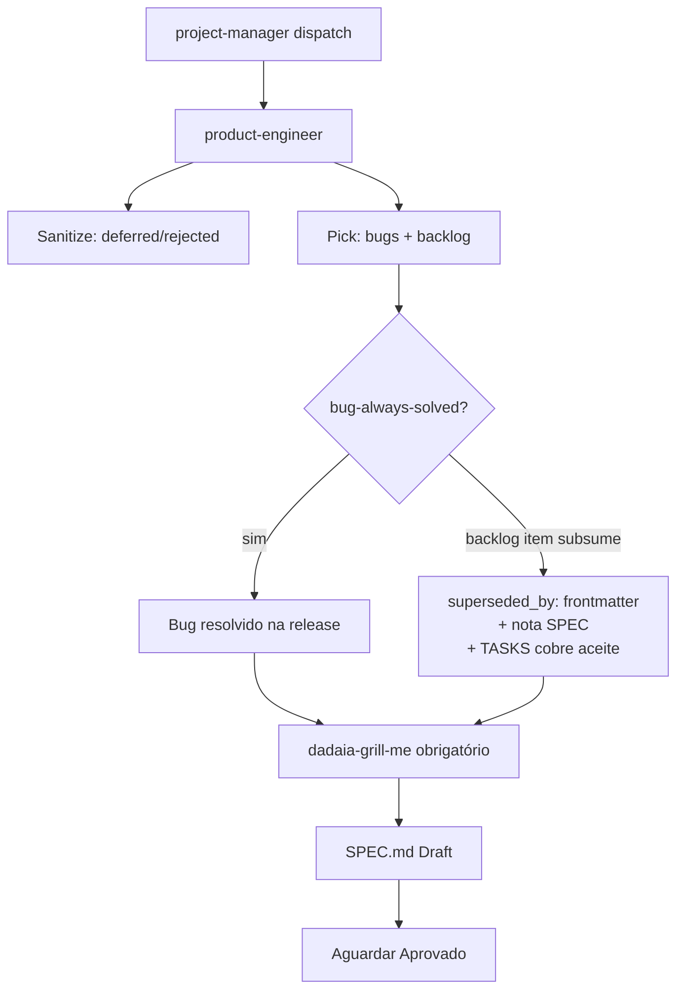

Skill: `dadaia-release-definition` · Rule: `release-governance.md` (always-on) · Rule: `backlog-ownership.md` (always-on, D5) · ADRs: ADR-1..5 in `specs/releases/v0.1.5/SPEC.md §8`

## Propósito

Define o ciclo completo de **como bugs e backlog viram releases** e **como releases
maturam e são revisadas** no dadaia-workspace. O contrato canônico exige intake
sanitizado, pick explícito, grill obrigatório antes da SPEC, release rastreável,
gates semânticos por etapa e push bloqueado mecanicamente por security review.

A governança tem três pilares:
1. **Bug/Backlog → Release** — protocolo formal para transformar itens dos ficheiros
   `specs/bugs/` e `specs/backlog/` em uma release definida e rastreável.
2. **Modelo de maturação** — o modelo `alpha-N → rc-N` que substitui o anti-padrão de
   4-segmentos (`v0.1.4.1`, `v0.1.4.2`, …) por uma estrutura onde cada release cresce
   dentro de um folder `v<M>.<m>.<p>/` com segmentos ordenados.
3. **Backlog-ownership como convenção de coordenação** —
   `project-manager` é o **curador/coordenador** do `specs/backlog/**`; os demais agentes
   leem livremente e roteiam mudanças via PM por disciplina; `product-engineer` consome
   backlog para criar release specs. **Não há gate** sobre backlog: `specs/backlog/**` é um
   caminho ADDITIVE que sempre flui (como `bugs/` e `audits/`). O hook não usa persona como
   autoridade para ownership porque nenhum harness consegue provar identidade de agente ao
   gate de forma confiável; enforcement é por convenção e por workflows:
   - Regra always-on `backlog-ownership.md` que declara a curadoria do PM (não-gate).
   - **Única trava determinística do produto:** o lease single-session por Spec Context
     (release-definition / implementation+review). Nenhum workflow é jamais lock-blocked por
     ownership.

## Fluxo de uso

### Parte 1 — Bug/Backlog → Release (skill `dadaia-release-definition`)

1. **Dispatch.** `project-manager` despacha `product-engineer` para definir uma release
   a partir de `specs/bugs/` (status `open`) + `specs/backlog/` (status
   `candidate`/`idea`). PE nunca auto-inicia — precisa de dispatch de PM.

2. **Sanitização.** PE revisa bugs e backlog; marca stale/inválidos como `deferred` ou
   `rejected` com um campo `reason:` no frontmatter. **Nunca deleta** arquivos de bug
   ou backlog.

3. **Pick.** PE seleciona o conjunto de bugs + backlog para a release. Todo bug picked
   **deve** ser resolvido na release — regra **bug-always-solved**.

4. **Subsumption.** Exceção ao bug-always-solved: se um item de backlog picked oferece
   uma solução mais completa que resolve o bug como subconjunto, o bug pode ser
   **subsumed** pelo backlog item. Nesse caso:
   - Campo `superseded_by: <backlog-slug>` no frontmatter do bug.
   - Nota na SPEC indicando a subsumption.
   - As TASKS do backlog item **devem cobrir** o critério de aceite do bug.
   - O bug nunca é silenciosamente descartado.

5. **Grill obrigatório.** Antes de escrever a SPEC, PE executa uma sessão
   `dadaia-grill-me` sobre o conjunto picked. Sem esse grill, PM não avança a
   release para SPEC.

6. **SPEC.** PE escreve a SPEC como Draft, aguarda aprovação.



### Parte 2 — Modelo de Maturação (ADR-1 / ADR-5)

Uma release é um folder `v<M>.<m>.<p>/` que matura através de segmentos ordenados
`alpha-1 → alpha-N → rc-1 → rc-N`. Cada segmento tem seus próprios
`SPEC.md`, `PLAN.md`, `TASKS.md`, e `CLOSURE.md` dentro de
`specs/releases/v<x>/<segment>/`.

`specs/releases/ACTIVE.md` usa schema v2 com campo `segment:` opcional:

```
release: v0.2.0
segment: alpha-1
phase: IMPLEMENTATION
```

O campo `segment:` está ausente para releases flat (sem segmentos, compatibilidade
retroativa).

O scaffolder cria segmentos via:
- `dadaia specs release open v<x>` → cria folder + `alpha-1` + atualiza ACTIVE.
- `dadaia specs segment open <alpha-N|rc-N>` → abre próximo segmento.

### Parte 3 — Cadência de revisão e lifecycle foundation

Uma branch única `feature/{version}` por release (ex: `feature/v0.1.14`). Segmentos
alpha **nunca** criam sub-branches.

Cadência vigente:

- **Commits** ficam review-unblocked (lease-only via o pre-commit lease gate) — o inner
  loop TDD tem zero fricção; commits nunca são review-blocked.
- **Push** é gated **mecanicamente**: o hook pre-push exige um handoff
  `security-reviewer` com `"verdict": "APPROVED"` cujo `metrics.commit_sha` seja igual a
  cada sha pushed (ref lines do stdin; APPROVE stale não passa; deleções/tag-only
  passam) — ver [[sdd-gate-v3]].
- **qa-per-task-group-commit** e **code-review-at-PR** são validados por semantic gates
  em `features/lifecycle/gates.py`: os handoffs precisam casar agent, context,
  release, verdict, commit/task group, age, artifact hash, and severity policy. O
  chokepoint mecânico que bloqueia push continua sendo o pre-push security verdict
  gate; QA/code-review são lifecycle gates consumidos pelos workflows Python.
- **Blocked/resume:** quando Codex não pode executar uma ação externa (por exemplo
  push com approvals disabled), `dadaia lifecycle preflight` retorna BLOCKED com
  handoff válido, comando exato para o operador, e resume token.

A autoridade de avanço de workflow fica em Python, não em texto livre do agente. A
disciplina per-task de implementação (markers, testes, pre-push gate) permanece
inalterada. Ver [[lifecycle-foundation]].

### Parte 4 — Hotfix unification (ADR-2)

Hotfixes são releases normais sob o mesmo modelo ADR-1. A distinção é que um
hotfix tipicamente abre `alpha-1` e faz ship imediatamente dali (sem rc).

O modelo canônico é o ADR-1 + ADR-2 documentado aqui. O atom [[sdd-hotfix-track]]
permanece apenas como referência superseded.

A reconciliação mecânica de `dadaia specs hotfix open` + SPEC-DOC-016 para o modelo
de segmentos foi entregue por T-ENG-07.

### Parte 5 — Pre-push CI gate (T-GATE-01; estendido em v0.1.14)

Script `dadaia_workspace/public/scripts/pre-push-ci-gate.sh` instalado como git
`pre-push` hook. Executa:
- `ruff format --check`
- `ruff check`
- `mypy --strict`
- `pytest` (caches fora do repo)
- `dadaia ci push-gate-check` — o check mecânico de verdict de security (stdin ref
  lines encaminhadas; ver Parte 3)

Bloqueia `git push` em qualquer falha. O push boundary exige árvore validada antes de
publicar histórico remoto.

## Trigger típico

Início de ciclo de planejamento de release: PM consulta `specs/bugs/` + `specs/backlog/`
e despacha PE para definir a próxima release. Ou no encerramento de um `alpha-N` (PE
avança para o próximo segmento). Ou quando um incidente em produção gera um novo bug
que precisa de subsumption ou nova release.

## Diferencial

Com esta governança: toda decisão de release tem dono explícito (PE, dispatch de PM),
toda subsumption é rastreada, todo bug tem destino declarado, toda release nasce de
grill, os gates semânticos validam evidência por etapa, e o modelo de segmentos mantém
a maturação de release ordenada.

## Estado runtime tocado

- Read: `specs/bugs/*.md` (frontmatter: status, superseded_by), `specs/backlog/*.md`,
  `specs/releases/ACTIVE.md` (release + segment + phase), `specs/releases/<ver>/<seg>/TASKS.md`.
- Write (CLOSURE phase only): `specs/memory/product/*.md` (product-engineer apenas).
- Write (implementation): `specs/releases/v<x>/<seg>/{SPEC,PLAN,TASKS,CLOSURE}.md`,
  `specs/releases/ACTIVE.md`, `specs/bugs/*.md` (frontmatter updates), `specs/backlog/*.md`.
- Script runtime: `dadaia_workspace/public/scripts/pre-push-ci-gate.sh` (git pre-push hook).

## Dependências

- [[sdd-gate-v3]] — gate RULE A valida que `specs/memory/` só é escrito em fase DEFINITION/CLOSURE; markers `[-]` e aprovações são disciplina, não mecanismo do gate; `specs/backlog/**` é ADDITIVE e sempre flui; o pre-push security-verdict gate é o chokepoint mecânico do push boundary.
- [[specs-doctor]] — valida estrutura de segmentos (T-ENG-05: SPEC-DOC-004 segment-aware; SPEC-DOC-016 replaced by segment-structure check).
- [[public-asset-distribution]] — propaga `pre-push-ci-gate.sh`, skill `dadaia-release-definition`, rule `release-governance.md`, rule `backlog-ownership.md`, persona edits (`product-engineer.md`, `project-manager.md`) via `dadaia public install --target all`.
- [[sdd-hotfix-track]] — superseded by ADR-2; mantido como histórico, não deletado.
- [[agent-sdd-alignment]] — agents resolve active segment via navigator skill (T-ENG-09: `dadaia-workspace-spec-navigator` updated).
